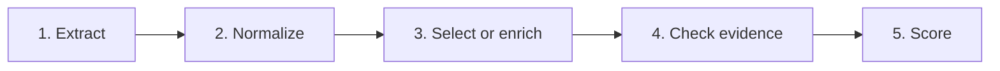

# Clinical Extraction

Turn epilepsy clinic letters into structured clinical facts.

The submitted dissertation is **Extract, then decide: a two-stage pipeline to identify seizure frequency patterns in epilepsy clinic letters**.
Public repository: [cbrown564-alt/clinical_extraction](https://github.com/cbrown564-alt/clinical_extraction).
An assessed copy is on [QUB EEECS GitLab](https://gitlab.eeecs.qub.ac.uk/40466218/clinical_extraction.git).

The submitted paper is the extract-then-decide two-stage pipeline: Hybrid rules decide versus LLM-only decide on the same saved extract.

The active direction for this repository is a synthetic longitudinal epilepsy benchmark for cohort identification and longitudinal analysis. The canonical project plan is the [Active Roadmap](docs/plans/ACTIVE_ROADMAP.md), and current task progress is tracked in [Project Status](PROJECT_STATUS.md). The longitudinal benchmark is not yet implemented, evaluated, or clinically validated. Existing reported metrics describe single-letter Gan 2026 and ExECTv2 tasks only and do not measure longitudinal history reconstruction. Current interactive frontend features include authored synthetic-patient scenarios, which are curated illustrative examples rather than outputs of an extraction pipeline.

This is a research and teaching package, not a clinical deployment claim.
The public tree is the package, tests, configs, and Demo UI fixtures. Clinic
letters, the lab notebook, experiment dumps, and the paper library stay on the
local research checkout and are not cloned. Paper-facing benchmark evidence is
tracked under `results/letter-benchmarks/` (with `paper_experiments/` retained
for compatibility).

## Try the demo

The frontend is the quick-reference path:
[frontend/](https://github.com/cbrown564-alt/clinical_extraction/tree/main/frontend).
It uses the bundled fixtures under `frontend/public/mock-data/`; no local letter
corpus is required. Run it locally from the repository root in two terminals.

Windows PowerShell:

```powershell
# Terminal 1: local Python API
.venv\Scripts\python.exe -m clinical_extraction.trace_explorer.api.app

# Terminal 2: Next.js frontend
Set-Location frontend
npm ci                 # first run only
npm run dev
```

macOS or Linux:

```sh
# Terminal 1: local Python API
.venv/bin/python -m clinical_extraction.trace_explorer.api.app

# Terminal 2: Next.js frontend
cd frontend
npm ci                 # first run only
npm run dev
```

Open [http://127.0.0.1:3000/workbench](http://127.0.0.1:3000/workbench).
Saved and fixture views explain the selected methods without new model calls.
More detail is in the [frontend README](frontend/README.md).

## Results

The Gemini five-cell grids and six-model rosters below are repository
research notes for this package. They are not the dissertation’s
headline claim.

A model collects facts and evidence; recorded rules shape them into the
required form. The tables below are Gemini five-cell grids: each of
find, encode, and select is rules, LLM, or both. The cited score is the
select stop; find and encode stops are stage ablations. The six-model
comparison uses cell 3 only (LLM find, rules encode, rules select) on
both Gan and ExECT. On the inventory task, ExECT cell 3 is both the
roster row and the Gemini peak. Cell 4 (LLM encode then rules select)
stays Gemini-only. Neither table is an on/off hybrid switch. The public
golds are the evaluation forms used here, not the task. Tables cite
Gemini 3.7 Flash so the story stays on the method. Grok, Luna,
DeepSeek, Qwen, and Gemma fill the cell-3 roster. The recorded object
keeps the source span and a change log, not only the score.

Held-out test scores for Gemini 3.7 Flash (2 d.p.), the cited model.
Find and encode columns are stage ablations; select is the cited stop
in these notes. The six-model roster compares cell 3 only on both
tasks. GPT-5.6 Sol cells stay historical. Rules are deterministic and
do not use a model.

**Gan 2026** (Purist micro-F1, locked `test450`). Cited stop is the
select score:

| Find | Encode | Select | Purist micro-F1 |
| --- | --- | --- | ---: |
| rules | rules | rules | 0.72 |
| both | rules | rules | 0.82 |
| LLM | rules | rules | 0.86 |
| LLM | LLM | rules | 0.85 |
| LLM | LLM | LLM | 0.85 |

**ExECTv2** (4-family micro F1, locked `test60`). Cited stop is the
select score. All five rows use the same scorer.

| Find | Encode | Select | F1 |
| --- | --- | --- | ---: |
| rules | rules | rules | 0.80 |
| both | rules | rules | 0.86 |
| LLM | rules | rules | 0.87 |
| LLM | LLM | rules | 0.86 |
| LLM | LLM | LLM | 0.85 |

Gan **LLM** find is the codebook find
(`gan_llm_extract`). **both** find is
`gan_llm_and_rules_extract`. LLM encode means that find already
wrote the form. The LLM-then-rules encode is `gan_rules_encode`.
LLM select is `gan_llm_select_from_extract`. Find and encode stops
are prior-stage ablations in
[the five-cell grid](docs/research/gan2026/gan_five_cell_grid_2026-08-22.md).
The source-near `gan_llm_extract_raw` ablation keeps source wording closer
to the letter; form alignment is weaker at find and rules recover
most at encode and select. ExECT **LLM** find is `exect_llm_extract`. The Compact find
`exect_llm_extract_and_select` is a Gemini ablation.
**both** find is
`exect_llm_pre_post` (living find plus suggested candidates). LLM encode is later-stage `exect_llm_encode`
(a second call). LLM / LLM / rules is accepted Select on that encode
ledger. LLM select is later-stage `exect_llm_select`. Extract and
encode stops are prior-stage ablations. Gan hybrid select is
ledger-only. `gan_llm_only` is not a results column.

- **Gan 2026:** Purist micro-F1 on the locked `test450` split (one current
  seizure-frequency label per letter). Micro-F1 equals accuracy here.
- **ExECTv2:** 4-family micro F1 on the locked `test60` split
  (diagnosis, seizure frequency, prescriptions, and investigations).
  Cell 3 (LLM / rules / rules) is the roster row and the Gemini
  peak (five-cell select 0.8674). Cell 4 (LLM / LLM /
  rules) is Gemini-only later-stage encode then rule select
  (0.8636).

**Gan cell-3 roster** (Purist, locked `test450`, aggregate-only).
LLM find (`gan_llm_extract`) then codebook rules. Select is the
roster stop. Gemini five-cell select is **0.86**.

| Model | Find | Select |
| --- | ---: | ---: |
| Gemini 3.7 Flash | 0.79 | **0.86** |
| Grok 4.6 | 0.79 | 0.85 |
| GPT-5.6 Luna | 0.69 | 0.79 |
| DeepSeek V4 Flash | 0.74 | 0.82 |
| Qwen 3.8 27B | 0.70 | 0.76 |
| Gemma 4 26B | 0.66 | 0.72 |

Exact totals:
[three variables](docs/research/shared/three_variables_rules_model_thinking_2026-08-23.md),
`results/letter-benchmarks/gan/rungs/`.

**ExECT cell-3 roster** (4-family micro F1, locked `test60`,
aggregate-only). LLM find (`exect_llm_extract`) then rules.
Select is the cited stop:

| Model | Find | Select |
| --- | ---: | ---: |
| Gemini 3.7 Flash | 0.85 | **0.87** |
| Grok 4.6 | 0.79 | 0.81 |
| DeepSeek V4 Flash | 0.78 | 0.81 |
| GPT-5.6 Luna | 0.77 | 0.80 |
| Qwen 3.8 27B | 0.73 | 0.76 |
| Gemma 4 26B | 0.72 | 0.76 |

Exact totals and sources:
[three variables](docs/research/shared/three_variables_rules_model_thinking_2026-08-23.md),
`results/letter-benchmarks/exect/exect_llm_extract/`.


**Ablations (not headline columns):** Gemini thinking low / medium /
high on cell 3 only; Gan source-near `gan_llm_extract_raw` (source
wording vs form alignment); find and encode stage stops above.
`gan_llm_only`, ExECT producer raw F1, Sol, and Full ledger are on
disk but not cited as headline results.

Scores are not interchangeable across tasks.

## Two tasks

| | Gan 2026 | ExECTv2 |
| --- | --- | --- |
| Question | What is the patient's current seizure frequency? | What diagnosis, frequency, prescriptions, and investigations does the letter support? |
| Development split | `dev750` | `dev140` |
| Locked test split | `test450` (aggregate scores only) | `test60` (aggregate scores only) |
| Primary score | Purist micro-F1 | Clinical fact F1 |

Both tasks name who runs find, encode, and select (rules, LLM, or
both).

- **rules / rules / rules** — standalone `gan_rules` / `exect_rules`.
- **both / rules / rules** — `gan_llm_and_rules_extract` /
  `exect_llm_pre_post`, then rule encode and select.
- **LLM / rules / rules** — codebook find / `exect_llm_extract`,
  then rule encode and select.
- **LLM / LLM / rules** — Gan: codebook find, then select only.
  ExECT: later-stage encode, then accepted Select rules.
- **LLM / LLM / LLM** — Gan `gan_llm_select_from_extract`. ExECT
  later-stage `exect_llm_select`.

## How it works

Every selected path answers the same five questions, even when a method has
more or fewer concrete stages:



1. **Find** — rules or a model find candidate events, findings, or a
   proposed answer.
2. **Normalize** — structure and bounded format repairs make the result usable
   without silently changing the task.
3. **Select or enrich** — the named method decides or revises the clinical
   answer.
4. **Check evidence** — the system checks that cited text appears in the note
   and records which component produced the result.
5. **Score** — the task scorer turns the final representation into Gan
   categories or ExECT fact metrics.

## Setup

Windows PowerShell:

```powershell
py -3.11 -m venv .venv
.\.venv\Scripts\Activate.ps1
python -m pip install -e ".[dev,trace-ui]"
python -m pytest
```

macOS or Linux:

```sh
python3.11 -m venv .venv
source .venv/bin/activate
python -m pip install -e ".[dev,trace-ui]"
python -m pytest
```

Use the repository virtual environment for all Python commands. Plain `pytest`
is the always-on suite. On a public clone, tests that need the local research
corpus are skipped. With a local checkout that still has `data/`, `docs/`, and
`experiments/`, the same command is the full always-on suite.
`python -m pytest -m deep` runs the optional deep tier and also needs that
local corpus.

For local Ollama runs, start with one row, then five, then 25. Record the model
route and API base in the run metadata.

### Run against a local vLLM server

On HPC or any machine where `pip install .` is awkward, install only the
runtime client and run the root script:

```sh
python -m pip install -r requirements.txt
python run.py --probe \
  --base-url http://127.0.0.1:8000/v1 \
  --model vllm/deepseek-v4-flash
python run.py \
  --input notes.jsonl \
  --output predictions.jsonl \
  --base-url http://127.0.0.1:8000/v1 \
  --model vllm/deepseek-v4-flash
```

A `vllm/<served-model>` identifier defaults to the keyless placeholder
`EMPTY`, so `--api-key` is not required for an unauthenticated local server.
The input is JSONL with one `id` and `text` object per line. That command is
the cited Gan codebook find (`gan_llm_extract`, cell 3). If the package is
installed, `clinical-extract gan` is the same path.

Pass `--method llm_select` for cell 5 (same find, then LLM select). That is
not `gan_llm_only`.

For ExECT extraction, replace `gan` with `exect`; its default method is
`llm_with_rules`. Pass `--api-key` only when the server is configured to require
one. The value after `vllm/` must exactly match the model name returned by the
server's `/v1/models` endpoint.

A full Gan walkthrough on three synthetic letters is in [VLLM.md](VLLM.md).

## Current repository layout

The layout below reflects the current repository structure following the Phase 0 restructuring. The [Active Roadmap](docs/plans/ACTIVE_ROADMAP.md) establishes the sequence for the subsequent longitudinal benchmark phases.

```text
run.py                     HPC / no-install Gan walkthrough (`python run.py --flags`)
requirements.txt           Runtime client packages for that walkthrough
src/clinical_extraction/   Package: loaders, pipelines, scoring, API
frontend/                  Interactive workbench and bundled Demo UI fixtures
examples/                  Pinned walkthrough inputs (gan2026, exectv2, longitudinal)
configs/                   Pipeline and model configuration (gan2026, exectv2, longitudinal)
tests/                     Contract and behavior checks
scripts/                   CLI helpers, checks, and experiment runners
results/letter-benchmarks/ Tracked paper fills and replayable local raws
docs/                      Tracked documentation (except local docs/audio/)
publications/dissertation/ Tracked dissertation manuscript sources, TeX templates, and notes
```

A local research checkout may also contain local corpora (`data/`), local media (`media/`), local literature reading copies (`literature/`), scratch work (`scratch/`), and local runs (`runs/`), which are gitignored. The `experiments/` tree is mostly local and untracked, with the exception of one tracked historical result (`experiments/paper/exect_llm_inventory/gemini37flash/dev140/comparison_residual.json`). Status and glossary files (`PROJECT_STATUS.md` and `CONTEXT.md`) are gitignored local files. While much of `docs/` and `publications/` is tracked in Git, tracking does not imply all tracked materials have been cleared for public release.
