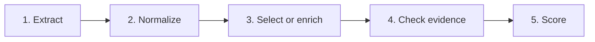

# Clinical Extraction

Turn epilepsy clinic letters into structured clinical facts.

This repository is research code and a working demonstration. The proposed
method translates clinic letters into structured clinical facts in a designed
form, with quoted source text. A model collects the facts and evidence;
recorded rules shape them into the required form. Written rules and a model
alone are baselines. The public golds are the evaluation forms used here, not
the task. Tables cite Grok 4.6 so the story stays on the method. Gemini is in
the same band where cells exist. The recorded object keeps the source span
and a change log, not only the score.

This is a research and teaching package, not a clinical deployment claim.

The public tree is the package, tests, configs, and Demo UI fixtures. Clinic
letters, the lab notebook, experiment dumps, and the paper library stay on the
local research checkout and are not cloned.

## Results

Held-out test scores for Grok 4.6 (2 d.p.), the cited model. GPT-5.6 Sol cells stay historical. Rules-only
is deterministic and does not use a model.

| Method | Gan 2026 | ExECTv2 |
| --- | ---: | ---: |
| LLM with rules | 0.83 | 0.81 |
| LLM only | 0.73 | 0.79 |
| Rules only | 0.73 | 0.79 |

- **Gan 2026:** Purist accuracy on the locked `test450` split (one current
  seizure-frequency label per letter). The cited hybrid is the cleaned
  request. The living Grok holdout is 375/450; do not read an enveloped
  `v0.5` score into the hybrid cell.
- **ExECTv2:** de-duplicated clinical fact F1 on the locked `test60` split
  (diagnosis, seizure frequency, prescriptions, and investigations). ExECT LLM
  with rules (`exect_llm_with_rules`) and ExECT LLM only
  (`exect_llm_only`) are separate requests; cite hybrid F1 and raw F1
  respectively. The unrepaired LLM-with-rules output is not ExECT LLM
  only. This is the project's primary research metric for ExECT, not
  the published strict benchmark score.

Scores are not interchangeable across tasks.

## Two tasks

| | Gan 2026 | ExECTv2 |
| --- | --- | --- |
| Question | What is the patient's current seizure frequency? | What diagnosis, frequency, prescriptions, and investigations does the letter support? |
| Development split | `dev750` | `dev140` |
| Locked test split | `test450` (aggregate scores only) | `test60` (aggregate scores only) |
| Primary score | Purist accuracy | Clinical fact F1 |

Each task uses the same three methods. LLM with rules is the proposed
method. Rules and LLM only are baselines:

- **LLM with rules** — the model collects structured facts with source text;
  recorded rules may normalize, select, or repair them before scoring.
- **LLM** — the model produces the clinical answer.
- **Rules** — deterministic code produces the clinical answer.

## How it works

Every selected path answers the same five questions, even when a method has
more or fewer concrete stages:



1. **Extract** — rules or a model find candidate events, findings, or a
   proposed answer.
2. **Normalize** — structure and bounded format repairs make the result usable
   without silently changing the task.
3. **Select or enrich** — the named method decides or revises the clinical
   answer.
4. **Check evidence** — the system checks that cited text appears in the note
   and records which component produced the result.
5. **Score** — the task scorer turns the final representation into Gan
   categories or ExECT fact metrics.

## Try the demo

The frontend is the main interactive demonstration. It uses the bundled
fixtures under `frontend/public/mock-data/`; no local letter corpus is
required. From the repository root, use two terminals.

Windows PowerShell:

```powershell
# Terminal 1: local Python API
.venv\Scripts\python.exe -m clinical_extraction.trace_explorer.api.app

# Terminal 2: Next.js frontend
Set-Location frontend
npm ci                 # first run only
npm run dev
```

macOS or Linux:

```sh
# Terminal 1: local Python API
.venv/bin/python -m clinical_extraction.trace_explorer.api.app

# Terminal 2: Next.js frontend
cd frontend
npm ci                 # first run only
npm run dev
```

Open [http://127.0.0.1:3000/workbench](http://127.0.0.1:3000/workbench).
Saved and fixture views explain the selected methods without new model calls.
More detail is in the [frontend README](frontend/README.md).

## Setup

Windows PowerShell:

```powershell
py -3.11 -m venv .venv
.\.venv\Scripts\Activate.ps1
python -m pip install -e ".[dev,trace-ui]"
python -m pytest
```

macOS or Linux:

```sh
python3.11 -m venv .venv
source .venv/bin/activate
python -m pip install -e ".[dev,trace-ui]"
python -m pytest
```

Use the repository virtual environment for all Python commands. Plain `pytest`
is the always-on suite. On a public clone, tests that need the local research
corpus are skipped. With a local checkout that still has `data/`, `docs/`, and
`experiments/`, the same command is the full always-on suite.
`python -m pytest -m deep` runs the optional deep tier and also needs that
local corpus.

For local Ollama runs, start with one row, then five, then 25. Record the model
route and API base in the run metadata.

### Run against a local vLLM server

Install the package, then probe an OpenAI-compatible server before processing
notes. A `vllm/<served-model>` identifier defaults to the keyless placeholder
`EMPTY`, so `--api-key` is not required for an unauthenticated local server:

```sh
python -m pip install .
clinical-extract probe \
  --base-url http://127.0.0.1:8000/v1 \
  --model vllm/deepseek-v4-flash
```

The input is JSONL with one `id` and `text` object per line. Run the selected
Gan seizure-frequency pipeline with:

```sh
clinical-extract gan \
  --input notes.jsonl \
  --output predictions.jsonl \
  --base-url http://127.0.0.1:8000/v1 \
  --model vllm/deepseek-v4-flash
```

For ExECT extraction, replace `gan` with `exect`; its default method is
`llm_with_rules`. Pass `--api-key` only when the server is configured to require
one. The value after `vllm/` must exactly match the model name returned by the
server's `/v1/models` endpoint.

A full Gan walkthrough on three synthetic letters is in [VLLM.md](VLLM.md).

## Repository layout

```text
src/clinical_extraction/   Package: loaders, pipelines, scoring, API
frontend/                  Interactive workbench and bundled Demo UI fixtures
examples/                  Pinned walkthrough inputs, including the vLLM Gan letters
configs/                   Pipeline and model configuration
tests/                     Contract and behavior checks
scripts/                   CLI helpers and experiment runners
paper_experiments/         Tracked paper fills and replayable local raws
```

A local research checkout may also have `data/`, `docs/`, `experiments/`,
`literature/`, and `media/`. Those trees are gitignored and are not part of a
public clone. Paper-facing fills are in `paper_experiments/`.
