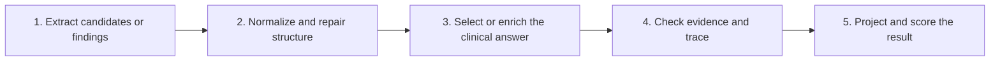

# Clinical Extraction

A Python package that combines deterministic rules and language models to turn
clinical notes into structured data.

The repository supports loading data, extracting clinical facts, normalizing
values, validating evidence, scoring predictions, and analysing errors. It is
also the research code for a paper about which pipeline component improves a
clinical result and where each method fails.

The current work is described in [project status](PROJECT_STATUS.md).

## Two tasks × three methods

- **Gan 2026** extracts one current seizure-frequency label from each letter.
  Development review uses `dev750` (machine/API field and retained filenames may
  still say `validation750`). The `test450` split is locked; only saved
  aggregate results may be used. Primary score: **Purist** accuracy.
- **ExECTv2** extracts diagnosis, seizure frequency, prescriptions, and
  investigations. Development review uses `dev140`; `test60` is locked and
  aggregate-only. Primary score: de-duplicated clinical fact recovery
  (`clinical_headline`), an internal research metric, not the published strict
  benchmark.

Each task has the same three active methods: `rules`, `llm`, and
`llm_with_rules`.

## At a glance

Both tasks are primary. Scores are not interchangeable across tasks.

| Task | Measure | Selected primary results |
| --- | --- | --- |
| **Gan 2026** | Purist | **LLM with rules** (final ruleset, no-call replay of matched v0.5 raws): Sol **381/450** on `test450`; on `dev750`, mini **677/750**, Sol/Luna **660/750**. Development method peers on `dev750` (GPT-4.1-mini three-way reference): **rules** **697/750**, **llm** **581/750**. |
| **ExECTv2** | `clinical_headline` F1 | Decision 0046 Sol-matched three-method strip: **rules** **0.8160** / **0.7154**; **llm** **0.8097** / **0.7771**; **llm with rules** **0.8920** / **0.8047** (`dev140` / `test60`). |

Six-model ranks, Pragmatic accuracy, paper-derived ExECT metrics, and claim
limits live in the [comparison report](docs/research/six_model_comparison_report_2026-07-18.md)
and [paper claim status](docs/canon/10_paper_provenance.md).

**System state**

- Selected six-model × three-method × two-task system: live generation,
  saved/fixture demonstration, frontend workflows, and exact no-call replay.
- Active method names are `rules`, `llm`, and `llm_with_rules`; historical
  replay identities remain for provenance.
- Canonical orchestrators own the six selected task-method paths
  ([Decision 0047](docs/decisions/0047-full-canonical-pipeline-orchestrator-refactor.md)).
- Standalone supervisor handoff package rebuilt; host setup and unaided README
  review remain open before calling the handoff usability-validated.
- Verification owners: always-on pytest firewall ([Decision 0049](docs/decisions/0049-pytest-research-validity-firewall.md)),
  retained-evidence manifest, and six no-call reference replays
  ([project status](PROJECT_STATUS.md)).

## Supervisor path

This is the shortest route through the selected system. It is a teaching and
research handoff, not a clinical deployment claim.

### Five-stage orientation

The same five questions make the six selected paths easy to compare. The
generated manifests and method cards remain authoritative where a method has
more or fewer concrete stages.



- **Extract:** rules or a model identify candidate events, findings, or a
  proposed answer.
- **Normalize and repair:** representation and bounded format repairs make the
  result usable without silently changing the task contract.
- **Select or enrich:** the named method owner makes or changes any clinical
  choice; the ownership matrix marks every such stage.
- **Check evidence and trace:** the system checks source containment and records
  which component produced the result.
- **Project and score:** the task scorer turns the final representation into
  Gan categories or ExECT fact metrics.

### Six-path teaching walkthrough

Read [the contiguous six-path walkthrough](docs/architecture/teaching_cases/six_paths.md)
in order. It uses the two synthetic teaching letters because Gan and ExECTv2
have different output contracts, links to every full generated stage trace,
and shows the deliberate Gan failure and deterministic recovery. The six
selected paths are:

1. Gan 2026 — rules only
2. Gan 2026 — LLM only
3. Gan 2026 — LLM with rules
4. ExECTv2 — rules only
5. ExECTv2 — LLM only
6. ExECTv2 — LLM with rules

The [architecture index](docs/architecture/README.md) links the six method
cards, ownership matrix, diagrams, and machine-readable stage manifests.

### Open the frontend

The frontend is the primary interactive demonstration. From the repository
root, use two terminals:

```powershell
# Terminal 1: local Python API
.venv\Scripts\python.exe -m clinical_extraction.trace_explorer.api.app

# Terminal 2: Next.js frontend
Set-Location frontend
npm ci                 # first run only
npm run dev
```

Open [http://127.0.0.1:3000/workbench](http://127.0.0.1:3000/workbench).
The [frontend runbook](frontend/README.md) covers the review route and frontend
checks. Use saved/fixture views for explanation; use live development runs
only on the permitted development workflow.

### Standalone handoff package status

The standalone `handoff/supervisor/` tree and
`handoff/clinical_extraction_supervisor_handoff.zip` were rebuilt from active
source on 2026-08-02. They ship readable Python for the selected Gan v0.5
current-frequency and one-call ExECT four-family workflows under Decision 0045
`default`/`default` assembly. Source-to-shipped closure passes:

```powershell
.venv\Scripts\python.exe scripts/build_supervisor_source_handoff.py --check-source-closure
```

The [source-to-shipped closure test](tests/test_supervisor_source_handoff.py)
and archive hash self-consistency checks verify the shipped package against
active source. Supervisor-host setup, endpoint `check`, and unaided README
review remain open before calling the handoff usability-validated. The
[handoff plan](docs/plans/supervisor_local_extraction_handoff_plan.md) owns
those checks. Current evidence and verification state are recorded in
[project status](PROJECT_STATUS.md).

### Canonical results, limits, and exact replay

- [Canonical six-model results report](docs/research/six_model_comparison_report_2026-07-18.md)
  owns the selected two-task comparison and its aggregate-only test limits.
- [Claim strength and limits](docs/canon/10_paper_provenance.md) states what
  each result supports and what must not be claimed.
- [Current status and checks](PROJECT_STATUS.md) records evidence freshness,
  open work, and the separation between engineering verification, research
  evidence, clinical review, and clinical validation.

With Git LFS objects available, these are the exact no-call checks for the six
retained reference paths:

```powershell
.venv\Scripts\python.exe scripts\check_retained_evidence_manifest.py
.venv\Scripts\python.exe scripts\verify_reference_evidence.py
```

They inspect retained outputs only; they make no model calls and do not inspect
locked rows. New live runs require the task, model, method, prompt/program
version, route, split, repair policy, scorer, and run metadata recorded by a
separate run-readiness protocol.

## Method names

Gan and ExECT active runtime, CLI, registry, API, trace, and frontend paths use
the same three plain names:

- `rules`: deterministic rules produce the clinical interpretation;
- `llm`: the model produces the clinical interpretation;
- `llm_with_rules`: the model extracts or selects facts and deterministic code
  can normalize, select, or repair them.

Saved run IDs, retained evidence IDs, filenames, and historical aliases remain
unchanged for exact replay. The
[naming guide](docs/reference/plain_language_glossary.md) maps older identifiers
to their plain descriptions.

## For workers

Ongoing research and engineering routes live in
[THREAD_MAP.md](docs/THREAD_MAP.md), [project status](PROJECT_STATUS.md), and
the [active roadmap](docs/plans/ACTIVE_ROADMAP.md). Do not treat the supervisor
path as a dump for experiment archaeology.

## Design principles

- Keep task boundaries clear enough to support more datasets later.
- Prefer small modules that expose where a failure occurred.
- Separate extraction from final clinical selection.
- Keep label normalization compatible with the author-provided scorer.
- Store evidence spans and rationale with final labels.
- Use tested scripts and selected saved outputs for reproducible analysis.
- Treat deterministic rules as named, testable components.
- Separate general clinical rules from seizure-frequency, dataset-specific,
  and benchmark-format rules.

## Repository layout

```text
src/clinical_extraction/
  core/                         Shared pipeline, schema, evidence, and validation code.
  tasks/seizure_frequency/
    gan2026/                    Gan loader, labels, scoring, pipeline, and analysis.
docs/
  design/                       Current software and data decisions.
  decisions/                    Reasons for active behavior.
  experiments/                  Human-readable selected evidence.
  plans/                        Ordered work.
  research/                     Thesis, manuscript, annotation source, and cleanup record.
  runbooks/                     Repeatable procedures.
experiments/                    Selected machine-readable outputs and run records.
tests/                          Data, scoring, and behavior checks.
```

## Start here

- [Project status](PROJECT_STATUS.md)
- [Active roadmap](docs/plans/ACTIVE_ROADMAP.md)
- [Documentation navigation](docs/NAVIGATION.md)
- [Retained evidence index](docs/experiments/retained_evidence_manifest.md)
- [Regeneration instructions](docs/REGENERATION.md)

## Setup

Windows PowerShell:

```powershell
py -3.11 -m venv .venv
.\.venv\Scripts\Activate.ps1
python -m pip install -e ".[dev,trace-ui]"
python -m pytest
```

macOS or Linux:

```sh
python3.11 -m venv .venv
source .venv/bin/activate
python -m pip install -e ".[dev,trace-ui]"
python -m pytest
```

Plain `pytest` runs the always-on tier only (Decision 0049). Use
`python -m pytest -m deep` for the optional deep allowlist.

Use the repository environment for all Python commands. For local Ollama runs,
start with one row, then five, then 25. Record the model route and API base in
the run metadata.
