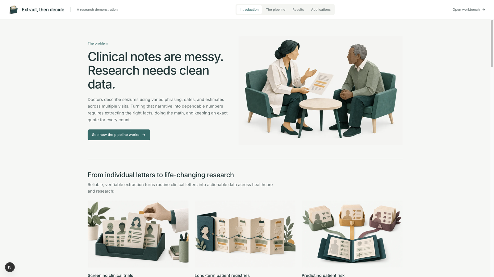
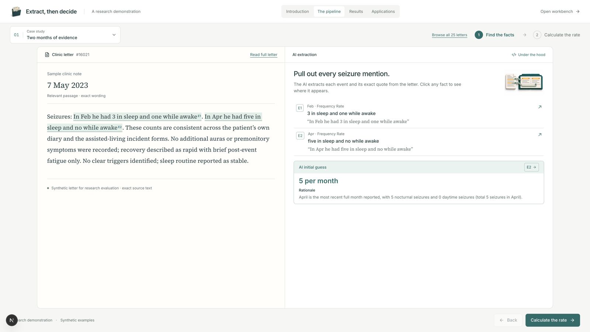
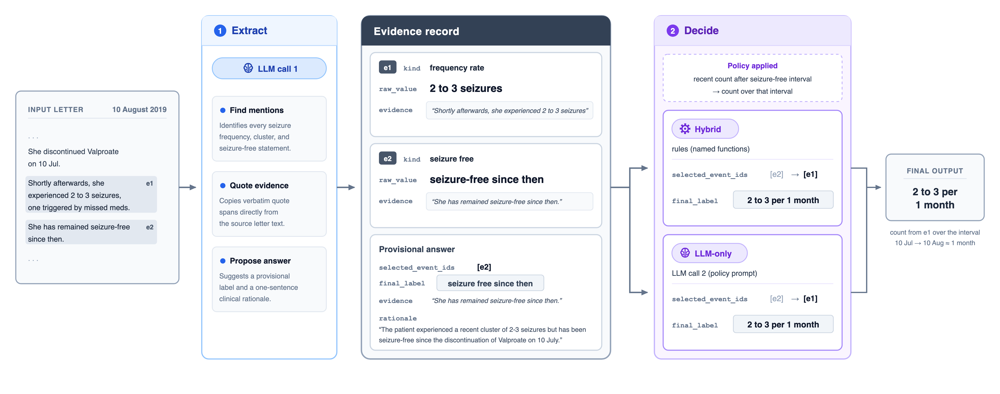

# Extract, then decide

Turn epilepsy clinic letters into structured seizure-frequency facts, with the supporting quote kept next to every count.

[Paper (PDF)](<publications/dissertation/draft/Extract, then decide.pdf>)
·
[Supporting materials (PDF)](<publications/dissertation/supporting materials/Supporting materials.pdf>)
·
[Demo](#try-the-demo)

This is a research and teaching package, not a clinical product. The public tree uses bundled demo fixtures; clinic letters stay off the clone.

> Epilepsy clinic letters may contain several seizure frequency statements: descriptions of past events, reports of the patient's current condition, and plans for future treatment. The challenge is therefore not only to identify seizure frequency information, but also to determine which statement describes the patient's current status. This paper evaluates a two-stage approach that separates these tasks. First, a large language model identifies relevant seizure frequency patterns in each letter, records the exact supporting text, and proposes a current-status interpretation. Second, predefined rules or a further model call use that evidence to select the final seizure frequency label. The approach was developed using 1,200 synthetic letters and evaluated on 300 clinician double-checked real clinic letters, against a fine-tuned model previously evaluated on the same test set. The two-stage systems achieved micro-F1 scores of 0.77 and 0.80, compared with 0.79 for the fine-tuned model. Separating evidence extraction from the final decision produced comparable accuracy while generating richer evidence and more transparent evidence trails.





## Try the demo

Run it locally from `frontend` (fixtures only; no letter corpus or model calls):

```sh
cd frontend
npm ci                 # first run only
npm run dev
```

Then open [http://127.0.0.1:3000/demo](http://127.0.0.1:3000/demo). The workbench at `/workbench` is the deeper inspection view.

## What the paper shows

A model collects candidate facts and quotes; recorded rules, or a second model call, choose the current seizure-frequency label.



On 300 clinician-checked letters, the two-stage systems scored **0.77** and **0.80** micro-F1 against **0.79** for a previously evaluated fine-tuned model. Tables, prompts, and further figures are in the [paper](<publications/dissertation/draft/Extract, then decide.pdf>) and [supporting materials](<publications/dissertation/supporting materials/Supporting materials.pdf>).

## What's next

The [paper roadmap](docs/plans/ACTIVE_ROADMAP.md) now focuses exclusively on
one-call evidence-grounded seizure-frequency extraction. The
[paper outline](publications/jamia-one-shot/README.md) and
[evaluation protocol](docs/research/gan2026/one_shot_paper_protocol.md) define the
planned study. Longitudinal prototype work and other applications are postponed;
their code and saved results remain available. Historical dissertation scores do
not evaluate the new method.

## How to cite

Conor Brown. *Extract, then decide: a two-stage pipeline to identify seizure frequency patterns in epilepsy clinic letters*. MSc dissertation, 2026.

## Reproduce / develop

Use the repository `.venv` for Python. On a public clone, tests that need the local research corpus are skipped.

```sh
python3.11 -m venv .venv
source .venv/bin/activate
python -m pip install -e ".[dev,trace-ui]"
python -m pytest
```

Windows PowerShell: `py -3.11 -m venv .venv`, then `.\.venv\Scripts\Activate.ps1` and the same `pip` / `pytest` commands.

For a no-install Gan walkthrough against a local vLLM server, see [VLLM.md](VLLM.md). More on the interface is in the [frontend README](frontend/README.md).

```text
src/clinical_extraction/   Package: loaders, pipelines, scoring, API
frontend/                  Interactive demo and workbench
publications/dissertation/ Submitted paper, supporting materials, and sources
results/letter-benchmarks/ Tracked paper fills and replayable local raws
docs/                      Methods notes and project documentation
examples/                  Pinned walkthrough inputs
```

## Package and commands

`core/` owns source/request identity, artifacts, persistence and provider mechanics.
`tasks/` owns clinical extraction, projections and benchmark evaluation;
`evaluation/` owns shared metrics and explicitly scoped old-study adapters.
`inspection/` serves the existing review API. The
[architecture](docs/design/architecture.md) explains these boundaries.

The installed `clinical-extract` command (or `python run.py`) provides:

| Operation | Purpose |
| --- | --- |
| `extract --task gan\|exect` | Capture ordinary notes into immutable artifacts and a local SQLite store |
| `replay --task gan\|exect` | Read the exact saved request/runtime; never invoke a model |
| `gan`, `exect` | Retained operational methods and output formats |
| `benchmark gan`, `benchmark exect` | Dataset runners with their existing split and checkpoint controls |
| `evaluate` | Verify, replay, reparse and score retained benchmark results |
| `inspect`, `index` | Local inspection API and trace indexing |

Use an operation's `--help` for input/runtime flags. New capture defaults to
`runs/extraction/artifacts.sqlite3`; pass the same input, model and runtime settings
to replay. Changed requests are refused. Failed captures remain stored until an
explicit `--retry-failed` capture; their earlier execution records remain available.
Old Python package paths and separate task-specific console aliases are retired.
The no-install HPC/vLLM route and `requirements.txt` remain supported.
