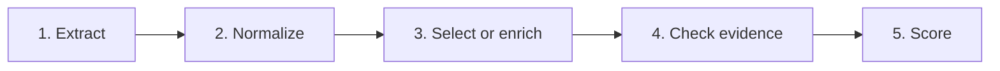

# Clinical Extraction

Turn epilepsy clinic letters into structured clinical facts.

This repository is research code and a working demonstration. It compares three
ways of extracting information from clinical notes—deterministic rules, a
language model alone, and a language model with deterministic repair—on two
benchmarks. The point of the work is not only the score, but which component
improved a result and where each method fails.

This is a research and teaching package, not a clinical deployment claim.

## Results

Held-out test scores for GPT-5.6 Sol (2 d.p.). Rules-only is deterministic and
does not use a model.

| Method | Gan 2026 | ExECTv2 |
| --- | ---: | ---: |
| LLM with rules | 0.85 | 0.80 |
| LLM only | 0.74 | 0.78 |
| Rules only | 0.73 | 0.72 |

- **Gan 2026:** Purist accuracy on the locked `test450` split (one current
  seizure-frequency label per letter).
- **ExECTv2:** de-duplicated clinical fact F1 on the locked `test60` split
  (diagnosis, seizure frequency, prescriptions, and investigations). This is
  the project's primary research metric for ExECT, not the published strict
  benchmark score.

Scores are not interchangeable across tasks. Full six-model ranks, development
scores, and claim limits are in the
[comparison report](docs/research/six_model_comparison_report_2026-07-18.md)
and [paper claim status](docs/canon/10_paper_provenance.md).

## Two tasks, three methods

| | Gan 2026 | ExECTv2 |
| --- | --- | --- |
| Question | What is the patient's current seizure frequency? | What diagnosis, frequency, prescriptions, and investigations does the letter support? |
| Development split | `dev750` | `dev140` |
| Locked test split | `test450` (aggregate scores only) | `test60` (aggregate scores only) |
| Primary score | Purist accuracy | Clinical fact F1 |

Each task uses the same three methods:

- **Rules** — deterministic code produces the clinical answer.
- **LLM** — the model produces the clinical answer.
- **LLM with rules** — the model extracts or proposes facts; deterministic code
  may normalize, select, or repair them before scoring.

## How it works

Every selected path answers the same five questions, even when a method has
more or fewer concrete stages:



1. **Extract** — rules or a model find candidate events, findings, or a
   proposed answer.
2. **Normalize** — structure and bounded format repairs make the result usable
   without silently changing the task.
3. **Select or enrich** — the named method decides or revises the clinical
   answer. The
   [ownership matrix](docs/architecture/diagrams/ownership_matrix.md) marks
   every stage that may change meaning.
4. **Check evidence** — the system checks that cited text appears in the note
   and records which component produced the result.
5. **Score** — the task scorer turns the final representation into Gan
   categories or ExECT fact metrics.

The [architecture index](docs/architecture/README.md) links method cards,
diagrams, and machine-readable stage manifests. For a letter-by-letter walk
through all six paths, read the
[six-path teaching case](docs/architecture/teaching_cases/six_paths.md).

## Try the demo

The frontend is the main interactive demonstration. From the repository root,
use two terminals:

```powershell
# Terminal 1: local Python API
.venv\Scripts\python.exe -m clinical_extraction.trace_explorer.api.app

# Terminal 2: Next.js frontend
Set-Location frontend
npm ci                 # first run only
npm run dev
```

Open [http://127.0.0.1:3000/workbench](http://127.0.0.1:3000/workbench).
Saved and fixture views explain the selected methods without new model calls.
Live development runs are for the permitted development splits only. More
detail is in the [frontend README](frontend/README.md).

## Reproduce selected results

With Git LFS objects available, these checks confirm the six retained reference
paths from saved outputs. They make no model calls and do not inspect locked
test rows:

```powershell
.venv\Scripts\python.exe scripts\check_retained_evidence_manifest.py
.venv\Scripts\python.exe scripts\verify_reference_evidence.py
```

For claim strength and what must not be claimed from these numbers, see
[paper claim status](docs/canon/10_paper_provenance.md). Current evidence
freshness and open work live in [project status](PROJECT_STATUS.md).

## Setup

Windows PowerShell:

```powershell
py -3.11 -m venv .venv
.\.venv\Scripts\Activate.ps1
python -m pip install -e ".[dev,trace-ui]"
python -m pytest
```

macOS or Linux:

```sh
python3.11 -m venv .venv
source .venv/bin/activate
python -m pip install -e ".[dev,trace-ui]"
python -m pytest
```

Use the repository virtual environment for all Python commands. Plain `pytest`
is the always-on suite; `python -m pytest -m deep` runs the optional deep tier.

For local Ollama runs, start with one row, then five, then 25. Record the model
route and API base in the run metadata.

### Run against a local vLLM server

Install the package, then probe an OpenAI-compatible server before processing
notes. A `vllm/<served-model>` identifier defaults to the keyless placeholder
`EMPTY`, so `--api-key` is not required for an unauthenticated local server:

```sh
python -m pip install .
clinical-extract probe \
  --base-url http://127.0.0.1:8000/v1 \
  --model vllm/deepseek-v4-flash
```

The input is JSONL with one `id` and `text` object per line. Run the selected
Gan seizure-frequency pipeline with:

```sh
clinical-extract gan \
  --input notes.jsonl \
  --output predictions.jsonl \
  --base-url http://127.0.0.1:8000/v1 \
  --model vllm/deepseek-v4-flash
```

For ExECT extraction, replace `gan` with `exect`; its default method is
`llm_with_rules`. Pass `--api-key` only when the server is configured to require
one. The value after `vllm/` must exactly match the model name returned by the
server's `/v1/models` endpoint.

For an OpenAI-compatible vLLM endpoint, use the canonical experiment runner;
`vllm/` selects the endpoint-specific chat template while retaining the normal
development JSONL, checkpoints, prompt inputs, raw outputs, diagnostics,
scores, and report:

```sh
export VLLM_BASE_URL=https://approved-host/v1
export VLLM_THINKING=false
gan2026-llm-experiment \
  --pipeline llm_with_rules \
  --split validation \
  --limit 10 \
  --model vllm/deepseek-v4-flash \
  --disable-dspy-cache \
  --jsonl scratch/validation/vllm-dev10.rows.jsonl \
  --markdown scratch/validation/vllm-dev10.report.md
```

Freeze explicit `--source-row-indices` for a named dev10 comparison rather
than relying on the first ten rows. Development rows may be inspected; Gan
`test450` and ExECT `test60` remain locked and aggregate-only.

## Repository layout

```text
src/clinical_extraction/   Package: loaders, pipelines, scoring, API
frontend/                  Interactive workbench and review UI
docs/                      Design, decisions, research, architecture, runbooks
experiments/               Selected machine-readable outputs
tests/                     Data, scoring, and behavior checks
```

## Go further

| Need | Read |
| --- | --- |
| Current evidence and open work | [project status](PROJECT_STATUS.md) |
| How documentation is organized | [documentation navigation](docs/NAVIGATION.md) |
| Short task routes for contributors | [THREAD_MAP](docs/THREAD_MAP.md) |
| Ordered next work | [active roadmap](docs/plans/ACTIVE_ROADMAP.md) |
| Selected evidence index | [retained evidence](docs/experiments/retained_evidence_manifest.md) |
| Regenerating historical artifacts | [regeneration guide](docs/REGENERATION.md) |
| Older method and file names | [naming guide](docs/reference/plain_language_glossary.md) |
