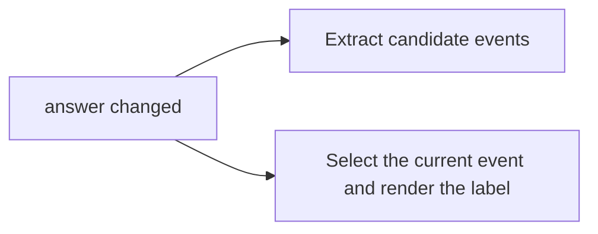
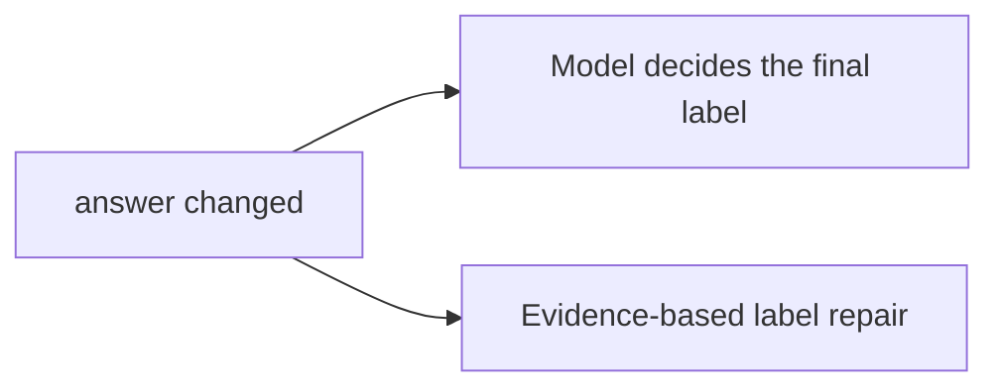
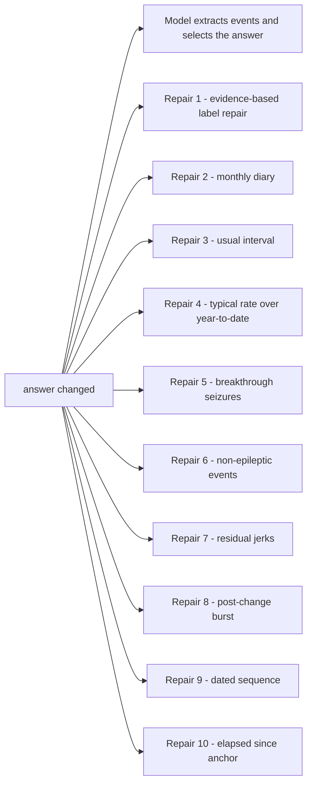
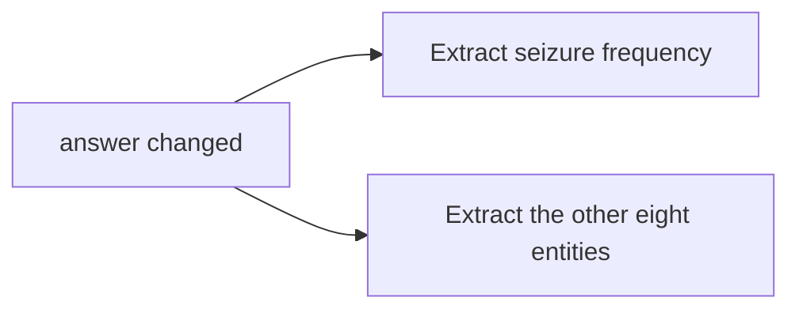
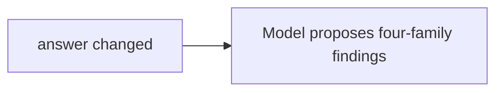
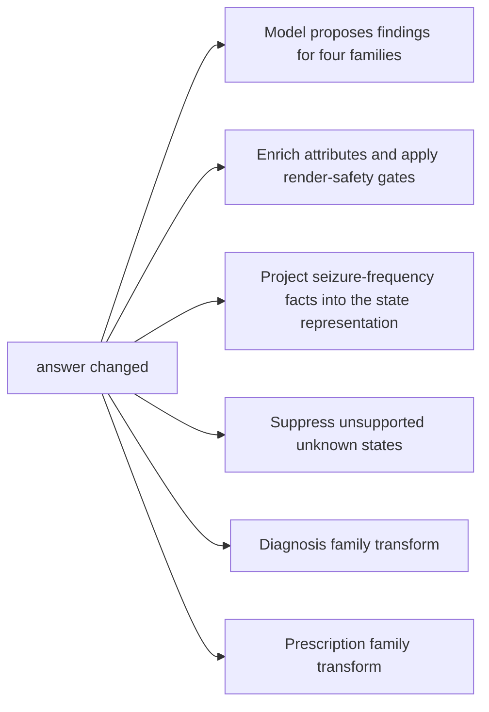

<!-- GENERATED FILE. Do not edit by hand.
     Source: src/clinical_extraction/architecture/ (stage manifests +
     executed teaching cases). Regenerate with
     python scripts/build_architecture_docs.py -->

# Result attribution: where a rescue or regression can originate

If a letter's answer changed for the better or the worse, one of the stages below did it. This is the candidate list, derived from the stage manifests - it is structural, not a measurement.

**Counts belong elsewhere.** Measured rescues and regressions live in the retained attribution artifacts named in each method card's evidence owners. This page deliberately does not restate them.

## Gan 2026 - Rules only

First proposer: deterministic rules (stage gan.rules.select_and_render)

## Gan 2026 - LLM only

First proposer: the model (stage gan.llm.model_call), with one deterministic override at gan.llm.selected_evidence_repair

## Gan 2026 - LLM with rules

First proposer: the model proposes and selects (gan.llm_with_rules.model_call); ten deterministic repair families may change the answer afterwards

## ExECTv2 - Rules only

First proposer: the nine deterministic extractors (stage exect.rules.extract_entities); the four-family projection is scorer-facing

## ExECTv2 - LLM only

First proposer: the named model (stage exect.llm.model_call); deterministic stages only parse, represent, and gate its findings

## ExECTv2 - LLM with rules

First proposer: the named model proposes all four families (exect.llm_with_rules.model_call); four family transforms may change findings afterwards

