<!-- GENERATED FILE. Do not edit by hand.
     Source: src/clinical_extraction/architecture/ (stage manifests +
     executed teaching cases). Regenerate with
     python scripts/build_architecture_docs.py -->

# ExECTv2 LLM with rules: stage diagram

> The model proposes findings for four families in one call; deterministic family transforms reconcile those findings into the final scored representation.

Node shape carries the ownership. Rounded nodes are model-owned. Rectangles are deterministic. Hexagons are gates. Stages that may change clinical meaning are highlighted.

```mermaid
flowchart TD
  letter([source letter])
  exect_llm_with_rules_build_prompt["Build the four-family prompt"]
  letter --> exect_llm_with_rules_build_prompt
  exect_llm_with_rules_model_call("Model proposes findings for four families")
  exect_llm_with_rules_build_prompt --> exect_llm_with_rules_model_call
  exect_llm_with_rules_parse_and_retry["Parse output, with format-only retry when eligible"]
  exect_llm_with_rules_model_call --> exect_llm_with_rules_parse_and_retry
  exect_llm_with_rules_flatten_events["Flatten model events into mentions"]
  exect_llm_with_rules_parse_and_retry --> exect_llm_with_rules_flatten_events
  exect_llm_with_rules_project_and_gate["Enrich attributes and apply render-safety gates"]
  exect_llm_with_rules_flatten_events --> exect_llm_with_rules_project_and_gate
  exect_llm_with_rules_sf_state_projection["Project seizure-frequency facts into the state representation"]
  exect_llm_with_rules_project_and_gate --> exect_llm_with_rules_sf_state_projection
  exect_llm_with_rules_sf_unknown_suppression["Suppress unsupported unknown states"]
  exect_llm_with_rules_sf_state_projection --> exect_llm_with_rules_sf_unknown_suppression
  exect_llm_with_rules_register_findings["Register raw and scored findings"]
  exect_llm_with_rules_sf_unknown_suppression --> exect_llm_with_rules_register_findings
  exect_llm_with_rules_lens_diagnosis["Diagnosis family transform"]
  exect_llm_with_rules_register_findings --> exect_llm_with_rules_lens_diagnosis
  exect_llm_with_rules_lens_seizure_frequency["Seizure Frequency family transform"]
  exect_llm_with_rules_lens_diagnosis --> exect_llm_with_rules_lens_seizure_frequency
  exect_llm_with_rules_lens_prescription["Prescription family transform"]
  exect_llm_with_rules_lens_seizure_frequency --> exect_llm_with_rules_lens_prescription
  exect_llm_with_rules_lens_investigations["Investigations family transform"]
  exect_llm_with_rules_lens_prescription --> exect_llm_with_rules_lens_investigations
  exect_llm_with_rules_evidence_requirement{{"Require exact evidence for every finding"}}
  exect_llm_with_rules_lens_investigations --> exect_llm_with_rules_evidence_requirement
  exect_llm_with_rules_materialize_views["Materialize the score views"]
  exect_llm_with_rules_evidence_requirement --> exect_llm_with_rules_materialize_views
  exect_llm_with_rules_score["Score against gold"]
  exect_llm_with_rules_materialize_views --> exect_llm_with_rules_score

  class exect_llm_with_rules_build_prompt transport_or_schema;
  class exect_llm_with_rules_model_call clinical_meaning;
  class exect_llm_with_rules_parse_and_retry transport_or_schema;
  class exect_llm_with_rules_flatten_events representation;
  class exect_llm_with_rules_project_and_gate clinical_meaning;
  class exect_llm_with_rules_sf_state_projection clinical_meaning;
  class exect_llm_with_rules_sf_unknown_suppression clinical_meaning;
  class exect_llm_with_rules_register_findings transport_or_schema;
  class exect_llm_with_rules_lens_diagnosis clinical_meaning;
  class exect_llm_with_rules_lens_seizure_frequency representation;
  class exect_llm_with_rules_lens_prescription clinical_meaning;
  class exect_llm_with_rules_lens_investigations representation;
  class exect_llm_with_rules_evidence_requirement validation_gate;
  class exect_llm_with_rules_materialize_views benchmark_projection;
  class exect_llm_with_rules_score benchmark_projection;
  classDef clinical_meaning fill:#fbe9e7,stroke:#c0392b,stroke-width:2px;
  classDef representation fill:#f4f6f8,stroke:#7f8c8d;
  classDef transport_or_schema fill:#fbfbfb,stroke:#bdc3c7;
  classDef validation_gate fill:#eef7ee,stroke:#27ae60;
  classDef benchmark_projection fill:#eef0fb,stroke:#5b6abf;
```

## Stages that can change the clinical answer

| Stage | Owner | What it may change |
| --- | --- | --- |
| `exect.llm_with_rules.model_call` | model | One structured call returns candidate findings for Diagnosis, Seizure Frequency, Prescription, and Investigations, each with evidence. |
| `exect.llm_with_rules.project_and_gate` | rules | Attach CUI and canonical-phrase attributes, drop attribute values outside the closed vocabulary, drop seizure-frequency mentions that carry no frequency state, and drop modality-only Investigations duplicates. |
| `exect.llm_with_rules.sf_state_projection` | rules | Convert the model's seizure-frequency facts into the state and ownership representation the ExECT scorer expects, adding state attributes and named-type ownership the model did not supply. |
| `exect.llm_with_rules.sf_unknown_suppression` | rules | Remove seizure-frequency findings whose state is unknown and unsupported under the narrowly defined suppression rule. |
| `exect.llm_with_rules.lens.diagnosis` | rules | Reconcile Diagnosis findings using heading recovery and the standard dictionary; may rewrite, drop, or add concepts. |
| `exect.llm_with_rules.lens.prescription` | rules | Apply dictionary-driven regimen processing and bounded correction to Prescription findings. |
