<!-- GENERATED FILE. Do not edit by hand.
     Source: src/clinical_extraction/architecture/ (stage manifests +
     executed teaching cases). Regenerate with
     python scripts/build_architecture_docs.py -->

# Gan 2026 LLM with rules: stage diagram

> The model extracts the event history and chooses an answer; deterministic rules then check and sometimes correct that answer.

Node shape carries the ownership. Rounded nodes are model-owned. Rectangles are deterministic. Hexagons are gates. Stages that may change clinical meaning are highlighted.

```mermaid
flowchart TD
  letter([source letter])
  gan_llm_with_rules_build_prompt["Build the structured-events prompt"]
  letter --> gan_llm_with_rules_build_prompt
  gan_llm_with_rules_model_call("Model extracts events and selects the answer")
  gan_llm_with_rules_build_prompt --> gan_llm_with_rules_model_call
  gan_llm_with_rules_json_schema_repair["Repair JSON dialect and payload shape"]
  gan_llm_with_rules_model_call --> gan_llm_with_rules_json_schema_repair
  gan_llm_with_rules_format_only_retry["Format-only retry local models"]
  gan_llm_with_rules_json_schema_repair --> gan_llm_with_rules_format_only_retry
  gan_llm_with_rules_schema_validation{{"Validate the extraction schema"}}
  gan_llm_with_rules_format_only_retry --> gan_llm_with_rules_schema_validation
  gan_llm_with_rules_normalize_events["Normalize every event"]
  gan_llm_with_rules_schema_validation --> gan_llm_with_rules_normalize_events
  gan_llm_with_rules_resolve_label["Resolve the label from the model's selection"]
  gan_llm_with_rules_normalize_events --> gan_llm_with_rules_resolve_label
  gan_llm_with_rules_repair_selected_evidence["Repair 1 - evidence-based label repair"]
  gan_llm_with_rules_resolve_label --> gan_llm_with_rules_repair_selected_evidence
  gan_llm_with_rules_repair_monthly_diary["Repair 2 - monthly diary"]
  gan_llm_with_rules_repair_selected_evidence --> gan_llm_with_rules_repair_monthly_diary
  gan_llm_with_rules_repair_usual_interval["Repair 3 - usual interval"]
  gan_llm_with_rules_repair_monthly_diary --> gan_llm_with_rules_repair_usual_interval
  gan_llm_with_rules_repair_typical_over_ytd["Repair 4 - typical rate over year-to-date"]
  gan_llm_with_rules_repair_usual_interval --> gan_llm_with_rules_repair_typical_over_ytd
  gan_llm_with_rules_repair_breakthrough["Repair 5 - breakthrough seizures"]
  gan_llm_with_rules_repair_typical_over_ytd --> gan_llm_with_rules_repair_breakthrough
  gan_llm_with_rules_repair_non_epileptic["Repair 6 - non-epileptic events"]
  gan_llm_with_rules_repair_breakthrough --> gan_llm_with_rules_repair_non_epileptic
  gan_llm_with_rules_repair_residual_jerk["Repair 7 - residual jerks"]
  gan_llm_with_rules_repair_non_epileptic --> gan_llm_with_rules_repair_residual_jerk
  gan_llm_with_rules_repair_post_change_burst["Repair 8 - post-change burst"]
  gan_llm_with_rules_repair_residual_jerk --> gan_llm_with_rules_repair_post_change_burst
  gan_llm_with_rules_repair_dated_sequence["Repair 9 - dated sequence"]
  gan_llm_with_rules_repair_post_change_burst --> gan_llm_with_rules_repair_dated_sequence
  gan_llm_with_rules_repair_elapsed_anchor["Repair 10 - elapsed since anchor"]
  gan_llm_with_rules_repair_dated_sequence --> gan_llm_with_rules_repair_elapsed_anchor
  gan_llm_with_rules_scorable_label_check{{"Check the label is scorable"}}
  gan_llm_with_rules_repair_elapsed_anchor --> gan_llm_with_rules_scorable_label_check
  gan_llm_with_rules_evidence_containment{{"Check evidence is an exact substring"}}
  gan_llm_with_rules_scorable_label_check --> gan_llm_with_rules_evidence_containment
  gan_llm_with_rules_score["Project to Purist and Pragmatic scoring"]
  gan_llm_with_rules_evidence_containment --> gan_llm_with_rules_score

  class gan_llm_with_rules_build_prompt transport_or_schema;
  class gan_llm_with_rules_model_call clinical_meaning;
  class gan_llm_with_rules_json_schema_repair transport_or_schema;
  class gan_llm_with_rules_format_only_retry transport_or_schema;
  class gan_llm_with_rules_schema_validation validation_gate;
  class gan_llm_with_rules_normalize_events representation;
  class gan_llm_with_rules_resolve_label representation;
  class gan_llm_with_rules_repair_selected_evidence clinical_meaning;
  class gan_llm_with_rules_repair_monthly_diary clinical_meaning;
  class gan_llm_with_rules_repair_usual_interval clinical_meaning;
  class gan_llm_with_rules_repair_typical_over_ytd clinical_meaning;
  class gan_llm_with_rules_repair_breakthrough clinical_meaning;
  class gan_llm_with_rules_repair_non_epileptic clinical_meaning;
  class gan_llm_with_rules_repair_residual_jerk clinical_meaning;
  class gan_llm_with_rules_repair_post_change_burst clinical_meaning;
  class gan_llm_with_rules_repair_dated_sequence clinical_meaning;
  class gan_llm_with_rules_repair_elapsed_anchor clinical_meaning;
  class gan_llm_with_rules_scorable_label_check validation_gate;
  class gan_llm_with_rules_evidence_containment validation_gate;
  class gan_llm_with_rules_score benchmark_projection;
  classDef clinical_meaning fill:#fbe9e7,stroke:#c0392b,stroke-width:2px;
  classDef representation fill:#f4f6f8,stroke:#7f8c8d;
  classDef transport_or_schema fill:#fbfbfb,stroke:#bdc3c7;
  classDef validation_gate fill:#eef7ee,stroke:#27ae60;
  classDef benchmark_projection fill:#eef0fb,stroke:#5b6abf;
```

## Stages that can change the clinical answer

| Stage | Owner | What it may change |
| --- | --- | --- |
| `gan.llm_with_rules.model_call` | model | One structured call returns an event ledger plus a selection naming selected_event_ids, final_kind, final_label, evidence, confidence, and rationale. |
| `gan.llm_with_rules.repair.selected_evidence` | rules | Compare the resolved label with the model's quoted evidence span and rewrite the label when the evidence supports a different rate. |
| `gan.llm_with_rules.repair.monthly_diary` | rules | Derive a label from a month-by-month diary in the ledger and override the current label unless the existing label is preserved by the diary guard. |
| `gan.llm_with_rules.repair.usual_interval` | rules | Convert a stated usual interval between seizures into a rate label when the ledger supports it. |
| `gan.llm_with_rules.repair.typical_over_ytd` | rules | When the ledger holds both a typical recurring rate and a year-to-date total, prefer the typical recurring rate. |
| `gan.llm_with_rules.repair.breakthrough` | rules | Handle letters where the current burden is expressed as breakthrough seizures against an otherwise controlled background. |
| `gan.llm_with_rules.repair.non_epileptic` | rules | Prevent events the ledger marks as non-epileptic from supplying the seizure-frequency answer. |
| `gan.llm_with_rules.repair.residual_jerk` | rules | Decide whether residual myoclonic jerks count toward the current seizure-frequency answer. |
| `gan.llm_with_rules.repair.post_change_burst` | rules | Handle a burst of seizures that follows a named medication or lifestyle change, so a transient burst does not become the current rate. |
| `gan.llm_with_rules.repair.dated_sequence` | rules | Derive a rate from a sequence of individually dated seizures and the window they span. |
| `gan.llm_with_rules.repair.elapsed_anchor` | rules | When the selected answer is seizure-free since a dated anchor, count months from that date to the clinic date. A last-event rate rewrite can still be computed and then withheld by the sustained seizure-free guard. |
