<!-- GENERATED FILE. Do not edit by hand.
     Source: src/clinical_extraction/architecture/ (stage manifests +
     executed teaching cases). Regenerate with
     python scripts/build_architecture_docs.py -->

# Overview: two tasks x three methods

One diagram, six cells. Each cell names who first proposes the clinical answer, which is the fact most often lost when these methods are described informally.

```mermaid
flowchart TB
  subgraph gan2026[Gan 2026]
    direction TB
    gan2026_rules_only["Rules only<br/>first proposer: rules<br/>2 stage(s) can change the answer"]
    gan2026_llm_only["LLM only<br/>first proposer: model<br/>2 stage(s) can change the answer"]
    gan2026_llm_with_rules["LLM with rules<br/>first proposer: model<br/>11 stage(s) can change the answer"]
  end
  subgraph exectv2[ExECTv2]
    direction TB
    exectv2_rules_only["Rules only<br/>first proposer: rules<br/>2 stage(s) can change the answer"]
    exectv2_llm_only["LLM only<br/>first proposer: model<br/>1 stage(s) can change the answer"]
    exectv2_llm_with_rules["LLM with rules<br/>first proposer: model<br/>6 stage(s) can change the answer"]
  end

  class gan2026_rules_only rules_only;
  class gan2026_llm_only llm_only;
  class gan2026_llm_with_rules llm_with_rules;
  class exectv2_rules_only rules_only;
  class exectv2_llm_only llm_only;
  class exectv2_llm_with_rules llm_with_rules;
  classDef rules_only fill:#eef4ea,stroke:#5a7d4f;
  classDef llm_only fill:#eaf0f7,stroke:#4a6f9c;
  classDef llm_with_rules fill:#f7f0e6,stroke:#a07b3c;
```

| Task | Method | One sentence |
| --- | --- | --- |
| Gan 2026 | Rules only | Deterministic rules find every seizure-frequency statement in the letter, normalize them, pick one as the current answer, and render it as a Gan label. |
| Gan 2026 | LLM only | One model call reads the letter and returns the final Gan label directly; deterministic code then repairs, validates, and scores that answer. |
| Gan 2026 | LLM with rules | The model extracts the event history and chooses an answer; deterministic rules then check and sometimes correct that answer. |
| ExECTv2 | Rules only | Nine independent deterministic extractors read the letter, their findings are pooled and de-duplicated, and the result is scored. |
| ExECTv2 | LLM only | A GEPA-optimized program emits de-duplicated clinical facts for four families, and an adapter maps them into ExECT mentions without adding or merging any fact. |
| ExECTv2 | LLM with rules | The model proposes findings for four families in one call; deterministic family transforms reconcile those findings into the final scored representation. |
