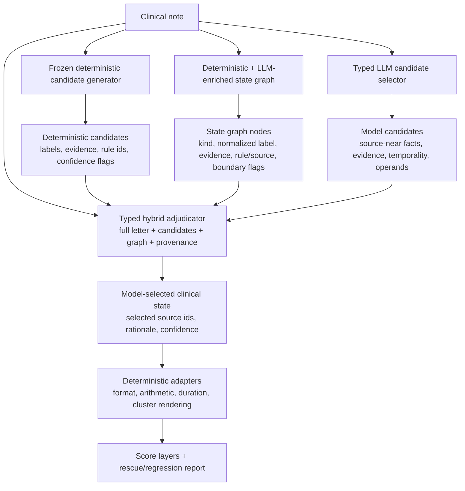
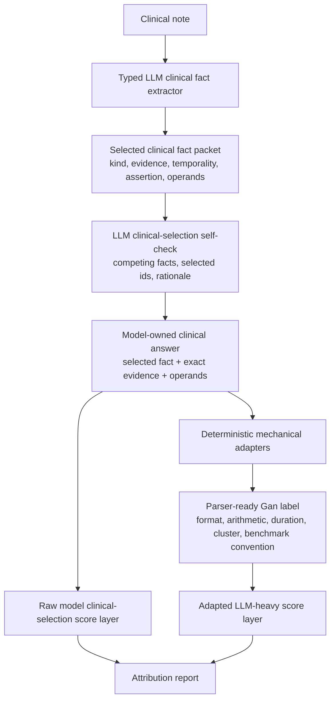

# Gan 2026 Optimal Next Architectures

Date: 2026-06-02

Status: predeclared design candidates for validation development.

This document proposes the two next Gan 2026 seizure-frequency architectures
that best fit the evidence from:

- `docs/decisions/0007-llm-heavy-clinical-selection-deterministic-adapters.md`
- ``
- `experiments/gan2026_hybrid_llm_deterministic_boundary_report_2026-06-02.md`

These are not benchmark claims. They are architecture predeclarations under
`gan2026_split_v1`. Validation remains the development surface. The locked test
split must not be used for row-level tuning.

## Executive Decision

Build and test two complementary architectures:

1. `hybrid_parallel_state_candidate_reasoner`
2. `llm_heavy_evidence_selection_with_deterministic_adapters`

The first is the strongest hybrid architecture because it removes deterministic
candidate recall as a hard ceiling while preserving transparent deterministic
rules, state-graph coverage diagnostics, and candidate-recall rescue metrics.

The second is the strongest LLM-heavy architecture because it assigns clinical
selection to the model and assigns mechanical Gan rendering to deterministic
adapters, matching Decision 0007 rather than forcing the model to memorize
parser grammar and arbitrary benchmark conventions.

Together, they test the project's central thesis: seizure-frequency extraction
works best when clinical state, evidence, component ownership, and
benchmark-facing rendering stay separate until the final score layer.

## Architecture 1: `hybrid_parallel_state_candidate_reasoner`

### Research Role

Family: `hybrid`

Prediction-bearing behavior: a typed LLM adjudicator selects the final clinical
state using the full note, deterministic candidates, state-graph nodes, and an
independent LLM candidate set.

Deterministic behavior remains prediction-bearing in the hybrid sense because
deterministic candidates and graph nodes are part of the final adjudicator
context. The result must be claimed as hybrid, not LLM-heavy.

### Why This Is Optimal

The old hybrid adjudicator asked:

```text
Given deterministic candidates, can an LLM choose better than the deterministic selector?
```

That design failed because deterministic candidate recall became the model's
information ceiling. On shifted surfaces, every no-recall row stayed wrong.

The new design asks the better question:

```text
Can deterministic rules, state-graph nodes, and model candidate recall compensate
for each other's failures while keeping ownership visible?
```

This uses the strongest current lessons:

- deterministic V1 is an excellent transparent comparator but overfits
  validation subfamilies;
- state graph separates representability from projection;
- LLMs are useful for source-near evidence, boundary states, and claim
  decomposition;
- candidate-recall rescue is the key hybrid metric, not aggregate F1 alone.

### Flow



### Component Contracts

The deterministic candidate generator should use the frozen comparator
configuration by default. Candidate revisions may be included only as named
ablation conditions, not as silent production changes.

The state graph should expose:

- deterministic rate, cluster, seizure-free, duration, and boundary nodes;
- accepted exact-evidence LLM boundary nodes where available;
- oracle coverage and projection diagnostics;
- node provenance and rule/source metadata.

The LLM candidate selector should independently emit source-near candidate
facts from the full note using typed DSPy fields and scoped `JSONAdapter`.
It should not receive gold labels. It may receive the output contract and
clinical-selection instructions.

The hybrid adjudicator receives the full note and all candidate sources. It may:

- select a deterministic candidate;
- select a state-graph node;
- select an LLM candidate;
- synthesize a final clinical event from multiple provided exact-evidence
  sources;
- reject all candidates and return `unknown` or `no seizure frequency
  reference` with source-near rationale.

It must report selected source ids and whether each selected source came from
`deterministic_candidate`, `state_graph_node`, `llm_candidate`, or
`adjudicator_synthesis`.

### Deterministic Ownership

Allowed deterministic prediction-bearing behavior:

- deterministic candidate extraction;
- deterministic state-graph node construction;
- deterministic graph projection as a comparator layer;
- deterministic adapters for parser-ready Gan syntax;
- deterministic arithmetic, duration, cluster, and benchmark-convention
  rendering from selected operands.

Required claim language:

```text
Hybrid parallel candidate/state reasoner with deterministic adapters.
```

Do not describe this architecture as LLM-heavy because deterministic candidates
and graph nodes participate in semantic selection.

### Required Score Layers

Every run must report:

- `deterministic_top_candidate`;
- `state_graph_projection`;
- `llm_candidate_selector_raw`;
- `hybrid_adjudicator_raw`;
- `hybrid_adjudicator_with_adapters`;
- `adapter_only_sidecar_from_adjudicator_selection`;
- `oracle_candidate_presence`, analysis-only;
- `oracle_graph_representability`, analysis-only.

### Required Diagnostics

The primary diagnostics are:

- candidate-recall rescue: deterministic candidate absent or wrong, LLM/state
  source present, hybrid final correct;
- graph-representability rescue: graph contains the gold clinical state but
  deterministic projection misses it, hybrid final correct;
- deterministic-correct regression: deterministic top correct, hybrid final
  wrong;
- graph-projection regression: state-graph projection correct, hybrid final
  wrong;
- selected-evidence exactness;
- selected-source provenance counts;
- adapter-changed rows;
- raw-wrong to adapter-correct rows;
- raw-correct to adapter-wrong rows.

### Validation25 Smoke

Predeclare a paired validation25 smoke with three conditions over identical
rows:

1. deterministic-top-only adjudication comparator;
2. parallel deterministic plus LLM candidate adjudication;
3. full-letter adjudication with deterministic candidates and state-graph hints.

Promotion to validation50 should require:

- 25/25 call success;
- 25/25 structured typed outputs, or a named parse-failure family with no more
  than one row affected;
- selected evidence exact on at least 23/25 rows;
- zero selected-source ids that do not exist in the supplied candidate/node
  tables unless marked as explicit adjudicator synthesis;
- at least one candidate-recall or graph-representability rescue, or a clear
  hard-slice reason to continue;
- no more than one deterministic-correct regression.

Failure to rescue any deterministic recall miss is a rejection signal, even if
aggregate F1 looks acceptable.

## Architecture 2: `llm_heavy_evidence_selection_with_deterministic_adapters`

### Research Role

Family: `llm_only` for the raw clinical-selection layer; LLM-heavy with named
deterministic adapters for the primary adapted score layer.

Prediction-bearing clinical behavior: the LLM selects the relevant clinical
fact, evidence, temporal state, competing seizure type, arithmetic operands,
cluster operands, and seizure-free evidence.

Deterministic behavior: parser-ready rendering and stable Gan-compatible
mechanical adapters computed only from the model-selected fact and operands.

### Why This Is Optimal

Earlier LLM-heavy variants failed in two different ways:

- v1 proved that the model often selects good evidence but loses points on
  parser grammar, arithmetic rendering, cluster syntax, compact intervals, and
  benchmark conventions;
- Decision 0006 briefly treated that as a reason to force model-owned
  parser-ready selected-evidence arithmetic, but Decision 0007 corrects the
  architecture: the model should own clinical selection, not every mechanical
  surface detail.

The optimal LLM-heavy architecture therefore uses a smaller, cleaner model
contract:

```text
Select the clinical fact and expose enough typed operands that deterministic
adapters can render the accepted Gan label transparently.
```

This is not a retreat from LLM-heavy reasoning. It is a cleaner division of
labor.

### Flow



### Model Output Contract

Use typed DSPy output fields with scoped `JSONAdapter`. Avoid the old
single-opaque-JSON-string contract except as an explicit comparator.

The model must emit:

- selected clinical kind:
  `frequency`, `cluster_frequency`, `seizure_free`, `last_event_only`,
  `unknown_frequency`, `no_reference`, or `unresolved_multiple`;
- exact selected evidence;
- selected fact ids, if multiple facts were extracted;
- current versus historical temporal state;
- assertion status;
- competing fact summary;
- frequency operands: occurrence count/range, denominator count/range,
  denominator unit;
- cluster operands: clusters per period, events per cluster, and whether the
  final answer should describe cluster cadence or event burden;
- seizure-free operands: selected seizure-free evidence, last-event evidence
  when present, clinic/reference date when present, and duration expression;
- benchmark caveat flags for `bimonthly`, `biweekly`, vague counts, compact
  intervals, and total-window statements;
- short clinical rationale.

The model may also emit a parser-ready label, but that label is diagnostic. The
primary adapted label is produced by deterministic adapters from the selected
fact packet.

### Deterministic Adapter Families

These adapter families are allowed in the adapted LLM-heavy score layer:

- parser-ready label grammar and unit spelling;
- word-number and numeric normalization;
- arithmetic from model-selected operands;
- total-window rendering, such as `3 events over 6 weeks` to `3 per 6 week`;
- seizure-free duration calculation from model-selected seizure-free or
  last-event evidence;
- cluster syntax rendering from model-selected cluster operands;
- stable Gan conventions, including bare `bimonthly` and `biweekly` mappings;
- schema and alias repair that does not change the selected clinical fact,
  semantic kind, selected evidence, or selected operands.

These deterministic behaviors are not allowed in the adapted LLM-heavy primary
score layer:

- choosing among competing clinical facts;
- replacing the selected seizure type or semiology;
- changing current versus historical status;
- changing `unknown_frequency` to `no_reference`, or the reverse;
- choosing a higher-burden event from the event table when the model selected a
  different event;
- applying Gan-specific diary/log aggregation unless the model selected the
  diary window and exposed the operands.

If any disallowed behavior is used, that score layer must be named hybrid.

### Required Score Layers

Every run must report:

- `raw_model_parser_label`, diagnostic;
- `raw_model_clinical_selection`, selected fact and evidence validity;
- `format_only_repair`;
- `mechanical_adapter_label`;
- `benchmark_convention_adapter`;
- `hybrid_replacement_oracle`, analysis-only, if deterministic selection would
  have chosen a different fact.

The primary LLM-heavy result should be:

```text
model-owned clinical selection with deterministic mechanical adapters
```

not:

```text
raw parser-ready LLM-only label
```

unless raw parser-ready scoring is explicitly being tested.

### Required Diagnostics

Every run must report:

- exact selected-evidence count;
- selected fact trace mismatches;
- selected operand completeness;
- adapter family used per row;
- raw model parser-label correctness;
- adapter-correct rows where the raw parser label was wrong;
- adapter-regression rows where the raw parser label was correct;
- rows where deterministic code would have selected a different clinical fact;
- rows where selected evidence is exact but selected clinical state is wrong.

The most important error split is:

```text
wrong selected clinical fact vs right selected fact with mechanical rendering failure
```

Only the second family is evidence for improving deterministic adapters.

### Validation25 Smoke

Start at validation25. Promotion to validation50 should require:

- 25/25 call success;
- 25/25 typed structured outputs, or a named adapter parse-failure family with
  no more than one row affected;
- exact selected evidence on at least 23/25 rows;
- selected operand completeness on at least 23/25 rows for rows that require
  arithmetic, interval, cluster, or duration rendering;
- zero selected fact trace mismatches;
- adapted-label Purist at least 22/25;
- no more than one raw-correct to adapter-wrong regression;
- row-level review showing that adapter gains came from mechanical rendering,
  not deterministic clinical replacement.

Failure mode triage after validation25 should prioritize:

1. wrong clinical fact selection;
2. exact-evidence failures;
3. missing operands;
4. adapter rendering bugs;
5. raw parser-label grammar.

Do not spend another prompt revision primarily on teaching Gan grammar until
the selected-fact and operand contract is stable.

## Comparison Plan

The first paired development cycle should use validation25 and compare:

| Condition | Purpose |
| --- | --- |
| deterministic V1 top | frozen transparent comparator |
| state-graph projection | coverage/projection comparator |
| `hybrid_parallel_state_candidate_reasoner` raw | hybrid selection signal |
| `hybrid_parallel_state_candidate_reasoner` adapted | hybrid plus mechanical adapter score |
| `llm_heavy_evidence_selection_with_deterministic_adapters` raw parser label | diagnostic parser-owning layer |
| `llm_heavy_evidence_selection_with_deterministic_adapters` adapted | LLM-owned clinical selection plus adapters |

The two new architectures should not be judged only by aggregate Purist F1.
The decision table should include:

- candidate-recall rescue;
- graph-representability rescue;
- wrong selected clinical fact count;
- right selected fact with adapter/rendering failure count;
- selected-evidence exactness;
- selected operand completeness;
- deterministic-correct regressions;
- adapter regressions;
- schema/adapter parse failures.

## Expected Outcomes

The likely winning pattern is not a single monolith.

`hybrid_parallel_state_candidate_reasoner` is expected to be best when:

- deterministic graph coverage is high but projection is weak;
- LLM candidate recall finds facts outside deterministic top;
- boundary states, competing semiologies, or temporal conflicts need arbitration.

`llm_heavy_evidence_selection_with_deterministic_adapters` is expected to be
best when:

- the model can identify the right fact and evidence;
- the remaining error is parser grammar, arithmetic, duration, cluster syntax,
  or benchmark convention;
- the note style differs enough that deterministic candidate recall is brittle.

If neither architecture clears its validation25 contract, the result is still
useful. The project will know whether the blocker is candidate recall,
selection, operand exposure, adapter rendering, or attribution drift.

## Implementation Notes

Use existing package boundaries:

- `deterministic/` for frozen candidates and named adapter families;
- `state_graph/` for graph nodes, coverage, projection, and node provenance;
- `llm/` for typed LLM-only clinical-selection programs;
- `hybrid/` for parallel candidate/state adjudication;
- `reports/` and `artifact_analysis/` for score-layer and attribution reports;
- `experiments/registry.jsonl` for canonical run records once smokes are run.

Use scoped DSPy adapter configuration for new LLM/DSPy code:

```python
with dspy.context(lm=lm, adapter=dspy.JSONAdapter()):
    prediction = program(...)
```

Preserve raw outputs and typed parsed outputs. Historical opaque-string
pipelines should remain frozen comparators unless explicitly redesigned.

## Claim Language

Use this claim language before results exist:

- "predeclared validation-development architecture";
- "hybrid parallel candidate/state reasoner";
- "LLM-owned clinical selection with deterministic mechanical adapters";
- "candidate-recall rescue";
- "graph-representability rescue";
- "mechanical adapter gain";
- "hybrid replacement oracle", for analysis-only deterministic clinical
  replacement layers.

Do not use:

- "benchmark result";
- "generalizes";
- "solves Gan 2026";
- "LLM-only" for adapted score layers that use deterministic benchmark or
  mechanical adapters;
- "LLM-heavy" for layers where deterministic code chooses the clinical fact.
