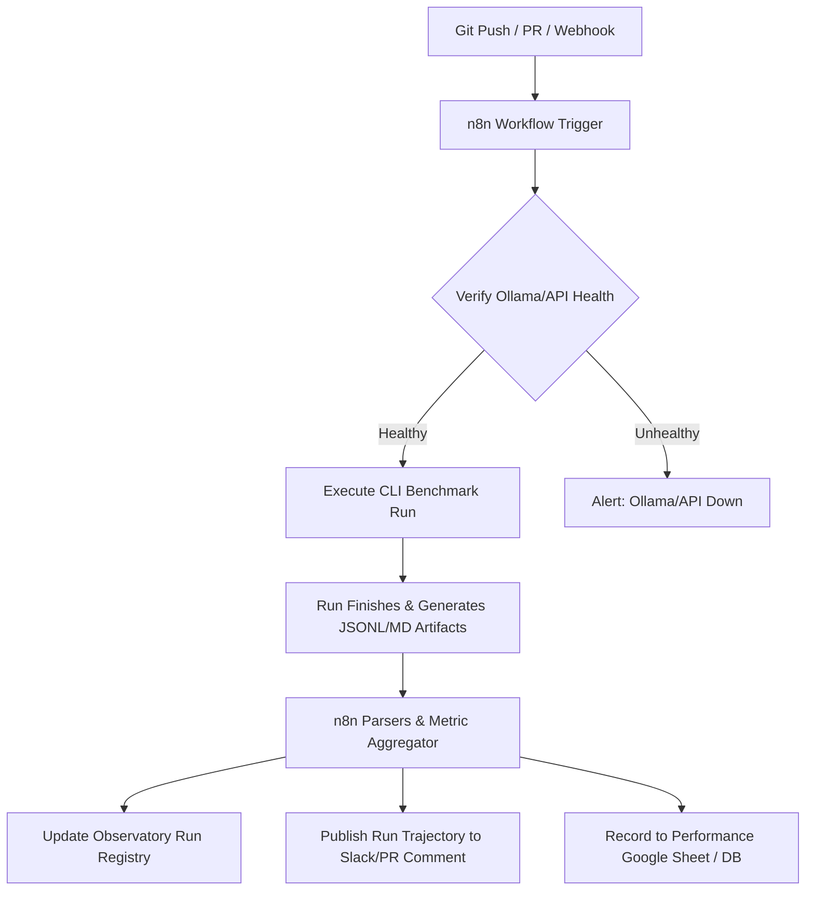

# Plan: Automated Benchmarking and Continuous Evaluation with n8n

This document outlines a plan to automate evaluation ladders (validation25/50/250/750) and local/remote model benchmarks (DSPy, Ollama, OpenAI) using **n8n**. 

Automating this workflow ensures that every code change is immediately validated for regressions, F1 score metrics are tracked historically, and local/remote LLM configurations are systematically benchmarked without manual CLI execution.

---

## 1. System Architecture

The automation sits between the Git repository, the execution environment (local developer machine or dedicated GPU host), and the reporting surfaces.



---

## 2. n8n Workflow Design

The workflow in n8n is structured as a series of connected nodes. Below is the blueprint of nodes and their roles.

### Trigger Node (Webhook or Cron)
* **Option A: Webhook (GitHub/GitLab PR or Push):** n8n listens for pushes to validation branches or pull requests.
* **Option B: Cron/Schedule:** Runs automated validation50 or validation250 stress-slices overnight when local GPU resources (Ollama/Qwen 3.6:35b) are idle.
* **Option C: Local File Watcher:** Triggers a run when changes are saved in the `src/` directory.

### Environment & Dependency Validation Node (HTTP Request)
Before starting a long, token-intensive experiment:
* **Action:** n8n sends an HTTP GET request to `http://localhost:11434/api/tags` (Ollama status endpoint) or check OpenAI/LiteLLM endpoints.
* **Conditional Branch:** If the model endpoint is offline or times out, the workflow halts and sends a warning message (e.g. *"Ollama is not running. Benchmarking aborted."*), preventing CLI execution failures.

### Execution Node (Execute Command / SSH)
* **Action:** Activates the virtual environment and runs the benchmark command.
* **Configuration Example:**
  ```bash
  cd /Users/cobro/code/clinical-extraction
  git pull origin main
  source .venv/bin/activate
  gan2026-llm-experiment --pipeline llm_only_sparse_operands_selected_state_reasoner --mode live --limit 50 --model ollama_chat/qwen3.6:35b
  ```

### Parsing & Aggregation Node (Code Node - JS/Python)
Once the CLI run completes and writes its report (e.g. `experiments/gan2026_*.jsonl` or `.md`), n8n reads and extracts:
* **Metrics:** Purist F1, Pragmatic F1, exact evidence match rates, and safety-floor fallback rate.
* **Errors:** Count of schema validation breaks or token budget truncation warnings.
* **Metadata:** Pipeline name, model route, API base, commit hash, date, and latency per token.

### Reporting & Publishing Nodes
* **Slack / Discord Node:** Post a formatted card detailing the run outcome:
  > 🚀 **Benchmark Complete for `sparse_operands_v1_boundaryfix`**
  > * **Model:** Ollama/Qwen3.6:35b
  > * **F1 Purist:** `0.9280` (vs baseline `0.8640` | 🟢 **+0.0640**)
  > * **F1 Pragmatic:** `0.9600` (vs baseline `0.8720` | 🟢 **+0.0880**)
  > * **Safety Fallbacks:** `14 / 50`
  > * **Schema Failures:** `0`
* **GitHub Comment Node:** If triggered by a PR, n8n uses the GitHub API to write this scorecard directly as a comment on the active PR.
* **Observatory Synchronizer:** n8n ensures the generated JSONL is copied to the correct run registry path so that the **Clinical Extraction Observatory** dashboard can instantly load the latest results.

---

## 3. Step-by-Step Implementation Steps

### Phase 1: Local n8n Instance & Health Check
1. Spin up n8n locally (e.g., using `npx n8n` or Docker).
2. Configure a health check workflow that pings `http://localhost:11434` (Ollama) every morning, notifying via desktop notification or Slack if the service is down.

### Phase 2: CLI Integration
1. Enable execution of system commands in n8n (using the environment variable `EXECUTIONS_PROCESS_SYSTEM_AUTHORIZATION_ENABLED=true` in n8n configuration).
2. Build an execution node that triggers `gan2026-llm-experiment` with smaller limits (`--limit 25`) to test the integration.

### Phase 3: Reporting & CI/CD Hookup
1. Connect n8n to your GitHub repository using a personal access token (PAT) to read commit hashes and post PR comments.
2. Hook the output JSON parser to format markdown telemetry report updates.
