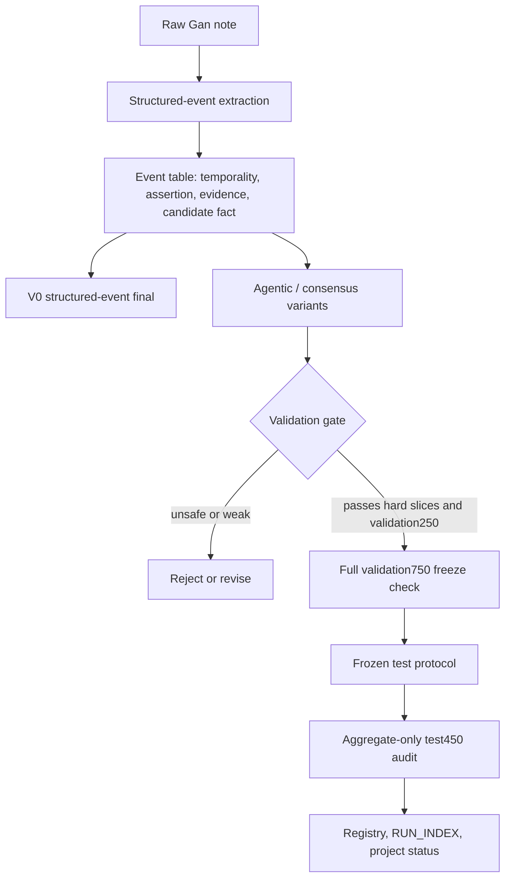
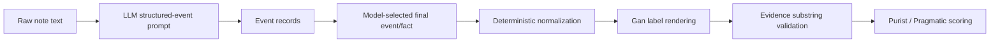
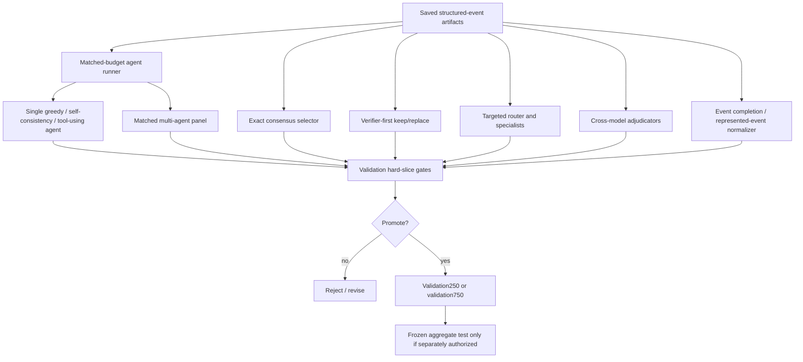
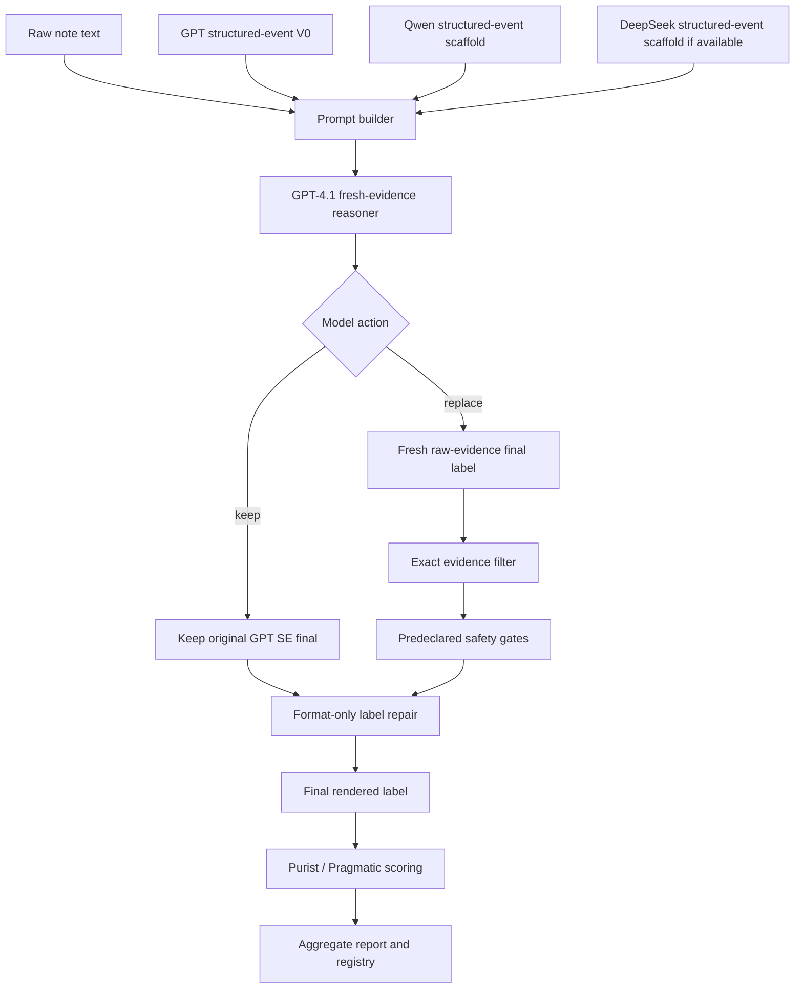

# Gan 2026 Hybrid Structured Events, Agentic Consensus, and Fresh Evidence Analysis

Date: 2026-06-14

Status: post-audit synthesis. This document summarizes completed validation
and aggregate-only test work. It does not authorize a new `test450` run, inspect
row-level holdout failures, or change scoring policy.

## Executive Summary

The strongest completed Gan 2026 direction is still the structured-event family:
an LLM extracts source-near seizure-frequency events, deterministic code
normalizes/renders/scoring labels, and evidence checks remain explicit. GPT
`hybrid_structured_events` reached `661/748` Purist on validation rendered rows
and `364/450` Purist, `381/450` Pragmatic on the locked aggregate-only
`test450` audit.

The agentic/consensus cycle explored whether orchestration could recover the
remaining boundary and selection failures. Exact structured-event consensus
looked excellent on validation (`708/750` Purist), but the closest available
locked-test replay reached only `365/450` Purist because the deterministic floor
and partial two-agent availability did not generalize. This rejected consensus
as a robust final-answer architecture, while preserving it as evidence that
structured-event disagreement contains useful signal.

The later V1-V11 agentic variants mostly failed for one of two reasons: broad
second-pass reasoning introduced regressions, while high-precision routers and
specialists were safe but too weak. The most promising pre-V12 specialist,
`temporal_sentinel_specialist`, reached `42/50` on the fixed hard50 slice but
transferred to only `237/250` versus V0 `236/250`.

V12 `fresh_evidence_reasoner` was the first post-consensus candidate to pass the
full validation ladder without deterministic final-label fallback. It reached
validation750 `682/750` Purist and `698/750` Pragmatic, then in the explicitly
authorized frozen aggregate-only `test450` audit reached `379/450` Purist and
`394/450` Pragmatic. This is the best completed holdout result in the line of
work, but it missed the predeclared target of `383/450` Purist by 4 rows. The
`>0.85` Purist goal is therefore not achieved.

## Inspection Boundary

- Validation row-level artifacts are development evidence and were used by the
  original experiments to design and gate candidates.
- Locked `test450` evidence in this synthesis is aggregate-only. The V12
  aggregate readout came from the pinned Markdown helper, and no row-level
  holdout failures, rationales, evidence strings, selected events, or
  transitions were inspected for this write-up.
- Evidence metrics are architecture-specific. `evidence_valid`,
  `evidence_exact_substrings`, `evidence_text_contained`, and CandidateSet
  source-id validity should not be read as one interchangeable number.

## Overall Pipeline

The work moved through three major journeys:

1. `hybrid_structured_events` established a strong source-near intermediate
   representation.
2. Agentic and consensus variants tested whether structured-event disagreement,
   tools, specialists, or cross-model selection could repair the remaining
   errors.
3. `fresh_evidence_reasoner` reset the final layer around single-model,
   evidence-grounded clinical selection rather than deterministic fallback or
   exact-label voting.

## Hybrid Structured Events

### Architecture

The structured-event architecture asks the model to stay close to the source
text: identify seizure-frequency-relevant events, attach exact evidence, mark
temporality and certainty, and select the event/fact that should determine the
Gan label. Deterministic code then handles label rendering, format repair,
evidence-substring validation, and scoring.

The rationale was pragmatic. Direct-label LLMs could often see the clinical
signal but were brittle in label syntax, arithmetic, and boundary states.
Fully deterministic systems were strong on validation but exposed
dataset-specific overfitting and large test generalization gaps. Structured
events split the difference: the LLM owns extraction and selection, while code
keeps the benchmark-facing label grammar controlled.

### Validation Performance

| Run | Model | Validation result | Evidence / health | Interpretation |
| --- | --- | ---: | --- | --- |
| Phase 1 GPT SE | `openai/gpt-4.1-mini` | `661/748` Purist rendered, `679/748` Pragmatic rendered | `691/750` evidence-valid rows, `2` null rows | Best GPT LLM-facing architecture in Phase 1. |
| Phase 1 Qwen SE | `ollama_chat/qwen3.6:35b` | `624/746` Purist rendered | Qwen hybrid rendered poorly in non-SE architecture; SE still led Qwen family | Cross-model support for SE substrate. |
| Phase 1 DeepSeek SE | `deepseek/deepseek-chat` | `609/742` Purist, `634/742` Pragmatic | `718/750` evidence-valid rows, `8` parse/validation failures | Good evidence behavior but weaker selection. |
| Qwen SE v0.6 | `ollama_chat/qwen3.6:35b` | `638/746` Purist, `656/746` Pragmatic | `581/750` evidence-valid rows, `4` parse/validation failures | Improved Qwen from Phase 1; dialect repair remained heavy. |
| DeepSeek SE v0.6 | `deepseek/deepseek-chat` | `622/745` Purist, `646/745` Pragmatic | `719/750` evidence-valid rows, `5` parse/validation failures | Improved DeepSeek from Phase 1. |

The key validation result was not that SE beat the deterministic validation
ceiling. It did not: the deterministic/canonical validation reports reached
`673` to `688` Purist depending on de-overfitting stage. The important result
was that SE was the strongest LLM-centered architecture with a clinically
inspectable intermediate state and much less dependence on deterministic final
candidate ranking.

### Test Performance

| Run | Test result | Health | Interpretation |
| --- | ---: | --- | --- |
| GPT `hybrid_structured_events` Phase 4 frozen audit | `364/450` Purist, `381/450` Pragmatic | `448/450` structured records, `0` call failures, `2` parse/schema/label issues, `418/450` evidence-valid | Best Phase 4 locked-test architecture, but only `0.8089` Purist over all 450 rows and below the `0.85` target. |
| DeepSeek SE v0.6 source-coverage run | `354/450` Purist, `368/450` Pragmatic | `446/450` structured records, `0` call failures, `4` parse/schema/label issues, `440/450` evidence-valid | Added after this synthesis was first written to correct the missing DeepSeek `test450` structured-event source gap; aggregate-only artifact generation, not a promoted candidate. |

The test result made SE the baseline to beat. The later `0.85` plan therefore
set the target as `383/450`, requiring roughly `+19` Purist rows over the
`364/450` SE holdout baseline.

## Agentic And Consensus Variants

### Rationale

The agentic cycle was not a single architecture. It was a sequence of tests
around a shared question: can an LLM or group of LLMs repair structured-event
selection errors without borrowing strength from a deterministic final-label
floor?

The explored mechanisms were:

- matched-budget single-agent and multi-agent comparisons, to avoid claiming
  multi-agent value without a fair self-consistency baseline;
- tool/context ablations, to test whether boundary guides or parser/candidate
  context actually helped;
- exact-label consensus, to exploit agreement between deterministic rules and
  multiple structured-event agents;
- verifier/router/specialist variants, to override V0 only when a narrow
  boundary or burden contradiction was visible;
- cross-model adjudication, to use GPT/Qwen/DeepSeek disagreement as a signal;
- completion and recomputation variants, to test whether failures came from
  missing events or from wrong selection/normalization of already represented
  events.

### Agentic Variant Map

### Early Matched-Budget And Tool Work

| Variant | Validation result | Test result | Decision / rationale |
| --- | ---: | ---: | --- |
| Matched-budget runner smoke | validation1 live smoke clean; validation25 prompt-only verified trace shape | Not run | Built infrastructure for fair comparisons, not an accuracy claim. |
| Single-agent validation25 post-vote | `25/25` row-final Purist after normalized-label voting | Not run | Cleared the small-surface contract, but did not prove hard-slice value. |
| Hard50 tool context ablation | boundary-guide-only `34/50`; no-tool `30/50`; parser-only `21/50`; parser+guide `19/50` | Not run | Parser/candidate context was harmful; boundary guide was the only non-harmful context. |
| Hard50 tool self-consistency | `34/50`, 4 wins and 2 losses versus comparator | Not run | Missed promotion gate by one rescue. |
| Selective fallback replay | eligible policies net `-3` to `-12` | Not run | No fallback policy produced promotable wrong-to-correct behavior. |
| Boundary-guide rescue replay | best policy `35/50`, `+3` net, precision `0.75`, `0` regressions | Not run | Useful validation signal, but too small to authorize broader escalation alone. |

The early work explained why the project moved away from broad "more tools,
more agents" designs. Extra context often made the model worse, and
matched-budget multi-agent behavior was not better than simpler single-agent
or self-consistency baselines.

### Consensus And Structured-Event Patches

| Variant | Architecture | Validation result | Test result | Decision / rationale |
| --- | --- | ---: | ---: | --- |
| Three-agent exact consensus | Deterministic floor plus exact-label unanimity across GPT, Qwen, and DeepSeek SE outputs | `708/750` Purist, `713/750` Pragmatic; baseline `697/750`; `27` W2C, `16` C2W | Not exactly reproducible on test because DeepSeek test SE artifact was unavailable | Promoted as validation signal, not as final architecture. |
| Available two-agent consensus test replay | Deterministic floor plus exact agreement from available GPT/Qwen SE outputs | Validation reference remained `708/750` for three-agent policy | `365/450` Purist, `375/450` Pragmatic; deterministic floor `343/450`; `45` W2C, `23` C2W | Rejected as robust holdout strategy. Improved weak floor but barely beat pure GPT SE. |
| Qwen recent unresolved burden patch | Conservative no-call patch over Qwen SE v0.6, selecting existing recent unresolved burden events only | `640/750` Purist from baseline `638/750`; `656` to `658` Pragmatic; precision `1.0` over 2 patches | No standalone locked-test success claim | Demonstrated narrow high-precision repair, but too small to solve target. |

The consensus journey was the most instructive negative result. On validation,
agreement looked like signal. On test, the deterministic floor had already
dropped, DeepSeek was unavailable for the original replay, and exact-label voting
mostly preserved the generalization gap. A later 2026-06-14 DeepSeek SE v0.6
`test450` source-coverage run filled the missing artifact gap for future frozen
aggregate-only replays, but it does not change the historical interpretation of
that earlier two-agent consensus audit. The reset plan therefore rejected
deterministic top as a prediction-bearing fallback and required LLM-owned final
clinical selection.

### V1-V11 LLM-Owned Agentic Ladder

| Variant | Main idea | Validation result | Test result | Decision / rationale |
| --- | --- | ---: | ---: | --- |
| V1 `llm_event_reasoner` | One second-pass LLM reasoner over GPT SE V0 | validation25 `25/25`; hard50 `35/50` vs V0 `39/50`, `1` W2C, `5` C2W | Not run | Broad free reasoning regressed semantic selection. |
| V3 `targeted_boundary_router` | Router triggers keep/replace on boundary profiles | best hard50 variants reached `40/50`; v0.1 had 3 wins and 2 losses, v0.2 safe `+1`, v0.4 parity | Not run | Auditable but below Stage 2 gate. |
| V4 `structured_event_verifier` | Verifier-first keep or replace with existing event | validation25 `25/25`; hard50 `40/50`, `+1`, precision `1.0`; frequency-denominator slice `8` vs V0 `7` | Not run | Safe but far below `+4` hard50 and `+5` validation250 gates. |
| V7 `event_completion_reasoner` | Create missing completed event only when omission is proven | validation25 `25/25`; hard50 `39/50`; no completed-event actions across hard/family slices | Not run | Showed misses were usually represented but selected/normalized wrongly, not absent. |
| V8 `represented_event_normalizer` | Recompute from selected existing evidence | validation25 `25/25`; hard50 `38/50` vs V0 `39/50` | Not run | Free recomputation over-selected seizure-free evidence and regressed. |
| V9 `temporal_sentinel_specialist` | Specialist plus safety gate for seizure-free/unknown/no-reference boundaries | hard50 `42/50`, `+3`, precision `1.0`; validation250 `237/250` vs V0 `236/250` | Not run | Safe and useful locally, but validation250 transfer only `+1`. |
| V10 `cross_model_structured_event_adjudicator` | Select one saved agent final using a peer-selection gate | validation25 `25/25`; hard50 `40/50`, `+1`, no regressions | Not run | Safe but too weak. |
| V11 `cross_model_challenge_gated_adjudicator` | Challenge disagreements, then apply high-precision gate | validation25 `25/25`; hard50 `41/50`, `+2`; five family slices each `+1`; validation250 upper bound only `+2` | Not run | Peer challenge found real rescues but still missed promotion gates. |

This ladder sharpened the central lesson. The safer the agent became, the fewer
rows it changed. The more freedom it had to recompute labels, the more it
regressed. The work therefore converged on a middle position: let the model
look back at raw evidence and make a fresh decision, but keep deterministic
roles limited to formatting, exact-evidence filtering, safety gates, rendering,
and scoring.

## V12 Fresh Evidence Reasoner

### Architecture

V12 kept the structured-event substrate but changed the final decision contract.
Instead of voting exact labels or asking a verifier to select a saved event, the
model could either keep the original GPT structured-event final or replace it
with a direct final label grounded in exact raw-note evidence. Validation used
saved GPT, Qwen, and DeepSeek structured-event scaffolding. The frozen test
audit used split-aware frozen GPT and Qwen test sources; DeepSeek test
structured-event output was unavailable and explicitly not loaded.

The model owned the clinical action and final fresh-evidence label. Deterministic
code was limited to prompt assembly, JSON/schema repair, format-only label
repair, exact-substring evidence filtering, predeclared safety gates, rendering,
and scoring. The fallback was only the original GPT structured-event LLM final,
not deterministic top.

### Rationale

V12 was designed to correct the failure pattern left by V1-V11:

- broad second-pass reasoning was too unconstrained;
- exact consensus over-synchronized with brittle baselines;
- high-precision routers were too weak;
- represented-event recomputation showed that event scaffolds were useful but
  not sufficient;
- the best specialist behavior came from conservative fallback to the original
  LLM structured-event final.

The fresh-evidence contract therefore gave the model one stronger option:
return to the raw evidence and make an explicit keep-or-replace decision,
without seeing deterministic final labels or row-level test information.

### Validation Ladder

| Surface | V12 result | Comparator | Health / attribution | Decision |
| --- | ---: | ---: | --- | --- |
| validation25 | `25/25` Purist | V0 `25/25` | Contract smoke passed | Proceeded. |
| fixed hard50 | `42/50` Purist | V0 `39/50` | `14` replace actions, `4` evidence-gate fallbacks, `46/50` exact evidence, `0` failures | Passed hard-slice directionally, with `3` net transition gain and no broad health issue. |
| validation250 | `242/250` Purist | V0 `236/250` | raw model `242/250`, final `242/250`, `42` replace actions, `241/250` exact evidence, `0` failures | Passed promotion gate. |
| validation750 | `682/750` Purist, `698/750` Pragmatic | V0 `661/750` Purist, `679/750` Pragmatic | raw model `676/750`, format-only `676/750`, final `682/750`, `182` replace actions, `8` gate fallbacks, `703/750` exact evidence, `0` failures | Froze candidate for one aggregate-only test request. |

Validation750 improved the count over V0 by `21` rows (`682` vs `661`), while
the official transition accounting recorded `42` wrong-to-correct and `22`
correct-to-wrong changes. That is a real gain, but the changed-label precision
was only `0.2857`, so the freeze depended on overall validation transfer and
health, not on a high-precision override story.

### Frozen Aggregate-Only Test Audit

| Surface | V12 final | V0 / baseline | Attribution and health | Target |
| --- | ---: | ---: | --- | ---: |
| locked `test450` Purist | `379/450` (`0.8422`) | GPT SE V0 `364/450`; prior consensus test `365/450` | raw model `372/450`; format-only `372/450`; final `379/450`; `26` W2C, `13` C2W; `118` replace actions; `9` gate fallbacks; `423/450` exact evidence; `0` call failures; `0` parse/schema/label failures | Required `383/450`; missed by `4` |
| locked `test450` Pragmatic | `394/450` (`0.8756`) | GPT SE V0 `381/450`; prior consensus test `375/450` | raw model `387/450`; format-only `387/450`; final `394/450` | No separate target, but improves prior baselines |

The result is both encouraging and final. It improves over the pure GPT
structured-event holdout by `+15` Purist rows by count and improves Pragmatic by
`+13` rows, but it does not exceed `0.85` Purist. Under the frozen protocol, the
failed target is final-evaluation evidence, not a tuning surface.

## Cross-Journey Interpretation

The structured-event substrate generalized better than direct label prompts,
tool-heavy agents, and deterministic-candidate adjudication. Its value is the
combination of source-near evidence, inspectable event state, and controlled
rendering.

Consensus was useful for validation discovery but brittle as a final
architecture. Exact-label agreement can amplify a weak floor, and validation
unanimity did not survive the locked test conditions. The missing DeepSeek test
source also exposed a practical problem for cross-model consensus: a strong
validation protocol is not automatically reproducible on holdout if source
coverage differs.

Most agentic variants were negative controls with useful information. Broad
reasoners over-changed labels; tool/context-heavy variants harmed performance;
routers and specialists became safer as they became weaker. The productive
pattern was conservative, evidence-grounded replacement with a known good LLM
fallback.

V12 was the best synthesis of those lessons. It made the LLM own the final
clinical selection, preserved structured events as scaffolding rather than a
deterministic answer, and used deterministic code only for contract enforcement.
It produced the best holdout result to date but still fell short of the target,
which means the remaining gap is not merely label formatting or evidence
filtering. It is still clinical selection under distribution shift.

## Performance Snapshot

| Architecture / variant | Best validation headline | Locked test headline | Status |
| --- | ---: | ---: | --- |
| GPT `hybrid_structured_events` | `661/748` Purist rendered, `679/748` Pragmatic rendered | `364/450` Purist, `381/450` Pragmatic | Strong baseline, below target. |
| Three-agent exact consensus | `708/750` Purist, `713/750` Pragmatic | Closest available test replay `365/450` Purist, `375/450` Pragmatic | Validation signal did not transfer. |
| Qwen recent unresolved burden patch | `640/750` Purist from `638/750` | No standalone successful test claim | Useful narrow patch only. |
| V1 free event reasoner | validation25 `25/25`; hard50 `35/50` | Not run | Rejected. |
| V4 structured-event verifier | hard50 `40/50`, `+1`, precision `1.0` | Not run | Safe but too weak. |
| V9 temporal sentinel specialist | hard50 `42/50`; validation250 `237/250` | Not run | Safe locally, weak transfer. |
| V11 cross-model challenge gated adjudicator | hard50 `41/50`; validation250 upper bound `238/250` | Not run | Useful but below gates. |
| V12 `fresh_evidence_reasoner` | validation750 `682/750` Purist, `698/750` Pragmatic | `379/450` Purist, `394/450` Pragmatic | Best holdout result, target missed. |

## Implications For Next Work

Any next attempt should start as a new validation-only cycle. It must not tune
from V12 row-level test behavior. The most defensible direction is not a larger
agent panel by default; the evidence so far says larger orchestration must beat
a matched-budget single-agent comparator before being trusted.

Promising validation-only questions:

- Can fresh-evidence reasoning be made more selective without losing the
  high-value replacements that produced the test gain?
- Can validation-only family slices isolate the residual distribution shift
  between validation750 `682/750` and test450 `379/450` without reading test
  rows?
- Can a second model improve V12 only as an uncertainty or contradiction signal,
  while the final action remains model-owned and aggregate-gated?
- Can profile-level reporting be added for validation artifacts so future
  freeze decisions know whether gains concentrate in denominator/window,
  cluster axis, seizure-free duration, unknown/no-reference, or multi-semiology
  families?

The current honest conclusion is: structured events are the durable substrate,
agentic orchestration has produced valuable negative controls, and V12 is the
best completed single-model reasoning layer but not enough to surpass `0.85`
Purist on locked `test450`.

## Source Artifacts

- `PROJECT_STATUS.md`
- `experiments/registry.jsonl`
- `experiments/RUN_INDEX.md`
- ``
- ``
- ``
- ``
- `experiments/gan2026_fresh_evidence_reasoner_validation750_live_gpt41_v0_4_2026-06-13.md`
- `experiments/gan2026_fresh_evidence_reasoner_validation250_live_gpt41_v0_4_2026-06-13.md`
- `experiments/gan2026_fresh_evidence_reasoner_hard50_live_gpt41_v0_4_2026-06-13.md`
- `experiments/gan2026_fresh_evidence_reasoner_test450_live_gpt41_v0_4_2026-06-13.md`
- Row-level DeepSeek test report removed by split policy.
