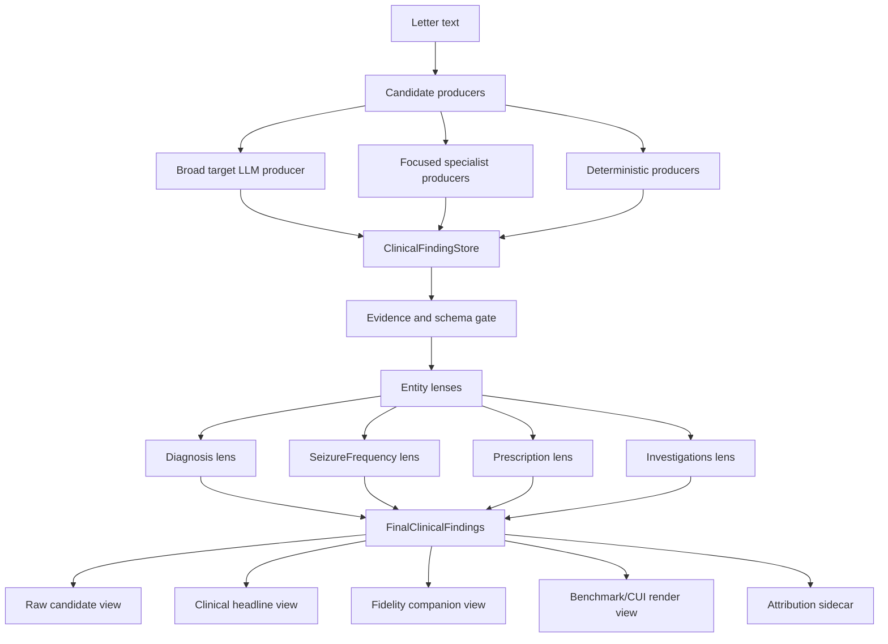

# Satellite 12 - Holistic Clinical Finding Architecture

Parent: [[00_overarching_implementation_plan]]  
Status: completed behavior-preserving structural replay, 2026-06-21
Scope: ExECTv2 Plan 11 architecture/refactoring only. This is not a new
full-200, locked-test, or benchmark claim.

## Purpose

The current best ExECTv2 Plan 11 result is real but awkward to explain:
`focused_lane_component_evidence_v01_dev140` combines a v0.42 local-Qwen
control for Prescription and Investigations with focused Diagnosis and
SeizureFrequency lanes. That is attribution-clean, but the architecture reads
like a collection of artifact-specific parts rather than one coherent clinical
extraction system.

This plan refactors the implementation and vocabulary around a single idea:

> ExECTv2 builds an evidence-backed clinical finding store, applies
> entity-specific clinical lenses to reconcile those findings, then renders
> multiple scoring views from the same final findings.

The goal is to make the system easier to reason about without weakening the
research discipline. The refactor must preserve source provenance, evidence
gates, component ownership, and deterministic-rule attribution.

## 1. Current Problem

The current focused-lane report is accurate but has three architectural smells.

First, assembly lives inside a report module:
`reports/focused_lane_component_evidence.py` reads source JSONL files, aligns
rows, selects lane-specific mentions, computes scores, writes JSONL/JSON/MD, and
renders gate results. That makes the architecture feel retrospective.

Second, the current vocabulary is artifact-first. Terms such as `v0.42_control`,
`focused_diagnosis_reconciler_v01`, and `focused_sf_unknown_suppression_v07` are
important provenance labels, but they should not be the main user-facing
architecture.

Third, scoring surfaces are described like separate outputs rather than views
over one shared object. `raw_lane_score`, `evidence_valid_score`,
`headline_target`, `cui_projection_companion`, benchmark raw, and fidelity
companions are easier to understand if they are explicitly rendered from the
same finding graph.

The refactor should not hide that different components perform different
prediction-bearing work. It should contain that complexity in a better object
model.

## 2. Target Architecture



### Core terms

| Term | Meaning |
| --- | --- |
| `ClinicalFinding` | Evidence-backed clinical assertion with entity, normalized concept, attributes, evidence, source, and provenance. |
| `ClinicalFindingStore` | Per-letter collection of raw and normalized findings from all candidate producers. |
| `CandidateProducer` | Any component that proposes findings: broad LLM, focused specialist, deterministic extractor, saved-output replay adapter. |
| `EntityLens` | Entity-specific reconciler that turns candidate findings into final clinical findings for one family. |
| `FindingView` | A scoring/rendering view over final findings, such as headline, fidelity, benchmark/CUI, or raw candidate. |
| `AttributionSidecar` | Structured provenance that records the prediction-bearing component, deterministic actions, evidence status, and view-specific rendering choices. |

## 3. Package Refactor

Add an assembly layer under ExECTv2:

```text
src/clinical_extraction/tasks/epilepsy_phenotyping/exectv2/
  assembly/
    __init__.py
    clinical_finding.py
    finding_store.py
    producers.py
    lenses.py
    views.py
    pipeline.py
    manifests.py
  reports/
    focused_lane_component_evidence.py  # becomes reporting wrapper only
```

The existing contract remains stable:

- `contract/prediction.py` remains the scorer-facing prediction contract.
- `PredictedMention` remains the adapter target for scoring.
- The new assembly layer converts richer `ClinicalFinding` objects into
  `PredictedMention` only at view/render boundaries.

This avoids breaking existing runners while creating a cleaner internal spine.

## 4. Proposed Data Model

### `ClinicalFinding`

The first version should be deliberately small and compatible with existing
JSONL artifacts.

```python
@dataclass(frozen=True)
class ClinicalFinding:
    finding_id: str
    letter_id: str
    entity: str
    text: str
    attributes: Mapping[str, str]
    evidence: str
    normalized_concept: str | None
    assertion: str | None
    confidence: str | None
    source: FindingSource
    provenance: tuple[ProvenanceEvent, ...]
```

### `FindingSource`

```python
@dataclass(frozen=True)
class FindingSource:
    producer_id: str
    artifact_path: str
    pipeline_family: str
    model: str
    prompt_version: str
    mode: str
    ownership_label: str
```

### `ProvenanceEvent`

```python
@dataclass(frozen=True)
class ProvenanceEvent:
    stage: str
    action: str
    owner: str
    portability: str | None
    detail: Mapping[str, Any]
```

Important boundary: if a provenance event adds, drops, replaces, or selects a
clinical concept/state, it is prediction-bearing deterministic behavior. It
must not be described as normalization unless it is format-preserving.

## 5. Entity Lenses

Each lens consumes all candidate findings for one letter and one entity, then
returns final clinical findings plus lens diagnostics.

```python
class EntityLens(Protocol):
    lens_id: str
    entity: str

    def reconcile(
        self,
        store: ClinicalFindingStore,
        *,
        policy: LensPolicy,
    ) -> LensResult:
        ...
```

### Initial lenses

| Lens | First implementation | Existing behavior absorbed |
| --- | --- | --- |
| `DiagnosisLens` | Reconcile diagnosis hierarchy, negation/assertion, duplicate concepts. | Focused Diagnosis reconciler v0.1 behavior and current target Diagnosis projection. |
| `SeizureFrequencyLens` | Classify active-rate, seizure-free, unknown/change states, generic-vs-specific ownership. | Focused SF v0.7, state projection, unknown suppression diagnostics. |
| `PrescriptionLens` | Preserve current regimen normalization and current v0.42 control behavior. | v0.42 Prescription lane plus medication normalization/projection. |
| `InvestigationsLens` | Preserve current modality/performed/result normalization and v0.42 control behavior. | v0.42 Investigations lane plus investigation projection. |

The first pass should be behavior-preserving. Do not rewrite the clinical logic
while moving it. The target is conceptual simplification and testable boundaries.

## 6. Manifest-Driven Assembly

Replace hard-coded lane constants with a manifest that says which producer feeds
which lens for a named candidate.

Example:

```yaml
candidate_id: focused_finding_assembly_v01_dev140
split: dev
row_count: 140
claim_boundary: dev_only_component_evidence
producers:
  target_single_call_v042:
    kind: saved_jsonl
    artifact: experiments/exectv2_target_indicators_single_call_v042_live_default_quarantine_dev140_qwen36_35b_ollama_autogpu_ctx16384_20260620.jsonl
    ownership_label: llm_first_control
  diagnosis_reconciler_v01:
    kind: saved_jsonl
    artifact: experiments/exectv2_hybrid_diagnosis_reconciler_v01_dev140_gpt41mini_20260618.jsonl
    ownership_label: hybrid_diagnosis_route
  sf_unknown_suppression_v07:
    kind: saved_jsonl
    artifact: experiments/exectv2_hybrid_sf_unknown_suppression_v07_dev140_20260618.jsonl
    ownership_label: hybrid_sf_route
lenses:
  Diagnosis:
    producer: diagnosis_reconciler_v01
    lens: diagnosis_hierarchy_negation_v01
  SeizureFrequency:
    producer: sf_unknown_suppression_v07
    lens: sf_state_adjudication_v01
  Prescription:
    producer: target_single_call_v042
    lens: prescription_regimen_v01
  Investigations:
    producer: target_single_call_v042
    lens: investigations_result_v01
views:
  - raw_candidate
  - evidence_valid
  - clinical_headline
  - fidelity_companion
  - benchmark_cui
```

Recommended location:

```text
configs/exectv2/finding_assembly/focused_finding_assembly_v01_dev140.yaml
```

The manifest becomes the thing we explain. Artifact versions remain in the
manifest and row-level provenance.

## 7. Scoring Views

Create `assembly/views.py` with explicit view builders.

| View | Purpose | Must preserve |
| --- | --- | --- |
| `raw_candidate_view` | What each producer emitted before evidence-valid filtering. | Producer source, raw surface flag, parse/call failures. |
| `evidence_valid_view` | Findings after exact evidence/schema gates. | Dropped evidence-invalid counts by producer and entity. |
| `clinical_headline_view` | Plan 11 target headline. | Current target scoring semantics. |
| `fidelity_companion_view` | Stricter clinical companions such as Diagnosis negation and SF active-rate fidelity. | Companion definitions and gaps. |
| `benchmark_cui_view` | Benchmark/CUI rendering over final findings. | CUI/projection attribution and raw benchmark score. |

Why this matters: the score ladder becomes one coherent story:

```text
raw candidates -> evidence-valid findings -> final clinical findings -> rendered views
```

## 8. Implementation Phases

### Phase 0 - Decision and guardrail document

Deliverables:

- This plan.
- Optional ADR: `docs/decisions/0032-clinical-finding-assembly-is-the-exectv2-plan11-spine.md`.
- Short glossary added to `docs/design/architecture.md` or a companion design doc.

Exit criteria:

- The refactor is explicitly framed as architecture cleanup, not new performance.
- Claim language says the current metric remains dev140 component evidence only.

### Phase 1 - Add assembly data objects

Deliverables:

- `assembly/clinical_finding.py`
- `assembly/finding_store.py`
- Unit tests for conversion from existing `PredictedMention` rows into
  `ClinicalFinding`.

Tests:

- Existing JSONL row with `predicted_mentions` converts to findings with stable
  source metadata.
- Raw-output mentions can be represented as raw candidate findings.
- Evidence-invalid mentions can be retained in the store but excluded from the
  evidence-valid view.

Exit criteria:

- No scoring behavior changes.
- Existing focused-lane report still runs unchanged.

### Phase 2 - Add saved-artifact producers

Deliverables:

- `assembly/producers.py`
- `SavedJsonlProducer`
- `ProducerManifest` parser in `assembly/manifests.py`

Tests:

- Producer fails closed when rows are missing or extra relative to the frozen
  row set.
- Producer preserves `pipeline_family`, `prompt_version`, `model`, `mode`,
  `call_error`, `parse_errors`, `gate_warnings`, and deterministic diagnostics.

Exit criteria:

- The three current source artifacts can be loaded through producers without
  changing row counts or mention counts.

### Phase 3 - Implement entity lenses as thin adapters

Deliverables:

- `assembly/lenses.py`
- `DiagnosisLens`, `SeizureFrequencyLens`, `PrescriptionLens`,
  `InvestigationsLens`

Initial implementation should mostly route existing scored mentions into final
findings. Do not yet rewrite logic from the source runners.

Tests:

- Lens output for the current manifest matches the existing focused-lane
  `predicted_mentions` set byte-for-byte after conversion to scorer contract.
- Diagnosis changed-row categories remain stable.
- SeizureFrequency changed-row categories remain stable.
- P/I lanes remain unchanged against the v0.42 control.

Exit criteria:

- `focused_finding_assembly_v01_dev140` reproduces the existing headline table:
  overall `0.8006`, Diagnosis `0.7572`, SeizureFrequency `0.8068`,
  Prescription `0.8214`, Investigations `0.8615`.

### Phase 4 - Move assembly out of reports

Deliverables:

- `assembly/pipeline.py` with a function such as:

```python
def build_finding_assembly(manifest: FindingAssemblyManifest) -> AssemblyRun:
    ...
```

- `reports/focused_lane_component_evidence.py` becomes a wrapper over
  `AssemblyRun`, with no source-selection business logic.

Tests:

- Golden regression test comparing old and new JSONL rows for the current
  dev140 assembly.
- Golden regression test comparing the markdown score ladder.
- Existing `tests/test_exectv2_focused_lane_component_evidence.py` migrated or
  retained as compatibility tests.

Exit criteria:

- The report layer renders; the assembly layer decides.
- The old output paths can still be produced for continuity.

### Phase 5 - Make scoring views first-class

Deliverables:

- `assembly/views.py`
- View objects for raw candidate, evidence-valid, headline, fidelity, and
  benchmark/CUI.
- A report section that explains scores as views over final findings.

Tests:

- View outputs match current `score_ladder` values.
- Benchmark/CUI view records projection provenance separately from clinical
  headline.
- Fidelity companions cannot silently disappear when headline scoring changes.

Exit criteria:

- New report can replace "lane score" language with "finding views" language
  while preserving numeric continuity.

### Phase 6 - Register the holistic candidate

Deliverables:

- New candidate name:
  `exectv2_holistic_finding_assembly_v01_dev140`
- Manifest in `configs/exectv2/finding_assembly/`
- Report:
  `docs/experiments/exectv2/key_entities/exectv2_holistic_finding_assembly_v01_dev140_YYYYMMDD.md`

Rules:

- If the manifest uses the same frozen source artifacts, the report is a
  structural replay and may compare directly to the previous focused-lane
  artifact.
- If any live calls are introduced, write a new predeclaration first.

Exit criteria:

- The holistic report is easier to explain than the lane-composed report.
- Numeric results are either identical to the focused-lane replay or any
  differences are documented as deliberate behavior changes with ablations.

### Phase 7 - Optional logic consolidation

Only after the behavior-preserving refactor is complete, move logic from
source-specific runners into reusable lenses where it truly belongs.

Candidate moves:

- Diagnosis hierarchy reconciliation into `DiagnosisLens`.
- SF active-rate/seizure-free/unknown state reconciliation into
  `SeizureFrequencyLens`.
- Prescription regimen normalization into `PrescriptionLens`.
- Investigation modality/result normalization into `InvestigationsLens`.

Each move needs:

- before/after same-source output comparison;
- unit tests for the moved clinical rule;
- portability category on deterministic behavior;
- component attribution preserved in `ProvenanceEvent`.

## 9. Verification Matrix

| Check | Required before merge |
| --- | --- |
| Unit tests for data objects and producers | yes |
| Source row fail-closed behavior | yes |
| Exact-evidence validation retained | yes |
| Existing focused-lane output reproduced | yes |
| P/I unchanged from v0.42 control | yes |
| Diagnosis/SF gates still pass | yes |
| Benchmark and fidelity companions still rendered | yes |
| No test/holdout row inspection | yes |
| No live model calls unless separately predeclared | yes |

Recommended focused test commands:

```powershell
.\.venv\Scripts\python.exe -m pytest tests/test_exectv2_focused_lane_component_evidence.py
.\.venv\Scripts\python.exe -m pytest tests/test_exectv2_target_indicators_single_call.py tests/test_exectv2_scoring.py
.\.venv\Scripts\python.exe -m pytest tests/test_exectv2_benchmark_projection.py
```

Add new tests as:

```text
tests/test_exectv2_clinical_finding_assembly.py
tests/test_exectv2_finding_views.py
```

## 10. Migration Strategy

Use a strangler pattern.

1. Keep all existing runners and artifacts valid.
2. Introduce assembly objects that can read current artifacts.
3. Reproduce the current focused-lane artifact exactly.
4. Move source-selection logic from reports into `assembly/pipeline.py`.
5. Only then move reusable clinical logic into lenses.

Do not rename or delete historical artifacts. The old names document how the
architecture was discovered. The new names document how the architecture should
be understood going forward.

## 11. Risks

| Risk | Mitigation |
| --- | --- |
| Holistic vocabulary hides attribution | Require `FindingSource` and `ProvenanceEvent` on every finding and every rendered mention. |
| Refactor changes scores unintentionally | Golden regression against the existing focused-lane JSONL and score ladder. |
| Lenses become a new opaque rule pile | Each deterministic semantic action must be a named provenance event with portability. |
| Manifest adds ceremony | Keep v01 manifest small and artifact-backed; only add fields used by tests/reports. |
| Reporting becomes too abstract | Always show both the holistic story and a component attribution table. |

## 12. Claim Language

Allowed after a behavior-preserving refactor:

> On dev140, the holistic finding-assembly implementation reproduces the
> focused-lane component-evidence result while expressing the architecture as a
> unified evidence-backed clinical finding pipeline with entity-specific lenses
> and explicit scoring views.

Not allowed:

- "Benchmark cleared."
- "Full ExECTv2 solved."
- "LLM-first result" if deterministic lenses perform semantic selection.
- "Normalization" for deterministic steps that add, drop, replace, or select
  clinical facts.

## 13. Completion Criteria

This plan is complete when:

- a manifest-driven holistic assembly candidate exists;
- reports explain the system as findings, lenses, and views;
- existing focused-lane scores are reproduced or deliberately changed with
  same-source attribution;
- report code no longer owns assembly decisions;
- every final mention can be traced to raw source, lens decision, evidence gate,
  and scoring view.

## 14. Completion Record

Completed 2026-06-21 as a no-call structural replay over the frozen dev140
artifacts.

Implemented code:

- `src/clinical_extraction/tasks/epilepsy_phenotyping/exectv2/assembly/`
  contains clinical finding objects, the per-letter store, saved JSONL
  producers, manifest parsing, thin entity lenses, scoring views, and the
  manifest-driven pipeline.
- `reports/focused_lane_component_evidence.py` is now a compatibility wrapper
  over `build_finding_assembly`; source selection and assembly decisions live in
  the assembly layer.
- `tests/test_exectv2_clinical_finding_assembly.py` covers the data model,
  manifest parser, producer fail-closed behavior, evidence-invalid raw retention,
  final evidence gates, provenance, and view registration.

Registered candidate:

- Manifest:
  `configs/exectv2/finding_assembly/exectv2_holistic_finding_assembly_v01_dev140.yaml`
- JSONL:
  `experiments/exectv2_holistic_finding_assembly_v01_dev140_20260621.jsonl`
- JSON:
  `experiments/exectv2_holistic_finding_assembly_v01_dev140_20260621.json`
- Report:
  `docs/experiments/exectv2/key_entities/exectv2_holistic_finding_assembly_v01_dev140_20260621.md`
- ADR:
  `docs/decisions/0032-clinical-finding-assembly-is-the-exectv2-plan11-spine.md`

Verification result:

- Gate decision: `promote-dev-holistic-finding-assembly`
- Headline target overall: `0.8006`
- Indicator headline F1: Diagnosis `0.7572`, SeizureFrequency `0.8068`,
  Prescription `0.8214`, Investigations `0.8615`
- Benchmark raw/after-CUI: `0.2968` / `0.3157`
- Fidelity companions: Diagnosis.concept_negation `0.7572`,
  SeizureFrequency.active_rate_fidelity `0.3931`

Claim boundary:

> On dev140, the holistic finding-assembly implementation reproduces the
> focused-lane component-evidence result while expressing the architecture as a
> unified evidence-backed clinical finding pipeline with entity-specific lenses
> and explicit scoring views.

This completion does not authorize a benchmark, full-200, or locked-test claim.
