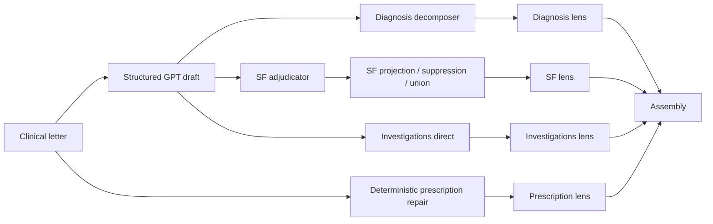
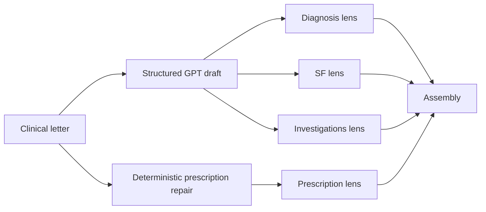
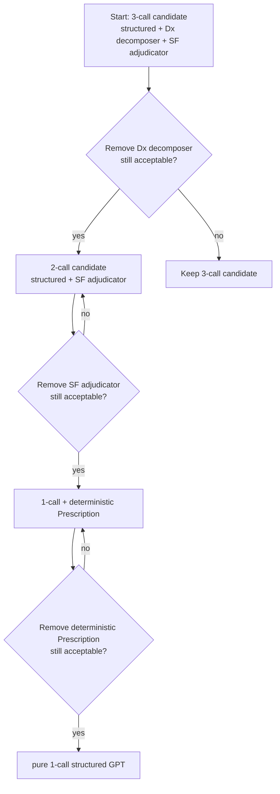

# ExECTv2 GPT-4.1-mini Simplification Frontier Plan

Date: 2026-06-24  
Scope: ExECTv2 current-code GPT-4.1-mini full-200 aggregate architecture simplification  
Protocol boundary: aggregate-only full-200 scoring; no full-200 or holdout row-level failure inspection

Rationalisation status, 2026-06-25: complete. The accepted lean candidate is
`exectv2_gpt41mini_simplification_2call_no_sf_adjudicator`; no further
simplification work is active unless the project owner changes the cost/quality
thresholds. See `docs/plans/recent_plan_rationalisation_2026-06-25.md`.

## Objective

Build a controlled cost-performance frontier for the GPT-4.1-mini ExECTv2 architecture by removing one model-bearing or deterministic component at a time until clinical-recovery performance falls below a predeclared acceptable level.

The goal is not to defend the most complex architecture. The goal is to identify the simplest architecture that preserves enough performance to justify promotion or further validation.

## Current Evidence

| Architecture | Approx LLM calls / letter | Overall F1 | Diagnosis | SeizureFrequency | Prescription | Investigations |
| --- | ---: | ---: | ---: | ---: | ---: | ---: |
| verifier-backed v08 full-200 | 6 | 0.8502 | 0.8321 | 0.7850 | 0.8926 | 0.9213 |
| no-verifier full-200 | 4 | 0.8431 | 0.8410 | 0.7850 | 0.8926 | 0.8563 |
| one-Diagnosis-call scratch | 3 | 0.8426 | 0.8397 | 0.7850 | 0.8926 | 0.8563 |

Interpretation so far:

- Diagnosis verifier and Diagnosis reconciler do not appear to justify their extra GPT-4.1-mini calls on aggregate full-200 results.
- Investigations verifier materially improves Investigations F1, but the overall delta is modest relative to the added call cost.
- The remaining expensive model-bearing components are the structured all-family draft, Diagnosis decomposer, and SF adjudicator.
- Prescription is already deterministic and relatively strong; it should remain fixed until the model-call frontier is mapped.

## Predeclared Acceptability Rule

Decision update, 2026-06-25: the project owner accepted the 2-call
no-SF-adjudicator package as the best current cost-performance point. The
governing cost-profile thresholds are now:

- Primary acceptable region: overall `clinical_headline` F1 at or above `0.8350`.
- Secondary family guardrails:
  - Diagnosis F1 at or above `0.8300`.
  - SeizureFrequency F1 at or above `0.7500`.
  - Prescription F1 at or above `0.8800`.
  - Investigations F1 at or above `0.8400`.
- A candidate below one family guardrail can remain a diagnostic candidate, but should not become the default simplified architecture without an explicit tradeoff decision.
- Stop broad simplification once the next one-component removal crosses the overall floor or causes a family-specific collapse that is larger than the saved cost plausibly justifies.

Rationale: this keeps the current 2-call package inside the accepted
cost-performance region while still rejecting the no-Diagnosis-decomposer and
1-call candidates. The rule is deliberately cost-aware but not metric-blind.

## Simplification Ladder

### Stage 0: Freeze The Scoring Harness

Implement a reusable simplification runner that can assemble variants from existing full-200 producer artifacts and run live calls only when a component has no saved output.

Requirements:

- One manifest or JSON config per candidate.
- Explicit `calls_per_letter` and `live_call_components` metadata.
- Reuse existing full-200 artifacts when possible.
- Write aggregate report, JSON, and JSONL with provenance labels.
- Do not write or inspect full-200 row-level failure ledgers during the simplification search.

### Stage 1: Confirm The 3-Call Candidate As A Durable Artifact

Candidate name:

`exectv2_holistic_finding_assembly_full200_gpt41mini_3call_dxdecomposer_sfadjudicator`

Architecture:

Expected result from scratch aggregate readout:

- 3 GPT calls / letter.
- Overall F1 about `0.8426`.
- Diagnosis about `0.8397`.

Work:

- Materialize the scratch readout as a durable report under `docs/experiments/exectv2/reliability/`.
- Add a reusable runner rather than an inline shell script.
- Record this as the current lean baseline if it reproduces the scratch aggregate result.

### Stage 2: Remove The Diagnosis Decomposer

Question: can the structured all-family GPT draft plus Diagnosis lens replace the Diagnosis decomposer?

Candidate:

`2call_no_dx_decomposer`

Architecture:

- Structured GPT draft.
- No Diagnosis verifier.
- No Diagnosis decomposer.
- No Diagnosis reconciler.
- Diagnosis comes directly from the structured draft through the current Diagnosis lens.
- SF adjudicator remains.
- Investigations direct from structured draft.
- Prescription deterministic.

Expected risk:

- Diagnosis likely drops because previous v09 single-GPT evidence showed generic epilepsy recall gaps.
- This is the first likely cliff candidate.

Decision:

- If overall stays `>=0.8350` and Diagnosis stays `>=0.8300`, promote this as the new lean baseline.
- If Diagnosis falls below floor, keep the Diagnosis decomposer as the cheapest justified Diagnosis specialist.

### Stage 3: Remove The SF Adjudicator

Question: can the structured all-family GPT draft plus deterministic SF projection/union replace the SF adjudicator?

Candidate:

`2call_no_sf_adjudicator` if Diagnosis decomposer remains, or `1call_structured_only_plus_rules` if Stage 2 also passed.

Architecture options:

- Option A: structured draft + Diagnosis decomposer; SF from structured draft and deterministic SF repair only.
- Option B: structured draft only; Diagnosis, SF, and Investigations all direct from structured draft, Prescription deterministic.

Expected risk:

- SeizureFrequency is the known weakest family on full-200 (`0.7850` even with adjudication).
- Removing the SF adjudicator may cross the family guardrail quickly.

Decision:

- If SF stays `>=0.7500` and overall stays `>=0.8350`, the SF adjudicator is not justified for the default low-cost architecture.
- If SF falls below `0.7500`, keep the SF adjudicator as a justified specialist.

### Stage 4: Test Structured-Only Clinical GPT Plus Deterministic Prescription

Question: how far can one GPT call go if the only non-GPT clinical component is deterministic Prescription repair?

Candidate:

`1call_structured_direct_plus_deterministic_prescription`

Architecture:

Expected risk:

- Existing dev140 v09 pure single-GPT evidence was too weak overall, but this full-200 current-code surface may differ.
- This is the cleanest production architecture if it remains inside the acceptable region.

Decision:

- If this passes, stop: it is the default simplified GPT-4.1-mini architecture.
- If this fails but Stage 3 passes, use the Stage 3 candidate.
- If Stage 3 fails, use the 3-call candidate.

### Stage 5: Test Fully Single-Call Structured GPT

Question: can deterministic Prescription repair be removed too?

Candidate:

`1call_structured_only`

Architecture:

- Structured GPT draft supplies all four families.
- Only evidence/schema validation and benchmark-facing projection remain.

Expected risk:

- Prescription is currently strong because deterministic repair handles regimen details reliably.
- Prior v09 evidence showed single GPT Prescription around `0.751` on dev140, so this is expected to fail the Prescription guardrail.

Decision:

- Run only if Stage 4 is surprisingly strong and the project owner wants the absolute minimum-call artifact.
- Otherwise keep deterministic Prescription repair as a near-free, high-value component.

## Measurement Contract

Every candidate report must include:

- `clinical_headline` overall F1, precision, recall, TP, FP, FN.
- Per-family F1, precision, recall, TP, FP, FN.
- Calls per letter and estimated full-200 call count.
- Live call components versus replayed/no-call components.
- Parse failures and call failures.
- Evidence-invalid dropped count and exact evidence rate.
- Fact-origin accounting: model-generated, deterministic projection, deterministic rescue.
- Claim boundary: dev/full-200/holdout, current-code/archive-surface, aggregate-only/row-level.

Do not report strict benchmark F1 as the headline. Keep it as a diagnostic/comparability surface only.

## Execution Order

1. Create a reusable simplification assembly runner/config format.
2. Materialize the 3-call scratch result as a durable artifact.
3. Run Stage 2 from saved structured/SF/Prescription artifacts.
4. Run Stage 3 from saved structured/Diagnosis/Prescription artifacts.
5. Run Stage 4 if Stage 2 or Stage 3 suggests a 1-call architecture might remain acceptable.
6. Run Stage 5 only if deterministic Prescription becomes the last remaining complexity and the expected score loss is worth measuring.
7. Summarize all candidates in one frontier table:

| Candidate | Calls / letter | Full-200 calls | Overall | Dx | SF | Presc | Inv | Pass/fail | Recommended? |
| --- | ---: | ---: | ---: | ---: | ---: | ---: | ---: | --- | --- |

## Stop Rules

Stop simplifying when any of these are true:

- Overall F1 drops below `0.8350`.
- Diagnosis drops below `0.8300` after removing the Diagnosis decomposer.
- SeizureFrequency drops below `0.7500` after removing the SF adjudicator.
- Prescription drops below `0.8800` after removing deterministic repair.
- The next candidate would save no LLM calls and only remove transparent deterministic code.
- A candidate introduces call/parse instability that makes score comparison ambiguous.

When a stop rule fires, the previous passing candidate becomes the recommended lean architecture, pending validation-surface decision.

## Expected Decision Tree

## Research Framing

This is a component-ablation study, not only an engineering cleanup. The final writeup should answer:

- Which GPT-4.1-mini calls are actually doing useful clinical work?
- Which deterministic components are high-value and low-cost?
- Where is the first real performance cliff?
- Does the simplest acceptable architecture preserve the project's transparency claims?
- Which components should be carried forward to other models such as Qwen or DeepSeek?

The expected paper-facing output is a cost-performance frontier table plus a short architecture diagram for each recommended candidate.

## Artifacts To Produce

- `docs/experiments/exectv2/reliability/exectv2_gpt41mini_simplification_frontier_2026-06-24.md`
- `experiments/exectv2_gpt41mini_simplification_frontier_20260624.json`
- Candidate assembly JSON/JSONL/report files for each durable candidate.
- Optional UI payload update for the Component Impact page once the frontier is complete.

## Known Caveats

- The current full-200 artifacts are current-code v08-shape, not byte-identical to archived dev140 prompt/module versions.
- Full-200 row-level inspection remains blocked under the current protocol.
- Aggregate F1 alone is insufficient for final promotion; the chosen lean architecture still needs calibration, robustness, and review-routing validation.
- The acceptable threshold is project-policy-sensitive. If the owner prefers a more aggressive cost target, lower the overall floor before running the next candidate rather than after seeing results.
