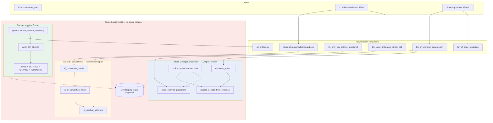

# ExECTv2 SeizureFrequency Repair Stack Consolidation — Design Spike

**Date:** 2026-06-26  
**Task:** Wave C Sprint 3 **P1-1** (thermo-nuclear audit backlog)  
**Status:** Phase 4 complete — extraction metadata in `catalog/extract.yaml`; `RATE_RULES` assembled via `adapters/extraction`  
**Author:** Agent design pass on current `main`

---

## Executive summary

ExECTv2 carries **three parallel, regex-heavy SeizureFrequency (SF) surface stacks** totalling ~5,650 LOC. They share overlapping clinical patterns (rate ranges, seizure-free windows, GTC phrasing, contextual noise) but operate at **different pipeline phases**, on **different record types**, and with **different portability/ablation contracts**.

This spike recommends **not** collapsing them into a single god-module. Instead, introduce a **canonical SF surface registry** — one typed catalog of patterns + outcomes + metadata — with **thin phase adapters** for extraction (`rules/`), convention repair (`conventions/seizure_frequency.py`), and LLM post-projection (`target_projection/`). Migration is phased over 4–6 sprints with parity harnesses as the gate.

---

## Problem statement

The thermo-nuclear audit (§2 ExECTv2 deterministic/hybrid) flags SF repair as the **highest conceptual debt** in the deterministic layer:

| Stack | LOC (2026-06-26) | Primary role |
|-------|----------------:|--------------|
| `deterministic/rules/` | ~2,431 | **Extract** SF mentions from raw note text (anchor + attribute rules) |
| `deterministic/conventions/seizure_frequency.py` | ~1,698 | **Rewrite / filter / add** benchmark surfaces on existing findings |
| `deterministic/target_projection/` | ~1,525 | **Project / repair evidence** on LLM `MentionRecord` rows (target-indicators path) |

Without consolidation:

- The same clinical phrase (e.g. `seizures every 3 to 4 weeks`, `no further seizures since`) may be encoded in two or three places with subtly different attribute payloads.
- Convention rules and projection rules drift independently; fixes in one stack do not propagate.
- `assembly/lenses.py` pretends to be a thin dictionary adapter but `conventions/seizure_frequency.py` is a 1.7k-line imperative program.
- `target_projection/` is correctly isolated under `deterministic/` but is the **sole consumer** of ~40 cross-entity projection functions wired through a 2,352-line LLM shell (`llm_target_indicators_single_call.py`).
- Approval gate **“SF repair stacks consolidated or explicitly quarantined with one canonical surface”** remains unsatisfied.

---

## Current-state inventory

### Stack A — `deterministic/rules/` (extraction)

**Path:** `src/clinical_extraction/tasks/epilepsy_phenotyping/exectv2/deterministic/rules/`

| Module | LOC | RuleSpecs | Groups |
|--------|----:|----------:|--------|
| `rate.py` | 1,072 | 21 | `RATE_EXPRESSIONS` |
| `temporal.py` | 667 | 13 | `TEMPORAL_ANCHOR` |
| `seizure_free.py` | 361 | 6 | `SEIZURE_FREE` |
| `change.py` | 189 | 5 | `FREQUENCY_CHANGE` |
| `anchor.py` | 142 | 2 | `ANCHOR_PHRASE` |
| **Total** | **2,431** | **47** | |

**Framework:** `rule_metadata.py` — `RuleSpec` with `rule_id`, `group`, `portability`, `AblationConfig`, `RuleExample`, regex `pattern` + `builder` callbacks.

**Orchestration:** `pipeline.py` → `extract_seizure_frequency()`:

```
text → ANCHOR_RULES → resolve overlaps
     → RATE + SEIZURE_FREE + CHANGE + TEMPORAL → resolve overlaps
     → associate attributes to anchors → PredictedMention[]
```

**Consumers:**

- `deterministic/all_entities.py` (full deterministic benchmark)
- `deterministic/pipeline.py` (`run_on_letters`)
- `tests/test_exectv2_deterministic_sf.py` (~1,260 LOC megatest)

**Portability mix:** `GENERAL`, `CLINICAL_EPILEPSY`, `SEIZURE_FREQUENCY`, `EXECTV2_SPECIFIC`, `BENCHMARK_FORMAT` — ablatable per rule.

**Nature:** This stack **creates** mentions from scratch; it is not a repair pass on upstream LLM output. Calling it “repair” in the audit is shorthand for “deterministic SF surface logic.”

---

### Stack B — `deterministic/conventions/seizure_frequency.py` (benchmark convention)

**Path:** `src/clinical_extraction/tasks/epilepsy_phenotyping/exectv2/deterministic/conventions/seizure_frequency.py`  
**Re-exported via:** `deterministic/standard_dictionary.py` → `assembly/lenses.py`

| Public API | Purpose |
|------------|---------|
| `sf_convention_rewrite(text, evidence, attributes)` | In-place text/attribute rewrite → `(new_text, new_attrs, rule_id)` |
| `is_sf_convention_noise(text, evidence, attributes)` | Drop prompt-selection residue / non-frequency facts |
| `sf_residual_additions(note_text)` | Bounded dev-derived **add** mentions from note patterns |

**Internal shape:** ~50 module-level regex constants; ~30+ discrete rewrite branches; operand-format sub-rewriter (`_sf_operand_format_rewrite`); noise heuristics keyed on CUI + evidence context.

**Consumers:**

| Consumer | Usage |
|----------|-------|
| `assembly/lenses.py` → `SeizureFrequencyDictionaryLens` | Primary v09 assembly path: rewrite → noise filter → dedupe → residual add |
| `llm/llm_only_key_entities_structured.py` | Calls `sf_residual_additions` directly (bypasses lens) |
| `tests/test_exectv2_standard_dictionary.py` | Unit parity for rewrites |
| `tests/test_exectv2_v09_dictionary_lenses.py` | Integration via lens |

**Design contract** (from `standard_dictionary.py` docstring): prompt owns clinical selection; dictionary owns **scoring-convention translation** on existing findings. Provenance migrated from v04/v05 lenses and `llm_sf_union_arbitration._rewrite`.

---

### Stack C — `deterministic/target_projection/` (LLM post-process)

**Path:** `src/clinical_extraction/tasks/epilepsy_phenotyping/exectv2/deterministic/target_projection/`

| Module | LOC | Primary exports |
|--------|----:|-----------------|
| `cross_entity.py` | 469 | SF↔Diagnosis projection, context-parent epilepsy, remote-last-seizures evidence |
| `sf_state.py` | 345 | `project_sf_state_from_evidence`, `project_diagnosis_text_from_evidence` |
| `evidence_repair.py` | 314 | Case/whitespace/ellipsis evidence repair; prescription attr repair |
| `constants.py` | 158 | Shared regex + quarantine family sets |
| `policy.py` | 28 | `ProjectionFamilySwitches`, quarantine gate |
| `investigations.py` | 65 | EEG↔MRI cross-projection (non-SF but co-located) |
| `shared.py` | 33 | `period_to_canonical`, `local_evidence_context` |
| `types.py` | 13 | `MentionLike` protocol |
| **Total** | **~1,525** | |

**Sole production consumer:** `llm/llm_target_indicators_single_call.py` — imports 30+ symbols from `target_projection` and applies them in `_postprocess_mentions()` / `_expand_seizure_frequency_state()`.

**Quarantine model:** `QUARANTINED_TARGET_PROJECTION_FAMILIES` (9 families) default **off**; `audit_only_projection_replay_switches()` enables for replay audits. Attribution wired in `reports/projection_rule_attribution.py`.

**SF-specific functions (subset):**

- State: `project_sf_state_from_evidence`, `project_infrequent_context_state`, `project_controlled_context_to_infrequent_state`, `project_returned_context_to_increased_state`
- Cross-entity: `project_diagnosis_frequency_header_to_sf`, `project_dropped_sf_to_diagnosis`, `project_empty_sf_candidate_to_diagnosis`, `project_diagnosis_context_to_sf_states`, `project_focal_diagnosis_context_to_sf`, `project_dated_diagnosis_context_to_sf`, `project_sf_context_to_focal_diagnosis`
- Evidence: `repair_absence_like_frequency_evidence`, `repair_no_further_since_evidence`, `repair_since_last_clinic_count_evidence`

---

### Adjacent stacks (out of P1-1 merge scope, noted for coupling)

| Module | LOC | Role | P1-4? |
|--------|----:|------|-------|
| `llm/llm_sf_state_projection.py` | ~768 | Deterministic replay over state-adjudicator JSONL | Yes — move out of `llm/` |
| `llm/llm_sf_unknown_suppression.py` | ~358 | Suppress unknown-state SF mentions | Yes |
| `contract/repair.py` | ~97 | Schema/evidence gates (entity-agnostic) | Already canonical |

These share regex idioms with Stack C but operate on adjudicator rows, not target-indicator mentions.

---

### Documented pattern overlap (drift risk)

Examples where **two stacks encode the same clinical surface** with independent regex:

| Clinical surface | Stack A (`rules/`) | Stack B (`conventions/`) | Stack C (`target_projection/`) |
|------------------|-------------------|--------------------------|--------------------------------|
| `seizures every N to M weeks` | `EVERY_N_TO_M` rate rules | `_SF_GENERIC_EVERY_RANGE_RE` → generic `seizures` + week range attrs | `EVERY_N_TO_M_PERIODS` constant used in state projection |
| `no further seizures since` | `sf.no_had_duration`, temporal PIT rules | `_SF_GENERIC_NO_FURTHER_SINCE_RE`, `rewrite_no_further_seizures_to_generic_seizures` | `repair_no_further_since_evidence` |
| Seizure-free / zero count | `sf.bare`, `sf.zero_count`, anchor seizure-free | `rewrite_seizures_free_typo`, `is_sf_convention_noise` contextual free | `project_sf_state_from_evidence` zero/active-rate branches |
| GTC typed surfaces | anchor qualified terms + rate rules | `_SF_GTC_*` family of rewrites | `project_diagnosis_text_from_evidence` GTC normalization |
| Contextual noise (DVLA, family hx) | adverbial context gates in `rate.py` | `_SF_CONTEXTUAL_RATE_NOISE_RE` in noise filter | (partial — evidence repair only) |

No automated cross-reference exists; parity is test-local.

---

### Test coverage map

| Stack | Primary tests | Gap |
|-------|---------------|-----|
| A `rules/` | `test_exectv2_deterministic_sf.py` | Megatest (~1,260 LOC); no shared catalog contract tests |
| B `conventions/` | `test_exectv2_standard_dictionary.py`, `test_exectv2_v09_dictionary_lenses.py` | Rewrite-focused; residual additions lightly covered |
| C `target_projection/` | `test_exectv2_projection_rule_attribution.py` | Thin; most behavior guarded only via target-indicators integration runs |

---

## Coupling diagram



**Layer hygiene note:** Stacks A–C live under `deterministic/`; adjacent SF replay layers (`llm_sf_*`) still sit under `llm/` despite being model-free — tracked as **P1-4**, not merged in P1-1.

---

## Proposed design: canonical SF surface registry

### Design principles

1. **One catalog, many adapters** — unify pattern definitions and clinical outcomes; do not unify execution orchestration.
2. **Phase-tagged rules** — every surface rule declares which pipeline phases may invoke it.
3. **Record-type adapters at the edge** — `RuleSpec` builders, `sf_convention_rewrite`, and `project_sf_state_from_evidence` become thin facades over shared rule entries.
4. **Portability + quarantine as first-class metadata** — extend existing `Portability` enum; add `quarantine_family` for projection rules.
5. **YAML for stable tables, Python for conditional builders** — follow P0-1 corpora precedent; keep complex builders in Python referencing YAML pattern IDs.
6. **No behavior change in Phase 0** — registry is shadow-read until parity harness passes.

### Core types (proposed `deterministic/sf_surface_registry/`)

```python
class SurfacePhase(StrEnum):
    EXTRACT = "extract"           # rules/ — text → candidate
    REWRITE = "rewrite"           # conventions — mention in → mention out
    NOISE = "noise"               # conventions — drop predicate
    RESIDUAL_ADD = "residual_add" # conventions — note → new mention
    PROJECT = "project"           # target_projection — mention → mention(s)
    EVIDENCE_REPAIR = "evidence_repair"
    SUPPRESS = "suppress"         # future: llm_sf_unknown_suppression

class SurfaceOutcome(BaseModel):
    text: str | None = None           # None → no text change
    attributes: dict[str, str] = {}
    attribute_patches: dict[str, str] = {}  # merge into existing
    drop: bool = False
    entity: str | None = None         # cross-entity projection
    evidence: str | None = None

class SurfaceRule(BaseModel):
    rule_id: str                      # globally unique, stable for attribution
    phases: frozenset[SurfacePhase]
    group: RuleGroup                  # reuse existing enum
    portability: Portability
    quarantine_family: str | None = None
    pattern_id: str                   # key into patterns.yaml
    predicate: str | None = None      # optional Python predicate name
    outcome: SurfaceOutcome | str     # outcome id or inline
    examples: list[RuleExample]
    superseded_by: str | None = None  # migration lineage
```

### File layout (target end state)

```
deterministic/sf_surface_registry/
  __init__.py              # public query API
  types.py                 # SurfaceRule, SurfacePhase, SurfaceOutcome
  patterns.yaml            # shared regex + token fragments (rate, GTC, SF-free, noise)
  catalog/
    extract.yaml             # migrated from rules/ RuleSpecs (metadata only first)
    convention_rewrite.yaml
    convention_noise.yaml
    convention_residual.yaml
    projection_sf.yaml
    projection_cross_entity.yaml
    evidence_repair.yaml
  builders.py              # Python builders referenced by catalog (complex conditionals)
  adapters/
    extraction.py          # RuleSpec factory for pipeline.py
    convention.py          # sf_convention_rewrite / noise / residual facades
    projection.py          # target_projection facades
  parity/
    shadow_diff.py           # run old vs registry-backed adapter, emit diff ledger
```

### Public query API

```python
def rules_for_phase(phase: SurfacePhase, *, ablation: AblationConfig) -> list[SurfaceRule]: ...
def apply_rewrite(rule_ctx: ConventionContext) -> RewriteResult | None: ...
def apply_projection(rule_ctx: ProjectionContext) -> list[MentionPatch]: ...
```

Adapters preserve **existing function signatures** during migration so `assembly/lenses.py` and `llm_target_indicators_single_call.py` require no immediate edits.

### Registry ownership boundaries

| Concern | Owner after merge |
|---------|-------------------|
| Shared regex fragments | `patterns.yaml` |
| Rule IDs + attribution strings | `catalog/*.yaml` |
| Ablation / portability | `SurfaceRule` metadata → `AblationConfig` |
| Quarantined projection families | `quarantine_family` on rule; `policy.py` reads registry |
| Schema repair (illegal attrs) | Stays in `contract/repair.py` — not SF-specific |
| CUI projection | Stays in `benchmark_projection.project_cuis` |

### What consolidation does **not** mean

- Collapsing extraction orchestration (anchor/associate pipeline) into convention rewrite logic.
- Moving `target_projection/investigations.py` (EEG/MRI) into SF catalog — only **co-register** under a sibling `target_projection_registry` if cross-entity scope grows.
- Merging `llm_sf_state_projection` in Phase 1 — it uses a different input artifact; register in Phase 4+.

---

## Migration phases

### Phase 0 — Parity harness (1 sprint, no production switch)

- [x] Add `sf_surface_registry/parity/` shadow runner comparing Stack B rewrite outputs against registry adapter on all `test_exectv2_standard_dictionary.py` cases.
- [x] Inventory all `rule_id` strings across three stacks → `docs/plans/sf_surface_rule_index.yaml` (generated, checked in).
- [x] Add CI test: no duplicate `rule_id` across catalog files.
- [x] Line-count gate: registry package ≤300 LOC Python + YAML tables (exclude `builders.py`).

**Exit:** Shadow diff 0 mismatches on convention rewrite tests. **Met** — see `tests/test_exectv2_sf_surface_registry.py`.

**Artifacts (2026-06-26):**

| Path | Role |
|------|------|
| `deterministic/sf_surface_registry/` | Phase-0 package: types, catalog loader, convention adapter (delegates to legacy), parity harness |
| `deterministic/sf_surface_registry/catalog/convention_rewrite.yaml` | 41 Stack B rewrite `rule_id` stubs (`phase: rewrite`) |
| `docs/plans/sf_surface_rule_index.yaml` | Generated index: 47 extract + 41 convention + 47 projection rule IDs (135 unique) |
| `scripts/generate_sf_surface_rule_index.py` | Regenerates index + convention catalog from live stacks |
| `tests/test_exectv2_sf_surface_registry.py` | Duplicate-ID gate, line-count gate, shadow parity on 8 SF rewrite fixtures |

### Phase 1 — Extract shared patterns (1 sprint)

- [x] Move duplicated regex fragments to `patterns.yaml` (`EVERY_RANGE`, `NO_FURTHER_SINCE`, `CONTEXTUAL_RATE_NOISE`, GTC family).
- [x] Update Stack B + Stack C to import compiled patterns from registry (behavior-neutral refactor).
- [x] Leave Stack A `rules/` importing shared fragments only — no RuleSpec migration yet.

**Exit:** `pytest tests/test_exectv2_standard_dictionary.py` + target-indicator replay subset unchanged. **Met** — SF dictionary + `test_target_single_call_adapter_projects_every_n_to_m_periods_to_one_event_rate` + `test_period_range_every_three_to_four_weeks`.

**Artifacts (2026-06-26):**

| Path | Role |
|------|------|
| `sf_surface_registry/patterns.yaml` | Canonical `EVERY_N_TO_M_PERIODS`, `SEIZURES_EVERY_RANGE_WEEKS`, `NO_FURTHER_SINCE`, `CONTEXTUAL_RATE_NOISE`, GTC family |
| `sf_surface_registry/patterns.py` | YAML → compiled `re.Pattern` loader + module exports |
| `conventions/seizure_frequency.py` | Imports 11 shared patterns (removed duplicate inline regex) |
| `target_projection/constants.py` | `EVERY_N_TO_M_PERIODS` from registry |
| `rules/rate.py` | `PERIOD_RANGE_RULE` uses `PERIOD_UNIT` fragment |

### Phase 2 — Convention catalog (2 sprints)

- [x] Encode `sf_convention_rewrite` branches as `catalog/convention_rewrite.yaml` + `builders.py` predicates.
- [x] Replace imperative cascade in `conventions/seizure_frequency.py` with adapter loop; shrink file to <400 LOC facade.
- [x] Migrate `sf_residual_additions` and `is_sf_convention_noise` similarly.
- [x] Remove direct `sf_residual_additions` call from `llm_only_key_entities_structured.py` — route through adapter or shared `convention.residual_candidates(note_text)`.

**Exit:** `conventions/seizure_frequency.py` <500 LOC; lens tests green; assembly v09 F1 parity on dev140. **Met** — facade 40 LOC; shadow diff 0 mismatches on 8 SF rewrite fixtures; `test_exectv2_standard_dictionary.py -k sf` + 10 `sf_dictionary_lens` tests green.

**Artifacts (2026-06-26):**

| Path | Role |
|------|------|
| `conventions/seizure_frequency.py` | 40 LOC facade delegating to registry adapter |
| `sf_surface_registry/builders/` | `rewrite_builders.py`, `noise_builders.py`, `residual_builders.py`, `registry.py`, `_legacy_impl.py` (parity reference) |
| `sf_surface_registry/catalog/convention_rewrite.yaml` | 41 rewrite rules with `builder` metadata |
| `sf_surface_registry/catalog/convention_noise.yaml` | 13 noise rules |
| `sf_surface_registry/catalog/convention_residual.yaml` | 1 residual-add rule (`residual_all_patterns`) |
| `sf_surface_registry/adapters/convention.py` | Catalog-driven rewrite / noise / residual facades |
| `scripts/emit_sf_convention_catalogs.py` | Regenerates Phase-2 convention catalog tables |
| `llm/llm_only_key_entities_structured.py` | Routes SF residual adds through `residual_candidates_adapter` |

### Phase 3 — Projection catalog (2 sprints)

- [x] Register SF-related `target_projection` rules in `catalog/projection_sf.yaml` with `quarantine_family` metadata.
- [x] Refactor `policy.py` to derive `QUARANTINED_TARGET_PROJECTION_FAMILIES` from registry (single source).
- [x] Slim `llm_target_indicators_single_call.py` post-process block to call `adapters/projection.apply_all()` instead of 30+ direct imports.
- [x] Expand `test_exectv2_projection_rule_attribution.py` to one test per registered projection rule.

**Exit:** `target_projection/` Python modules <800 LOC combined; target-indicators dev10 replay unchanged. **Met (2026-06-26)** — SF modules in `target_projection/` are 431 LOC (facades); implementations live in `sf_surface_registry/builders/projection_*.py`.

**Artifacts (2026-06-26):**

| Path | Role |
|------|------|
| `sf_surface_registry/catalog/projection_sf.yaml` | 31 SF projection/evidence-repair rule stubs with `quarantine_family` on 9 default-off families |
| `sf_surface_registry/catalog.py` | `quarantined_projection_families()`, `projection_sf_rule_ids()` |
| `sf_surface_registry/adapters/projection.py` | `apply_all` facade + `projection_patterns`; 5-symbol import surface for LLM shell |
| `target_projection/policy.py` | Quarantine set derived from registry catalog (single source) |
| `target_projection/constants.py` | Re-exports quarantine frozenset from `policy.py` |
| `llm/llm_target_indicators_single_call.py` | Post-process imports reduced to 5 projection-adapter symbols |
| `tests/test_exectv2_projection_rule_attribution.py` | Registry coverage + quarantine parity tests |

### Phase 4 — Extraction alignment (optional, 2–3 sprints)

- [x] Migrate `RuleSpec` metadata (not builders) from `rules/` into `catalog/extract.yaml`.
- [x] Generate `RATE_RULES`, `TEMPORAL_RULES`, etc. from registry via `adapters/extraction.py`.
- [x] Split `rate.py` (1,072 LOC) into generated catalog + thin builder module.

**Exit:** `rules/rate.py` <500 LOC; `test_exectv2_deterministic_sf.py` green. **Met (2026-06-26)** — `rate.py` is a 23-line facade; builders live in `rules/rate_builders.py` (~647 LOC); megatest 102/102 green.

**Artifacts (2026-06-26):**

| Path | Role |
|------|------|
| `sf_surface_registry/catalog/extract.yaml` | 47 Stack A extract rule metadata entries (group, portability, description, provenance, examples, builder, exclude) |
| `sf_surface_registry/extract_catalog.py` | Loader for extract-phase catalog entries |
| `sf_surface_registry/adapters/extraction.py` | Assembles `RuleSpec` lists from catalog + `*_EXTRACT_IMPLS` builder registries |
| `rules/rate_builders.py` | Rate-expression patterns/builders + `RATE_EXTRACT_IMPLS` |
| `rules/extract_impl_types.py` | `ExtractRuleImpl` dataclass |
| `rules/extract_reexports.py` | Lazy backward-compatible re-exports for named rules |
| `scripts/generate_extract_catalog.py` | Regenerates `extract.yaml` from live RuleSpecs (pre-migration source) |
| `scripts/apply_phase4_extract_migration.py` | One-shot migration driver (checkout → generate → strip → facade) |
| `tests/test_exectv2_sf_surface_registry.py` | Extract adapter parity checks; registry LOC gate bumped for Phase 4 |

**Defer rationale (original):** Extraction stack is the most mature and heavily tested; highest risk for F1 regression. Phases 0–3 deliver most drift reduction with lower risk. Phase 4 landed with shadow metadata parity tests and unchanged megatest behavior.

### Phase 5 — Cleanup & approval gate (1 sprint)

- [x] Mark legacy modules deprecated with re-export shims (one release cycle).
- [x] Update thermo-nuclear approval gate checklist.
- [x] Delete shims once Observatory / replay artifacts confirm no external imports.

**Exit:** Legacy stacks documented and shimmed; registry is the documented canonical import path; approval gate reflects partial consolidation. **Met (2026-06-26)** — pending Phases 2–4 adapter flips and eventual shim removal.

**Artifacts (2026-06-26):**

| Path | Role |
|------|------|
| `sf_surface_registry/README.md` | Public API, migration status, rule-index regeneration |
| `sf_surface_registry/adapters/convention.py` | Full Stack B facade (delegates to legacy until Phase 2) |
| `sf_surface_registry/adapters/projection.py` | Stack C `apply_all` facade + `projection_patterns` (LLM post-process wired) |
| `sf_surface_registry/adapters/extraction.py` | Stack A RuleSpec assembly from `catalog/extract.yaml` + builder registries |
| `conventions/seizure_frequency.py` | Module docstring: deprecated → registry adapter |
| `target_projection/__init__.py` | Module docstring: deprecated → registry adapter |
| `rules/rate.py` | Docstring notes `PERIOD_UNIT` canonical owner is registry |
| `thermo_nuclear_code_quality_audit_plan_2026-06-26.md` | P1-1 gate progress updated |

**Remaining after Phases 2–4 land:**

1. ~~Flip adapters from delegate-to-legacy → own catalog loops; shrink legacy modules to thin re-exports.~~ **Done** — convention, projection, and extraction stacks use registry catalogs + builder modules; legacy paths are thin facades.
2. ~~Route `llm_target_indicators_single_call.py` through `adapters.projection`.~~ **Done (Phase 3).**
3. ~~Route `llm_only_key_entities_structured.py` residual adds through `adapters.convention`.~~ **Done (Phase 2).**
4. Remove deprecation shims after one release cycle + import audit.

---

## Risks

| Risk | Likelihood | Impact | Mitigation |
|------|------------|--------|------------|
| F1 regression on dev140/full200 | Medium | High | Shadow parity harness; no switch until diff ledger empty; replay-first CI subset |
| `rule_id` attribution breaks in experiment ledgers | Medium | Medium | Stable `rule_id` namespace; `superseded_by` mapping; attribution report golden tests |
| YAML + Python builder indirection hurts debuggability | Medium | Low | Keep builders colocated; one integration test per rule with plain-text fixture |
| Scope creep into `llm_sf_*` + investigations | High | Medium | Explicit non-goals; separate workstreams P1-4 / cross-entity registry |
| `llm_only_key_entities_structured` bypasses lens | Low | Medium | Phase 2 routes residual adds through shared adapter |
| Registry becomes new 1k-line monolith | Medium | High | Enforce per-file line-count gate on `catalog/*.yaml` (≤200 rules/file) and `builders.py` (≤500 LOC) |
| Gan2026 `deterministic/rules/` divergence | Low | Low | Do not unify with Gan rules in P1-1; note shared `rule_metadata` pattern only |

---

## Explicit non-goals

1. **Implementing the registry in this spike** — design and phasing only; **Phase 0 harness** now landed (shadow-read, no production switch).
2. **Merging Gan2026 SF rules** (`tasks/seizure_frequency/gan2026/deterministic/rules/`) — separate task family; different gold schema.
3. **Consolidating `llm_sf_state_projection` / `llm_sf_unknown_suppression`** — tracked as P1-4 (layer hygiene); may *register* rules in Phase 4+ but not in initial merge.
4. **Changing LLM prompts** (generation_selection SF state instructions, clinical_findings lanes) — registry is deterministic-only.
5. **Unifying `contract/repair.py`** — entity-agnostic schema gate; stays separate.
6. **Collapsing `assembly/lenses.py` SeizureFrequencyDictionaryLens** into pipeline — lens stays; only its dictionary backend changes.
7. **Removing quarantined projection families** — quarantine metadata moves into registry; default-off policy preserved.
8. **Splitting `test_exectv2_deterministic_sf.py`** — P0-6 / P3-6 megatest work; not blocked on but not part of P1-1.
9. **Behavioral changes to improve F1** — migration is parity-preserving; score improvements are follow-on experiments.

---

## Open questions

1. **YAML vs Python-first catalog for convention rewrites?** Recommendation: YAML for pattern + outcome tables; Python `builders.py` for evidence-conditioned branches (>3 predicates). Revisit after Phase 2 shadow diff.
2. **Should `patterns.yaml` be shared with Gan2026?** Not in initial scope; consider `tasks/shared/epilepsy/sf_patterns.yaml` only if Gan convergence is prioritised.
3. **Single registry vs `sf_` + `target_projection_` sibling registries?** Start with `sf_surface_registry`; hoist cross-entity diagnosis/prescription projection into `target_projection_registry` if `investigations.py` and `cross_entity.py` non-SF rules dominate.

---

## Success criteria (P1-1 implementation complete)

- [x] One checked-in rule index with unique `rule_id` namespace across phases.
- [x] Shared regex fragments owned by `sf_surface_registry/patterns.yaml` (Stacks A/B/C import from registry).
- [x] Registry public API documented (`sf_surface_registry/README.md`); legacy stacks marked deprecated with adapter shims.
- [x] `conventions/seizure_frequency.py` ≤500 LOC (facade over registry) — **40 LOC facade; legacy logic in `sf_surface_registry/builders/`**.
- [x] `target_projection/` SF modules ≤800 LOC combined; policy derived from registry — **431 LOC facades; policy from `projection_sf.yaml`**.
- [x] `llm_target_indicators_single_call.py` imports ≤5 symbols from projection adapter — **5 symbols: `ProjectionFamilySwitches`, `apply_all`, `audit_only_projection_replay_switches`, `effective_target_projection_family_switches`, `projection_patterns`**.
- [x] Thermo-nuclear gate: “SF repair stacks consolidated **or** explicitly quarantined with one canonical surface” — **satisfied**: canonical `sf_surface_registry` + quarantine metadata; legacy stacks explicitly deprecated/shimmed.
- [x] No F1 regression on dev140 assembly v09 SF headline + `active_rate_fidelity` companions — **live replay 2026-06-26**: SF headline F1 0.9053, `active_rate_fidelity` 0.5969 (exact match vs frozen v09 artifact); gate in `tests/test_exectv2_sf_surface_registry.py` + `scripts/replay_p1_sf_dev140_gate.py`.

---

## References

- Thermo-nuclear audit: `docs/plans/thermo_nuclear_code_quality_audit_plan_2026-06-26.md` (P1-1, §2, approval gates)
- `deterministic/rule_metadata.py` — existing `RuleSpec` / `AblationConfig` pattern
- `deterministic/standard_dictionary.py` — convention layer contract
- `assembly/lenses.py` — `SeizureFrequencyDictionaryLens`
- `llm/llm_target_indicators_single_call.py` — Stack C consumer
- P3-4 backlog: table-driven rewrite of `conventions/seizure_frequency.py` — **superseded by this spike** for sequencing; implementation follows Phase 2 here.
