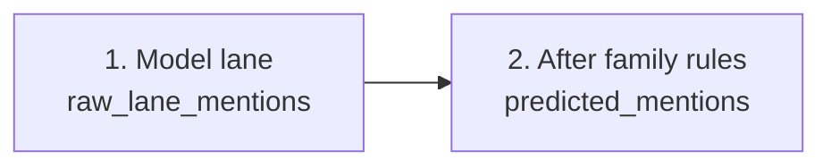
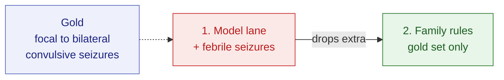
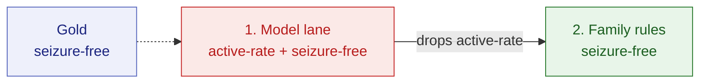
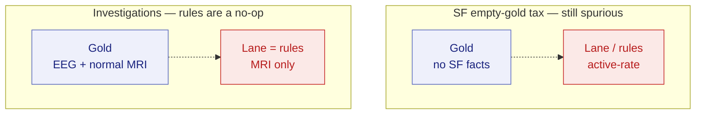
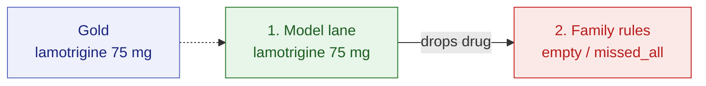
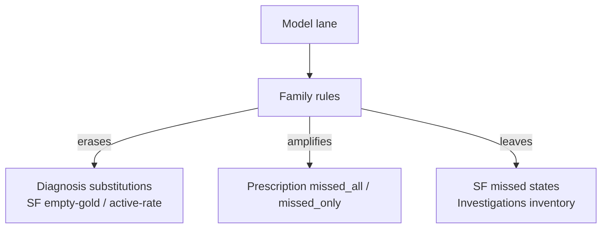

# ExECTv2 within-family error catalog

Date: 2026-08-06
Correction: within-family categories adopted 2026-08-08
Status: development catalog with subtype and pipeline ablation reading
Paper-library role: complete ExECT error record; start with [failures and limits](../paper/failures_and_limits_2026-08-10.md)
Protocol: [exect family error catalog protocol](family_error_catalog_protocol_2026-08-06.md)
Parent: [category-cut performance](../shared/six_model_category_cut_performance_2026-08-06.md)
Companions: [task-shape framework](../shared/task_shape_framework_2026-08-06.md), [hard-slice modes](../shared/six_model_hard_slice_error_modes_2026-08-06.md), [Gan error catalog](../gan2026/category_error_catalog_2026-08-06.md)
Artifact: [`experiments/exectv2_family_error_catalog_20260806.json`](../../experiments/exectv2_family_error_catalog_20260806.json)

## Plain answer

The useful error categories are clinical subtypes inside each family,
not whole-letter composition and not the four family names alone. On the
model lane, Diagnosis is mostly wrong-set / extra concepts;
SeizureFrequency adds empty-gold spurious `active-rate`; Prescription
and Investigations are smaller missed/extra problems.

Family rules then do **different jobs by family**:

1. **Diagnosis** — large rescue: substitutions collapse into exact
   letters; empty-gold spurious nearly vanishes.
2. **SeizureFrequency** — partial rescue: fewer empty-gold over-reads
   and less extra `active-rate`; missed states remain the floor.
3. **Prescription** — can **hurt**: consensus imperfect widens as
   rules drop drugs that the model lane had right.
4. **Investigations** — no change on this roster (rules leave the
   lane alone).

## Why this document exists

The [category-cut report](../shared/six_model_category_cut_performance_2026-08-06.md) shows **which**
within-family subtypes move under rules (F1). This catalog shows **how** at letter
exactness: which imperfect modes dominate, and whether family rules
erase, reshape, or amplify them. Full per-model tables and every
retained example live in the JSON; this page is the readable ablation.

## Primary catalogue: errors within each family subtype

Gold subtype selects the development cohort; modes compare the complete
named-family output on those letters. This preserves the unchanged
clinical-headline scorer. Subtypes may overlap on multi-mention letters.

### Diagnosis

| Gold subtype | n | llm exact | hybrid exact | Dominant llm errors |
| --- | ---: | --- | --- | --- |
| `epilepsy` | 118 | 0.31–0.44 | 0.46–0.67 | `extra_only` (87), `missed_all` (8) |
| `multiple_seizures` | 94 | 0.15–0.33 | 0.32–0.60 | `extra_only` (69), `missed_all` (10) |
| `single_seizure` | 16 | 0.12–0.38 | 0.12–0.38 | `extra_only` (5), `missed_all` (2) |

### SeizureFrequency

| Gold subtype | n | llm exact | hybrid exact | Dominant llm errors |
| --- | ---: | --- | --- | --- |
| `seizure_free` | 46 | 0.30–0.61 | 0.37–0.65 | `extra_only` (42), `missed_all` (10) |
| `numeric_cadence_rate` | 51 | 0.39–0.65 | 0.41–0.65 | `extra_only` (31), `missed_all` (6) |
| `count_in_named_window` | 19 | 0.32–0.84 | 0.32–0.84 | `extra_only` (10), `missed_all` (3) |
| `qualitative_frequency_change` | 27 | 0.22–0.33 | 0.22–0.33 | `extra_only` (7), `missed_all` (2) |

### Prescription

| Gold subtype | n | llm exact | hybrid exact | Dominant llm errors |
| --- | ---: | --- | --- | --- |
| `complete_regimen` | 113 | 0.72–0.90 | 0.71–0.85 | `extra_only` (36), `missed_all` (13) |
| `rescue_as_required` | 5 | 0.00–0.80 | 0.20–0.80 | `extra_only` (2), `missed_only` (7) |

### Investigations

| Gold subtype | n | llm exact | hybrid exact | Dominant llm errors |
| --- | ---: | --- | --- | --- |
| `eeg_normal` | 14 | 0.64–0.86 | 0.64–0.86 | `missed_only` (11), `substituted_or_mixed` (8) |
| `eeg_abnormal` | 39 | 0.64–0.87 | 0.64–0.87 | `missed_all` (3), `missed_only` (35) |
| `eeg_unknown_or_unstated` | 1 | 0.00–1.00 | 0.00–1.00 | `missed_only` (5) |
| `mri_normal` | 37 | 0.68–0.81 | 0.68–0.81 | `missed_all` (2), `missed_only` (41) |
| `mri_abnormal` | 23 | 0.65–0.91 | 0.65–0.91 | `extra_only` (1), `missed_all` (5) |
| `ct_normal` | 8 | 0.75–1.00 | 0.75–1.00 | `missed_all` (4) |
| `ct_abnormal` | 4 | 0.75–1.00 | 0.75–1.00 | `missed_all` (2), `substituted_or_mixed` (1) |
| `ct_unknown_or_unstated` | 1 | 0.00–1.00 | 0.00–1.00 | `missed_all` (1), `substituted_or_mixed` (2) |

The artifact stores per-model mode counts and examples under
`within_family_surfaces.*.families.<family>.<subtype>`. The older
whole-family roll-up follows as secondary mechanism context.

## Observable ablation layers

No new calls. Same retained `dev140` letters. Two prediction fields we
can already separate:

| Layer | What it is | What it typically does to errors |
| --- | --- | --- |
| **1. Model lane** | One-call mentions before family transforms (`raw_lane_mentions`) | Diagnosis substitutions / extras; SF empty-gold `active-rate`; smaller Rx / Investigations misses |
| **2. After family rules** | Mentions after deterministic family transforms (`predicted_mentions`) | Diagnosis inventory rescue; SF precision trim; Prescription drop risk; Investigations unchanged |

This is an ablation over **saved surfaces**, not a leave-one-rule-out
factorial. Category-cut **within-family F1** remains the competence metric;
letter exactness here is the mechanism lens.

## Secondary whole-family mechanism cases

Read these first. Green end-state = letter-exact for that family;
red = still imperfect. Paired Sol letters unless noted.

### A. Diagnosis rules strip a spurious extra

Model lane adds `febrile seizures`; family rules drop it and match gold.

EA0009 / Sol (`extra_only` → exact). This is the Diagnosis mass story:
−167 `substituted_or_mixed`, +156 `correct_nonempty` pooled.

### B. SeizureFrequency rules drop an extra active-rate

Gold is seizure-free; the lane also emits `active-rate`.

EA0142 / Sol. Extra `active-rate` tokens fall 201→141 pooled; this is
precision help, not a solved inventory floor.

### C. Two residuals rules do not clear

Left: empty-gold SF still emits `active-rate` after rules (Sol).
Right: Investigations miss is unchanged by rules.

EA0092 / Sol (SF) and EA0102 / mini (Investigations `missed_only`).
Empty-gold SF still falls for some weaker models under rules; Sol’s
empty-gold band does not.

### D. Prescription rules can drop a correct drug

Model lane matches gold; family rules wipe the prescription set.

EA0008 / Sol. Consensus imperfect rises 6→14; pooled `missed_all`
+17. Rules are not a free upgrade on Prescription.

## Ablation map: which step addresses which mode

| Error shape | Main families | Family rules |
| --- | --- | --- |
| Wrong / mixed Diagnosis inventory (`substituted_or_mixed`) | Diagnosis | **Clears** most (−167); lifts `correct_nonempty` (+156) |
| Extra Diagnosis concepts (`extra_only`) | Diagnosis | Mixed: some stripped (case A), pooled count can **rise** (+45) as substitutions resolve into extras |
| Empty-gold spurious SF | SeizureFrequency | **Cuts** (−30 pooled); Sol often still emits `active-rate` |
| Extra SF `active-rate` | SeizureFrequency | **Cuts** token mass (201→141); residual remains |
| Missed SF states | SeizureFrequency | Mostly **leaves** (`missed_only` +7; `missed_all` unchanged) |
| Prescription drops | Prescription | **Amplifies** misses (`missed_all` +17, `missed_only` +21) |
| Investigations misses / extras | Investigations | **No-op** on this roster (all mode deltas 0) |

## Secondary rules lift by whole family (llm → hybrid modes)

Pooled six-model letter cells. Exact bands are letter-exact rates
(mechanism lens), not category-cut F1.

| Family | llm exact | hybrid exact | Consensus imperfect llm→hyb | Dominant llm imperfect | What rules do |
| --- | --- | --- | ---: | --- | --- |
| Diagnosis | 0.31–0.47 | 0.48–0.67 | 56→36 | `empty_gold_spurious` (22), `extra_only` (92) | Inventory problem. Rules convert many substitutions into exact letters (−167 `substituted_or_mixed`) but can leave a larger `extra_only` residue (+45). |
| SeizureFrequency | 0.36–0.64 | 0.43–0.71 | 26→23 | `empty_gold_spurious` (115), `extra_only` (76) | Practical floor on both surfaces. Rules cut some empty-gold spurious and extra `active-rate`, but missed-state inventory stays. |
| Prescription | 0.71–0.91 | 0.74–0.86 | 6→14 | `empty_gold_spurious` (26), `extra_only` (36) | High without rules; rules are not uniformly helpful—consensus imperfect widens as `missed_all` / `missed_only` rise. |
| Investigations | 0.79–0.92 | 0.79–0.92 | 6→6 | `empty_gold_spurious` (11), `extra_only` (1) | Same letter-exact modes on both surfaces for this roster (rules are a no-op here); residual is mostly missed inventory. |

### Mode deltas worth remembering

#### Diagnosis

| Mode | llm | hybrid | Δ |
| --- | ---: | ---: | ---: |
| `correct_nonempty` | 290 | 446 | +156 |
| `substituted_or_mixed` | 267 | 100 | -167 |
| `extra_only` | 92 | 137 | +45 |
| `missed_only` | 117 | 89 | -28 |
| `correct_empty` | 38 | 56 | +18 |
| `empty_gold_spurious` | 22 | 4 | -18 |
| `missed_all` | 14 | 8 | -6 |

#### SeizureFrequency

| Mode | llm | hybrid | Δ |
| --- | ---: | ---: | ---: |
| `correct_nonempty` | 302 | 318 | +16 |
| `correct_empty` | 131 | 161 | +30 |
| `empty_gold_spurious` | 115 | 85 | -30 |
| `substituted_or_mixed` | 104 | 91 | -13 |
| `missed_only` | 93 | 100 | +7 |
| `extra_only` | 76 | 66 | -10 |
| `missed_all` | 19 | 19 | +0 |

#### Prescription

| Mode | llm | hybrid | Δ |
| --- | ---: | ---: | ---: |
| `correct_nonempty` | 562 | 534 | -28 |
| `correct_empty` | 136 | 148 | +12 |
| `missed_only` | 41 | 62 | +21 |
| `extra_only` | 36 | 36 | +0 |
| `missed_all` | 13 | 30 | +17 |
| `substituted_or_mixed` | 26 | 16 | -10 |
| `empty_gold_spurious` | 26 | 14 | -12 |

#### Investigations

Every pooled mode count is identical on `llm` and
`llm_with_rules` for this six-model roster.

### SeizureFrequency state tokens (pooled)

| State | llm missed | llm extra | hybrid missed | hybrid extra |
| --- | ---: | ---: | ---: | ---: |
| `active-rate` | 85 | 201 | 85 | 141 |
| `seizure-free` | 82 | 75 | 75 | 68 |
| `unknown` | 97 | 76 | 97 | 68 |

Extra `active-rate` is the distinctive precision pressure; rules
shrink it without clearing missed `unknown` / inventory under-fill.

## Secondary family roll-up cards

Letter-exact bands are six-model min–max on `dev140`. Mode counts
are pooled letter×model cells. Mechanism pictures are in
[Four cases](#four-cases-that-explain-the-catalog) above.

### Diagnosis

Inventory problem. Rules convert many substitutions into exact letters (−167 `substituted_or_mixed`) but can leave a larger `extra_only` residue (+45).

| Surface | Exact band | Consensus imperfect | Top imperfect |
| --- | --- | ---: | --- |
| `llm` | 0.31–0.47 | 56 | `empty_gold_spurious` (22), `extra_only` (92), `missed_all` (14) |
| `llm_with_rules` | 0.48–0.67 | 36 | `empty_gold_spurious` (4), `extra_only` (137), `missed_all` (8) |

Top missed / extra tokens on `llm` (pooled):

| Direction | Token | Count |
| --- | --- | ---: |
| missed | `focal epilepsy` | 87 |
| missed | `focal seizures` | 41 |
| missed | `epilepsy` | 35 |
| missed | `focal to bilateral convulsive seizures` | 26 |
| missed | `tonic clonic seizures` | 25 |
| extra | `epilepsy` | 71 |
| extra | `absences` | 46 |
| extra | `symptomatic structural epilepsy` | 44 |
| extra | `tonic clonic seizures` | 32 |
| extra | `dissociative seizures` | 20 |

### SeizureFrequency

Practical floor on both surfaces. Rules cut some empty-gold spurious and extra `active-rate`, but missed-state inventory stays.

| Surface | Exact band | Consensus imperfect | Top imperfect |
| --- | --- | ---: | --- |
| `llm` | 0.36–0.64 | 26 | `empty_gold_spurious` (115), `extra_only` (76), `missed_all` (19) |
| `llm_with_rules` | 0.43–0.71 | 23 | `empty_gold_spurious` (85), `extra_only` (66), `missed_all` (19) |

Top missed / extra tokens on `llm` (pooled):

| Direction | Token | Count |
| --- | --- | ---: |
| missed | `unknown` | 97 |
| missed | `active-rate` | 85 |
| missed | `seizure-free` | 82 |
| extra | `active-rate` | 201 |
| extra | `unknown` | 76 |
| extra | `seizure-free` | 75 |

### Prescription

High without rules; rules are not uniformly helpful—consensus imperfect widens as `missed_all` / `missed_only` rise.

| Surface | Exact band | Consensus imperfect | Top imperfect |
| --- | --- | ---: | --- |
| `llm` | 0.71–0.91 | 6 | `empty_gold_spurious` (26), `extra_only` (36), `missed_all` (13) |
| `llm_with_rules` | 0.74–0.86 | 14 | `empty_gold_spurious` (14), `extra_only` (36), `missed_all` (30) |

### Investigations

Same letter-exact modes on both surfaces for this roster (rules are a no-op here); residual is mostly missed inventory.

| Surface | Exact band | Consensus imperfect | Top imperfect |
| --- | --- | ---: | --- |
| `llm` | 0.79–0.92 | 6 | `empty_gold_spurious` (11), `extra_only` (1), `missed_all` (16) |
| `llm_with_rules` | 0.79–0.92 | 6 | `empty_gold_spurious` (11), `extra_only` (1), `missed_all` (16) |

## How to explore further

| Need | Where |
| --- | --- |
| Per-model subtype exact rates and mode counts | JSON `within_family_surfaces.*.families.*.*.models` in [`exectv2_family_error_catalog_20260806.json`](../../experiments/exectv2_family_error_catalog_20260806.json) |
| Up to two examples per subtype × imperfect mode × surface | JSON `within_family_surfaces.*...examples_by_mode` |
| SF floor token lens and rescue context | [hard-slice error modes](../shared/six_model_hard_slice_error_modes_2026-08-06.md) |
| Family F1 competence (x/y/z) | [category-cut](../shared/six_model_category_cut_performance_2026-08-06.md) |
| Peer Gan ablation catalog | [Gan category error catalog](../gan2026/category_error_catalog_2026-08-06.md) |
| Regenerate this page + artifact | `python scripts/build_exectv2_family_error_catalog.py` |

## Method

- Split: ExECT `dev140`. Surfaces: `llm` (`raw_lane_mentions`) and
  `llm_with_rules` (`predicted_mentions`).
- Letter metric: clinical-headline unit-key multiset exactness
  **per family**.
- Imperfect modes: `empty_gold_spurious`, `missed_all`,
  `missed_only`, `extra_only`, `substituted_or_mixed`.
- Ablation: model lane vs after family rules on retained rows.
- Examples in JSON: up to two per imperfect mode; consensus + Sol
  preferred; saved mention texts only; holdout sealed.

## Claim boundary

- Development ExECT within-family subtype error catalog on `dev140`,
  with whole-family roll-ups retained as secondary context.
- Letter exactness is a mechanism lens; category-cut within-family
  subtype F1 remains the competence metric.
- Ablation is across retained surfaces, not a full rule factorial.
- Mention texts are from saved prediction rows, not full notes.
- Not sealed holdout competence; not a Decision 0046 rewrite.
