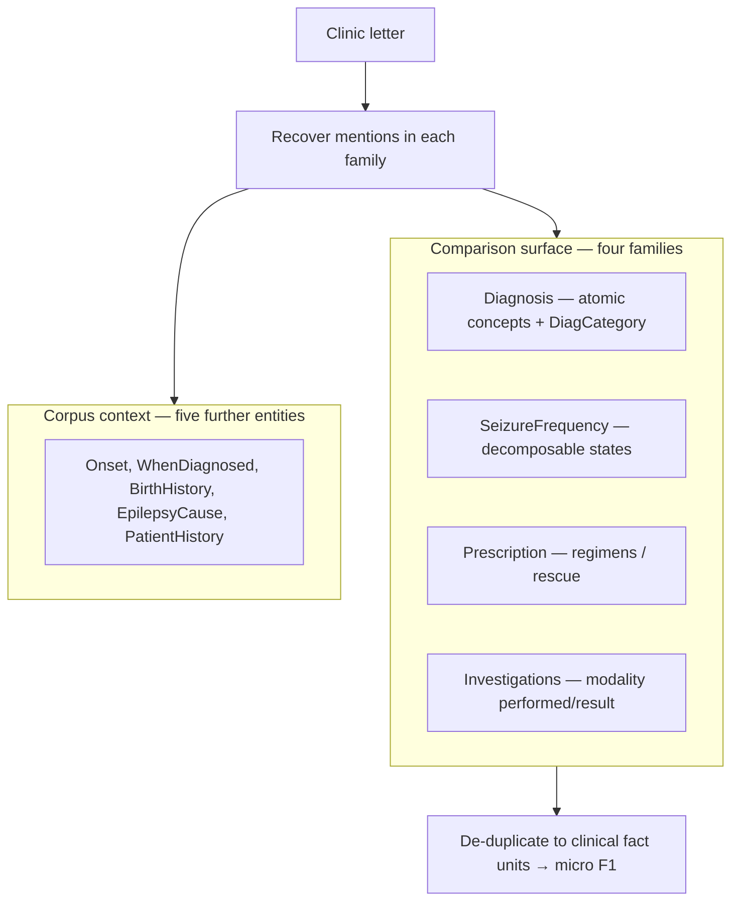

# ExECTv2 gold-label task taxonomy

Date: 2026-08-06  
Status: gold-label framework (no model performance cuts)  
Parent: [task-shape framework](../shared/task_shape_framework_2026-08-06.md)  
Artifact: [`experiments/exectv2_gold_task_taxonomy_20260806.json`](../../experiments/exectv2_gold_task_taxonomy_20260806.json)  
Regenerator: `python scripts/build_gold_task_taxonomy_inventories.py`

## Broad shape of the ExECT task

ExECT asks a different question of the same kind of letter:

> Which structured clinical facts does this epilepsy letter support?

Gold is a **set of mentions** with attributes. The paper and six-model
comparison surface is **four-family clinical fact F1** (Diagnosis, Seizure
Frequency, Prescription, Investigations), not nine-entity published phrase/CUI
metrics ([Decision 0046](../../decisions/0046-exect-primary-method-comparison-boundary.md)).
Unlike Gan, there is no exhaustive single label and **no valid unknown-only
denominator** ([Decision 0044](../../decisions/0044-shared-reliability-criteria-use-task-specific-measures.md)).

### What one letter is asking the system to do

1. **Cover** the families that gold marks as present (often several at once).
2. **Respect absence**: if gold has no SeizureFrequency mentions, emitting a
   rate is spurious (empty-gold is a real letter phenotype, not “unknown”).
3. **Fill attributes** that the family scorer needs (concept identity, rate
   state, regimen parts, investigation components).
4. **Handle multiplicity**: many letters have ≥2 Diagnosis or SF mentions;
   scoring cares about the de-duplicated fact set.
5. **Avoid extras** that are clinically plausible but not in gold’s inventory.

Teaching case
[TEACH-EXECT-01](../../architecture/teaching_cases/exectv2.md) shows pipeline
shape and the four-family versus nine-entity boundary on a synthetic letter
without gold.

## Gold categories (from labels only)

Counts are full200 unless noted. Default split manifest is `exectv2_split_v2`
(dev140 / test with **59** letters; prose still says `test60`).

### Corpus presence (nine entities)

| Entity | Mentions | Letters with ≥1 | Letters with ≥2 | Letters absent |
| --- | ---: | ---: | ---: | ---: |
| PatientHistory | 656 | 179 | 144 | 21 |
| Diagnosis | 572 | 189 | 146 | 11 |
| Prescription | 294 | 166 | 96 | 34 |
| SeizureFrequency | 263 | 142 | 79 | 58 |
| Investigations | 183 | 108 | 64 | 92 |
| BirthHistory | 47 | 37 | 6 | 163 |
| EpilepsyCause | 36 | 28 | 8 | 172 |
| Onset | 24 | 19 | 5 | 181 |
| WhenDiagnosed | 17 | 17 | 0 | 183 |

Recovery class: Diagnosis atomic; SF / Prescription / Investigations
decomposable; PatientHistory coverage-diagnostic (outside headline).

### Letter-level composition on the four-family surface

How many comparison families are present on a letter:

| Four-family count | Letters |
| ---: | ---: |
| 4 | 72 |
| 3 | 78 |
| 2 | 36 |
| 1 | 11 |
| 0 | 3 |

Secondary whole-letter composition buckets (mutually exclusive):

| Bucket | n | What the letter is asking |
| --- | ---: | --- |
| `multi_mention_with_sf` | 132 | At least one family has ≥2 mentions, and SF is present |
| `present_families_multi_mention_empty_sf` | 46 | Other families present (often multi), **no** SF gold |
| `present_families_single_mention_empty_sf` | 9 | Sparse non-SF gold only |
| `broad_single_mention_with_sf` | 6 | ≥3 families, all single-mention, SF present |
| `sparse_multi_family_single_mention_with_sf` | 4 | 2 families, single mentions, SF present |
| `no_four_family_gold` | 3 | No four-family mentions at all |

These describe workload composition, not the primary clinical categories.
The dominant letter shape is still useful context: **most letters are
multi-mention with SeizureFrequency present**. Empty-SF letters (55) are a
first-class task phenotype—recover other facts and **do not invent** SF.

### Family-internal gold subtypes

**Diagnosis** (letter multiplicity): multi 146 / single 43 / absent 11.  
DiagCategory mentions: Epilepsy 310, MultipleSeizures 239, SingleSeizure 21
(+ rare missing/lowercase).

**SeizureFrequency mention buckets** (263 mentions):

| Bucket | n | What the mention encodes |
| --- | ---: | --- |
| `seizure_free` | 92 | Zero seizure count, with or without a duration/anchor |
| `numeric_cadence_rate` | 89 | Positive count + TimePeriod cadence (closest to Gan-like active rates) |
| `count_in_named_window` | 30 | Positive count anchored to PointInTime / dates / Since-During, no cadence |
| `qualitative_frequency_change` | 52 | FrequencyChange without a numeric count |

**Prescription**: 288 mentions with complete drug/dose/unit/frequency attrs;
6 `As_Required` rescue forms.

**Investigations**: modality attrs appear on MRI / CT / EEG mentions (see
artifact `inv_modality_mentions`); gold is component-shaped
(performed/result), not a free-text summary.

### Split stability (secondary letter buckets)

| Bucket | dev140 | test (59) |
| --- | ---: | ---: |
| multi_mention_with_sf | 91 | 41 |
| present_families_multi_mention_empty_sf | 31 | 14 |
| present_families_single_mention_empty_sf | 7 | 2 |
| broad_single_mention_with_sf | 4 | 2 |
| sparse_multi_family_single_mention_with_sf | 4 | 0 |
| no_four_family_gold | 3 | 0 |

## Why each category is hard for LLMs vs rules

| Category | Why hard for an LLM | Why hard for rules |
| --- | --- | --- |
| Single clear Diagnosis concept | Usually easy; fails when gold wants a narrower inventory than a good paraphrase | Lexicon / CUIPhrase coverage; heading vs prose |
| Multi Diagnosis + DiagCategory mix | Must emit the gold set, not one adequate umbrella term | Multiple concept lines; category assignment |
| SF numeric cadence | Format and unit binding; type-conditioned state | Pattern coverage across phrasings |
| SF seizure-free | Must preserve zero-event state despite nearby active or historical seizure language | Zero-count and duration/anchor templates |
| SF count-in-named-window | Easy to turn a window count into a wrong cadence rate (Gan-like habit) | Needs date/PointInTime/Since logic, not only `N per unit` |
| SF qualitative FrequencyChange | “Well controlled” / “increased” style language is soft | Closed vocab mapping from guidelines; brittle |
| Empty-SF letter | Over-inference from historical or drug context | Same: any SF extractor may fire spuriously |
| Complete Prescription | Usually easy when dose line is explicit | Strong when templates match |
| Investigations components | Must keep modality × performed × result, not a prose summary | Slot filling from templated report lines |
| Low-frequency nine-entity families | Sparse supervision; not in primary four-family score | Separate extractors; low prevalence (e.g. EpilepsyCause 36) |

## Measured three-method competence (`dev140`)

Owner: [category-cut performance](../shared/six_model_category_cut_performance_2026-08-06.md).

| Surface | x / high | y / mid | z / floor |
| --- | --- | --- | --- |
| **rules** | Prescription, Diagnosis, SeizureFrequency (high) | none | Investigations (floor) |
| **llm** | complete Prescription | Diagnosis, SF, Investigation subtypes | single-seizure Diagnosis |
| **llm_with_rules** | complete Prescription | Diagnosis, SF, Investigation subtypes | none strict |

The rules row is one deterministic system, so high/mid/floor are absolute
bands, not x/y/z agreement. On development, rules-only already owns
Prescription, Diagnosis, and SF; Investigations is the rules floor. The hybrid
surface still turns Prescription into strict six-model x, but that is a
different claim. Primary comparison remains four-family clinical fact F1.

Whole-letter composition buckets remain in the category-cut artifact as a
secondary workload lens. Primary ExECT conclusions come from the family-
internal Diagnosis, SF, Prescription, and Investigation subtypes above.

The later [phrase-variant inventory](../paper/exect_gold_phrase_variants_2026-08-13.md)
lists official source spans behind development four-family gold keys. It does
not change these buckets.

## Claim boundary

- Gold inventory only; no predictions in the artifact.
- Nine-entity counts are corpus context; peer comparison is four-family.
- `test60` prose name vs 59-letter v2 count is recorded, not redefined.
- Locked test rows were not inspected.
- Do not cite this document as model performance evidence.
