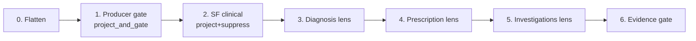
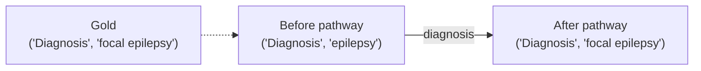
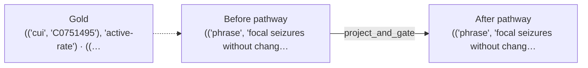
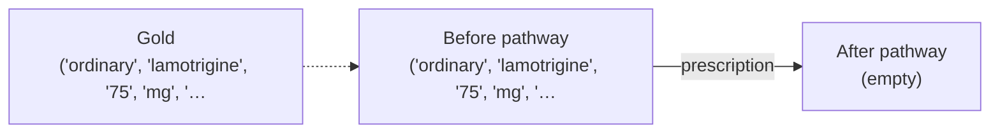

# ExECTv2 llm_with_rules stage ablation

Date: 2026-08-06  
Status: development stage ablation inside hybrid only  
Paper-library role: ExECT component-attribution record; start with the [component deck](../artifacts/paper_source_component_roles_and_limits_2026-08-09.pptx)

Protocol: [hybrid stage ablation protocol](hybrid_stage_ablation_protocol_2026-08-06.md)  
Parent: [family error catalog](family_error_catalog_2026-08-06.md)  
Companions: [task-shape framework](../shared/task_shape_framework_2026-08-06.md), [architecture stage diagram](../../architecture/diagrams/exectv2_llm_with_rules_stages.md), [Gan peer](../gan2026/hybrid_stage_ablation_2026-08-06.md)  
Artifact: [`experiments/exectv2_hybrid_stage_ablation_20260806.json`](../../experiments/exectv2_hybrid_stage_ablation_20260806.json)

> **Update 2026-08-10:** The Prescription band in this historical replay is
> the pre-v10 lens. Its 0.81 exactness endpoint and 44-rescue/60-harm ledger
> remain valid development evidence for v09, but no longer describe the
> selected Prescription implementation. The later per-rule decomposition
> removed two harmful rules and the aggregate-only `test59` confirmation is
> linked from the [v10 report](prescription_lens_rule_decomposition_2026-08-10.md).

## Plain answer

Inside `llm_with_rules`, family rules are not one blob. On 830 replayable six-model letter cells under true ordered no-call replay:

1. **Diagnosis** — `lens.diagnosis` is the mass first-changer (457 first; 212 rescue / 49 harm). Exactness moves 0.39 → 0.58 by the Diagnosis-lens band.
2. **SeizureFrequency** — mass first-changer is `project_and_gate` (623 first; 305 rescue), mainly dropping or reshaping pre-state mentions; `sf_state_projection` adds a smaller further lift (31 first). Thin SF lens fires 0. Exactness 0.14 → 0.51 after the gate, then 0.57 after SF clinical.
3. **Prescription** — `lens.prescription` can hurt (60 any-harm vs 44 any-rescue). Exactness 0.83 → 0.81 across the Rx lens band.
4. **Investigations** — near no-op on lenses (`lens.investigations` fires 0); small `project_and_gate` movement only (14 fires).

## Why this document exists

The [family error catalog](family_error_catalog_2026-08-06.md) contrasts model lane vs after family rules. This sibling stays on hybrid only and splits the deterministic stack into bands and named stages under true ordered replay.

## Observable bands

No new calls. Saved `*_structured.jsonl` events are replayed through current selected-policy deterministic stages (`default` / `default`, SF `combined`).

| Band | Stages | Role |
| --- | --- | --- |
| Post-flatten | `flatten_events` | Model events as mentions (pre-gate) |
| Producer gate | `project_and_gate` | Enrich attributes; drop no-state SF / modality-only Inv |
| SF clinical | `sf_state_projection`, `sf_unknown_suppression` (+ thin SF lens) | Project SF state; suppress unsupported unknown |
| Diagnosis lens | `lens.diagnosis` | Heading/dictionary reconcile |
| Prescription lens | `lens.prescription` | Bounded regimen correction |
| Investigations lens | `lens.investigations` | Validate / de-dupe |
| Evidence gate | `evidence_requirement` | Hard exact-evidence check |

Attribute a rescue or harm to the **first** stage that changes that family's clinical-headline unit keys. Later fires count under any-rescue / any-harm.

## Four pathways that explain the stack

### A. Diagnosis lens rewrites the concept set

Mass Diagnosis first-changer; inventory rescue from substitutions/extras.

EA0007 / GPT-5.6 Sol. Pathway effect `rescue`; final mode `correct_nonempty`.

### B. Producer gate / SF projection trims state

SF mass first-changer is often `project_and_gate`; projection adds a smaller further lift. Thin SF lens should barely fire.

EA0002 / GPT-5.6 Sol. Pathway effect `reshape`; final mode `substituted_or_mixed`.

### C. Prescription lens drops or rewrites a drug

Known hurt surface under default policy.

EA0008 / GPT-5.6 Sol. Pathway effect `harm`; final mode `missed_all`.

### D. Investigations with no stage change

Rules leave Investigations alone on this roster.
Pooled count: 816.

## Band ablation by clinical family

Pooled six-model letter×model cells. Exact rate is clinical-headline unit-key letter exactness at the band endpoint. Mode Δ is mode-count versus the previous band (negative means that shape shrank).

### `Diagnosis` (n=830)

| Band | Exact | Top modes | Mode Δ from previous |
| --- | ---: | --- | --- |
| After flatten (pre-gate) | 0.39 | `correct_nonempty` (290), `substituted_or_mixed` (270), `missed_only` (117) | — |
| After producer gate | 0.39 | `correct_nonempty` (290), `substituted_or_mixed` (267), `missed_only` (117) | `missed_all` +3, `substituted_or_mixed` -3 |
| After SF clinical | 0.39 | `correct_nonempty` (290), `substituted_or_mixed` (267), `missed_only` (117) | — |
| After Diagnosis lens | 0.58 | `correct_nonempty` (437), `extra_only` (132), `substituted_or_mixed` (111) | `substituted_or_mixed` -156, `correct_nonempty` +147, `extra_only` +40, `missed_only` -26, `correct_empty` +18, `empty_gold_spurious` -18 |
| After Prescription lens | 0.58 | `correct_nonempty` (437), `extra_only` (132), `substituted_or_mixed` (111) | — |
| After Investigations lens | 0.58 | `correct_nonempty` (437), `extra_only` (132), `substituted_or_mixed` (111) | — |
| After evidence gate / final | 0.58 | `correct_nonempty` (437), `extra_only` (132), `substituted_or_mixed` (111) | — |

### `SeizureFrequency` (n=830)

| Band | Exact | Top modes | Mode Δ from previous |
| --- | ---: | --- | --- |
| After flatten (pre-gate) | 0.14 | `substituted_or_mixed` (576), `correct_empty` (120), `empty_gold_spurious` (118) | — |
| After producer gate | 0.51 | `correct_nonempty` (302), `correct_empty` (123), `empty_gold_spurious` (115) | `substituted_or_mixed` -472, `correct_nonempty` +302, `missed_only` +93, `extra_only` +76, `correct_empty` +3, `empty_gold_spurious` -3 |
| After SF clinical | 0.57 | `correct_nonempty` (318), `correct_empty` (153), `missed_only` (100) | `correct_empty` +30, `empty_gold_spurious` -30, `correct_nonempty` +16, `substituted_or_mixed` -13, `extra_only` -10, `missed_only` +7 |
| After Diagnosis lens | 0.57 | `correct_nonempty` (318), `correct_empty` (153), `missed_only` (100) | — |
| After Prescription lens | 0.57 | `correct_nonempty` (318), `correct_empty` (153), `missed_only` (100) | — |
| After Investigations lens | 0.57 | `correct_nonempty` (318), `correct_empty` (153), `missed_only` (100) | — |
| After evidence gate / final | 0.57 | `correct_nonempty` (318), `correct_empty` (153), `missed_only` (100) | — |

### `Prescription` (n=830)

| Band | Exact | Top modes | Mode Δ from previous |
| --- | ---: | --- | --- |
| After flatten (pre-gate) | 0.83 | `correct_nonempty` (562), `correct_empty` (127), `missed_only` (40) | — |
| After producer gate | 0.83 | `correct_nonempty` (562), `correct_empty` (127), `missed_only` (41) | `substituted_or_mixed` -3, `missed_all` +2, `missed_only` +1 |
| After SF clinical | 0.83 | `correct_nonempty` (562), `correct_empty` (127), `missed_only` (41) | — |
| After Diagnosis lens | 0.83 | `correct_nonempty` (562), `correct_empty` (127), `missed_only` (41) | — |
| After Prescription lens | 0.81 | `correct_nonempty` (534), `correct_empty` (139), `missed_only` (61) | `correct_nonempty` -28, `missed_only` +20, `missed_all` +18, `correct_empty` +12, `empty_gold_spurious` -12, `substituted_or_mixed` -10 |
| After Investigations lens | 0.81 | `correct_nonempty` (534), `correct_empty` (139), `missed_only` (61) | — |
| After evidence gate / final | 0.81 | `correct_nonempty` (534), `correct_empty` (139), `missed_only` (61) | — |

### `Investigations` (n=830)

| Band | Exact | Top modes | Mode Δ from previous |
| --- | ---: | --- | --- |
| After flatten (pre-gate) | 0.87 | `correct_nonempty` (368), `correct_empty` (352), `missed_only` (54) | — |
| After producer gate | 0.87 | `correct_nonempty` (365), `correct_empty` (353), `missed_only` (54) | `missed_all` +4, `correct_nonempty` -3, `correct_empty` +1, `empty_gold_spurious` -1, `extra_only` -1 |
| After SF clinical | 0.87 | `correct_nonempty` (365), `correct_empty` (353), `missed_only` (54) | — |
| After Diagnosis lens | 0.87 | `correct_nonempty` (365), `correct_empty` (353), `missed_only` (54) | — |
| After Prescription lens | 0.87 | `correct_nonempty` (365), `correct_empty` (353), `missed_only` (54) | — |
| After Investigations lens | 0.87 | `correct_nonempty` (365), `correct_empty` (353), `missed_only` (54) | — |
| After evidence gate / final | 0.87 | `correct_nonempty` (365), `correct_empty` (353), `missed_only` (54) | — |

## First-changer stage ledger by family

Counts are pooled six-model stage hops on replayable rows. **First-changer** = earliest stage that changed that family's keys. **Any-rescue / any-harm** count every hop.

### `Diagnosis`

| Stage | Band | Fires | First | Rescue | Harm | Any+ | Any- |
| --- | --- | ---: | ---: | ---: | ---: | ---: | ---: |
| `project_and_gate` | producer_gate | 3 | 3 | 0 | 0 | 0 | 0 |
| `sf_state_projection` | sf_clinical | 0 | 0 | 0 | 0 | 0 | 0 |
| `sf_unknown_suppression` | sf_clinical | 0 | 0 | 0 | 0 | 0 | 0 |
| `lens.diagnosis` | diagnosis_lens | 460 | 457 | 212 | 49 | 214 | 49 |
| `lens.prescription` | prescription_lens | 0 | 0 | 0 | 0 | 0 | 0 |
| `lens.investigations` | investigations_lens | 0 | 0 | 0 | 0 | 0 | 0 |

Band-level first-changer share:

| Band | First-changer letters |
| --- | ---: |
| `diagnosis_lens` | 457 |
| `producer_gate` | 3 |

#### `project_and_gate`

Fires 3; first-changer 3 (rescue 0, harm 0); any-rescue 0, any-harm 0.

#### `lens.diagnosis`

Fires 460; first-changer 457 (rescue 212, harm 49); any-rescue 214, any-harm 49.
- Rescue example: EA0007 / GPT-5.6 Sol: substituted_or_mixed → correct_nonempty (`["('Diagnosis', 'epilepsy')"]` → `["('Diagnosis', 'focal epilepsy')"]`).
- Harm example: EA0008 / GPT-5.6 Sol: correct_nonempty → extra_only (`["('Diagnosis', 'focal epilepsy')", "('Diagnosis', 'focal seizures with altered awareness')"]` → `["('Diagnosis', 'focal epilepsy')", "('Diagnosis', 'focal seizures with altered awareness')", "('Diagnosis', 'focal seizures')"]`).

### `SeizureFrequency`

| Stage | Band | Fires | First | Rescue | Harm | Any+ | Any- |
| --- | --- | ---: | ---: | ---: | ---: | ---: | ---: |
| `project_and_gate` | producer_gate | 623 | 623 | 305 | 0 | 305 | 0 |
| `sf_state_projection` | sf_clinical | 73 | 31 | 23 | 0 | 41 | 1 |
| `sf_unknown_suppression` | sf_clinical | 8 | 0 | 0 | 0 | 6 | 0 |
| `lens.diagnosis` | diagnosis_lens | 0 | 0 | 0 | 0 | 0 | 0 |
| `lens.prescription` | prescription_lens | 0 | 0 | 0 | 0 | 0 | 0 |
| `lens.investigations` | investigations_lens | 0 | 0 | 0 | 0 | 0 | 0 |

Band-level first-changer share:

| Band | First-changer letters |
| --- | ---: |
| `producer_gate` | 623 |
| `sf_clinical` | 31 |

#### `project_and_gate`

Fires 623; first-changer 623 (rescue 305, harm 0); any-rescue 305, any-harm 0.
- Rescue example: EA0004 / GPT-5.6 Sol: substituted_or_mixed → correct_nonempty (`["(('phrase', 'seizures'), 'active-rate')"]` → `["(('cui', 'C0036572'), 'active-rate')"]`).

#### `sf_state_projection`

Fires 73; first-changer 31 (rescue 23, harm 0); any-rescue 41, any-harm 1.
- Rescue example: EA0142 / GPT-5.6 Sol: extra_only → correct_nonempty (`["(('cui', 'C0036572'), 'active-rate')", "(('cui', 'C0036572'), 'seizure-free')"]` → `["(('cui', 'C0036572'), 'seizure-free')"]`).
- Harm example: EA0119 / Qwen 3.6:35B: correct_nonempty → substituted_or_mixed (`["(('cui', 'C0036572'), 'active-rate')", "(('cui', 'C0036572'), 'unknown')"]` → `["(('cui', 'C0270834'), 'active-rate')", "(('cui', 'C0036572'), 'unknown')"]`).

#### `sf_unknown_suppression`

Fires 8; first-changer 0 (rescue 0, harm 0); any-rescue 6, any-harm 0.
- Rescue example: EA0063 / GPT-4.1-mini: extra_only → correct_nonempty (`["(('cui', 'C0036572'), 'seizure-free')", "(('cui', 'C0036572'), 'unknown')"]` → `["(('cui', 'C0036572'), 'seizure-free')"]`).

### `Prescription`

| Stage | Band | Fires | First | Rescue | Harm | Any+ | Any- |
| --- | --- | ---: | ---: | ---: | ---: | ---: | ---: |
| `project_and_gate` | producer_gate | 3 | 3 | 0 | 0 | 0 | 0 |
| `sf_state_projection` | sf_clinical | 0 | 0 | 0 | 0 | 0 | 0 |
| `sf_unknown_suppression` | sf_clinical | 0 | 0 | 0 | 0 | 0 | 0 |
| `lens.diagnosis` | diagnosis_lens | 0 | 0 | 0 | 0 | 0 | 0 |
| `lens.prescription` | prescription_lens | 124 | 123 | 44 | 60 | 44 | 60 |
| `lens.investigations` | investigations_lens | 0 | 0 | 0 | 0 | 0 | 0 |

Band-level first-changer share:

| Band | First-changer letters |
| --- | ---: |
| `prescription_lens` | 123 |
| `producer_gate` | 3 |

#### `project_and_gate`

Fires 3; first-changer 3 (rescue 0, harm 0); any-rescue 0, any-harm 0.

#### `lens.prescription`

Fires 124; first-changer 123 (rescue 44, harm 60); any-rescue 44, any-harm 60.
- Rescue example: EA0038 / GPT-5.6 Sol: substituted_or_mixed → correct_nonempty (`["('ordinary', 'carbamazepine', '400/400/200', 'mg', '3')", "('ordinary', 'zonisamide', '50', 'mg', '2')", "('ordinary', 'clobazam', '10', 'mg', '2')"]` → `["('ordinary', 'carbamazepine', '400', 'mg', '1')", "('ordinary', 'carbamazepine', '400', 'mg', '1')", "('ordinary', 'carbamazepine', '200', 'mg', '1')", "('ordinary', 'zonisamide', '50', 'mg', '2')", "('ordinary', 'clobazam', '10', 'mg', '2')"]`).
- Harm example: EA0008 / GPT-5.6 Sol: correct_nonempty → missed_all (`["('ordinary', 'lamotrigine', '75', 'mg', '2')"]` → `[]`).

### `Investigations`

| Stage | Band | Fires | First | Rescue | Harm | Any+ | Any- |
| --- | --- | ---: | ---: | ---: | ---: | ---: | ---: |
| `project_and_gate` | producer_gate | 14 | 14 | 2 | 4 | 2 | 4 |
| `sf_state_projection` | sf_clinical | 0 | 0 | 0 | 0 | 0 | 0 |
| `sf_unknown_suppression` | sf_clinical | 0 | 0 | 0 | 0 | 0 | 0 |
| `lens.diagnosis` | diagnosis_lens | 0 | 0 | 0 | 0 | 0 | 0 |
| `lens.prescription` | prescription_lens | 0 | 0 | 0 | 0 | 0 | 0 |
| `lens.investigations` | investigations_lens | 0 | 0 | 0 | 0 | 0 | 0 |

Band-level first-changer share:

| Band | First-changer letters |
| --- | ---: |
| `producer_gate` | 14 |

#### `project_and_gate`

Fires 14; first-changer 14 (rescue 2, harm 4); any-rescue 2, any-harm 4.
- Rescue example: EA0002 / GPT-4.1-mini: extra_only → correct_nonempty (`["('MRI', 'Yes', None)", "('MRI', 'Yes', 'Abnormal')"]` → `["('MRI', 'Yes', 'Abnormal')"]`).
- Harm example: EA0010 / Gemma 4 26B: correct_nonempty → missed_all (`["('MRI', 'Yes', 'Abnormal')"]` → `[]`).

## Residual ownership after the full stack

### `Diagnosis`

| Outcome | Count |
| --- | ---: |
| `final_correct_no_stage_change` | 271 |
| `final_wrong_after_stage_change` | 246 |
| `final_correct_after_stage_change` | 214 |
| `final_wrong_no_stage_change` | 99 |

### `SeizureFrequency`

| Outcome | Count |
| --- | ---: |
| `final_correct_after_stage_change` | 351 |
| `final_wrong_after_stage_change` | 303 |
| `final_correct_no_stage_change` | 120 |
| `final_wrong_no_stage_change` | 56 |

### `Prescription`

| Outcome | Count |
| --- | ---: |
| `final_correct_no_stage_change` | 629 |
| `final_wrong_after_stage_change` | 82 |
| `final_wrong_no_stage_change` | 75 |
| `final_correct_after_stage_change` | 44 |

### `Investigations`

| Outcome | Count |
| --- | ---: |
| `final_correct_no_stage_change` | 716 |
| `final_wrong_no_stage_change` | 100 |
| `final_wrong_after_stage_change` | 12 |
| `final_correct_after_stage_change` | 2 |

## Top pathways by family

### `Diagnosis`

| Pathway | Count |
| --- | ---: |
| `diagnosis` | 457 |
| `no_stage_change` | 370 |
| `project_and_gate → diagnosis` | 3 |

### `SeizureFrequency`

| Pathway | Count |
| --- | ---: |
| `project_and_gate` | 574 |
| `no_stage_change` | 176 |
| `project_and_gate → state_projection` | 41 |
| `state_projection` | 31 |
| `project_and_gate → unknown_suppression` | 7 |
| `project_and_gate → state_projection → unknown_suppression` | 1 |

### `Prescription`

| Pathway | Count |
| --- | ---: |
| `no_stage_change` | 704 |
| `prescription` | 123 |
| `project_and_gate` | 2 |
| `project_and_gate → prescription` | 1 |

### `Investigations`

| Pathway | Count |
| --- | ---: |
| `no_stage_change` | 816 |
| `project_and_gate` | 14 |

## How to explore further

| Need | Where |
| --- | --- |
| Band mode tables and stage examples | JSON artifact |
| llm vs hybrid mode catalog | [family error catalog](family_error_catalog_2026-08-06.md) |
| Stage ownership definitions | [llm_with_rules stages](../../architecture/diagrams/exectv2_llm_with_rules_stages.md) |
| Gan peer report | [Gan hybrid stage ablation](../gan2026/hybrid_stage_ablation_2026-08-06.md) |
| Regenerate | `python scripts/build_exectv2_hybrid_stage_ablation.py` |

## Method

- Split: ExECT `dev140`. Surface: `llm_with_rules` only.
- Replay input: retained `*_structured.jsonl` `structured_events` + dev letter note text.
- Policy: selected `default` / `default`, SF projection `combined`.
- Baseline for hops: post-`flatten_events`; then `project_and_gate` → SF project/suppress → four lenses → evidence gate.
- Wrongness: clinical-headline unit-key letter imperfect. Modes: same vocabulary as the parent catalog.
- Attribution: first key-changing stage per family is the first-changer; any-rescue/harm count later hops too.
- Fidelity on replayable rows: all-family key exact 0.976; evidence-gate pass 1.000; per-family Diagnosis 0.976, SeizureFrequency 1.000, Prescription 1.000, Investigations 1.000.

## Claim boundary

- Development ExECT `llm_with_rules` stage ablation on `dev140`.
- True ordered current-code replay of saved structured events, not a factorial leave-one-stage-out experiment.
- Not a replacement for parent-catalog llm-vs-hybrid scores.
- Not sealed holdout competence; not a Decision 0046 rewrite.
- Do not treat post-rules exact-evidence rates near `1.00` as model-quality evidence.
