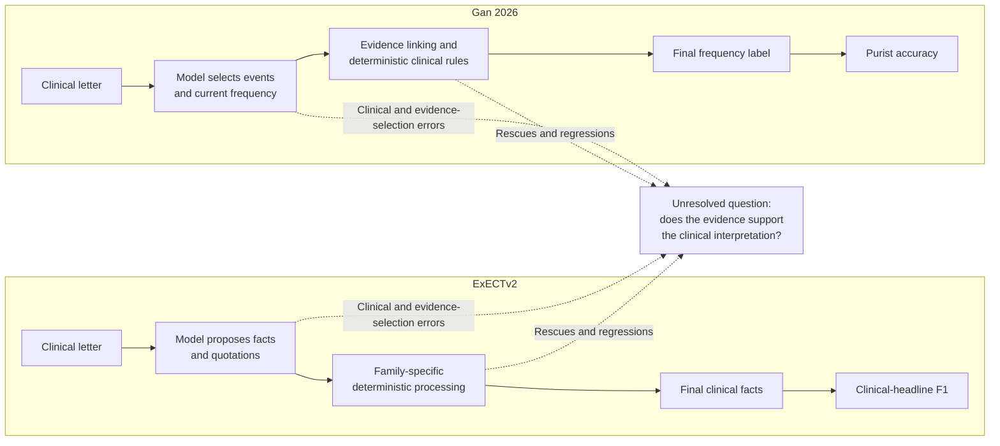
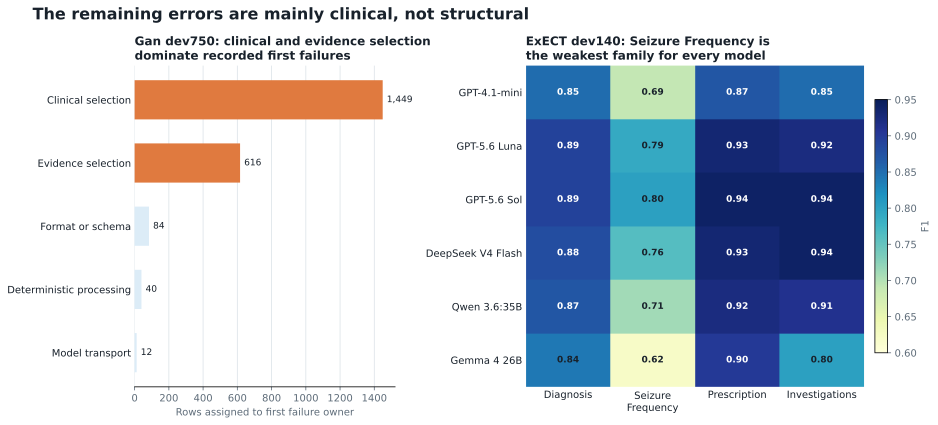
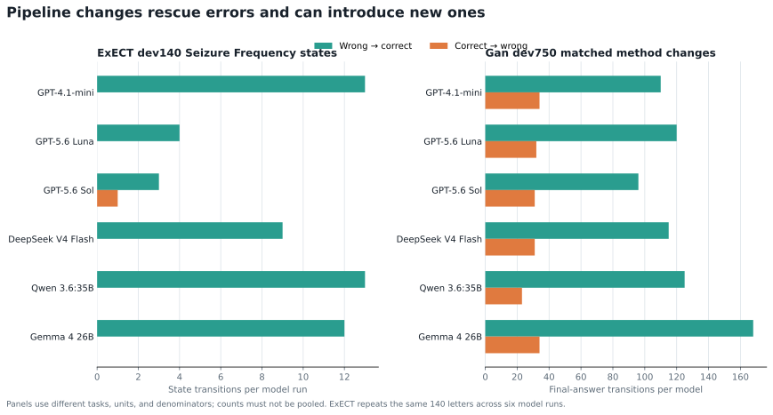
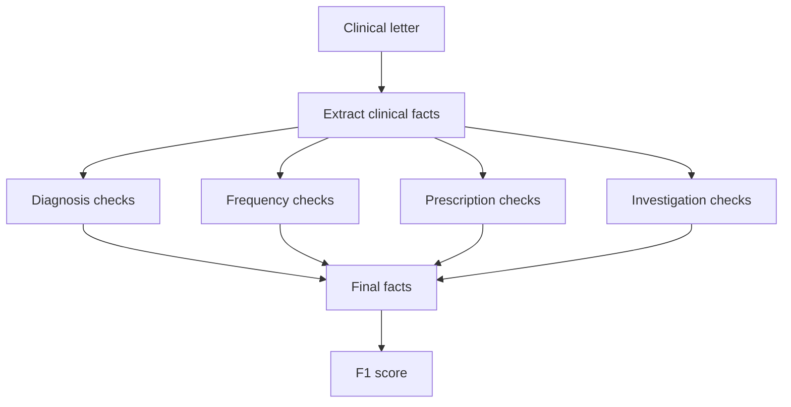
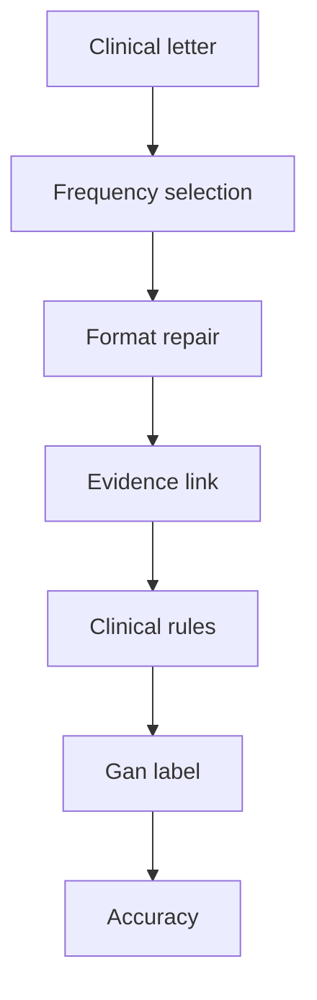

# From structured output to clinical interpretation

## A six-model component analysis across ExECTv2 and Gan 2026

**Report date:** 18 July 2026

**Evidence updated through:** 20 July 2026

## Executive summary

Structured output is effectively solved for the project’s current pipelines.
Across the evaluated runs, format, schema, and transport failures are uncommon
relative to errors in clinical selection and evidence selection. The main
research problem is now whether the pipeline selects the right clinical fact
and whether its quoted evidence supports that interpretation.

The six-model comparison supports four findings:

1. **Clinical interpretation is the main remaining source of error.** Seizure
   Frequency is the weakest ExECT family for every model. In the Gan
   development audit, clinical selection and evidence selection account for
   2,065 of 2,201 rows with a recorded first failure; format, schema,
   deterministic processing, and transport account for 136.
2. **Fixed processing contributes materially to the final result.** On ExECT
   `dev140`, the final pipeline improves F1 by `0.08` to `0.11` over the saved
   model output. On Gan `dev750`, the event-ledger-plus-rules method produces
   65 to 134 more correct answers than the matched direct-label method. The Gan
   comparison changes both the prompt structure and downstream processing, so
   it does not isolate rules alone.
3. **The gains are not uniformly safe.** The Gan method comparison records 96
   to 168 wrong-to-correct transitions and 23 to 34 correct-to-wrong
   transitions per model. ExECT’s narrower Seizure Frequency state study records 54
   wrong-to-correct transitions and one correct-to-wrong transition across six
   runs over the same 140 letters.
4. **Exact quotations make predictions traceable, not clinically valid.**
   ExECT records an exact source match for every final fact in every model
   condition, yet scores still differ and Seizure Frequency remains weak. Gan
   shows the same separation between evidence presence and final correctness.

Model rankings provide context rather than the main result. No model leads both
tasks, and the cross-task rank correlation is `0.20`. The tasks use different
outputs, annotations, and scores, so their numerical results must remain
separate.

The component analyses explain where the evaluated pipelines gain and lose
accuracy. They do not establish whether the quoted evidence clinically
supports each prediction. Independent semantic-support review remains
necessary to answer that question.

The diagram shows the shared research question without treating the two
pipelines as the same system. Each task keeps its own output, deterministic
processing, scorer, and evidence limits.

## How to read the comparison

| Field | ExECTv2 | Gan 2026 |
| --- | --- | --- |
| Clinical task | Recover facts from four parts of an epilepsy letter | Assign one current seizure-frequency label |
| Output | Diagnosis, Seizure Frequency, Prescription, and Investigation facts | One exhaustive frequency label |
| Development evidence | `dev140`; row review permitted | `dev750` (legacy ID: `validation750`); row review permitted |
| Test evidence | `test60`; 59 loadable letters; aggregate only | `test450`; 450 rows; aggregate only |
| Model call | One structured call for all four families | One structured call for seizure events |
| Deterministic processing | Checks evidence, standardizes values, applies family-specific policies, and assembles facts | Repairs format, links evidence, applies clinical rules, and converts the final label |
| Primary score | Internal `clinical_headline` F1 | Purist accuracy |
| Main comparison limit | Internal fact-recovery score, not the published ExECT benchmark | Exact-label accuracy for a different annotation scheme |

The six models use the same data, prompt, processing steps, and scorer within
each task. Qwen and Gemma use local routes; the other four models use hosted
routes. Provider transport and temperature differ where required. The local
Gan results use aggregate-only reparse of sealed outputs. These route
differences limit claims about model capability in isolation but do not change
the task-level component findings.

## 1. Clinical interpretation is the main remaining source of error

The pipelines can usually return valid structured outputs. Their remaining
errors concern which clinical fact to select, which time period is current,
which quotation supports the answer, and how that evidence should be
interpreted.

### ExECT: Seizure Frequency is consistently weak

Seizure Frequency has the lowest `dev140` F1 for every model. Its family F1
ranges from `0.62` to `0.80`, while the other families are usually above
`0.80` and often above `0.90`. This repeated result points to the clinical
target rather than one weak model.

Frequency extraction requires more than finding a seizure mention. The
pipeline must distinguish current from historical events, connect numbers to
the correct seizure type and time period, and avoid treating an uncertain or
absent rate as a positive assertion. A well-formed fact can still be
clinically wrong when any of those selections fail.

The predeclared ExECT component study gives a narrower view of this problem. It
compares the state proposed by the model with the state left after fixed code
converts or removes it. A state records whether the letter gives a rate, says
the patient is seizure-free, or leaves the current frequency unknown. Fixed
processing improves state F1 for all six models, by `0.01` to `0.05`.

### Gan: selection failures dominate format failures

The Gan post-panel audit assigns the first failure in each of 9,000 development
model-condition rows to one processing stage. Of the 2,201 rows with a recorded
failure, 1,449 first fail at model clinical selection and 616 at evidence
selection. Only 84 first fail at format or schema handling, 40 at deterministic
semantic processing, and 12 at model transport.

This does not mean format handling is unnecessary. It means that format is no
longer the main source of wrong clinical answers in these evaluated pipelines.
The central problem is selecting the current clinical state and the evidence
that justifies it.

The audit also assigns each Gan row to one clinical subproblem. Rate and
denominator selection is the largest group (`3,919/9,000`), followed by
cluster or diary aggregation (`1,714`), the seizure-free boundary (`1,575`),
the uncertainty boundary (`844`), temporal selection (`477`), and competing
event selection (`471`). These groups describe the decision each row tests;
they are not six additional error counts. They show why a valid output schema
does not settle the task. The difficult choices concern which events to count,
which interval defines the rate, whether remission language overrides older
events, and whether uncertainty permits a numerical label.

## 2. Fixed processing contributes to gains, but aggregate scores hide regressions

On ExECT, applying fixed processing to saved model output improves the
development result for every model. On Gan, the event-ledger-plus-rules method
outperforms the matched direct-label method for every model. That repeated
pipeline result is stronger than any cross-task model-ranking claim.
Component tracing also shows why the final score is not enough: a processing
step can rescue an error or replace a correct answer with an incorrect one.

The panels use different units and denominators and must not be pooled. The
ExECT panel covers one Seizure Frequency state comparison over six evaluations
of the same 140 letters. The Gan panel covers final-answer transitions on 750
letters for each model.

The component measures answer different questions. A first-failure owner marks
the earliest recorded stage that prevents a correct final answer. A transition
compares correctness before and after a named stage or method. The final score
then summarizes all rows after every stage has run. Keeping these views
separate matters: one component can repair an upstream mistake, preserve it,
or introduce a new mistake, while the aggregate score reports only the net
result.

### ExECT: a broad pipeline gain and a narrow state result

On ExECT `dev140`, the output after fixed processing improves
`clinical_headline` F1 by `0.08` to `0.11` over the saved model output for all
six models. The processing removes facts without valid quoted evidence,
standardizes values, recovers Diagnosis facts, converts or removes Seizure
Frequency facts, repairs Prescription facts, and assembles the final output.
The aggregate comparison shows the contribution of the whole deterministic
stage; it does not isolate one rule.

The separate Seizure Frequency state study isolates a smaller part of that
stage. Across the six model runs, fixed code produces 54 wrong-to-correct
transitions and one correct-to-wrong transition. These are repeated
evaluations of the same letters, not 840 independent clinical samples.

### Gan: gains contain substantial movement in both directions

On Gan `dev750`, the event-ledger-plus-rules method produces 65 to 134 more
correct answers than the matched direct-label method for every model. Between
the two methods, each model also has 23 to 34 correct answers changed to
incorrect answers.

This is a method comparison, not a same-output rule ablation. The two
conditions use different prompts and prediction structures. A later no-call
replay repaired 11 schema-invalid records but changed none of the answers that
had already been selected, so format recovery does not explain the net gains.

The [Qwen versus GPT-5.6 Sol row audit](../experiments/gan2026/gan2026_qwen_sol_rule_benefit_audit_2026-07-20.md)
separates the prompt-and-method comparison from the deterministic effect on the
same saved output. It also comments on every development row missed by either
scored condition. In the event-ledger condition, deterministic processing
changes 343 Qwen rows from wrong to correct and seven from correct to wrong; it
changes 389 Sol rows from wrong to correct and two from correct to wrong.
These scorer-defined changes mix clinical selection, label rendering, and
sentinel behavior, so they cannot all be credited to clinical rules. Rules
without a model also remain more accurate on many Gan rows, so the result does
not promote the LLM-with-rules method over the deterministic comparator.

The defensible conclusion is narrower: deterministic processing contributes
materially to the final result, and its contribution includes both clinical
rescues and clinical regressions. A final pipeline score cannot show either
mechanism by itself.

## 3. Exact evidence provides traceability, not clinical validation

Evidence capture is operationally strong in the current pipelines. ExECT
records an exact source-text match for every final fact in every model
condition. Gan records exact evidence for 363 to 449 of 450 test answers,
depending on the model.

Those figures answer a limited question: can the prediction be traced to text
in the source letter? They do not answer whether the quotation is decisive,
whether it describes the current clinical state, or whether the pipeline’s
interpretation follows from it.

The distinction is visible in both tasks:

- ExECT has saturated exact-match evidence, but overall F1 differs by model and
  Seizure Frequency remains the weakest family.
- Gan exact-evidence counts are high, but Purist accuracy ranges from 342 to
  367 correct answers out of 450.
- In the Gan development audit, evidence selection accounts for 616 recorded
  first failures even when the system can often produce an exact quotation.

Pragmatic Gan accuracy accepts specified clinically equivalent labels and is
higher than Purist accuracy for every model. It still does not replace a review
of whether the selected quotation supports the predicted clinical state.

The report therefore separates three questions:

1. **Presence:** does the output contain an exact quotation?
2. **Selection:** is it the right quotation for the current clinical question?
3. **Support:** does the quotation justify the predicted interpretation?

The current evidence answers the first question well and provides
component-level evidence about the second. Independent semantic-support review
is required for the third.

That review has a different unit of judgment from exact string matching. It
must assess the selected quotation in the context of the letter and the
predicted clinical state. A quotation can be exact yet historical, incomplete,
or attached to the wrong seizure type. Conversely, a clinically defensible
interpretation may depend on more than one passage. The present automatic
metrics do not distinguish those cases, which is why saturated evidence
presence does not close the clinical-validity question.

## 4. Model rankings and task transfer are secondary findings

The test panels do not identify one model that is best across both tasks.
Model order is stable from development to test on ExECT, while the order below
first place changes on Gan. Across tasks, the rank correlation is `0.20`.

The rankings should not be read as a task-independent measure of model
quality. ExECT asks for multiple facts and uses an internal fact-recovery F1.
Gan asks for one exhaustive label and uses exact-label accuracy. The prompts,
post-processing, provider routes, and annotation schemes also differ.

The task difference matters most in Seizure Frequency. The study predeclared a
comparison of an unknown current frequency with an asserted rate to test
whether a Gan failure pattern also appeared in ExECT. The ExECT gold
denominator contains no letters labelled only as unknown. Letters with no
reference fact cannot be treated as unknown because ExECT permits multiple
mentions and has documented annotation omissions and conventions.

The intended over-inference rate therefore cannot be calculated. ExECT fixed
state processing improves all six model conditions, but that is an ExECT
development result. It does not show that the Gan unknown-versus-rate mechanism
transfers.

This negative result is informative. Two tasks can share a clinical name while
measuring different outputs under different annotation rules. Cross-task
comparison must begin with the annotation and scoring definitions, not the
label attached to the task.

## 5. Evidence boundary

The report establishes that:

- structured output is operationally sufficient for the current fixed
  pipelines and is not their main source of error;
- clinical and evidence selection account for most recorded Gan first
  failures;
- Seizure Frequency is the weakest ExECT family for every evaluated model;
- fixed processing improves every ExECT model, while the Gan
  event-ledger-plus-rules method outperforms the direct-label method for every
  model;
- those aggregate gains can include both wrong-to-correct and
  correct-to-wrong transitions;
- exact quotations provide traceability without proving clinical support; and
- model rankings and failure measures do not transfer automatically between
  the two tasks.

The report does not establish general model superiority, a shared reliability
score across tasks, reproduction of the published ExECT benchmark, clinical
validity, demographic fairness, calibrated confidence after deployment, or
the semantic adequacy of the selected evidence.

The completed component analyses explain where the evaluated pipelines gain
and lose accuracy. The unresolved question is whether the evidence selected by
the pipeline clinically supports its prediction. That question remains outside
the current automatic metrics.

---

## Appendix A. Complete model results

### A1. Aggregate-only test results and task-specific ranks

| Model | ExECT test60 F1 | ExECT rank | Gan test450 Purist | Gan rank |
| --- | ---: | ---: | ---: | ---: |
| GPT-5.6 Sol | 0.8047 | 1 | 358/450 (0.7956) | 2 |
| GPT-5.6 Luna | 0.7950 | 2 | 352/450 (0.7822) | 4 |
| DeepSeek V4 Flash | 0.7881 | 3 | 342/450 (0.7600) | 6 |
| Qwen 3.6:35B | 0.7872 | 4 | 367/450 (0.8156) | 1 |
| GPT-4.1-mini | 0.7572 | 5 | 353/450 (0.7844) | 3 |
| Gemma 4 26B | 0.7169 | 6 | 343/450 (0.7622) | 5 |

### A2. ExECT development and test F1

| Model | dev140 F1 | test60 F1 | Change | Final exact evidence | Output-format or parsing errors |
| --- | ---: | ---: | ---: | ---: | --- |
| GPT-5.6 Sol | 0.89 | 0.80 | -0.09 | 1.00 | 0 |
| GPT-5.6 Luna | 0.88 | 0.80 | -0.09 | 1.00 | 0 |
| DeepSeek V4 Flash | 0.88 | 0.79 | -0.09 | 1.00 | 0 |
| Qwen 3.6:35B | 0.86 | 0.79 | -0.07 | 1.00 | 0 |
| GPT-4.1-mini | 0.82 | 0.76 | -0.06 | 1.00 | 0 |
| Gemma 4 26B | 0.80 | 0.72 | -0.08 | 1.00 | 6 aggregate events |

The ExECT model order is unchanged from `dev140` to `test60`. Every test score
is lower than its development score; the mean absolute F1 change is `0.08`.
Test60 contains 59 loadable letters, and its rows cannot be inspected.

### A3. Gan development and test Purist accuracy

| Model | dev750 Purist | test450 Purist | Change |
| --- | ---: | ---: | ---: |
| Qwen 3.6:35B | 667/750 (0.89) | 367/450 (0.82) | -0.07 |
| GPT-5.6 Sol | 655/750 (0.87) | 358/450 (0.80) | -0.08 |
| GPT-4.1-mini | 653/750 (0.87) | 353/450 (0.78) | -0.09 |
| GPT-5.6 Luna | 646/750 (0.86) | 352/450 (0.78) | -0.08 |
| Gemma 4 26B | 646/750 (0.86) | 343/450 (0.76) | -0.10 |
| DeepSeek V4 Flash | 643/750 (0.86) | 342/450 (0.76) | -0.10 |

Qwen ranks first on both Gan splits; the order below it changes. Only totals
are available for `test450`, which had been used before this comparison. These
results support comparison under the stated score and procedure, not
row-level test analysis or an estimate from a test split used only once.

## Appendix B. Component results

### B1. ExECT output before and after deterministic processing

| Model | Saved model output | Final output | Change |
| --- | ---: | ---: | ---: |
| GPT-5.6 Sol | 0.81 | 0.89 | +0.08 |
| GPT-5.6 Luna | 0.81 | 0.88 | +0.08 |
| DeepSeek V4 Flash | 0.79 | 0.88 | +0.09 |
| Qwen 3.6:35B | 0.75 | 0.86 | +0.11 |
| GPT-4.1-mini | 0.71 | 0.82 | +0.11 |
| Gemma 4 26B | 0.70 | 0.80 | +0.10 |

### B2. Gan method comparison and final-answer transitions

| Model | Event ledger with rules | Direct label | Net gain | Wrong→correct | Correct→wrong |
| --- | ---: | ---: | ---: | ---: | ---: |
| GPT-4.1-mini | 653/750 | 577/750 | +76 | 110 | 34 |
| GPT-5.6 Luna | 646/750 | 558/750 | +88 | 120 | 32 |
| GPT-5.6 Sol | 655/750 | 590/750 | +65 | 96 | 31 |
| DeepSeek V4 Flash | 643/750 | 559/750 | +84 | 115 | 31 |
| Qwen 3.6:35B | 667/750 | 565/750 | +102 | 125 | 23 |
| Gemma 4 26B | 646/750 | 512/750 | +134 | 168 | 34 |

### B3. ExECT F1 by clinical family

| Model | Diagnosis | Seizure Frequency | Prescription | Investigations |
| --- | ---: | ---: | ---: | ---: |
| GPT-4.1-mini | 0.85 | 0.69 | 0.87 | 0.85 |
| GPT-5.6 Luna | 0.89 | 0.79 | 0.93 | 0.92 |
| GPT-5.6 Sol | 0.89 | 0.80 | 0.94 | 0.94 |
| DeepSeek V4 Flash | 0.88 | 0.76 | 0.93 | 0.94 |
| Qwen 3.6:35B | 0.87 | 0.71 | 0.92 | 0.91 |
| Gemma 4 26B | 0.84 | 0.62 | 0.90 | 0.80 |

### B4. ExECT Seizure Frequency state processing

| Model | Model state F1 | F1 after fixed processing | Change | Wrong→correct | Correct→wrong |
| --- | ---: | ---: | ---: | ---: | ---: |
| GPT-4.1-mini | 0.73 | 0.78 | +0.05 | 13 | 0 |
| GPT-5.6 Luna | 0.84 | 0.86 | +0.02 | 4 | 0 |
| GPT-5.6 Sol | 0.85 | 0.86 | +0.01 | 3 | 1 |
| DeepSeek V4 Flash | 0.81 | 0.84 | +0.03 | 9 | 0 |
| Qwen 3.6:35B | 0.75 | 0.80 | +0.05 | 13 | 0 |
| Gemma 4 26B | 0.69 | 0.74 | +0.05 | 12 | 0 |

### B5. Gan first-failure ownership

| First failure owner | Rows |
| --- | ---: |
| Model clinical selection | 1,449 |
| Evidence selection | 616 |
| Format or schema | 84 |
| Deterministic semantic processing | 40 |
| Model transport | 12 |
| No recorded failure | 6,799 |

## Appendix C. Evidence and operational detail

### C1. Gan test evidence and secondary score

| Model | Purist | Pragmatic | Answers with exact evidence | Format or repair record |
| --- | ---: | ---: | ---: | --- |
| Qwen 3.6:35B | 367/450 (0.82) | 380/450 (0.84) | 363/450 | 0 final; deterministic repair |
| GPT-5.6 Sol | 358/450 (0.80) | 376/450 (0.84) | 449/450 | 0; 366 repair notes |
| GPT-4.1-mini | 353/450 (0.78) | 371/450 (0.82) | 419/450 | 2; 317 repair notes |
| GPT-5.6 Luna | 352/450 (0.78) | 365/450 (0.81) | 446/450 | 3; 305 repair notes |
| Gemma 4 26B | 343/450 (0.76) | 367/450 (0.82) | 437/450 | 0 final; deterministic repair |
| DeepSeek V4 Flash | 342/450 (0.76) | 362/450 (0.80) | 434/450 | 4; 259 repair notes |

Purist accuracy remains the primary Gan result. Pragmatic accuracy accepts
specified clinically equivalent labels. It is higher for every model but does
not change the first-place model.

### C2. Unmeasured operational questions

The runs record parsing, output-format, repair, and model-host information.
They do not provide matched cost or latency measurements. Neither task
measures demographic fairness or whether predicted confidence matches observed
accuracy after deployment.

## Appendix D. Task and term definitions

- **Development split:** data that may be examined one row at a time.
  `dev140` contains 140 ExECT letters; `dev750` contains 750 Gan letters.
- **Locked test split:** data whose individual rows may not be examined or used
  to change the system. This report gives totals only for ExECT `test60` and
  Gan `test450`.
- **Aggregate only:** only totals and summary scores are available, not
  individual predictions or errors.
- **Saved model output:** the structured model output before deterministic code
  changes its clinical content.
- **Final output:** the output after fixed code checks, standardizes, selects,
  or repairs the saved model output.
- **F1:** the harmonic mean of precision and recall. Higher is better.
- **Purist accuracy:** the share of Gan predictions that exactly match the
  reference label.
- **Pragmatic accuracy:** a secondary Gan score that also accepts specified
  clinically equivalent labels.
- **Exact evidence:** text copied exactly from the source letter. It establishes
  quotation presence, not clinical support.
- **Wrong→correct:** a prediction changed from incorrect to correct by the
  compared processing step.
- **Correct→wrong:** a prediction changed from correct to incorrect by the
  compared processing step; also called a regression.

### D1. ExECT pipeline

The model proposes facts and quotations. Fixed code then checks and
standardizes Diagnosis, Seizure Frequency, Prescription, and Investigations
without running a second extractor or adding facts the model did not propose.
The final facts are scored with the internal `clinical_headline` F1 measure. It
is not the published ExECT benchmark.

### D2. Gan pipeline

The model identifies seizure events and selects the current frequency. Fixed
code repairs formatting, keeps the supporting quotation, resolves conflicts
between current and historical statements, and converts the answer to a Gan
label. Each stage is saved so errors can be assigned to model selection,
formatting, clinical rules, or label conversion.

## Appendix E. Sources and provenance

- [Project status](../../PROJECT_STATUS.md)
- [Paper claim status](../canon/10_paper_provenance.md)
- [Retained evidence index](../experiments/retained_evidence_manifest.md)
- [Shared eight-criterion scorecard](shared_reliability_scorecard_2026-07-18.md)
- [Reliability framework](../design/reliability_evaluation_framework.md)
- [ExECT test60 protocol](../experiments/exectv2/reliability/exectv2_hosted_test60_protocol_2026-07-15.md)
- [Gan v0.7 test450 protocol](../experiments/gan2026/gan2026_matched_v07_test450_protocol_2026-07-15.md)
- [ExECT Seizure Frequency reliability protocol](../experiments/exectv2/reliability/exectv2_six_model_sf_overinference_protocol_2026-07-18.md)
- [ExECT Seizure Frequency reliability result](../experiments/exectv2/reliability/exectv2_six_model_sf_overinference_2026-07-18.md)
- [Gan dev750 comparison](../experiments/gan2026/gan2026_six_model_validation_comparison_2026-07-18.md)
- [Gan component audit](../experiments/gan2026/gan2026_six_model_post_panel_attribution_2026-07-20.md)
- [Gan Qwen versus Sol component audit](../experiments/gan2026/gan2026_qwen_sol_rule_benefit_audit_2026-07-20.md)

The retained evidence index records source commits, dependency versions,
prompts, scorers, splits, repair policies, model routes, runbooks, hashes, and
CI versions for the selected runs.
