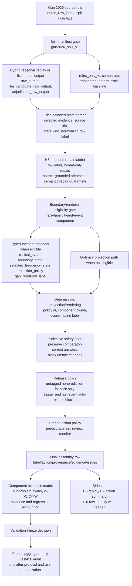

# Gan 2026 Final Assembly Findings And Frozen Holdout Plan

Date: 2026-06-05

Status: final validation-development interpretation and implementation plan for
the fully assembled staged hybrid pipeline. This document does not authorize a
locked-test run by itself. The holdout protocol below must be frozen in code,
artifacts, and user approval before test450 is evaluated.

## Executive Interpretation

The preferred Gan 2026 seizure-frequency architecture is now a staged hybrid
pipeline, not an LLM-first pipeline and not a single deterministic repair stack.
The strongest supported design is:

```text
deterministic/state-graph substrate
  + saved or live LLM-selected clinical facts where available
  + rich selected-state evidence carrier
  + bounded H5 repair policy
  + promoted rare-family boundary/benchmark typed-event component
  + deterministic projection/rendering
  + selective safety floor
  + untagged nonprediction release policy
  + staged predict/abstain/review action policy
  + component evidence matrix and sidecars
```

The validation-development result supports component-level claims under
`gan2026_split_v1`, exact-evidence discipline, and attribution constraints. It
does not support benchmark-comparable language.

The next implementation phase should build one runnable candidate:

```text
hybrid_multi_component_staged_assembly_v1
```

This candidate should use the current auditable validation assembly as its
control, then compose the promoted components into a reproducible validation
runner. Only after the candidate and analysis plan are frozen should a separate
aggregate-only locked test450 audit be run.

## Key Findings

### 1. The Current Validation Assembly Is The Control

The current auditable validation control is:

```text
untagged_nonprediction_release_candidate_v0_assembled_candidate
```

On validation750 it has:

| Readout | Value |
| --- | ---: |
| rows | 750 |
| prediction-bearing rows | 735 |
| correct prediction-bearing rows | 697 |
| H6 controls preserved | 37/37 |
| release-applied rows | 19 |
| release-wrong rows | 0 |

Interpretation: the assembly is strong enough to become the denominator for the
fully assembled pipeline. It is not a final holdout result.

### 2. The Safety Floor Transfers Better Than Broad Projection

`selective_safety_floor_gate_v0` is the best-supported cross-surface component:

| Surface | Changes | W->C | C->W |
| --- | ---: | ---: | ---: |
| validation750 | 21 | 11 | 0 |
| frozen local test450 aggregate | 14 | 8 | 0 |

Interpretation: selective fallback is useful when it is narrow and
predeclared. This does not justify broad projection or broad action-policy
widening.

### 3. H5 Repair Is Bounded, Not A New Semantic Engine

`h5_repair_policy_v1_manifest` is the current repair contract. It keeps
renderer effects separate from clinical selection and prevents semantic repair
from being hidden under normalization language.

Interpretation: future assembly must report repair as a score layer. Any
label-changing semantic repair must be attributed as deterministic behavior.

### 4. Boundary/Renderer Is Promoted As A Rare-Family Component

The boundary/benchmark typed-event layer is promoted as a bounded rare-family
component for eligible cases. The promotion rests on:

| Evidence | Result |
| --- | --- |
| synthetic typed-event contract | 36/36 matched, 36/36 exact evidence |
| H7 minimal pairs | 18/18 invariant pairs |
| benchmark renderer fixture | 16/16 clinical state preserved |
| validation typed panel after precision revision | 6 W->C, 0 C->W, 0 H6 regressions |

Coverage is not a rejection reason because boundary and benchmark-rendering
cases are intrinsically rare. The claim is bounded: this component helps when
eligible boundary or renderer cases are present. It is not evidence of aggregate
gap closure.

### 5. Stage 4 Action Sidecars Are Complete

Stage 4 is complete for the current cycle:

| Sidecar | Result |
| --- | --- |
| `h9_action_summary_sidecar_v1` | 735/750 prediction-bearing; 9 abstain; 6 review |
| `h9_release_lane_ablation_v1` | 19 W->C, 0 C->W, 0 H6 regressions |
| `h6_control_replay_v1` | 0 H6 regressions across checked saved candidates |

Interpretation: H6/H9 should now be mandatory instrumentation for future
candidates. They are guardrails, not the lead mechanism.

### 6. Stage 5 Is Deferred

`h10_raw_identity_sidecar_v1` already showed byte-identical paired validation750
raw outputs on 750/750 matched rows with 0 calls and 0 prediction changes. That
is sufficient for the current saved-artifact assembly phase.

Stage 5 downstream runtime-provenance expansion is deferred. It is not a
precondition for building the fully assembled saved-replay pipeline. If a future
candidate uses live model calls or compares live versus replay behavior, H10
must be reattached before interpreting deltas.

### 7. Broad Structured Projection Is Rejected

`structured_projection_port_promoted_v0` was authorized for one frozen
aggregate-only test450 audit despite failed validation gates. It reduced test450
Purist proxy from 342/450 to 337/450, with 7 W->C and 12 C->W.

Interpretation: broad structured projection is closed as a goal-achieving path.
The fully assembled pipeline should use only bounded projection/rendering and
eligible rare-family boundary/renderer behavior.

## Pipeline Diagram



## Component Roles And Justification

| Component | Role | Owner Type | Why It Stays |
| --- | --- | --- | --- |
| `rules_only_v1` comparator | transparent baseline and C/W denominator | deterministic rule | stable comparator; required for regression accounting |
| hybrid reasoner replay | supplies model-selected clinical facts where already available | LLM or saved replay | useful substrate, but not credited for downstream deterministic choices |
| rich selected-state carrier | makes selected evidence and state explicit | schema/evidence component | prevents hidden post-processing and enables row-level audit |
| H5 bounded repair | allows only bounded format/operand repair | schema repair or deterministic rule by effect | controls validation-attuned semantic repair risk |
| boundary/renderer typed-event | handles rare boundary and benchmark-rendering cases | deterministic/hybrid component | passed exact-evidence and precision gates for eligible cases |
| deterministic projection/rendering | maps selected state to scorer-facing label | deterministic adapter or benchmark_format | arithmetic and Gan formatting are reproducible and ablatable |
| selective safety floor | preserves high-confidence comparator-correct behavior | safety_floor | strongest cross-surface evidence; 0 observed C->W in reported readouts |
| untagged nonprediction release | releases only preaudited fallback rows | deterministic fallback/action | 19 validation releases, 0 wrong releases |
| staged action policy | predicts, abstains, reviews, or monitors | action policy | keeps uncertainty visible instead of forcing unsupported labels |
| component evidence matrix | reports owner/evidence/regression by row | reporting contract | paper-facing transparency and promotion discipline |

## Intermediate Schemas

The implementation should materialize each row through explicit schemas. These
can be dataclasses, Pydantic models, or typed dictionaries, but the JSONL output
must preserve the same fields.

### 1. Source Row

```json
{
  "source_row_index": 8123,
  "split": "validation",
  "split_manifest": "gan2026_split_v1",
  "note_text": "Clinic Date: 2025-02-01. Focal seizures occurred twice last month. No tonic clonic seizures since 2022.",
  "gold_label": "2 per month"
}
```

### 2. Comparator State

```json
{
  "component": "rules_only_v1",
  "label": "2 per month",
  "purist_correct_on_validation": true,
  "evidence": "Focal seizures occurred twice last month",
  "source_id": "note:8123",
  "evidence_status": "exact"
}
```

Purpose: gives the assembly a transparent denominator. On test, the same fields
may be computed, but no row-level failure review is allowed for development.

### 3. Raw Model Or Replay State

```json
{
  "component": "hybrid_reasoner_replay",
  "mode": "saved_replay",
  "raw_output_id": "validation750_row_8123",
  "selected_event_text": "Focal seizures occurred twice last month",
  "selected_label_text": "2 per month",
  "adjudicator_raw_output_present": true,
  "h10_identity_status": "previously_checked"
}
```

Purpose: keeps model output separate from downstream repair/projection. If live
calls are used later, the raw output fields become freeze-critical.

### 4. Rich Selected-State Carrier

```json
{
  "component": "rich_selected_state_v1",
  "selected_state_id": "8123:selected:0",
  "clinical_event": {
    "event_kind": "frequency_rate",
    "event_family": "focal seizures",
    "temporality": "current",
    "assertion": "asserted"
  },
  "selected_evidence": {
    "text": "Focal seizures occurred twice last month",
    "source_id": "note:8123",
    "exact_substring": true
  },
  "frequency_operands": {
    "count_low": 2,
    "count_high": 2,
    "period_low": 1,
    "period_high": 1,
    "period_unit": "month"
  },
  "raw_selected_label": "2 per month",
  "missing_field_flags": []
}
```

Purpose: makes clinical fact identity explicit before repair or rendering. This
is the schema that prevents a later adapter from silently selecting a different
event.

### 5. Repair Ladder State

```json
{
  "component": "h5_repair_policy_v1",
  "raw_label": "2 per month",
  "format_only_label": "2 per month",
  "source_grounded_arithmetic_label": "2 per month",
  "semantic_repair_label": null,
  "accepted_label": "2 per month",
  "accepted_repair_family": "none",
  "repair_portability_category": "not_applicable",
  "semantic_change": false
}
```

Purpose: separates raw model selection, mechanical repair, arithmetic, and
semantic repair. Only bounded repair is accepted by default.

### 6. Boundary/Renderer Eligibility State

For an ordinary frequency row:

```json
{
  "component": "boundary_renderer_eligibility_v1",
  "eligible": false,
  "reason": "ordinary_frequency_rate",
  "suppression_reason": null
}
```

For a rare boundary row:

```json
{
  "component": "boundary_renderer_eligibility_v1",
  "eligible": true,
  "target_mechanism": "seizure_free_boundary_event_v0",
  "suppression_reason": null
}
```

Purpose: ensures the promoted rare-family component only acts on its target
family. Suppressed states such as protected last-event current seizure-free
overrides and unknown/no-reference sentinel churn must remain suppressed.

### 7. Typed Boundary Event State

Example rare-family source row:

```json
{
  "source_row_index": 8450,
  "note_text": "Clinic Date: 2025-03-10. No epileptic seizures for two years. Brief shaking episodes last week were non-epileptic.",
  "gold_label": "seizure free for multiple year"
}
```

Intermediate typed event:

```json
{
  "component": "boundary_event_v1",
  "clinical_event": {
    "event_kind": "seizure_free_interval",
    "event_family": "epileptic seizures",
    "excluded_event_family": "non-epileptic shaking episodes",
    "assertion": "asserted",
    "temporality": "current"
  },
  "boundary_state": {
    "state": "seizure_free_interval",
    "duration_text": "two years",
    "duration_unit": "year",
    "duration_value": 2
  },
  "selected_frequency_state": {
    "state": "seizure_free_interval",
    "ordinary_frequency": null,
    "last_event_only": false,
    "unknown_frequency": false
  },
  "projection_policy": {
    "policy_id": "seizure_free_boundary_event_v0",
    "owner": "clinical_boundary_projection"
  },
  "gan_rendered_label": "seizure free for multiple year",
  "evidence": {
    "text": "No epileptic seizures for two years",
    "exact_substring": true,
    "source_id_valid": true
  }
}
```

Purpose: separates clinical boundary interpretation from benchmark rendering.
The non-epileptic shaking clause is preserved as an exclusion, not converted
into an active seizure-frequency rate.

### 8. Projection And Rendering State

```json
{
  "component": "deterministic_projection_rendering_v1",
  "input_state_id": "8450:boundary:0",
  "projected_label": "seizure free for multiple year",
  "projection_owner": "clinical_boundary_projection",
  "renderer_rule_id": null,
  "benchmark_format_only": false,
  "policy_id": "seizure_free_boundary_event_v0",
  "changed_from_comparator": true
}
```

For benchmark-only rendering:

```json
{
  "component": "deterministic_projection_rendering_v1",
  "projection_owner": "benchmark_format",
  "renderer_rule_id": "gan_unknown_sentinel",
  "benchmark_format_only": true,
  "clinical_state_preserved": true
}
```

Purpose: keeps `benchmark_format` from masquerading as clinical reasoning.

### 9. Safety Floor State

```json
{
  "component": "selective_safety_floor_gate_v0",
  "input_label": "seizure free for multiple year",
  "comparator_label": "unknown",
  "action": "allow_candidate",
  "reason": "eligible_boundary_component_no_h6_regression",
  "h6_member": false,
  "would_regress_comparator_correct": false
}
```

Purpose: preserves the comparator when a candidate change is unsafe. It is a
prediction-bearing decision owner and must be credited as `safety_floor` when it
blocks or restores a label.

### 10. Release And Action State

```json
{
  "component": "staged_action_policy_v1",
  "pre_release_action": "predict",
  "release_lane": null,
  "final_action": "predict",
  "final_label": "seizure free for multiple year",
  "action_reason": "prediction_bearing_with_exact_evidence",
  "monitor_flags": []
}
```

For an untagged nonprediction release:

```json
{
  "component": "untagged_nonprediction_release_candidate_v0",
  "pre_release_action": "abstain",
  "release_lane": "deterministic_comparator_fallback",
  "final_action": "predict",
  "final_label": "1 per month",
  "action_reason": "preaudited_fallback_release",
  "release_expected_transition": "W_to_C"
}
```

Purpose: action policy is not allowed to hide uncertainty. It either produces a
prediction with provenance or leaves the row as abstain/review/monitor.

### 11. Final Assembly Row

```json
{
  "candidate_version": "hybrid_multi_component_staged_assembly_v1",
  "source_row_index": 8450,
  "split": "validation",
  "split_manifest": "gan2026_split_v1",
  "final_action": "predict",
  "final_label": "seizure free for multiple year",
  "component_owner": "clinical_boundary_projection",
  "score_layer": "final_policy",
  "evidence_status": "exact",
  "source_id_valid": true,
  "comparator_label": "unknown",
  "changed_from_comparator": true,
  "validation_transition": "W_to_C",
  "h6_member": false,
  "h6_regression": false,
  "repair_policy_id": "h5_repair_policy_v1",
  "boundary_policy_id": "seizure_free_boundary_event_v0",
  "renderer_policy_id": null,
  "safety_floor_action": "allow_candidate",
  "release_lane": null,
  "issue_counts": {
    "parse": 0,
    "evidence": 0,
    "schema": 0,
    "projection": 0
  }
}
```

Purpose: this is the canonical JSONL row for validation and test. Test rows
must not include development-only fields produced by test failure inspection.
They may include frozen operational fields, component usage, and aggregateable
transition flags when computed by the frozen plan.

### 12. Component Evidence Matrix Row

```json
{
  "task": "seizure_frequency",
  "dataset": "gan2026",
  "split_manifest": "gan2026_split_v1",
  "distribution": "validation750",
  "pipeline_family": "hybrid",
  "candidate_name": "hybrid_multi_component_staged_assembly_v1",
  "score_layer": "final_policy",
  "clinical_subproblem": "seizure_free_boundary",
  "component_owner": "clinical_boundary_projection",
  "evidence_constraint": "exact_selected_evidence",
  "evidence_status": "exact",
  "baseline_label": "unknown",
  "candidate_label": "seizure free for multiple year",
  "baseline_purist_correct": false,
  "candidate_purist_correct": true,
  "changed_from_baseline": true,
  "wrong_to_correct": true,
  "correct_to_wrong": false,
  "regression_family": "none",
  "hidden_family": "seizure_free_duration"
}
```

Purpose: this is the paper-facing attribution unit. It answers which component
solved which subproblem under which evidence gate and regression risk.

## Fully Assembled Pipeline Implementation Plan

### Phase 1: Freeze Candidate Identity And Config

Create a candidate identity:

```text
hybrid_multi_component_staged_assembly_v1
gan2026_hybrid_multi_component_staged_assembly_v1
```

The candidate config must name:

- split manifest: `gan2026_split_v1`;
- comparator: `rules_only_v1`;
- control artifact:
  `gan2026_untagged_nonprediction_release_candidate_v0_assembled_candidate`;
- repair policy: `h5_repair_policy_v1`;
- boundary policy: `seizure_free_boundary_event_v0`;
- renderer policy: `benchmark_convention_renderer_v0`;
- safety floor: `selective_safety_floor_gate_v0`;
- action sidecars: `h9_action_summary_sidecar_v1`,
  `h9_release_lane_ablation_v1`, and `h6_control_replay_v1`;
- provenance sidecar: existing `h10_raw_identity_sidecar_v1` for saved replay,
  with Stage 5 expansion deferred unless live calls are used.

### Phase 2: Promote Component Homes Into Runnable Code

Follow ADR 0010. The final assembly runner should orchestrate components, not
contain their business logic.

Expected homes:

| Component | Implementation Home |
| --- | --- |
| selected-state carrier | `components/selected_state.py` or existing selected-state module |
| H5 repair contract adapter | `artifact_analysis/h5_*` plus promoted component wrapper |
| boundary/renderer typed-event component | existing `components/boundary_event_*`, `benchmark_renderer_fixture`, `boundary_selector_precision_revision` modules |
| safety floor adapter | existing selective safety-floor replay component wrapper |
| action policy | existing staged decision and H9 sidecar modules |
| evidence matrix | existing `components/component_evidence_matrix.py` |
| final runner | new narrow assembly module under `gan2026/hybrid/` or `gan2026/components/assembly/` |

### Phase 3: Define Contract Tests Before Runner Wiring

Add tests that pin:

- every validation row is emitted exactly once;
- every output row includes candidate version, split manifest, source row index,
  final action, label or nonprediction reason, component owner, and policy ids;
- changed prediction-bearing rows have exact evidence and valid source ids;
- boundary/renderer component fires only on eligible rare-family cases;
- suppressed boundary cases remain suppressed;
- H5 repair policy id is recorded and semantic repair is not hidden as
  format-only repair;
- H6 controls have 0 C->W regressions;
- untagged nonprediction releases remain the only release lane;
- trigger-context release remains rejected;
- last-event automatic release remains blocked;
- component evidence matrix row count and candidate row count match.

### Phase 4: Build Saved-Replay Validation Runner

Implement:

```bash
python -m clinical_extraction.tasks.seizure_frequency.gan2026.hybrid.staged_assembly_v1 \
  --split validation \
  --mode saved-replay \
  --candidate-version hybrid_multi_component_staged_assembly_v1 \
  --output-dir experiments/
```

Expected validation outputs:

```text
experiments/gan2026_hybrid_multi_component_staged_assembly_v1_validation750_2026-06-05.jsonl
experiments/gan2026_hybrid_multi_component_staged_assembly_v1_validation750_2026-06-05.json
experiments/gan2026_hybrid_multi_component_staged_assembly_v1_validation750_2026-06-05.md
experiments/gan2026_hybrid_multi_component_staged_assembly_v1_validation750_component_matrix_2026-06-05.csv
```

The validation run should reuse saved artifacts wherever possible. Do not add a
new live model dependency unless a missing saved artifact makes the assembly
impossible.

### Phase 5: Validation Freeze Gate

Freeze for holdout only if all are true:

- 750/750 validation rows assembled exactly once;
- output contract and component evidence matrix pass tests;
- H5 repair policy remains fixed;
- boundary/renderer behavior matches the bounded rare-family decision;
- safety floor introduces no deterministic-correct regression;
- release policy has 0 release-wrong rows and 0 H6 regressions;
- changed prediction-bearing rows have exact evidence and valid source ids;
- no locked-test row-level artifact has been read or written;
- final report labels the result as validation-development.

If any gate fails, revise on validation only. Do not run test.

## Frozen Holdout Protocol Plan

### Preconditions

Before evaluating test450, write a separate frozen protocol addendum that names:

- candidate version and git commit or working-tree state;
- exact source artifacts and hashes;
- split manifest and test row count;
- scorer versions and Purist/Pragmatic mapping;
- repair, boundary, renderer, safety-floor, release, and action policy ids;
- model ids and prompt versions if any live calls are used;
- fields allowed in test outputs;
- aggregate and predeclared-slice readouts;
- explicit prohibition on row-level test failure inspection for development.

User authorization must be recorded after this protocol exists.

### Test Runner

The test command should be separate from validation:

```bash
python -m clinical_extraction.tasks.seizure_frequency.gan2026.hybrid.staged_assembly_v1 \
  --split test \
  --mode frozen \
  --candidate-version hybrid_multi_component_staged_assembly_v1 \
  --protocol docs/experiments/gan2026/frozen_test/gan2026_hybrid_multi_component_staged_assembly_v1_frozen_holdout_protocol_2026-06-05.md \
  --output-dir experiments/
```

Expected test outputs:

```text
experiments/gan2026_hybrid_multi_component_staged_assembly_v1_test450_aggregate_2026-06-05.json
experiments/gan2026_hybrid_multi_component_staged_assembly_v1_test450_aggregate_2026-06-05.md
experiments/gan2026_hybrid_multi_component_staged_assembly_v1_test450_component_summary_2026-06-05.csv
```

Do not write locked-test row-level failure artifacts during the development
audit. Operational row outputs may be created only if they are required for
scoring and are not inspected for tuning; the public report should use
aggregate and predeclared-slice summaries.

### Allowed Test Readouts

- overall Purist exact label aggregate;
- overall Pragmatic aggregate;
- prediction-bearing coverage and action counts;
- predeclared hidden-family aggregate counts when family definitions were frozen
  before the test run;
- component-owner aggregate summaries;
- H6 aggregate W->C/C->W where computable under the frozen plan;
- evidence/source-id/schema validity counts;
- cost/latency/call telemetry if live calls occur.

### Disallowed Test Readouts

- row-level locked-test failure review for development;
- new test-derived slice definitions;
- threshold, prompt, repair, projection, boundary, renderer, or action-policy
  changes derived from test outcomes;
- benchmark-comparable claims unless a separate benchmark-replication policy is
  written and satisfied.

### Interpretation Rules

If the frozen test improves the aggregate and preserves predeclared controls,
record it as a local frozen holdout result, not as a benchmark result.

If the frozen test fails, record it as final-evaluation evidence. Any fix starts
a new validation-only development cycle and requires a later, clearly separated
holdout evaluation.

## Why These Choices Are Justified

The design follows the project thesis: clinical extraction should be modular,
auditable, and honest about which component made each clinical decision.

The choices are conservative for four reasons:

1. Validation is saturated, so another broad aggregate validation run is less
   informative than a frozen assembly and holdout audit.
2. The strongest transferable component is selective safety/fallback, not broad
   projection.
3. Boundary/renderer behavior is clinically meaningful but rare, so it should
   be promoted as a bounded component rather than rejected for low coverage or
   overstated as aggregate gap closure.
4. H6/H9 action sidecars are complete and make the final policy auditable:
   uncertainty stays visible, releases remain preaudited, and H6 regressions are
   monitored before any test-facing claim.

The assembled pipeline is therefore not a larger pile of rules. It is a
controlled composition of evidence-bearing components, each with a named owner,
policy id, evidence gate, and regression gate.

## Immediate Next Work

1. Create the `hybrid_multi_component_staged_assembly_v1` config and output
   contract.
2. Add schema/contract tests for the final assembly row and component evidence
   matrix.
3. Wire the validation saved-replay runner.
4. Materialize validation750 assembly outputs and sidecar summaries.
5. Apply the validation freeze gate.
6. If frozen, write the separate frozen test protocol addendum.
7. Request explicit user authorization for the aggregate-only test450 audit.
8. Run test450 once under the frozen protocol.

