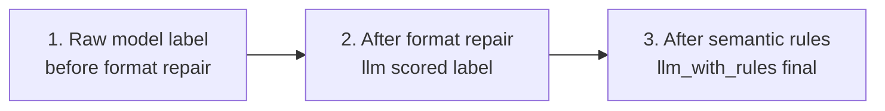
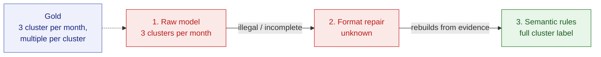
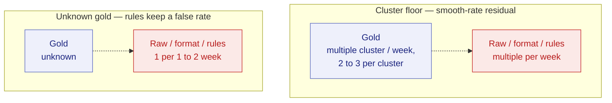
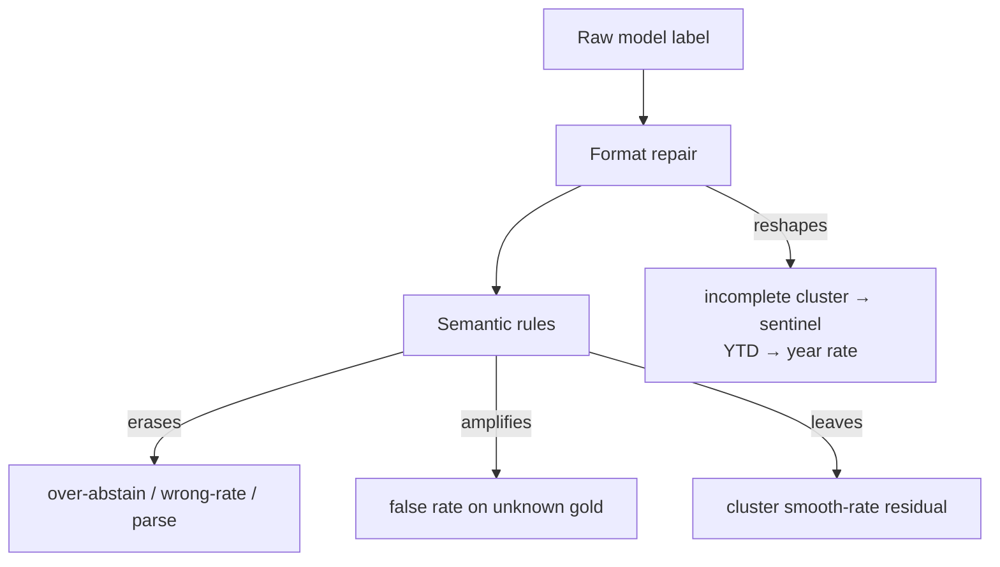

# Gan 2026 category error catalog

Date: 2026-08-06  
Status: development catalog with pipeline ablation reading  
Paper-library role: complete Gan error record; start with [failures and limits](../paper/failures_and_limits_2026-08-10.md)

Protocol: [gan category error catalog protocol](category_error_catalog_protocol_2026-08-06.md)  
Parent: [category-cut performance](../shared/six_model_category_cut_performance_2026-08-06.md)  
Companions: [task-shape framework](../shared/task_shape_framework_2026-08-06.md), [hard-slice modes](../shared/six_model_hard_slice_error_modes_2026-08-06.md), [hybrid stage ablation](hybrid_stage_ablation_2026-08-06.md)  
Artifact: [`experiments/gan2026_category_error_catalog_20260806.json`](../../experiments/gan2026_category_error_catalog_20260806.json)

## Plain answer

Category errors are not a flat list of wrong labels. They are a small
set of wrong-answer **shapes**, and different pipeline layers erase,
reshape, or amplify them.

1. The **raw model label** often emits incomplete cluster grammar,
   illegal fragments, or soft `unknown`.
2. **Format repair** (llm-only scored label) collapses many of those
   fragments into sentinels or invented year totals—so Purist sees
   abstention / wrong-rate even when the model almost said something
   cluster-like.
3. **Semantic rules** (`llm_with_rules`) erase most over-abstention and
   create the easy mass on seizure-free, range, and no-reference. They
   do **not** cleanly fix `unknown_sentinel`, and clusters remain the
   practical floor.

## Why this document exists

The [category-cut report](../shared/six_model_category_cut_performance_2026-08-06.md) shows **which**
gold buckets move under rules. This catalog shows **how**: which wrong
shapes dominate each bucket, and which observable pipeline layer
changes those shapes. Full per-model counts and every retained example
live in the JSON artifact; this page is the readable ablation.

## Observable ablation layers

No new calls. Same retained `dev750` rows. Three labels we can already
separate in saved artifacts:

| Layer | What it is | What it typically does to errors |
| --- | --- | --- |
| **1. Raw model label** | What the model selected before llm-only format repair | Emits incomplete cluster grammar, malformed fragments, soft `unknown` |
| **2. After format repair** | llm-only scored `final_label` | Erases illegal fragments into sentinels or year-rate guesses; can *create* scored wrong-rate / no-reference from an almost-right raw label |
| **3. After semantic rules** | Hybrid final after deterministic repairs | Clears most abstention and many false-free / wrong-rate cases on easy mass; can *worsen* unknown-gold by asserting a rate or free interval |

This is an ablation over **saved surfaces**, not a claim that every
numbered repair rule was toggled in isolation. Attribute a rescue to
the first layer that changes the answer.

## Four cases that explain the catalog

Read these first. Each arrow is one pipeline layer changing the label.
Green end-state = Purist-correct; red = still wrong.

### A. Format invents a year total; rules rescue

Ordinary point rate. Gold is a short observation window; the note says
“so far this year.”

Row 12788 / Sol. Evidence: six focal seizures “so far this year.”
Lesson: format repair can **create** a scored wrong-rate from soft
`unknown`; rules undo it when the diary/window reading is recoverable.

### B. Incomplete cluster grammar collapses, then rebuilds

Cluster burden. Model almost has the answer but omits 
`…, M per cluster`.

Row 10097 / Sol. Lesson: the llm-only **z** floor on clusters is partly
a format collapse of almost-right answers—not pure non-comprehension.

### C. Rules clear ordinary abstention

Ordinary point rate. Model abstains; hybrid recovers the rate.

Row 13190 / Sol. This is the mass effect behind −207
`over_abstain_unknown` on ordinary rates.

### D. Two residuals rules do not fix

Left: cluster still read as a smooth rate. Right: unknown gold gets a
confident active rate.

Rows 10434 and 6368 / Sol. Lesson: after rules, the hard remainder is
**selection / convention**, often with evidence already in hand—not
parse failure.

## Ablation map: which step addresses which mode

| Error shape | Main gold homes | Format repair | Semantic rules |
| --- | --- | --- | --- |
| Incomplete cluster grammar / illegal `N per cluster` | clusters; some ordinary rates | **Reshapes** → `unknown` / no-reference | Often rebuilds a legal label when evidence supports it |
| Over-abstain `unknown` | ordinary, free, range | Sometimes invents a year total instead | **Clears** most of this mass (−207 ordinary, −43 free, −39 range) |
| Wrong point-rate / wrong range band | ordinary, range | Can increase wrong-rate by repairing YTD phrases | Large but incomplete cut (−85 ordinary wrong-rate) |
| False seizure-free on active gold | ordinary, range | Usually passes through | Cuts ordinary false-free (−58); thinner residual remains |
| Parse / call failure | weak models, no-reference | Still empty / unscored | **Erases** (hybrid path recovers a label) |
| False active-rate / false free on `unknown` gold | unknown sentinel | Passes through or slightly worsens | **Amplifies** (+19 false active-rate, +5 false free) |
| Dropped cluster → smooth rate | clusters | Passes through | Does not clear; can become the dominant residual (+22) |

## Rules lift by bucket (llm → hybrid modes)

Pooled six-model Purist wrongs. Delta = hybrid − llm (negative means
rules removed that error shape).

| Bucket | n | llm acc | hybrid acc | Dominant llm modes | What rules do |
| --- | ---: | --- | --- | --- | --- |
| `ordinary_point_rate` | 312 | 0.61–0.71 | 0.82–0.89 | `over_abstain_unknown` (225), `wrong_point_rate_selection` (206) | Largest gold mass. Without rules this is a shared floor; rules mostly erase abstention and many wrong-rate / false-free readings. |
| `cluster_burden` | 64 | 0.31–0.59 | 0.52–0.77 | `collapse_to_unknown` (122), `dropped_to_smooth_rate` (34) | Practical floor on both surfaces. Format repair hides incomplete cluster grammar as sentinels; hybrid still leaves smooth-rate and unknown residuals. |
| `seizure_free` | 112 | 0.78–0.95 | 0.95–1.00 | `over_abstain_unknown` (54), `over_abstain_no_reference` (9) | Rules turn a separator into common competence mainly by clearing over-abstention. |
| `range_rate` | 92 | 0.75–0.85 | 0.89–0.96 | `over_abstain_unknown` (47), `wrong_range_bounds_or_band` (17) | Same pattern as seizure-free: abstention falls hard; band-edge and false-free remain the thin residual. |
| `unknown_sentinel` | 100 | 0.81–0.89 | 0.77–0.87 | `false_seizure_free` (41), `false_active_rate` (38) | The hybrid step that does **not** cleanly help: false active-rate and false seizure-free both rise. |
| `no_reference_sentinel` | 27 | 0.04–1.00 | 0.96–1.00 | `parse_or_call_failure` (26), `false_active_rate` (2) | llm variance is mostly parse/call failure on one weak model; hybrid collapses the bucket to near-ceiling. |
| `unresolved_multiple` | 43 | 0.93–1.00 | 0.93–1.00 | `false_resolved_rate` (7), `false_seizure_free` (2) | Already easy without rules; residual is rare false resolution or false seizure-free. |

### Mode deltas worth remembering

#### `ordinary_point_rate`

| Mode | llm wrongs | hybrid wrongs | Δ |
| --- | ---: | ---: | ---: |
| `wrong_point_rate_selection` | 206 | 121 | -85 |
| `over_abstain_unknown` | 225 | 18 | -207 |
| `false_seizure_free` | 99 | 41 | -58 |
| `false_multiple_word` | 28 | 33 | +5 |
| `over_abstain_no_reference` | 27 | 6 | -21 |
| `false_range` | 18 | 13 | -5 |
| `parse_or_call_failure` | 30 | 0 | -30 |

#### `cluster_burden`

| Mode | llm wrongs | hybrid wrongs | Δ |
| --- | ---: | ---: | ---: |
| `collapse_to_unknown` | 122 | 57 | -65 |
| `dropped_to_smooth_rate` | 34 | 56 | +22 |
| `collapse_to_no_reference` | 31 | 7 | -24 |
| `wrong_cluster_parameters` | 13 | 18 | +5 |

#### `seizure_free`

| Mode | llm wrongs | hybrid wrongs | Δ |
| --- | ---: | ---: | ---: |
| `over_abstain_unknown` | 54 | 11 | -43 |
| `over_abstain_no_reference` | 9 | 4 | -5 |

#### `range_rate`

| Mode | llm wrongs | hybrid wrongs | Δ |
| --- | ---: | ---: | ---: |
| `over_abstain_unknown` | 47 | 8 | -39 |
| `wrong_range_bounds_or_band` | 17 | 12 | -5 |
| `false_seizure_free` | 15 | 12 | -3 |
| `range_collapsed_to_point` | 9 | 5 | -4 |
| `parse_or_call_failure` | 9 | 0 | -9 |

#### `unknown_sentinel`

| Mode | llm wrongs | hybrid wrongs | Δ |
| --- | ---: | ---: | ---: |
| `false_active_rate` | 38 | 57 | +19 |
| `false_seizure_free` | 41 | 46 | +5 |
| `parse_or_call_failure` | 8 | 0 | -8 |

## Format-repair ablation (raw model label → llm scored)

On `llm` only we also keep the raw model label. The interesting
deltas are where format repair **changes the error shape** before
rules ever run.

### `ordinary_point_rate`

Raw `unknown` falls (−51) while scored wrong-rate rises (+81): YTD / “so far this year” phrases get repaired into a year total. Illegal cluster fragments (−28) become no-reference (+19).

| Mode | raw model | scored llm | Δ |
| --- | ---: | ---: | ---: |
| `over_abstain_unknown` | 276 | 225 | -51 |
| `wrong_point_rate_selection` | 125 | 206 | +81 |
| `false_seizure_free` | 99 | 99 | +0 |
| `parse_or_call_failure` | 30 | 30 | +0 |
| `false_multiple_word` | 31 | 28 | -3 |
| `over_abstain_no_reference` | 8 | 27 | +19 |
| `false_range` | 11 | 18 | +7 |
| `false_cluster_structure` | 28 | 0 | -28 |
| `other_malformed_or_unparsed` | 25 | 0 | -25 |

### `cluster_burden`

Incomplete cluster grammar (91 in the raw label) disappears from scored labels; collapse-to-unknown (+78) and no-reference (+31) absorb it. The floor Purist sees is partly a format collapse of almost-cluster answers.

| Mode | raw model | scored llm | Δ |
| --- | ---: | ---: | ---: |
| `collapse_to_unknown` | 44 | 122 | +78 |
| `incomplete_cluster_grammar` | 91 | 0 | -91 |
| `dropped_to_smooth_rate` | 34 | 34 | +0 |
| `wrong_cluster_parameters` | 32 | 13 | -19 |
| `collapse_to_no_reference` | 0 | 31 | +31 |

### `range_rate`

False cluster structure in the raw label (8) is cleared; a few rows become scored abstention or collapsed point rates.

| Mode | raw model | scored llm | Δ |
| --- | ---: | ---: | ---: |
| `over_abstain_unknown` | 41 | 47 | +6 |
| `wrong_range_bounds_or_band` | 23 | 17 | -6 |
| `false_seizure_free` | 15 | 15 | +0 |
| `parse_or_call_failure` | 9 | 9 | +0 |
| `range_collapsed_to_point` | 5 | 9 | +4 |
| `false_cluster_structure` | 8 | 0 | -8 |

### `unknown_sentinel`

Wrong unknown variants in the raw label (10) are reshaped into active rates before scoring (+10 false active-rate).

| Mode | raw model | scored llm | Δ |
| --- | ---: | ---: | ---: |
| `false_seizure_free` | 41 | 41 | +0 |
| `false_active_rate` | 28 | 38 | +10 |
| `parse_or_call_failure` | 8 | 8 | +0 |
| `wrong_unknown_variant_or_unscored` | 10 | 0 | -10 |

## Bucket cards

Accuracy bands are six-model min–max Purist on `dev750`. Mode
counts are pooled wrong row×model cells. Mechanism pictures are
in [Four cases](#four-cases-that-explain-the-catalog) above.

### `ordinary_point_rate` (n=312)

Largest gold mass. Without rules this is a shared floor; rules mostly erase abstention and many wrong-rate / false-free readings.

| Surface | Acc band | Consensus wrong | Top modes |
| --- | --- | ---: | --- |
| `llm` | 0.61–0.71 | 73 / 312 | `over_abstain_unknown` (225), `wrong_point_rate_selection` (206), `false_seizure_free` (99) |
| `llm_with_rules` | 0.82–0.89 | 6 / 312 | `wrong_point_rate_selection` (121), `false_seizure_free` (41), `false_multiple_word` (33) |

### `cluster_burden` (n=64)

Practical floor on both surfaces. Format repair hides incomplete cluster grammar as sentinels; hybrid still leaves smooth-rate and unknown residuals.

| Surface | Acc band | Consensus wrong | Top modes |
| --- | --- | ---: | --- |
| `llm` | 0.31–0.59 | 22 / 64 | `collapse_to_unknown` (122), `dropped_to_smooth_rate` (34), `collapse_to_no_reference` (31) |
| `llm_with_rules` | 0.52–0.77 | 6 / 64 | `collapse_to_unknown` (57), `dropped_to_smooth_rate` (56), `wrong_cluster_parameters` (18) |

### `seizure_free` (n=112)

Rules turn a separator into common competence mainly by clearing over-abstention.

| Surface | Acc band | Consensus wrong | Top modes |
| --- | --- | ---: | --- |
| `llm` | 0.78–0.95 | 1 / 112 | `over_abstain_unknown` (54), `over_abstain_no_reference` (9), `false_active_rate` (5) |
| `llm_with_rules` | 0.95–1.00 | 0 / 112 | `over_abstain_unknown` (11), `false_active_rate` (5), `over_abstain_no_reference` (4) |

### `range_rate` (n=92)

Same pattern as seizure-free: abstention falls hard; band-edge and false-free remain the thin residual.

| Surface | Acc band | Consensus wrong | Top modes |
| --- | --- | ---: | --- |
| `llm` | 0.75–0.85 | 8 / 92 | `over_abstain_unknown` (47), `wrong_range_bounds_or_band` (17), `false_seizure_free` (15) |
| `llm_with_rules` | 0.89–0.96 | 0 / 92 | `false_seizure_free` (12), `wrong_range_bounds_or_band` (12), `over_abstain_unknown` (8) |

### `unknown_sentinel` (n=100)

The hybrid step that does **not** cleanly help: false active-rate and false seizure-free both rise.

| Surface | Acc band | Consensus wrong | Top modes |
| --- | --- | ---: | --- |
| `llm` | 0.81–0.89 | 8 / 100 | `false_seizure_free` (41), `false_active_rate` (38), `parse_or_call_failure` (8) |
| `llm_with_rules` | 0.77–0.87 | 7 / 100 | `false_active_rate` (57), `false_seizure_free` (46), `other_malformed_or_unparsed` (1) |

### `no_reference_sentinel` (n=27)

llm variance is mostly parse/call failure on one weak model; hybrid collapses the bucket to near-ceiling.

| Surface | Acc band | Consensus wrong | Top modes |
| --- | --- | ---: | --- |
| `llm` | 0.04–1.00 | 0 / 27 | `parse_or_call_failure` (26), `false_active_rate` (2), `false_seizure_free` (1) |
| `llm_with_rules` | 0.96–1.00 | 0 / 27 | `false_seizure_free` (1), `other_malformed_or_unparsed` (1) |

### `unresolved_multiple` (n=43)

Already easy without rules; residual is rare false resolution or false seizure-free.

| Surface | Acc band | Consensus wrong | Top modes |
| --- | --- | ---: | --- |
| `llm` | 0.93–1.00 | 0 / 43 | `false_resolved_rate` (7), `false_seizure_free` (2), `parse_or_call_failure` (2) |
| `llm_with_rules` | 0.93–1.00 | 0 / 43 | `false_resolved_rate` (8), `false_seizure_free` (5) |

## How to explore further

| Need | Where |
| --- | --- |
| Per-model accuracy and mode counts | JSON `surfaces.*.buckets.*.models` in [`gan2026_category_error_catalog_20260806.json`](../../experiments/gan2026_category_error_catalog_20260806.json) |
| Up to two examples per observed mode × surface | JSON `examples_by_mode` / `boundary_examples_by_mode` (raw-label examples; field name is historical) |
| Hard-slice rescue rates on ordinary rates / clusters | [hard-slice error modes](../shared/six_model_hard_slice_error_modes_2026-08-06.md) |
| Gold-bucket definitions and x/y/z lenses | [task-shape](../shared/task_shape_framework_2026-08-06.md), [category-cut](../shared/six_model_category_cut_performance_2026-08-06.md) |
| Hybrid-only band + first-changer stage ablation | [hybrid stage ablation](hybrid_stage_ablation_2026-08-06.md) |
| Regenerate this page + artifact | `python scripts/build_gan2026_category_error_catalog.py` |

## Method

- Split: Gan `dev750`. Surfaces: `llm` and `llm_with_rules`.
- Wrongness: Purist false. Modes: mutually exclusive predicted-shape
  buckets (cluster refinements kept).
- Ablation layers: raw model label (llm only), format-repaired
  scored label, hybrid final label.
- Examples in JSON: up to two per observed mode; consensus-wrong
  and Sol preferred; saved evidence spans only; holdout sealed.

## Claim boundary

- Development Gan category error catalog on `dev750`.
- Mode labels are analyst heuristics over saved predictions.
- Ablation is across retained surfaces / label stages, not a
  full leave-one-repair-out experiment.
- Evidence strings are model-selected spans, not full notes.
- Not sealed holdout competence; DeepSeek `llm` remains pre-0731.
