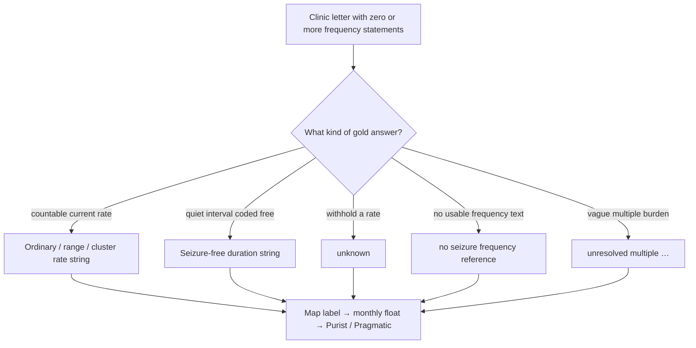

# Gan 2026 gold-label task taxonomy

Date: 2026-08-06  
Status: gold-label framework (no model performance cuts)  
Parent: [task-shape framework](../shared/task_shape_framework_2026-08-06.md)  
Artifact: [`experiments/gan2026_gold_task_taxonomy_20260806.json`](../../experiments/gan2026_gold_task_taxonomy_20260806.json)  
Regenerator: `python scripts/build_gold_task_taxonomy_inventories.py`

## Broad shape of the Gan task

Gan asks one question of each letter:

> What is the patient’s **current** seizure frequency?

Gold answers with **exactly one** canonical label string. Scoring then maps that
string to a monthly rate and into Purist (fine) or Pragmatic (coarse)
categories. Competing true numbers in the note do not yield multiple gold
answers; something must pick a winner
([policy catalog Part A](../shared/clinical_selection_policy_catalog_2026-07-31.md);
teaching case
[TEACH-GAN-01](../../architecture/teaching_cases/gan2026.md)).

### What one row is asking the system to do

For every letter the system must:

1. **Find** frequency-relevant evidence (rates, free intervals, absences).
2. **Interpret** dialect (ranges, clusters, “multiple”, dates, windows).
3. **Select** the single current winner under Gan gold conventions.
4. **Render** the exact scorer-facing string shape.
5. **Survive** Purist banding (strict) or Pragmatic banding (coarser).

Steps 1–2 are shared with ordinary clinical reading. Steps 3–4 are where Gan
becomes a benchmark rather than a summary.

## Gold categories (from labels only)

Semantic kind comes from the package normalizer
(`FrequencyLabelKind`). Label-shape buckets further split ordinary rates.
Counts below are full synthetic 1,500 unless noted; splits are stratified and
preserve the same shape (see artifact `validation` / `test`).

### Semantic kinds

| Kind | n | Share | What the row is asking |
| --- | ---: | ---: | --- |
| `frequency` | 937 | 62.5% | Emit a countable current rate in Gan dialect |
| `seizure_free` | 223 | 14.9% | Emit a seizure-free duration label (monthly 0) |
| `unknown` | 200 | 13.3% | Withhold a rate; answer `unknown` (or close forms) |
| `unresolved_multiple` | 86 | 5.7% | Vague “multiple per …” burden → sentinel band |
| `no_reference` | 54 | 3.6% | Assert that the letter has no usable frequency reference |

Scorer sentinel band `monthly == 1000` collapses unknown + unresolved multiple
+ no_reference → Purist/Pragmatic `seizure_freq_unknown` (**340 / 22.7%**).

### A-priori label-shape buckets

These are regenerable partitions of the gold string (and kind). They are the
primary Gan lenses for later x / y / z cuts.

| Bucket | n | What is difficult about it |
| --- | ---: | --- |
| `ordinary_point_rate` | 616 | Least exotic: `N per unit` with a single point count |
| `seizure_free` | 223 | Duration phrasing; quiet interval vs still-active competing rates |
| `unknown_sentinel` | 200 | When to abstain vs code a countable but contested rate |
| `range_rate` | 191 | `N to M per unit` must survive mid-point / band mapping |
| `cluster_burden` | 130 | Cluster grammar (`N cluster per …, M per cluster`) |
| `unresolved_multiple` | 86 | “Multiple per week/day/…” is not an ordinary rate |
| `no_reference_sentinel` | 54 | Absence of evidence vs failed extraction |

Shape flags (overlapping; not mutually exclusive): `has_per` 1044; word
`multiple` 277; range `to` 255; cluster 151; exact `unknown` 179;
`no seizure frequency reference` 54. Quote-quality `row_ok=False`: 65.

### Boundary bands (scorer geometry)

| Band | n |
| --- | ---: |
| `band_weekly` | 347 |
| `band_unknown` | 340 |
| `band_monthly` | 283 |
| `band_zero` | 223 |
| `band_submonthly` | 179 |
| `band_daily` | 128 |

Use bands when comparing rate-window difficulty; use semantic kinds / shape
buckets when comparing abstention and representation.

### Split stability (same lenses)

| Bucket | train300 | dev750 | test450 |
| --- | ---: | ---: | ---: |
| ordinary_point_rate | 122 | 312 | 182 |
| seizure_free | 44 | 112 | 67 |
| unknown_sentinel | 40 | 100 | 60 |
| range_rate | 41 | 92 | 58 |
| cluster_burden | 25 | 64 | 41 |
| unresolved_multiple | 17 | 43 | 26 |
| no_reference_sentinel | 11 | 27 | 16 |

The holdout is sealed for row inspection; these are aggregate stratum counts
only.

## Why each bucket is hard for LLMs vs rules

| Bucket | Why hard for an LLM | Why hard for rules |
| --- | --- | --- |
| Ordinary point rate | Usually easy if the note has one clear rate; still fails when a second true number is more salient | Easy when patterns match; fails on paraphrases and unusual units |
| Range rate | Must keep both ends and the unit; format repair can collapse the meaning | Pattern coverage; mid-point / band edge cases |
| Cluster burden | Dialect is arbitrary relative to clinical paraphrase ([Decision 0005](../../decisions/0005-benchmark-format-rules-vs-llm-clinical-reasoning.md)) | Needs explicit cluster grammar; easy to under- or over-match |
| Seizure-free | Competing “still having rare events” vs “free since …” | Duration templates vs nearby active-rate phrases |
| Unknown | Clinical caution vs gold that sometimes wants a rate (A2) or sometimes forbids it (A3) | Hard to encode soft epileptic-status judgments as regex |
| Unresolved multiple | Temptation to invent `N` or map to a weekly band | “Multiple” is intentionally not a numeric rate |
| No reference | Over-extraction of tangential counts (drug frequency, historical totals) | Must prove absence; silence is easy to mistake for miss |

Selection difficulty (policies A1, A4, and peers) cuts **across** rate buckets:
ordinary rates can still be hard when the letter contains two countable truths.
That cross-cutting axis is not a separate gold field; it is a property of the
note relative to the single winner. Later model analysis should keep it as a
secondary lens (policy-tagged development examples), not pretend it is a
prevalence column.

## Measured three-method competence (`dev750`)

Owner: [category-cut performance](../shared/six_model_category_cut_performance_2026-08-06.md).
Lenses differ sharply by surface.

| Surface | x / high | y / mid | z / floor |
| --- | --- | --- | --- |
| **rules** | all buckets except `unknown_sentinel` (high) | `unknown_sentinel` (mid) | none |
| **llm** | `unresolved_multiple` only | unknown, range, seizure-free, no-reference | **`ordinary_point_rate`**, **`cluster_burden`** (strict z) |
| **llm_with_rules** | seizure-free, range, no-reference, unresolved multiple | ordinary rates, unknown, cluster | practical floor: cluster (no strict z) |

For `llm` and `llm_with_rules`, x/y/z retains its six-model meaning. The
independent rules system is already high on every bucket except
`unknown_sentinel`, which is mid; it is not a six-model band. Rules create
most of the hybrid surface’s easy mass, but that mass is already present in
the rules-only method.

## Claim boundary

- Gold inventory only; no predictions in the artifact.
- Buckets are descriptive partitions for analysis, not a change to gold or
  scorers.
- Locked test450 rows were not inspected; split counts come from the stratified
  manifest and loader.
- Do not cite this document as evidence that models succeed or fail on any
  bucket.

The later [phrase-variant inventory](../paper/gan_gold_phrase_variants_2026-08-13.md)
lists official source phrases behind development gold labels. It does not
change these buckets.
