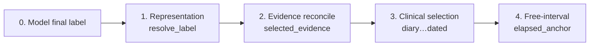
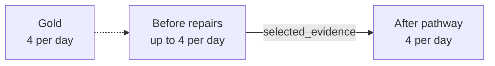
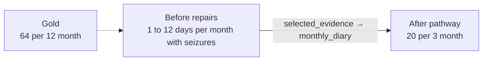
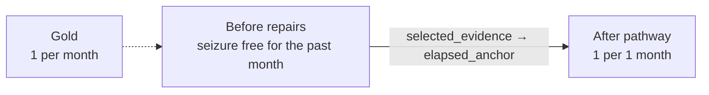

# Gan 2026 llm_with_rules stage ablation

Date: 2026-08-06  
Status: development stage ablation inside hybrid only  
Paper-library role: Gan component-attribution record; start with the [component deck](../artifacts/paper_source_component_roles_and_limits_2026-08-09.pptx)

Protocol: [hybrid stage ablation protocol](hybrid_stage_ablation_protocol_2026-08-06.md)  
Parent: [category error catalog](category_error_catalog_2026-08-06.md)  
Companions: [task-shape framework](../shared/task_shape_framework_2026-08-06.md), [architecture stage diagram](../../architecture/diagrams/gan2026_llm_with_rules_stages.md)  
Artifact: [`experiments/gan2026_hybrid_stage_ablation_20260806.json`](../../experiments/gan2026_hybrid_stage_ablation_20260806.json)

## Plain answer

Inside `llm_with_rules`, most label movement is not “rules as a blob.” On 4,482 replayable six-model cells:

1. **Evidence reconcile** is the mass first-changer (2925 of 3075 changed rows; 1402 first-rescues). On ordinary rates it lifts Purist from ~0.37 at resolve to ~0.72 mainly by clearing malformed / incomplete grammar.
2. **Clinical selection** then adds the next large lift (ordinary ~0.72 → ~0.85), led by `monthly_diary` (152 any-rescues, 28 any-harms). `breakthrough` is the next harm source; `dated_sequence`, `usual_interval`, and `residual_jerk` are mostly rescue-sided.
3. **Free-interval** (`elapsed_anchor`) is smaller but clean on seizure-free mass (54 any-rescues, 2 any-harms).
4. Residuals after the stack are mostly `final_wrong_after_repair` (439) plus a thin `final_wrong_no_repair` (94) band—selection/convention errors, not missing format cleanup.

## Why this document exists

The [category error catalog](category_error_catalog_2026-08-06.md) contrasts `llm` vs `llm_with_rules`. This sibling stays on hybrid only and splits the deterministic stack into bands and named repair families.

## Observable bands

No new calls. Saved `model_prediction.record` ledgers are replayed through the current normalize/resolve + ten repair families.

| Band | Stages | Role |
| --- | --- | --- |
| Representation | `normalize_events`, `resolve_label` | Render the model selection into a Gan label |
| Evidence reconcile | `repair.selected_evidence` | Rewrite the label from the quoted evidence span |
| Clinical selection | diary, usual, YTD, breakthrough, non-epileptic, jerk, burst, dated | Re-choose among ledger readings |
| Free-interval | `repair.elapsed_anchor` | Derive seizure-free windows from elapsed anchors |

Attribute a rescue or harm to the **first** stage that changes the Purist answer. Later fires are counted separately under any-rescue / any-harm.

## Four pathways that explain the stack

### A. Evidence reconcile cleans / rewrites the rate

Mass first-changer. Often grammar cleanup; often also the Purist rescue.

Row 10 / GPT-5.6 Sol. Bucket `ordinary_point_rate`; pathway effect `rescue`.

### B. Diary overrides after evidence

Second-stage clinical rewrite from month-by-month ledger counts.

Row 13627 / GPT-5.6 Sol. Bucket `ordinary_point_rate`; pathway effect `rescue`.

### C. Free-interval / dated clinical rewrite

Elapsed or dated-sequence families commit a window the resolve step left open.

Row 14765 / GPT-5.6 Sol. Bucket `ordinary_point_rate`; pathway effect `rescue`.

### D. Residual with no repair change

Many hybrid finals never rewrite after resolve; wrongs here are selection/convention residuals, not missing repair fires.
Pooled count: 1407.

## Band ablation by gold bucket

Pooled six-model row×model cells. Accuracy is Purist at the band endpoint. Mode Δ is wrong-mode count versus the previous band (negative means that wrong shape shrank).

### `ordinary_point_rate` (n=1867)

| Band | Acc | Top wrong modes | Mode Δ from previous |
| --- | ---: | --- | --- |
| Model final label | 0.37 | `other_malformed_or_unparsed` (483), `wrong_point_rate_selection` (284), `false_seizure_free` (104) | — |
| After resolve (representation) | 0.37 | `other_malformed_or_unparsed` (483), `wrong_point_rate_selection` (284), `false_seizure_free` (104) | `over_abstain_unknown` +5, `parse_or_call_failure` -5 |
| After evidence reconcile | 0.72 | `wrong_point_rate_selection` (156), `over_abstain_no_reference` (141), `false_seizure_free` (104) | `other_malformed_or_unparsed` -483, `over_abstain_no_reference` +141, `wrong_point_rate_selection` -128, `false_cluster_structure` -94, `false_range` -79, `false_multiple_word` -55 |
| After clinical selection repairs | 0.85 | `wrong_point_rate_selection` (121), `false_seizure_free` (73), `over_abstain_unknown` (24) | `over_abstain_no_reference` -119, `over_abstain_unknown` -46, `wrong_point_rate_selection` -35, `false_seizure_free` -31, `false_multiple_word` -14, `false_range` -1 |
| After free-interval / final | 0.88 | `wrong_point_rate_selection` (124), `over_abstain_unknown` (24), `over_abstain_no_reference` (20) | `false_seizure_free` -55, `wrong_point_rate_selection` +3, `over_abstain_no_reference` -2 |

### `cluster_burden` (n=381)

| Band | Acc | Top wrong modes | Mode Δ from previous |
| --- | ---: | --- | --- |
| Model final label | 0.02 | `incomplete_cluster_grammar` (239), `wrong_cluster_parameters` (86), `dropped_to_smooth_rate` (38) | — |
| After resolve (representation) | 0.02 | `incomplete_cluster_grammar` (239), `wrong_cluster_parameters` (86), `dropped_to_smooth_rate` (38) | `collapse_to_unknown` +1, `parse_or_call_failure` -1 |
| After evidence reconcile | 0.65 | `collapse_to_unknown` (75), `dropped_to_smooth_rate` (26), `wrong_cluster_parameters` (13) | `incomplete_cluster_grammar` -239, `wrong_cluster_parameters` -73, `collapse_to_unknown` +70, `collapse_to_no_reference` +12, `dropped_to_smooth_rate` -12, `false_seizure_free` +8 |
| After clinical selection repairs | 0.70 | `collapse_to_unknown` (54), `dropped_to_smooth_rate` (29), `wrong_cluster_parameters` (13) | `collapse_to_unknown` -21, `collapse_to_no_reference` -3, `dropped_to_smooth_rate` +3 |
| After free-interval / final | 0.70 | `collapse_to_unknown` (54), `dropped_to_smooth_rate` (29), `wrong_cluster_parameters` (13) | — |

### `seizure_free` (n=669)

| Band | Acc | Top wrong modes | Mode Δ from previous |
| --- | ---: | --- | --- |
| Model final label | 0.93 | `over_abstain_unknown` (24), `other_malformed_or_unparsed` (14), `over_abstain_no_reference` (4) | — |
| After resolve (representation) | 0.93 | `over_abstain_unknown` (24), `other_malformed_or_unparsed` (14), `over_abstain_no_reference` (4) | — |
| After evidence reconcile | 0.94 | `over_abstain_unknown` (21), `over_abstain_no_reference` (13), `false_active_rate` (5) | `other_malformed_or_unparsed` -14, `over_abstain_no_reference` +9, `over_abstain_unknown` -3, `false_active_rate` +2 |
| After clinical selection repairs | 0.96 | `over_abstain_no_reference` (12), `over_abstain_unknown` (12), `false_active_rate` (5) | `over_abstain_unknown` -9, `over_abstain_no_reference` -1 |
| After free-interval / final | 0.96 | `over_abstain_no_reference` (12), `over_abstain_unknown` (12), `false_active_rate` (5) | — |

### `range_rate` (n=550)

| Band | Acc | Top wrong modes | Mode Δ from previous |
| --- | ---: | --- | --- |
| Model final label | 0.56 | `wrong_range_bounds_or_band` (156), `false_cluster_structure` (30), `false_seizure_free` (16) | — |
| After resolve (representation) | 0.56 | `wrong_range_bounds_or_band` (156), `false_cluster_structure` (30), `false_seizure_free` (16) | — |
| After evidence reconcile | 0.84 | `over_abstain_no_reference` (32), `false_seizure_free` (16), `wrong_range_bounds_or_band` (11) | `wrong_range_bounds_or_band` -145, `over_abstain_no_reference` +32, `false_cluster_structure` -29, `other_malformed_or_unparsed` -12, `over_abstain_unknown` +8, `false_multiple_word` -7 |
| After clinical selection repairs | 0.93 | `over_abstain_no_reference` (11), `wrong_range_bounds_or_band` (9), `false_multiple_word` (6) | `over_abstain_no_reference` -21, `false_seizure_free` -11, `range_collapsed_to_point` -7, `over_abstain_unknown` -3, `wrong_range_bounds_or_band` -2, `false_multiple_word` -1 |
| After free-interval / final | 0.92 | `over_abstain_no_reference` (11), `wrong_range_bounds_or_band` (11), `false_multiple_word` (6) | `wrong_range_bounds_or_band` +2 |

### `unknown_sentinel` (n=598)

| Band | Acc | Top wrong modes | Mode Δ from previous |
| --- | ---: | --- | --- |
| Model final label | 0.45 | `false_active_rate` (144), `other_malformed_or_unparsed` (129), `false_seizure_free` (42) | — |
| After resolve (representation) | 0.47 | `false_active_rate` (145), `other_malformed_or_unparsed` (129), `false_seizure_free` (42) | `parse_or_call_failure` -14, `false_active_rate` +1 |
| After evidence reconcile | 0.83 | `false_active_rate` (61), `false_seizure_free` (43) | `other_malformed_or_unparsed` -129, `false_active_rate` -84, `false_seizure_free` +1 |
| After clinical selection repairs | 0.80 | `false_active_rate` (73), `false_seizure_free` (44) | `false_active_rate` +12, `false_seizure_free` +1 |
| After free-interval / final | 0.80 | `false_active_rate` (77), `false_seizure_free` (40) | `false_active_rate` +4, `false_seizure_free` -4 |

### `no_reference_sentinel` (n=160)

| Band | Acc | Top wrong modes | Mode Δ from previous |
| --- | ---: | --- | --- |
| Model final label | 0.55 | `parse_or_call_failure` (69), `false_active_rate` (2), `false_seizure_free` (1) | — |
| After resolve (representation) | 0.98 | `false_active_rate` (2), `false_seizure_free` (1) | `parse_or_call_failure` -69 |
| After evidence reconcile | 0.99 | `false_seizure_free` (1) | `false_active_rate` -2 |
| After clinical selection repairs | 0.99 | `false_seizure_free` (1) | — |
| After free-interval / final | 0.99 | `false_seizure_free` (1) | — |

### `unresolved_multiple` (n=257)

| Band | Acc | Top wrong modes | Mode Δ from previous |
| --- | ---: | --- | --- |
| Model final label | 0.47 | `false_resolved_rate` (111), `other_malformed_or_unparsed` (22), `false_seizure_free` (2) | — |
| After resolve (representation) | 0.47 | `false_resolved_rate` (111), `other_malformed_or_unparsed` (22), `false_seizure_free` (2) | `parse_or_call_failure` -1 |
| After evidence reconcile | 0.96 | `false_resolved_rate` (7), `false_seizure_free` (2) | `false_resolved_rate` -104, `other_malformed_or_unparsed` -22 |
| After clinical selection repairs | 0.98 | `false_resolved_rate` (3), `false_seizure_free` (1) | `false_resolved_rate` -4, `false_seizure_free` -1 |
| After free-interval / final | 0.98 | `false_resolved_rate` (3), `false_seizure_free` (1) | — |

## First-changer family ledger

Counts are pooled six-model repair hops on replayable rows. **First-changer** = earliest repair that changed the label. **Any-rescue / any-harm** count every hop, so later families are not hidden behind `selected_evidence`.

| Stage | Band | Fires | First | Rescue | Harm | Any+ | Any- |
| --- | --- | ---: | ---: | ---: | ---: | ---: | ---: |
| `repair.selected_evidence` | evidence_reconcile | 2925 | 2925 | 1402 | 7 | 1402 | 7 |
| `repair.monthly_diary` | clinical_selection | 321 | 99 | 60 | 7 | 152 | 28 |
| `repair.usual_interval` | clinical_selection | 33 | 7 | 7 | 0 | 32 | 0 |
| `repair.typical_over_ytd` | clinical_selection | 2 | 0 | 0 | 0 | 2 | 0 |
| `repair.breakthrough` | clinical_selection | 61 | 8 | 3 | 4 | 45 | 10 |
| `repair.non_epileptic` | clinical_selection | 11 | 10 | 9 | 1 | 10 | 1 |
| `repair.residual_jerk` | clinical_selection | 50 | 7 | 4 | 0 | 45 | 0 |
| `repair.post_change_burst` | clinical_selection | 21 | 2 | 1 | 0 | 19 | 0 |
| `repair.dated_sequence` | clinical_selection | 60 | 7 | 6 | 0 | 49 | 1 |
| `repair.elapsed_anchor` | free_interval | 63 | 10 | 9 | 0 | 54 | 2 |

### Band-level first-changer share

| Band | First-changer rows |
| --- | ---: |
| `evidence_reconcile` | 2925 |
| `clinical_selection` | 140 |
| `free_interval` | 10 |

### Family notes worth remembering

#### `repair.selected_evidence`

Fires 2925; first-changer 2925 (rescue 1402, harm 7); any-rescue 1402, any-harm 7. First-changer homes: `ordinary_point_rate` 1233, `seizure_free` 547, `cluster_burden` 362, `range_rate` 319.
- Rescue example: row 10 / GPT-5.6 Sol: `up to 4 per day` → `4 per day` (gold `4 per day`).
- Harm example: row 16203 / GPT-5.6 Luna: `1 to 5 per month` → `8 per 2 month` (gold `9 per 3 month`).

#### `repair.monthly_diary`

Fires 321; first-changer 99 (rescue 60, harm 7); any-rescue 152, any-harm 28. First-changer homes: `ordinary_point_rate` 98, `seizure_free` 1.
- Rescue example: row 14562 / GPT-5.6 Sol: `no seizure frequency reference` → `5 per 7 month` (gold `3 per 6 month`).
- Harm example: row 16091 / GPT-5.6 Sol: `3 per 3 month` → `1 per 2 month` (gold `3 per 3 month`).

#### `repair.usual_interval`

Fires 33; first-changer 7 (rescue 7, harm 0); any-rescue 32, any-harm 0. First-changer homes: `ordinary_point_rate` 4, `range_rate` 2, `unresolved_multiple` 1.
- Rescue example: row 16408 / GPT-5.6 Sol: `1 per day` → `1 per 3 day` (gold `1 per 3 day`).

#### `repair.typical_over_ytd`

Fires 2; first-changer 0 (rescue 0, harm 0); any-rescue 2, any-harm 0. First-changer homes: —.
- Rescue example: row 2748 / GPT-5.6 Luna: `7 per 10 month` → `1 per month` (gold `1 per month`).

#### `repair.breakthrough`

Fires 61; first-changer 8 (rescue 3, harm 4); any-rescue 45, any-harm 10. First-changer homes: `ordinary_point_rate` 4, `unknown_sentinel` 4.
- Rescue example: row 13051 / GPT-5.6 Sol: `unknown` → `2 per 8 month` (gold `2 per 8 month`).
- Harm example: row 10542 / GPT-5.6 Sol: `no seizure frequency reference` → `2 to 4 per 3 month` (gold `unknown, 2 to 4 per cluster`).

#### `repair.non_epileptic`

Fires 11; first-changer 10 (rescue 9, harm 1); any-rescue 10, any-harm 1. First-changer homes: `seizure_free` 9, `unknown_sentinel` 1.
- Rescue example: row 13843 / GPT-5.6 Sol: `unknown` → `seizure free for multiple year` (gold `seizure free for multiple month`).
- Harm example: row 11259 / DeepSeek V4 Flash: `unknown` → `seizure free for multiple year` (gold `unknown`).

#### `repair.residual_jerk`

Fires 50; first-changer 7 (rescue 4, harm 0); any-rescue 45, any-harm 0. First-changer homes: `range_rate` 5, `cluster_burden` 2.
- Rescue example: row 15094 / GPT-5.6 Sol: `no seizure frequency reference` → `3 per 13 month` (gold `4 per 13 month`).

#### `repair.post_change_burst`

Fires 21; first-changer 2 (rescue 1, harm 0); any-rescue 19, any-harm 0. First-changer homes: `ordinary_point_rate` 2.
- Rescue example: row 14383 / GPT-5.6 Sol: `seizure free for multiple year` → `3 to 4 per 3 month` (gold `3 to 4 per 3 month`).

#### `repair.dated_sequence`

Fires 60; first-changer 7 (rescue 6, harm 0); any-rescue 49, any-harm 1. First-changer homes: `ordinary_point_rate` 6, `range_rate` 1.
- Rescue example: row 14530 / GPT-5.6 Sol: `2 per 3 month` → `2 per 2 month` (gold `2 per 2 month`).
- Harm example: row 17200 / Qwen 3.6:35B: `1 per month` → `1 per 6 month` (gold `1 per month`).

#### `repair.elapsed_anchor`

Fires 63; first-changer 10 (rescue 9, harm 0); any-rescue 54, any-harm 2. First-changer homes: `ordinary_point_rate` 9, `unknown_sentinel` 1.
- Rescue example: row 14765 / GPT-5.6 Sol: `seizure free for multiple year` → `1 per 1 month` (gold `1 per month`).
- Harm example: row 15108 / GPT-5.6 Sol: `2 to 3 per 12 month` → `2 to 3 per 15 month` (gold `3 to 4 per 15 month`).

## Residual ownership after the full stack

| Outcome | Count |
| --- | ---: |
| `final_correct_after_repair` | 2636 |
| `final_correct_no_repair` | 1313 |
| `final_wrong_after_repair` | 439 |
| `final_wrong_no_repair` | 94 |

Most hybrid competence is already present at resolve or created by `selected_evidence`. The hard remainder is dominated by rows with no repair rewrite, or repairs that reshape without clearing the selection/convention error.

## Top pathways

| Pathway | Count |
| --- | ---: |
| `selected_evidence` | 2463 |
| `no_repair_change` | 1407 |
| `selected_evidence → monthly_diary` | 214 |
| `monthly_diary` | 99 |
| `selected_evidence → breakthrough` | 51 |
| `selected_evidence → elapsed_anchor` | 51 |
| `selected_evidence → dated_sequence` | 45 |
| `selected_evidence → residual_jerk` | 43 |
| `selected_evidence → usual_interval` | 26 |
| `selected_evidence → post_change_burst` | 19 |

## How to explore further

| Need | Where |
| --- | --- |
| Band mode tables and family examples | JSON artifact |
| llm vs hybrid mode catalog | [category error catalog](category_error_catalog_2026-08-06.md) |
| Stage ownership definitions | [llm_with_rules stages](../../architecture/diagrams/gan2026_llm_with_rules_stages.md) |
| Regenerate | `python scripts/build_gan2026_hybrid_stage_ablation.py` |

## Method

- Split: Gan `dev750`. Surface: `llm_with_rules` only.
- Replay input: `row_trace.model_prediction.record` + prompt note text.
- Baseline: post-`resolve_label`; then ten repair families in manifest order.
- Wrongness: Purist false. Modes: same predicted-shape vocabulary as the parent catalog.
- Attribution: first label-changing repair is the first-changer; any-rescue/harm count later hops too.
- Fidelity on replayable rows: historical after-label exact 0.975; floors-panel exact 0.812; floors-panel Purist agreement 0.913.

## Claim boundary

- Development Gan `llm_with_rules` stage ablation on `dev750`.
- Ordered current-code replay of saved ledgers, not a factorial leave-one-family-out experiment.
- Not a replacement for parent-catalog floors-panel aggregate scores.
- Not sealed holdout competence.
