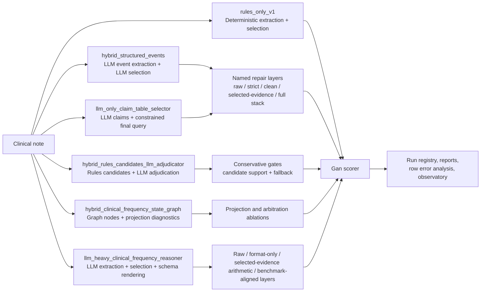
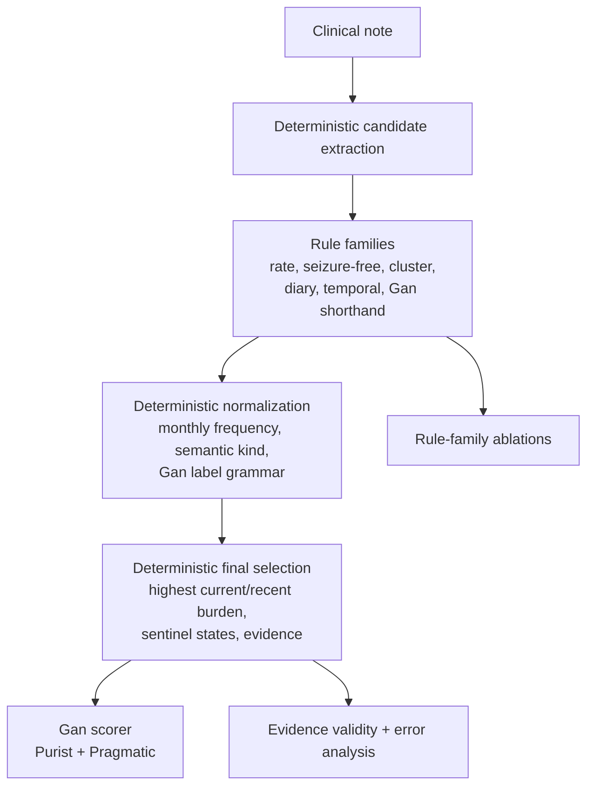
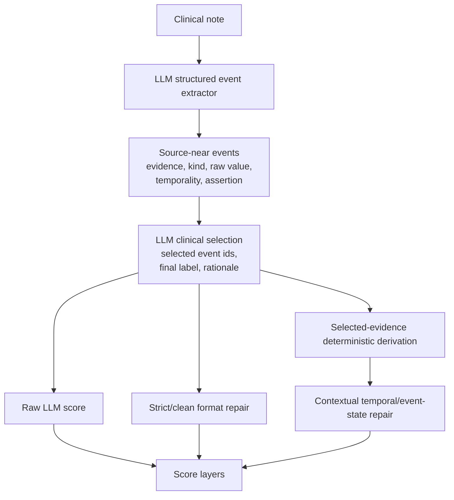
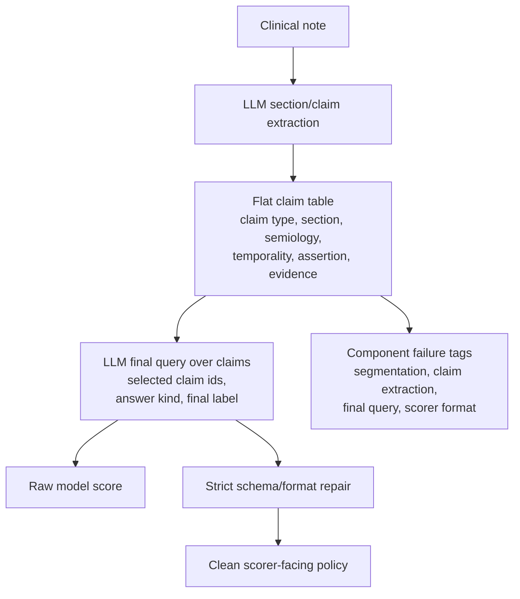
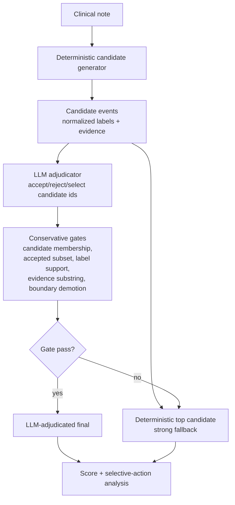
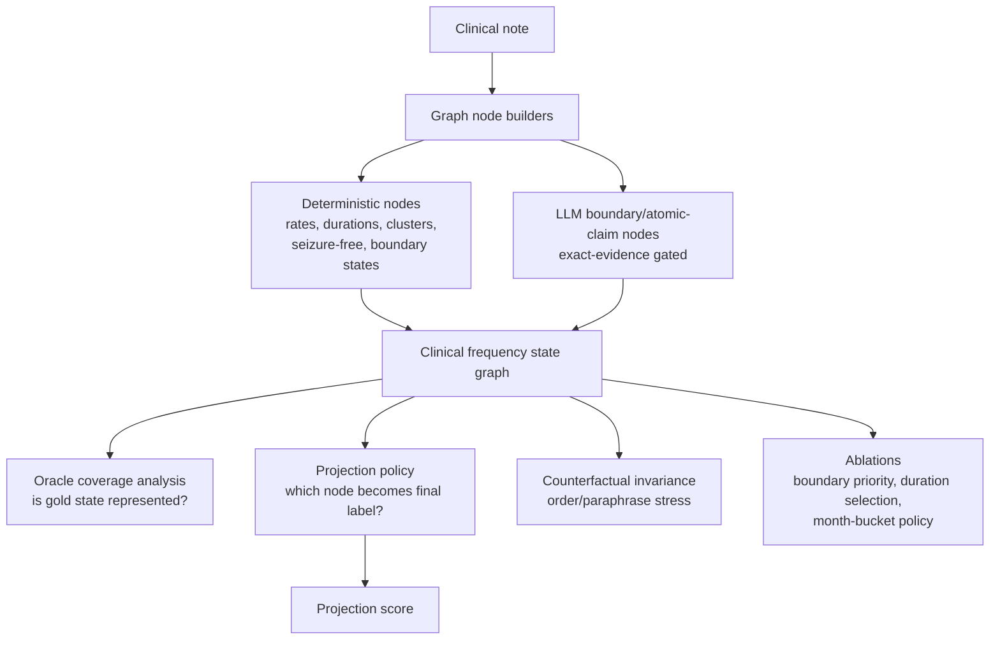
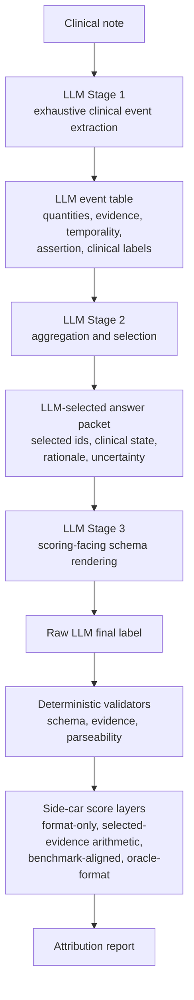

# Gan 2026 Full Research Retrospective

Date: 2026-06-02

Scope: current Gan 2026 seizure-frequency research state across
`rules_only_v1`, `hybrid_structured_events`,
`llm_only_claim_table_selector`, `hybrid_rules_candidates_llm_adjudicator`,
`hybrid_clinical_frequency_state_graph`, and
`llm_heavy_clinical_frequency_reasoner`.

This is a research retrospective, not a benchmark-comparison claim. Validation
results are development evidence under `gan2026_split_v1`; locked-test results
are aggregate/frozen-audit context only and must not be used for row-level
tuning.

## Executive Synthesis

The project is materially closer to its core research goals, but not because one
architecture has simply "solved" Gan 2026. The clearest finding is that seizure
frequency extraction is a multi-stage clinical state problem: source evidence,
temporality, assertion, seizure-free intervals, clusters, diary windows,
competing semiologies, underdetermined frequency, and benchmark-facing label
grammar all have to be represented separately before the final Gan label is
safe.

The work has produced three kinds of progress:

1. A strong transparent comparator: `rules_only_v1` reaches 697/750 = 0.9293
   Purist and 704/750 = 0.9387 Pragmatic on validation, with exact selected
   evidence on every row. It also drops to about 0.7600 Purist and 0.7867
   Pragmatic on locked test, showing that validation strength alone is not a
   generalisation claim.
2. A disciplined attribution story: structured LLM and claim-table experiments
   showed useful source-near extraction, but also exposed attribution drift.
   The threshold-passing structured-events result, 675/750 = 0.9000 Purist, is
   repair-heavy hybrid behavior rather than clean LLM-first behavior.
3. A better research substrate: the state-graph cycle separates coverage,
   projection, boundary-state node construction, invariance, and arbitration.
   Validation50 oracle coverage is 47/50 and projection Purist/Pragmatic F1 is
   0.9600; validation hard-slice oracle coverage is 219/250 with projection
   Purist F1 0.9160. The system is now set up to ask sharper component
   questions instead of chasing another broad aggregate validation score.

The main negative result is equally important: changing the surface architecture
does not by itself remove the generalization gap. Rules-only, claim-table,
structured-events, and hybrid adjudicator variants all encounter hidden
subfamilies in template, temporal anchoring, cluster notation, seizure-free
boundary language, and distributed counts. The next research leap is not another
prompt patch; it is proving which component owns each clinical decision and
whether that ownership transfers beyond the validation surface.

## Core Research Goals Revisited

The contribution thesis asks for a modular, auditable clinical extraction system
where deterministic rules and LLM reasoning are explicit, testable components.
Against that thesis, we are in a stronger position than the raw metrics alone
suggest.

| Goal | Current state | Progress |
| --- | --- | --- |
| Modular breadth and depth | The Gan 2026 package is organized into `contract`, `deterministic`, `selected_evidence`, `llm`, `hybrid`, `state_graph`, `reports`, `experiments`, `artifact_analysis`, `observatory`, and `cli` ownership areas. | Strong. The seizure-frequency task is no longer a pile of one-off scripts. |
| Generalisation by design | Split protocol is locked; validation/test distinction is explicit; saturated validation has pushed work toward hard slices, synthetic panels, and frozen audits. | Medium-strong. We have evidence of the gap and better tools to study it, but not yet a generalizing final model. |
| Transparency through evidence and error analysis | Every major family now emits score layers, evidence validity summaries, repair metadata, and row/error artifacts. State graph exposes representability and projection separately. | Strong. This may be the strongest achieved contribution so far. |
| Deterministic rules as controlled variables | Deterministic V1 is frozen; rule families are catalogued and ablated; post-LLM repair is now named rather than hidden. | Strong, with a caveat: some early LLM repair work became too semantic before the audit forced a cleaner taxonomy. |
| LLM reasoning as an explicit component | Claim-table, structured-events, adjudicator, boundary-node builder, and LLM-heavy reasoner all test different LLM roles. | Medium. LLMs are useful for evidence/claim generation, but clean LLM-owned final-label performance remains below the target. |

## Architecture Map

The most important architectural lesson is that a final Gan label is too lossy
to be the only representation. Every successful or instructive branch has moved
toward richer intermediate objects: candidate events, claim tables, adjudication
records, graph nodes, selected evidence, and repair-mode metadata.

## Performance Summary

| Family | Best/current surface | Result | Interpretation |
| --- | --- | ---: | --- |
| `rules_only_v1` | validation750 | 697/750 Purist = 0.9293; 704/750 Pragmatic = 0.9387 | Strongest transparent validation comparator. |
| `rules_only_v1` | locked test450 | about 343/450 Purist = 0.7622 by rerun; original report 0.7600; 354/450 Pragmatic = 0.7867 | Generalization gap is decisive. |
| `hybrid_structured_events` v0.5 full stack | validation750 | 675/750 Purist = 0.9000; 690/750 Pragmatic = 0.9200 | Hits threshold only as repair-heavy hybrid behavior. |
| Structured-events clean attribution | 650-row saved-output replay | raw 394/650 = 0.6062; clean 438/650 = 0.6738 | Clean LLM-first endpoint remains well below target. |
| `llm_only_claim_table_selector` v4 | validation250 then validation750 | 231/250 clean Purist, then 528/750 clean Purist | Prefix optimism; full-validation collapse. |
| `llm_only_claim_table_selector` v5 | validation250 then test450 | 227/250 clean Purist; 301/450 clean Purist | Useful complementarity, not reliable replacement. |
| `hybrid_rules_candidates_llm_adjudicator` v0.1 | validation750 | 680/750 Purist, 689/750 Pragmatic | Good decomposition; LLM regressed more deterministic-correct rows than it fixed. |
| Hybrid v0.2 `cluster_diary_candidate_recall` | validation750 | 677/750 Purist; 686/750 Pragmatic | Underperformed deterministic top despite stronger hard-case recall. |
| Hybrid v0.2 `cluster_diary_candidate_recall` | locked test450 frozen audit | 343/450 Purist; 353/450 Pragmatic | Tied deterministic Purist, slightly worse Pragmatic; no promotion. |
| `hybrid_clinical_frequency_state_graph` diagnostics | validation50 | 47/50 oracle coverage; 0.9600 projection Purist/Pragmatic F1 | Promising diagnostic substrate, not a final benchmark result. |
| State graph hard-slice union | validation hard-slice 250 | 219/250 oracle coverage; 0.9160 projection Purist F1 | Coverage and projection are now measurable separately. |
| `llm_heavy_clinical_frequency_reasoner` v0 | validation25 smoke | 24/25 schema-valid; 18/25 selected evidence exact; raw scorable 0/25; selected-evidence arithmetic 23/25 | Useful evidence selection, but fails LLM-heavy Stage A. |
| `llm_heavy_clinical_frequency_reasoner` v1 | validation50 then validation250 | validation50: 50/50 structured, 48/50 selected evidence exact, raw Purist 41/50; validation250: 237/250 structured, raw Purist 188/250, selected-evidence arithmetic 219/250 | Output contract improved; validation250 rejects promotion because the best layer remains attribution-diagnostic. |

## 1. `rules_only_v1`

### Architecture

### Why This Architecture

The initial rules-only system was the fastest way to make the task concrete. It
forced the repo to define label parsing, source evidence, row quality,
normalization, final selection, and scoring contracts. It also made deterministic
logic scientifically inspectable rather than incidental.

The rule families now have research meaning:

- portable rate expressions;
- seizure-free/no-event assertions;
- cluster arithmetic;
- diary/log aggregation;
- temporal selection;
- Gan shorthand;
- benchmark-facing format repair.

### What We Did

We built deterministic extraction and final selection, then froze it as
`rules_only_v1`. We ran validation, locked holdout, error analysis, and
rule-family ablations. The rule catalogue and architecture docs now treat rules
as categorized, testable components.

Key validation ablation findings:

| Disabled group | Purist | Delta |
| --- | ---: | ---: |
| none | 0.9293 | baseline |
| portable rate expressions | 0.7627 | -0.1666 |
| temporal selection | 0.7787 | -0.1506 |
| seizure-free/no-event assertions | 0.8107 | -0.1186 |
| diary log aggregation | 0.8507 | -0.0786 |
| cluster arithmetic | 0.8600 | -0.0693 |
| Gan shorthand | 0.9027 | -0.0266 |
| benchmark repair | 0.9293 | 0.0000 |

### Performance And Lessons

The system is excellent on validation and perfectly evidence-exact on both
validation and test. But the locked-test drop is the defining warning. Evidence
exactness is necessary but not sufficient: the hard operation is converting a
span into a current clinical state under multiple windows, semiologies,
clusters, and boundary states.

Rules-only taught us that high validation F1 can be achieved transparently, but
it also taught us that a local rule stack can become brittle. The right role for
`rules_only_v1` is frozen comparator, diagnostic substrate, and ablation control,
not endlessly tuned production policy.

## 2. `hybrid_structured_events`

### Architecture

### Why This Architecture

The direct note-to-label approach asked too much of one model pass. Structured
events were introduced to preserve source-near clinical facts before final
selection. This matched the thesis: store intermediate events, not just final
predictions.

### What We Did

We moved from direct label prompting to a slim event schema, added a general LLM
experiment CLI, used cache-first runs and saved-output replay, separated
schema-repair from normalization, and eventually built attribution ladders for
raw, strict, clean, selected-evidence-derived, and full-stack scoring.

The turning point was the repair audit. The 750-row v0.5 completion reached the
0.9000 validation target, but it carried 481 deterministic repair notes and
714/750 exact selected-evidence substrings. The grouped 650-row ladder clarified
where performance came from:

| Layer group | Purist | Interpretation |
| --- | ---: | --- |
| Raw structured LLM selection | 394/650 = 0.6062 | Model's own final label. |
| Clean scorer-facing normalization | 438/650 = 0.6738 | Clean LLM-first endpoint. |
| Broad basic label repair bridge | 461/650 = 0.7092 | Crosses into semantic repair. |
| Selected-evidence deterministic derivation | 546/650 = 0.8400 | Main metric jump. |
| Contextual temporal/event-state modules | 588/650 = 0.9046 | Full hybrid stack. |

### Performance And Lessons

Structured-events is valuable because the LLM often finds useful evidence and
intermediate events. It is not yet strong as a clean LLM-first final-label
system. The largest performance movement came after deterministic derivation
over model-selected evidence, which means the high score is a hybrid result.

The central lesson is attribution discipline: selected evidence is not a magic
safe boundary. If deterministic code derives a better label from the evidence
than the model emitted, that deterministic derivation is prediction-bearing and
must be named, ablated, and claimed honestly.

## 3. `llm_only_claim_table_selector`

### Architecture

### Why This Architecture

The claim-table branch tested a more LLM-native representation than event
normalization. Instead of asking the model to directly solve arithmetic and
selection inside one final answer, it first produced a source-near table of
claims, then answered from that table. This made segmentation, claim extraction,
temporality, final query, and scorer formatting separately inspectable.

### What We Did

We developed v3/v4 claim tables, then v5 with more explicit constrained selector
state, cluster-axis fields, and boundary-state fields. We added component
ablation and component-failure reports. The architecture initially looked strong
on validation prefixes:

- v4 clean validation250: 231/250 = 0.9240 Purist.
- v5 clean validation250: 227/250 = 0.9080 Purist.

But broad surfaces exposed the instability:

- v4 clean validation750: 528/750 = 0.7040 Purist and 577/750 = 0.7693
  Pragmatic.
- v5 clean test450: 301/450 = 0.6689 Purist, with 445/450 structured records.

### Performance And Lessons

Claim tables are transparent and complementary, but not yet reliable. On test,
v5 correctly classified 61 rows that deterministic V1 missed, while
deterministic V1 correctly classified 103 rows that v5 missed. That is a strong
signal for ensemble or hybrid arbitration, but a weak signal for replacement.

The failure modes were meaningful:

- claim extraction failures rose from 9/250 on validation250 to 61/450 on test;
- final-query failures rose from 4/250 to 32/450;
- scorer-format failures rose from 8/250 to 39/450;
- selected final evidence exactness dropped from 246/250 to 418/450.

The lesson is that source-near claim tables help transparency, but the final
Gan query still collapses too much clinical state unless cluster axes,
boundary-state decisions, and denominator policy are handled explicitly.

## 4. `hybrid_rules_candidates_llm_adjudicator`

### Architecture

### Why This Architecture

This family tested a pragmatic hybrid thesis: deterministic rules are good at
high-recall candidate retrieval, while an LLM may be better at semantic
adjudication among candidates. The v0.2 design made deterministic top the
fallback and allowed LLM changes only through named overreach gates.

### What We Did

We first ran v0.1 over deterministic candidates. It cleared broad validation
numerically after schema replay, but underperformed deterministic top:

- validation750 LLM adjudicator: 680/750 = 0.9067 Purist;
- deterministic top on same rows: 697/750 = 0.9293;
- LLM corrected 7 deterministic misses but regressed 24 deterministic-correct
  rows.

We then built v0.2 conservative gates and saturated-surface analysis. The v0.2
validation250 result was not a promotion:

- deterministic top: 246/250 Purist;
- gated adjudicator: 244/250 Purist;
- deterministic-wrong to gated-correct: 0;
- deterministic-correct to gated-wrong: 2.

Synthetic hard-case stress then identified a candidate-recall problem. The
named `cluster_diary_candidate_recall` revision improved the 56-row synthetic
panel:

- baseline synthetic gated Purist: 42/56;
- cluster/diary revision gated Purist: 50/56;
- raw wrong-to-correct: 13;
- raw correct-to-wrong: 0.

We froze that revision for a comparator-only generalization audit.

### Performance And Lessons

The broad audit showed the revision did not generalize:

| Surface | Condition | Purist | Pragmatic | Changed labels | Wrong to correct | Correct to wrong |
| --- | --- | ---: | ---: | ---: | ---: | ---: |
| validation750 | deterministic top | 697/750 | 704/750 | 0 | 0 | 0 |
| validation750 | gated final | 677/750 | 686/750 | 45 | 5 | 25 |
| test450 | deterministic top | 343/450 | 354/450 | 0 | 0 | 0 |
| test450 | gated final | 343/450 | 353/450 | 29 | 9 | 9 |

Candidate recall became the hard ceiling:

| Split | Candidate Purist recall | No-recall rows | No-recall rows fixed by gated final |
| --- | ---: | ---: | ---: |
| validation750 | 707/750 = 0.9427 | 43 | 0 |
| test450 | 359/450 = 0.7978 | 91 | 0 |

The lesson is sharp: an adjudicator constrained to a candidate set cannot
recover rows where the correct category is absent. The LLM did contain signal,
especially raw test changes before gates, but current gates are blunt and
candidate recall is too low on shifted surfaces.

This result moved the project away from final-label prompt/gate tuning and
toward semantic-state graph diagnostics.

## 5. `hybrid_clinical_frequency_state_graph`

### Architecture

### Why This Architecture

The state graph is the most important architectural reframing so far. It stops
treating "did we emit the right final label?" as the only question. Instead, it
asks:

- Did the system represent the correct clinical state somewhere?
- Is the selected evidence exact?
- Did projection select the right represented state?
- Which boundary states are missing?
- Is the graph invariant to harmless note-order or paraphrase perturbations?

That separation directly supports the paper thesis. It gives us a substrate for
coverage, projection, and arbitration ablations, and it prevents node
construction improvements from being confused with scorer-policy changes.

### What We Did

We scaffolded deterministic graph diagnostics, reused saved LLM atomic-claim
outputs where appropriate, ran validation and synthetic diagnostics, reviewed
row families, built a hosted boundary-state graph-builder for unknown and
unresolved-multiple nodes, replayed accepted nodes, and ran projection
arbitration plus seizure-free duration ablations.

Key results:

- validation50 oracle coverage: 47/50;
- validation50 projection Purist/Pragmatic F1: 0.9600;
- validation hard-slice union oracle coverage: 219/250 = 0.876;
- validation hard-slice projection Purist F1: 0.9160;
- counterfactual order invariance: 1.0;
- counterfactual paraphrase invariance: 0.98;
- LLM atomic-claim conversion: 79/80 exact-evidence-certain nodes, with one
  non-exact claim downgraded.

The boundary-state builder then recovered useful missing coverage:

- validation31 produced 10/31 representability-gain candidates;
- synthetic unknown8 v1 produced 8/8 schema-valid, exact-evidence-valid unknown
  nodes;
- accepted-node replay recovered representability on all 10 validation gain
  rows, but unchanged projection exactly matched only 6/10 labels.

Seizure-free duration analysis separated node construction from projection:

- duration-node replay emitted 21/21 exact-evidence-valid nodes over 18 target
  rows;
- month-scale representability recovered on all 18 target rows;
- unchanged projection still recovered 0/18 exact duration labels.

Projection then became the bottleneck. The enriched projection replay found
`month_bucket_duration_selection` could recover 18/18 exact duration labels on
the target surface. A broader v0 ablation fixed those 18 target rows but caused
27 already-correct regressions. Gated v1 preserved the 18/18 target corrections
and reduced regression-panel changes to 4/232, with 0 already-correct and 0
frequency-with-seizure-free regressions. It remains revise-only pending a
broader enriched-node regression panel.

### Performance And Lessons

The state graph has not yet produced a promoted final production policy. That is
the right decision. Its contribution is stronger: it has localized the problem.
Coverage is promising; boundary nodes can be added with exact evidence;
duration-node construction can be fixed; projection and arbitration remain the
active bottleneck.

This family moves us closest to the core research goals because it keeps
clinical meaning rich until the final projection step. It also gives paper-grade
tables: oracle coverage, projection-only F1, invariance, boundary-node recall,
duration-node ablations, and regression panels.

## 6. `llm_heavy_clinical_frequency_reasoner`

### Architecture

### Why This Architecture

After the state-graph cycle became mostly deterministic, we needed a strong
LLM-driven alternative. The LLM-heavy protocol deliberately flips ownership:
the model owns extraction, normalization proposal, aggregation/selection, and
final schema rendering. Deterministic code validates, scores, and optionally
applies named benchmark-alignment adapters. If deterministic code changes the
selected event or clinical state, the result is no longer LLM-heavy.

### What We Did

We wrote the protocol, implemented and registered
`llm_heavy_clinical_frequency_reasoner_v0`, ran validation25 with GPT-4.1 mini,
then performed saved-output schema replay and row-level error analysis. After
that error analysis, we implemented v1 with a stricter output contract:

- `final_answer.selected_evidence` must equal one selected event evidence
  string rather than a concatenated rationale;
- prose clinical interpretation moves into `raw_clinical_summary`,
  `combined_rationale`, or `final_rationale`;
- `raw_llm_final_label` must be parser-ready, with explicit examples for
  inequalities, upper bounds, cluster modifiers, and seizure-free distractors;
- shape-only parser repair covers singleton enum lists and non-semantic aliases
  such as `vague_count=many`, `vague_count=several`, `vague_count=most days`,
  unsupported quantity units such as `hour`, and `raw_llm_final_kind` aliases
  such as `cluster_frequency -> frequency`.

Aggregate validation25 results:

| Layer | Scorable | Purist correct | Pragmatic correct |
| --- | ---: | ---: | ---: |
| raw LLM | 0/25 | 0/25 | 0/25 |
| format-only | 11/25 | 10/25 | 10/25 |
| selected-evidence arithmetic | 24/25 | 23/25 | 23/25 |
| benchmark-aligned | 24/25 | 13/25 | 13/25 |
| oracle-format upper bound | 11/25 | 10/25 | 10/25 |

Additional contract metrics:

- structured records after non-semantic schema replay: 24/25;
- event evidence exact: 42/47;
- selected evidence exact: 18/25;
- selected-event trace mismatches: 0/25;
- frozen deterministic V1 same-row Purist correct: 25/25.

The v1 validation ladder then produced:

| Surface | Structured | Parse/schema failures | Selected evidence exact | Raw/format-only Purist | Selected-evidence arithmetic Purist | Benchmark-aligned Purist |
| --- | ---: | ---: | ---: | ---: | ---: | ---: |
| validation50 | 50/50 | 0 | 48/50 | 41/50 | 48/50 | 45/50 |
| validation250 | 237/250 | 13 | 230/250 | 188/250 | 219/250 | 204/250 |

Validation50 passed the output-contract gate and justified a diagnostic
validation250 scale-up. Validation250 rejected promotion: the raw
prediction-bearing LLM label remained far below the target, while the stronger
selected-evidence arithmetic score still depended on deterministic derivation
over model-selected evidence.

### Performance And Lessons

The v0 reasoner fails the Stage A smoke gate. The model often identifies the
right evidence and selected event trace, but its raw final labels are not
parser-ready and final selected evidence is often a concatenation or paraphrase
rather than one exact source substring. V1 fixes much of this contract problem:
the 50-row gate was schema-clean and raw labels were usually scorable.

The high selected-evidence arithmetic score is promising but attribution-invalid
for LLM-heavy promotion: deterministic arithmetic over selected evidence is
doing the scoring work. The benchmark-alignment adapter also regressed 10 rows
relative to selected-evidence arithmetic, showing that broad Gan repair over raw
prose is unsafe for this architecture.

The validation250 result narrows the next revision target. It is no longer
enough to ask for parser-ready labels and exact selected evidence: v1 must be
audited for parse/schema tail failures, selected-event trace mismatches, and
raw-label mistakes relative to selected-evidence arithmetic. The evidence
selection signal remains useful, but the architecture has not yet shown that the
model can own final Gan label rendering cleanly at scale.

## Cross-Architecture Findings

### 1. Evidence Exactness Is Necessary But Not Sufficient

`rules_only_v1` has exact evidence on every validation and test row. Claim-table
and structured-events variants often have high evidence exactness too. Yet all
families show either validation-to-test gaps or clean-attribution weakness. The
hard part is not just finding text; it is choosing the correct clinical state
and benchmark-facing abstraction.

### 2. Candidate Recall Defines Hybrid Headroom

The hybrid adjudicator cannot fix rows where the correct candidate is absent.
On test, candidate Purist recall fell to 359/450 = 0.7978; every no-recall row
remained wrong after gated final. This makes candidate generation a scientific
object, not mere preprocessing.

### 3. Repair Layers Can Hide Prediction-Bearing Logic

Structured-events reached 0.9000 validation only after deterministic repair
families that changed semantic answers. The project learned to report raw,
strict, clean, selected-evidence-derived, benchmark-aligned, and full-stack
layers separately. This is now one of the strongest methodological safeguards
in the repo.

### 4. Validation Prefixes Are Often Too Friendly

Claim-table v4 went from 231/250 clean Purist to 528/750 clean Purist.
Structured-events v0.5 dropped from a very high validation250 replay to exactly
675/750 on full validation. Hybrid v0.2 looked strong on validation250 but did
not beat deterministic top on validation750 or test450. Prefixes are useful
development gates, not promotion proof.

### 5. Hidden Subfamilies Matter More Than Top-Level Label Mix

Validation and test label distributions are not wildly different at the top
level. The shift is inside categories: note template, temporal anchor, cluster
phrasing, diary arithmetic, seizure-free boundary language, vague frequency
claims, and competing semiologies. Future splits and hard panels should stratify
by these subfamilies, not only by gold kind.

### 6. LLMs Are Useful, But Their Best Current Role Is Not Settled

The evidence supports several possible LLM roles:

- source-near event extractor;
- claim-table builder;
- candidate adjudicator;
- boundary-state graph-node builder;
- LLM-heavy clinical reasoner.

So far, the strongest clean LLM-owned final-label result is not competitive with
the deterministic comparator. The most reliable LLM signal appears in
source-near extraction, selected evidence, claim decomposition, and targeted
boundary-node construction. The LLM-heavy track remains necessary because it
tests whether stronger prompting/schema discipline can make the model own more
of the clinical reasoning without hidden repair.

## How Much Closer Are We?

We are substantially closer to the research paper, but only partially closer to
a final generalizing system.

### Closer To The Paper

Very close. We now have:

- a frozen rules-only comparator with ablations;
- multiple LLM/hybrid architectures with named score layers;
- a documented attribution failure and repair taxonomy;
- a generalization-gap report across validation/test;
- state-graph diagnostics that separate coverage from projection;
- evidence-validity and schema-validity metrics;
- a run registry and observatory direction;
- conservative claim language around test and validation.

This is already a rich research story: clinical extraction systems can look
similar by aggregate F1 while differing radically in attribution, evidence
validity, and generalization risk.

### Closer To The Metric Goal

On validation, yes: we have reached or exceeded 0.9000 Purist on several
development surfaces. But the metric goal is now correctly understood as
conditional on attribution and generalization. A 0.9000 validation score is not
enough if it is repair-heavy, validation-overfit, or candidate-recall-limited.

### Closer To A Generalizing System

Moderately. The locked-test results remain sobering. The best frozen hybrid
audit ties deterministic Purist on test rather than improving it. Claim-table v5
underperforms deterministic V1 on test but has complementary correct rows. The
state graph is the best path toward generalization because it lets us measure
which clinical states are represented before projection collapses them into Gan
labels.

## Research Thesis As Of Now

The strongest current thesis is not "LLMs beat rules" or "rules are enough."
The strongest thesis is:

> Seizure-frequency extraction requires an auditable clinical-state
> representation. Deterministic rules, LLM extraction, and benchmark
> normalization can all improve performance, but they must be named by
> prediction-bearing role. Generalization depends less on the final model family
> label and more on whether the system preserves source-near evidence,
> temporal/boundary semantics, and component-level attribution until final
> projection.

This thesis is supported by the failures as much as by the successes.

## Recommended Next Steps

1. Keep `rules_only_v1` and hybrid v0.2 `cluster_diary_candidate_recall` frozen.
   Do not tune from locked-test behavior.
2. Continue the state-graph cycle with a broader enriched-node regression panel
   before promoting duration projection policy.
3. Review `llm_heavy_clinical_frequency_reasoner_v1` validation250 failure
   families before another LLM-heavy prompt revision. Do not escalate v1
   further: raw/format-only Purist is 188/250 and the stronger 219/250
   selected-evidence arithmetic layer is attribution-diagnostic only.
4. Treat claim-table v5 as a comparator/complementarity source, not a promoted
   candidate, until it passes a fresh 25/50/250 ladder with written decision
   criteria.
5. Design LLM-replacement ablations over state-graph nodes: deterministic graph
   only, LLM boundary nodes only, LLM atomic claims, deterministic projection,
   LLM projection, and oracle projection.
6. Build hard panels by hidden subfamily: clusters, seizure-free duration,
   unknown/no-reference boundary, diary aggregation, recent-window arithmetic,
   competing semiologies, no-call/reparse repair sensitivity, and template
   family.
7. Keep every future aggregate score paired with attribution layers: raw,
   format-only, selected-evidence arithmetic, benchmark-aligned, deterministic
   fallback, and full stack where applicable.

## Source Artifacts

Primary sources for this synthesis:

- `PROJECT_STATUS.md`
- `docs/research/contribution_thesis.md`
- `docs/design/architecture.md`
- `docs/design/gan2026_pipeline_v1.md`
- `docs/research/gan2026_current_pipeline_results_report_2026-06-01.md`
- `experiments/gan2026_generalization_gap_research_report_2026-06-02.md`
- `experiments/gan2026_llm_structured_decision_retrospective_2026-06-01.md`
- `experiments/gan2026_section_claim_table_validation750_v4_interpretation_2026-06-01.md`
- `experiments/gan2026_architecture_validation250_component_ablation_2026-06-01.md`
- `experiments/gan2026_arch2_validation750_v01_interpretation_2026-06-01.md`
- `experiments/gan2026_hybrid_adjudicator_v02_selective_action_report_2026-06-01.md`
- `experiments/gan2026_hybrid_rules_candidates_llm_adjudicator_validation750_gpt41mini_v02_cluster_diary_candidate_recall_live_2026-06-02.md`
- `experiments/gan2026_hybrid_rules_candidates_llm_adjudicator_test450_gpt41mini_v02_cluster_diary_candidate_recall_live_2026-06-02.md`
- `experiments/gan2026_clinical_frequency_state_graph_protocol_2026-06-02.md`
- `experiments/gan2026_clinical_frequency_state_graph_validation50_diagnostics_2026-06-02.md`
- `experiments/gan2026_hybrid_clinical_frequency_state_graph_projection_arbitration_ablation_2026-06-02.md`
- `experiments/gan2026_hybrid_clinical_frequency_state_graph_seizure_free_duration_node_replay_2026-06-02.md`
- `experiments/gan2026_state_graph_projection_ablation_month_bucket_duration_selection_v1_2026-06-02.md`
- `experiments/gan2026_llm_heavy_extraction_protocol_2026-06-02.md`
- `experiments/gan2026_llm_heavy_clinical_frequency_reasoner_v0_validation25_error_analysis_2026-06-02.md`
- `experiments/gan2026_llm_heavy_clinical_frequency_reasoner_validation50_gpt41mini_v1_2026-06-02.md`
- `experiments/gan2026_llm_heavy_clinical_frequency_reasoner_validation250_gpt41mini_v1_2026-06-02.md`
- `experiments/registry.jsonl`
- `experiments/RUN_INDEX.md`
