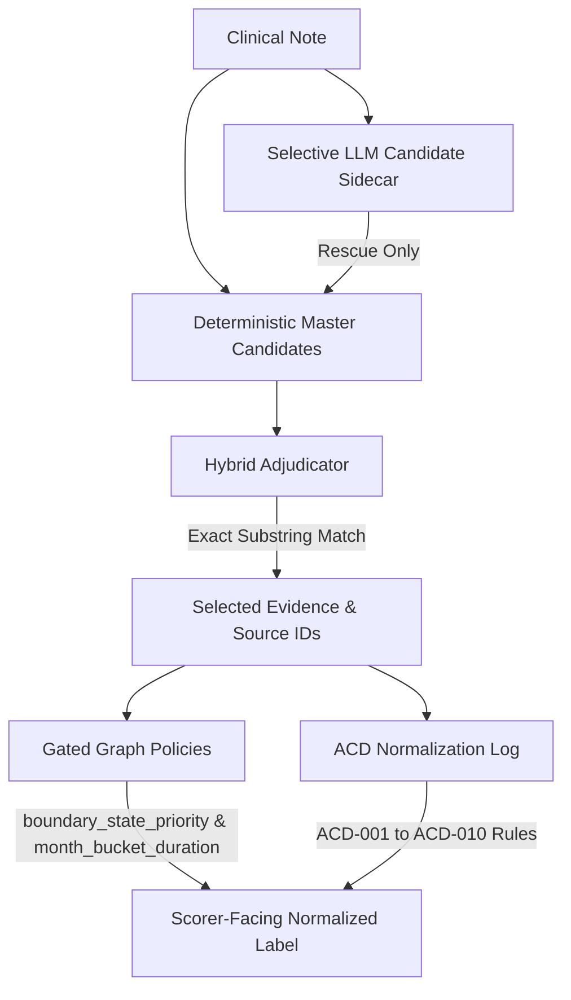

# Gan 2026 LLM Component Mechanics Synthesis

Date: 2026-06-04

Status: Final synthesis report for validation-development component mechanics.

## Executive Summary

This synthesis report integrates the final answers for **RQ1** (candidate discovery), **RQ2** (evidence selection), and **RQ4** (projection) on the validation-development split (`gan2026_split_v1`). By evaluating the components on the **2026-06-04 follow-up panel** (654 panel rows over 371 source rows) and cataloguing ambiguous case decisions (**ACD-001 through ACD-010**), we establish a clear architectural path forward:

1. **Broad LLM Reasoning is Regressive**:
   - Allowing the LLM to perform unconstrained, end-to-end extraction, selection, and projection causes severe regressions.
   - Raw candidate selection (`llm_candidate_selector_raw`) regressed **49 baseline-correct rows**, and broad graph projection (`state_graph_projection`) regressed **84 baseline-correct rows**.
2. **Gated Projection Rules are Highly Precise**:
   - Gating projection logic under explicit graph metadata checks achieves 100% precision.
   - `boundary_state_priority` achieved **17/17 correct corrections with 0 regressions**.
   - `graph_gated_month_bucket_duration` achieved **18/18 correct corrections with 0 regressions**.
3. **Projection Policy is the Dominant Failure Owner**:
   - Over **40% of incorrect validation rows (152 rows)** fail due to `projection_policy` (lack of clear mapping rules for clinically ambiguous text) rather than LLM candidate generation or evidence selection.
   - Standardising mapping rules (e.g. vague cadence, conditional triggers, relative trends, non-epileptic symptoms, summary overrides) via **ACD decisions** resolves this bottleneck.

**Core Recommendation**: Transition the pipeline from a broad, unconstrained LLM reasoner to a **hybrid, policy-gated architecture**:
- Lock deterministic rules as the baseline substrate.
- Deploy the LLM sidecar selectively to propose candidates on boundary-uncertainty slices (78 rows).
- Deploy the hybrid adjudicator strictly to locate exact evidence substrings and source IDs, blocking it from altering labels.
- Normalise raw extracted clinical facts to final benchmark labels using the gated graph policies and the **ACD decision log**.

## Source-Backed Outcomes (2026-06-04 Panel)

| Component | Panel rows | W->C | C->W | Exact evidence rate | Key findings |
| --- | ---: | ---: | ---: | ---: | --- |
| `boundary_state_priority` | 17 | 17 | 0 | 100% | Resolves unknown/unresolved-multiple graph states; 0 regressions. |
| `graph_gated_month_bucket_duration` | 250 | 18 | 0 | 100% | Corrects seizure-free duration mapping; 0 regressions. |
| `llm_heavy_selected_fact` | 95 | 0 | 0 | 98.9% | Strong diagnostic facts, but lacks source ID traces. |
| `claim_table_final_query` | 38 | 0 | 0 | 100% | Strong diagnostic query spans; excellent exactness. |
| `hybrid_adjudicator_raw` | 61 | 0 | 8 | 100% | Finds exact text but regresses 8 baseline-correct rows. |
| `llm_candidate_selector_raw` | 61 | 7 | 49 | 98.3% | Heavy regressions; unconstrained selection is unsafe. |
| `state_graph_projection` | 131 | 0 | 84 | 95.4% | Broad graph projection causes severe regressions. |

## Row-Level Clinical Mechanisms

A systematic review of 16 target validation rows (documented in [gan2026_target_rows_inspection.md](file:///Users/cobro/code/clinical-extraction/docs/research/gan2026_target_rows_inspection.md)) isolates the clinical scenarios behind these results:

### 1. Conditional-Only Occurrences (ACD-004)
- **Rows**: 3356, 3371, 3468, 3469, 3482
- **Scenario**: Note describes seizures occurring exclusively under specific triggers (e.g. "when perimenstrual only (days -3 to +3)" or "exclusively after nights of curtailed sleep").
- **LLM Success/Failure**: The LLM extracts the exact trigger text but is forced by the schema to project a rate (e.g., 2 per 6 weeks), leading to F1 failure.
- **Resolution**: Map conditional triggers to `unknown` if no rate is quantified.

### 2. Relative-Only Changes (ACD-005) and Qualitative Improvement
- **Rows**: 3528, 3534
- **Scenario**: Note describes comparative trends only (e.g. "frequency increased by 50%" or "better control over past seven months").
- **LLM Success/Failure**: The LLM extracts the relative trends but is unable to project an absolute rate, resulting in overreach.
- **Resolution**: Map to `unknown` (or `no reference`).

### 3. Non-Epileptic or Uncertain Events (ACD-007)
- **Row**: 3137
- **Scenario**: Patient has "no definite seizure events" but attended the ED twice for somatic/dissociative symptoms (light-headedness, anxiety) resolved without intervention.
- **LLM Success/Failure**: The raw LLM selector treats ED presentations as active seizures, resulting in regression.
- **Resolution**: Project to `seizure free` if triage confirms symptoms were non-epileptic.

### 4. Summary Overrides (ACD-008)
- **Row**: 2748
- **Scenario**: Note contains both a long-term count ("seven seizures so far this year") and an explicit rate assessment ("typical pattern is a focal seizure monthly").
- **LLM Success/Failure**: The adapter attempts to calculate the mathematical average (~0.7 per month), causing a benchmark mismatch.
- **Resolution**: Prioritize explicit clinician summary statements ("monthly" -> `1 per month`) over calculated ratios.

### 5. Temporal Aggregation (ACD-009)
- **Row**: 1695
- **Scenario**: Note written on July 27 reports "a handful of events during the previous month" and "current month to date: no events".
- **LLM Success/Failure**: The LLM overreaches to project seizure freedom based on the current month's zero events.
- **Resolution**: Prioritize the previous month's active rate (`multiple per month`) unless long-term (3+ months) seizure freedom is established.

### 6. Multi-Semiology Prioritization (ACD-010)
- **Rows**: 1165, 1363
- **Scenario**: Patient has minor interictal auras (1-2 per week) but experienced an acute relapse of major events (3 tonic-clonic seizures yesterday).
- **LLM Success/Failure**: The LLM selects the minor aura rate, losing the critical clinical relapsed event frequency.
- **Resolution**: Prioritize the frequency of the major relapsed convulsive/impaired-awareness events (`3 per day`).

## Architectural Recommendations

The findings outline a strict hybrid model for clinical extraction:

- **Candidate Phase**: Deterministic candidates provide the broad 96.7% recall substrate. The LLM sidecar is used only as a selective rescue proposer for boundary-uncertainty slices (78 rows).
- **Selection Phase**: The hybrid adjudicator acts as a pure evidence locator, attaching exact spans and source IDs to deterministic nodes while blocking unconstrained label changes.
- **Projection Phase**: Standardised clinical ambiguities are resolved at the final layer using the ACD decision rules and gated policies.

## Next Action

With the component mechanics of RQ1, RQ2, and RQ4 understood, the active question moves to **RQ5 (Deterministic Compilation/Rendering)**. The final task is ensuring the selected state translates cleanly into a Gan-compatible output without semantic drift.
