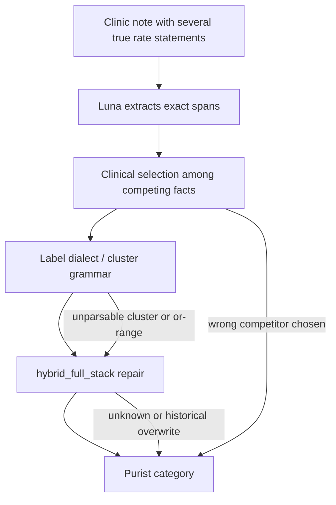

# Why Luna A/B/C residual error stays high on Gan `dev750`

Date: 2026-07-31  
Status: development mechanism answer  
Parent report: [Luna prompt variants](gan2026_luna_prompt_variants_report_2026-07-30.md)

## Answer

Prompt tuning moves a modest band of rows, but it does not touch the hard core.
On `validation750`, only **48 rows** are Purist-wrong under all three Luna
prompts after `hybrid_full_stack`. That shared residual is almost entirely
**clinical selection and label construction with exact evidence already in
hand**, not quotation failure. Thirty-nine of those 48 are rows the
deterministic rules control already gets right. So the persistent LLM+rules
gap is mostly “the model chose a wrong clinically plausible reading that repair
cannot or will not undo,” plus a smaller set of **projection/format losses**
and a few **rules regressions of correct raw answers**.

The much larger LLM-only residual (about 328–339 raw-wrong rows; **269 wrong
under all three prompts**) is a different problem: Luna repeatedly picks the
wrong competing rate, collapses or invents ranges, mishandles seizure-free
boundaries, or emits cluster phrasing the normalizer cannot score. Rules rescue
most of that mass. Prompt variants only rearrange the margins.

## Protocol and evidence

No-call matched analysis of the retained A/B/C `validation750` traces.
Protocol:
[residual analysis protocol](../experiments/gan2026/gan2026_luna_prompt_variants_residual_analysis_protocol_2026-07-31.md).
Machine artifacts:
[residual_summary.json](../../experiments/gan2026_luna_prompt_variants_dev750_20260730/residual_summary.json),
[residual_panel.jsonl](../../experiments/gan2026_luna_prompt_variants_dev750_20260730/residual_panel.jsonl),
[residual_exemplars.json](../../experiments/gan2026_luna_prompt_variants_dev750_20260730/residual_exemplars.json).

| Boundary | A | B | C |
| --- | ---: | ---: | ---: |
| LLM-only Purist | 411/750 | 422/750 | 414/750 |
| LLM+rules Purist | 646/750 | 656/750 | 666/750 |
| Final wrong | 104 | 94 | 84 |
| Exact evidence among final wrong | 101/104 | 88/94 | 82/84 |
| Rules-right but this variant still wrong | 91 | 81 | 71 |

Correctness patterns across A/B/C final Purist:

| Pattern (A,B,C) | Rows | Meaning |
| --- | ---: | --- |
| TTT | 601 | all three correct |
| FFF | 48 | persistent residual |
| FTT | 28 | A-only wrong |
| TFT | 21 | B-only wrong |
| FFT | 16 | C rescues A+B |
| TTF | 15 | C-only wrong |
| FTF | 12 | B rescues A+C |
| TFF | 9 | A-only correct |

## Why the residual feels “persistently high”

Three different ceilings are easy to confuse:

1. **LLM-only ceiling.** Luna is still wrong on ~44% of rows before repair.
   Across prompts, **269/750** raw answers are wrong in every variant. Exact
   evidence remains high. The model finds text; it does not stably choose the
   gold clinical reading.
2. **LLM+rules ceiling.** Repair lifts A/B/C to 646–666/750. That looks strong
   until compared with the rules control at **697/750**. Best Luna+rules (C)
   still trails rules-only by 31 rows net.
3. **Prompt-shared hard core.** After all prompt movement, **48 rows** remain
   wrong under A, B, and C. Of those, **35 emit the same final label in all
   three**, and **26 select the same evidence span**. Prompt wording is not
   the lever on this set.

Near-misses are real but limited: 12/48 persistent wrongs are Pragmatic-correct
for at least one variant; 9/48 for all three. Most residual errors are true
Purist category misses, not off-by-one wording.

## Shared residual themes (wrong in A, B, and C)

Theme counts below use the A final answer as the anchor; consensus themes are
similar. Exact selected evidence is present on **all 48** persistent final
wrongs for A.

### 1. Over-abstention from countable evidence (16 persistent)

The dominant shared theme. Luna sees a countable or near-countable current
burden, then finalizes as `unknown` or `no seizure frequency reference`.

Representative mechanisms:

- **Cluster spoken without the canonical cluster grammar.**  
  Row 10097: gold `3 cluster per month, multiple per cluster`; all three raw
  answers say `3 clusters per month`; all three finals become `unknown`.  
  Row 5837: gold `2 cluster per 3 week, multiple per cluster`; raw answers are
  close (`2 clusters over/per/in 3 weeks`); finals all `unknown`.  
  The normalizer accepts `N cluster per period, M per cluster` but rejects
  `N clusters per month`. Clinically Luna often has the right fact; projection
  into the Gan label dialect fails, and repair collapses to unknown.
- **Diagnostic uncertainty overrides a rate gold still codes.**  
  Row 8419: gold `1 to 2 per week`; all three choose `unknown` because nocturnal
  episodes are “under review” / not confirmed seizures. The note contains the
  weekly observational rate; gold uses it, Luna refuses.
- **Dated counts demoted to no-reference.**  
  Rows 14587 and 14628: gold `2 per 3 month` / `2 per 2 month`; all three raw
  answers keep a two-event recent count; all three finals become
  `no seizure frequency reference`. C’s instruction not to demote dated counts
  did not hold on these rows after repair.

### 2. Competing countable formulations (12 persistent)

Notes often contain two true rates. Gold picks one; Luna consistently picks the
other.

- Row 2748: gold `1 per month` (“typical pattern is a focal seizure monthly”);
  all three select “seven … so far this year” → `7 per 10 month`. B’s
  “prefer overall count” instruction actively endorses the losing reading.
  Pragmatic is correct; Purist is not.
- Row 1880: gold `8 per 2 month`; all three lock onto “several times per week”
  for a competing semiology → `multiple per week`.
- Row 1030: gold `1 to 3 per month`; all three collapse to `1 per month` after
  seeing “one or three.” B told the model to keep ranges; the range still dies
  in repair (`1 or 3` is unparsable; `1 to 3` would score).

### 3. Seizure-free / unknown boundary (9–10 persistent)

Two opposite failures survive every prompt:

- **False seizure-free when gold is unknown** (5). Dated quiet intervals
  (`since mid-June 2025`, `since 25 December 2023`) become
  `seizure free for multiple year`. C was written to block short quiet →
  seizure-free, but these dated intervals still win.
- **False rate when gold is seizure-free**, or the reverse after repair.  
  Row 2932 is the clearest shared rules regression: all three raw answers are
  Purist-correct (`seizure free since 29/09/2017`), and `hybrid_full_stack`
  replaces them with historical `13 per 2 month` from earlier February/March
  counts. Prompt cannot fix a repair that overwrites a correct raw selection.

### 4. Missed or mangled cluster structure (5–9 persistent)

Even when Luna does not abstain, it drops the cluster side or invents a smooth
rate:

- Row 10630: gold `multiple cluster per 2 week, 5 per cluster`; A/C become
  `multiple per week`; B becomes `unknown` despite a better raw
  (`several clusters per fortnight, roughly 5 per cluster`).
- Row 17135: gold `5 cluster per month...`; all three finalize
  `1 cluster per month...` after misreading “five days each month” as one
  cluster-day pattern with the wrong cadence.

### 5. Hard rows even rules miss (9 persistent)

Only 9/48 persistent wrongs are also rules-wrong. These are the true joint hard
cases: ambiguous unknown-versus-rate notes, stimulant-linked or diary-correlated
pseudo-cycles coded unknown or rare in gold, and menstrual “per cycle” language
that neither Luna nor the rules stack maps cleanly (`3 to 6 per cycle` is
unparsable).

## Mechanism buckets for all final wrongs

| Mechanism | A (104) | B (94) | C (84) | Persistent (48) |
| --- | ---: | ---: | ---: | ---: |
| Rate construction / competing count | 28 | 20 | 27 | 12 |
| Over-abstain | 22 | 23 | 20 | 12 |
| Seizure-free boundary | 22 | 20 | 10 | 9 |
| Cluster format lost in repair | 13 | 9 | 11 | 4 |
| Cluster structure selection | 7 | 6 | 5 | 5 |
| Rules destroyed correct raw | 5 | 6 | 6 | 3 |
| Competing-evidence selection | 4 | 4 | 4 | 3 |
| Parse / schema failure | 3 | 6 | 1 | 0 |

C’s only clear thematic win inside the final residual is **seizure-free
boundary** (22 → 10). B reduces some rate/cluster mass but pays for parse
failures and new seizure-free regressions. Neither prompt shrinks
over-abstention or competing-count errors much.

## Errors particular to each variant

### A (`v0.5` control): under-specified on the margins

28 rows are wrong only in A. Themes concentrate in over-abstain, vague
`multiple` versus countable totals, competing-event selection, and a few
seizure-free false rates. B and C both fix many of these because the added
instructions name exactly those patterns. A is not uniquely bad on the hard
core; it is uniquely weak on the prompt-addressable fringe.

### B (`luna_rate`): rate gains with schema and seizure-free side effects

B leads LLM-only (+11 vs A) and B-target slice raw accuracy (14 more correct
on the 441-row rate/cluster attribution slice). Its distinctive failures:

- **Parse/schema failures unique to B:** 5 of 21 B-only wrongs have null
  structured output (`invalid_json`). A and C score those same rows correctly.
  Longer rate instructions appear to raise brittle JSON risk for Luna.
- **Seizure-free regressions:** 7 of 21 B-only wrongs sit in the attribution
  `seizure_free_boundary` slice. Examples: gold seizure-free becomes `unknown`
  (8805, 13843), or a quiet-since-date reading overwrites a sparse yearly rate
  (14581, 14645). B’s “do not let a short quiet spell erase a recent count”
  helps clusters, but also pushes some true seizure-free rows toward rates or
  abstention.
- **Instruction conflict with gold.** Preferring overall period totals helps
  some diary rows and hurts others where gold prefers the typical monthly
  pattern (2748 remains wrong in all three; B’s wording makes that reading
  feel mandated).

B’s clean wins versus A+C are mostly cluster/diary rows (7 of 12
A+C-wrong/B-correct), matching its design target.

### C (`luna_current`): boundary gains with residual over-caution and count drift

C leads final Purist on development (+20 vs A) and is the only variant that
materially cuts seizure-free boundary residuals. Distinctive profile:

- **Rescues A+B on uncertainty / competing-event / seizure-free rows** (16
  rows). Themes rescued: over-abstain versus seizure-free, false seizure-free
  versus rate, and some dated-count abstentions. This is the intended C effect.
- **C-only wrongs are mostly rate construction, not boundaries.** Among 15
  C-only wrongs: wrong counts (1794, 9496, 16091), collapse to `multiple per
  week` (15745, 15768, 15771, 16574), over-abstain on countable rows (2548,
  7573, 14973), and occasional overconfident rate versus gold unknown (7168).
- **Boundary overshoot still happens.** Row 12751: gold `4 per day`; C alone
  chooses long seizure-free since previous review. Row 3015: raw seizure-free
  is correct, repair turns it into `1 per 13 month`.

C improves the slice it was built for; it does not become a better rate model
than B, and it can still abstain or blur counts when the note is dense.

## Thematic synthesis: what “high residual” actually is

The persistent high error rate is not one bug. It is the stack of:

1. **Annotation-shaped ambiguity.** Many notes support more than one
   defensible current frequency. Prompt text can bias which reading wins, but
   cannot invent a unique clinical truth when gold encodes one convention
   among several.
2. **Label-dialect brittleness.** Cluster answers and `or`-ranges are often
   clinically right in raw form and unscorable until rewritten into a narrow
   canonical string. Repair then drops them to unknown.
3. **Boundary policy mismatch.** Seizure-free since a date, short quiet after
   a burst, unconfirmed nocturnal events, and “unknown” are scored under a
   sharp Purist policy. Luna’s clinical hedging and gold’s coding conventions
   disagree in both directions.
4. **Repair as a second selector.** Rules rescue hundreds of raw wrongs, but
   on a handful of important rows they also destroy correct raw seizure-free or
   recent-fortnight answers by preferring another extracted event. Prompt
   variants cannot police that second selector.
5. **Ceiling relative to rules-only.** Even best Luna+rules remains tens of
   rows behind the deterministic control on this development split. As long as
   LLM selection can veto a rules-correct path, prompt edits only nibble at a
   structural gap.

## Claim boundary

Development-only Luna-versus-Luna residual analysis on `validation750`. Theme
labels are reproducible heuristics over saved traces, not adjudicated clinical
codes. No `test450` rows were inspected. This explains why prompt deltas stayed
modest; it does not justify replacing the frozen six-model v0.5 panel or
claiming the residual is solved.

## Follow-up

Projection/anti-regression, dated-count, competing-rate floors, and narrow
cross-model guards from this thread are complete and absorbed into the **final
Gan LLM-with-rules ruleset** (2026-07-31). See
[dated-count / guards](gan2026_luna_dated_count_competing_rate_report_2026-07-31.md)
and [six-model comparison](six_model_comparison_report_2026-07-18.md). Further
rule tuning for this comparison is closed unless a new predeclared study
reopens it. Keep B and C unmerged; do not kitchen-sink prompts.
