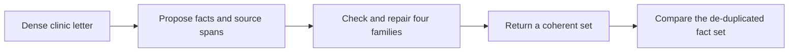

# ExECTv2: recovering a complete clinical fact inventory

Date: 2026-08-12
Revised: 2026-08-19 (proposed method named without Grok or hybrid shorthand)

Status: paper source; selected results and development mechanism evidence

> **Current boundary (2026-08-19):** The proposed ExECT method is ExECT LLM
> with rules (`exect_llm_with_rules`; cite hybrid F1). ExECT LLM only
> (`exect_llm_only`; cite raw F1) and ExECT rules are baselines. They are
> different requests. Grok 4.6 is the cited model. Full ledger is a
> comparison control only. See `docs/paper/*`.

## The result

ExECT asks for a complete set of diagnoses, seizure-frequency facts,
prescriptions, and investigations from one letter. On the locked `test60`
split, living **Grok 4.6** scored under four-family clinical fact F1:

| Method | `test60` F1 | `dev140` F1 |
| --- | ---: | ---: |
| ExECT rules | 0.7937 | 0.9042 |
| Grok LLM only (raw) | 0.7726 | 0.8212 |
| Grok LLM with rules (hybrid) | 0.805 | 0.8998 |

Gemini `test60` is 0.8129 and Luna `test60` is 0.7827, both on the
proposed method. Grok is the cited model. Qwen both methods, and
DeepSeek/Gemma LLM only, are still missing. Holdout is aggregate-only. The
metric is not the published ExECT benchmark. Do not cite Sol Compact 0.8031 or
Full-ledger Sol 0.8302 as living cells.

## What the task requires

A short letter can contain several related facts and attributes. The system
must recover the supported set without merging distinct mentions, dropping a
repeated or split regimen, omitting a family, or adding an unsupported
inference.

This makes ExECT mainly an inventory problem. On the proposed method the model
proposes four-family facts with source text. Recorded rules then map, drop, or
assemble those facts. A grounded span can still miss a fact, attach an
attribute to the wrong event, or invent a rate the letter does not support.
The final F1 records set agreement; it cannot identify which earlier step
caused the difference.

## Where the hybrid helps

The model proposes all four families in one structured call. Deterministic
stages then project attributes, apply selected family rules, require evidence,
and assemble the final set. Development replay shows that those rules do
different jobs:

1. **Diagnosis** repairs many concept substitutions and omissions. Diagnosis
   exactness rises from 0.39 to 0.58 after the diagnosis transform, with 212
   rescue events and 49 harms recorded.
2. **Seizure frequency** removes unsupported states at the producer check: 305
   rescues and no recorded harms at that stage. Missed and mixed state
   inventories remain.
3. **Prescription** is strong overall, but the selected transform is not
   uniformly helpful. The earlier v09 lens recorded 44 rescues and 60 harms on
   `dev140`. Removing two dev-fitted rules produced v10, confirmed on
   aggregate-only `test59`.
4. **Investigations** remains a no-op on the selected hybrid configuration.
   The standalone rules-only extractor now binds List 9 findings itself.
   That rewrite is why rules-only Investigations is no longer the method
   floor.

These are development first-changer and family-lens records, not holdout
component estimates.

Those family jobs are not one rescue mechanism. The same 13 Aug provenance
study classified each family's own first-rescue hop on `dev140`:

| Family | n | Main source of the rescued set | Unquoted letter add |
| --- | ---: | --- | ---: |
| Diagnosis | 174 | 104 use a model quote not scored as that diagnosis; 51 only drop extras | 10 |
| Seizure frequency | 347 | 301 re-render a model state (mostly phrase → CUI at the producer gate); 42 drop extras; 4 compose a new state from captured SF events | 0 |
| Prescription | 10 | All 10 rewrite a drug the model already named (dose split, rescue recode, unit clean-up) | 0 |
| Investigations | 2 | Both drop an extra or empty investigation key | 0 |

On living Grok `EA0007`, the hedge *is* inside the quoted
seizure-frequency span. The diagnosis dictionary rewrites `focal onset`
to `focal epilepsy`. That is a use-quote / convention rewrite, not the
retired Sol unquoted-letter add.

See [rescue source provenance](../shared/hybrid_rescue_source_provenance_2026-08-13.md)
and the [exhibit](../artifacts/rescue_source_provenance_2026-08-13.html).

## Where the difficulty remains

The cited Grok run of the proposed method is the living holdout row, but the
gain is uneven across families. Holdout ranges below cover the Full-ledger
six-model panel and are not Compact holdout floors.

- **Seizure frequency is the holdout floor.** Hybrid family F1 ranges from
  0.49 to 0.61. Rules-only is 0.58. Named windows, missed states, and mixed
  inventories persist after the producer check.
- **Diagnosis improves the concept inventory**, with hybrid holdout about
  0.79–0.85 against rules-only 0.86. Single-seizure diagnosis remains a
  shared LLM-only difficulty in the corrected category cuts.
- **Prescription is strong, with a measured harm surface.** Hybrid holdout
  ranges from 0.78 to 0.86. The v10 simplification transferred better than
  v09; that does not make every prescription rule safe.
- **Investigations is no longer the rules-only collapse.** After the 15 Aug
  result-binding rewrite, rules-only Investigations is 0.87 on aggregate
  holdout. LLM-only and hybrid still range from about 0.79 to 0.92 because
  the selected hybrid investigations transform does not change the scored
  answer.

The main residual problem is not JSON formatting. It is keeping a complete,
unmerged, evidence-supported set under the project's four-family definition.

## One reviewable example

In development letter `EA0007`, Grok quoted both “epilepsy – unclassified”
and “seizures every 3 to 4 weeks, possibly focal onset.” The diagnosis
dictionary rewrote the quoted hedge to `focal epilepsy`. Hybrid
four-family letter-exact is true and hybrid headline F1 is 1.0.

The trace keeps the quoted hedge and names the dictionary rewrite. The
rewrite is a gold-format rule, not an unqualified clinical diagnosis. The
case ledger also records the model reading as defensible.

See the [case explorer](../artifacts/paired_case_explorer_2026-08-09.html)
for the recorded object.

## What this evidence supports

The retained evidence supports this account of the proposed method, cited on Grok:

- the model proposes a four-family inventory with source text;
- recorded rules then shape families into the designed form, with family-specific
  rescues, harms, and a no-op;
- those mappings can be replayed without a new model call;
- the locked hybrid total is slightly above standalone rules and above the
  model alone;
- only Diagnosis has a measured unquoted-letter add class;
- seizure frequency remains the holdout floor. Standalone rules now recover
  investigations; the selected hybrid investigations transform is still a
  no-op.

It does not establish reproduction of the published ExECT benchmark, clinical
validity, a universal hybrid advantage, or that every family transform
improves F1.

## Evidence owners

- [Decision 0058](../../decisions/0058-compact-ledger-is-the-paper-cited-exect-hybrid.md)
- [Decision 0046](../../decisions/0046-exect-primary-method-comparison-boundary.md)
- [Paper Compact cells](../../../paper_experiments/exectv2_compact_ledger/README.md)
- [Paper claim status C10, C17, C18, and C19](../../canon/10_paper_provenance.md)
- [Six-model comparison](../shared/six_model_comparison_report_2026-07-18.md)
- [ExECT stage replay](../exectv2/hybrid_stage_ablation_2026-08-06.md)
- [Rescue source provenance](../shared/hybrid_rescue_source_provenance_2026-08-13.md)
- [ExECT family error record](../exectv2/family_error_catalog_2026-08-06.md)
- [Aggregate holdout categories](../shared/six_model_holdout_category_aggregates_2026-08-06.md)
- [Prescription v10 holdout confirmation](../exectv2/prescription_lens_v10_holdout_confirmation_2026-08-10.md)
