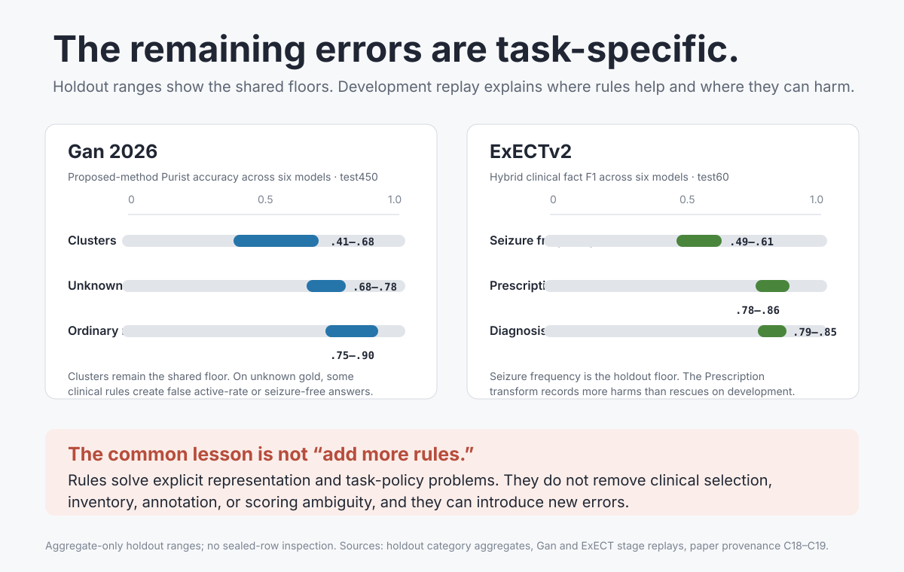

# Where the proposed method still fails

Date: 2026-08-10
Revised: 2026-08-19 (failures of the proposed method)

Status: paper source; concise failure and harm account

> **Update 2026-08-10:** The earlier Prescription harm account described the
> v09 lens as a single component. A leave-one-out decomposition found that two
> rules were harmful and dev-fitted; removing them produced v10, which was
> confirmed on aggregate-only `test59` with a larger holdout gain. The broader
> lesson remains component-specific: this does not make every deterministic
> correction safe.

## The short answer

Recorded rules remove many errors caused by malformed output, incomplete task
grammar, and explicit policy violations. They also introduce harms. The
remaining errors depend on where the proposed method first goes wrong: the
model misses or flattens evidence, a rule switches the reading, the inventory
is incomplete, or the gold discards a distinction the span still holds.
Family floors below are the Full-ledger development and holdout
panel unless a Compact cell is named. Compact ledger is the paper-cited
ExECT hybrid ([Decision 0058](../../decisions/0058-compact-ledger-is-the-paper-cited-exect-hybrid.md)).

- **Gan still struggles with clinical selection.** Clusters remain the shared
  holdout floor. Unknown cases show that a rule can turn justified uncertainty
  into a false rate or seizure-free answer.
- **ExECT still struggles with fact inventory.** Seizure frequency remains the
  holdout floor. The previous v09 Prescription transform could drop a correct
  drug or regimen; its two harmful sub-rules were removed in v10.
- **Neither task is reduced to formatting.** Annotation conventions, scorer
  definitions, competing evidence, and missing or extra facts still matter.

## Gan: the hard part is choosing the right reading

Evidence reconciliation clears much of the malformed rate grammar visible at
the model boundary. Later stages then choose among diary, usual-rate, dated,
breakthrough, and seizure-free readings.

This works well for much of the task, but two limits remain:

1. **Clusters preserve two linked quantities.** The system must recover both
   how often clusters occur and how many seizures occur within one cluster.
   Models often collapse the structure into a smooth rate or an unknown label.
2. **Uncertainty can be overwritten.** On unknown-gold development rows,
   clinical selection reduces accuracy and creates false active-rate and false
   seizure-free outputs. Removing the breakthrough rule rescues ten unknown
   cases but harms the full ledger, so the study does not support disabling it.

## ExECT: the hard part is keeping the inventory complete

Family rules have different effects:

- The Diagnosis transform repairs many concept substitutions and omissions.
- The seizure-frequency producer check removes unsupported states, but missed
  and mixed state inventories remain.
- The v09 Prescription transform recorded 60 harms against 44 rescues on
  `dev140`. Decomposing it identified the planned/historical noise drop and
  dictionary residual additions as the harmful rules. Removing those two rules
  produced v10: on `dev140`, exactness moved `0.8108 → 0.8337` and micro-F1
  `0.9175 → 0.9182`; on aggregate-only `test59`, exactness moved
  `0.6591 → 0.7472` and micro-F1 `0.8286 → 0.8748`. Five of six models
  improved on holdout; GPT-4.1-mini was marginally worse.
- The selected hybrid Investigations transform is a no-op. Standalone
  rules-only Investigations now binds List 9 findings (development F1 0.96;
  aggregate holdout 0.87). The hybrid lane still does not change this
  family's scored answer.

## What the evidence changes

The experiments reject two simple explanations.

**“The model only needs better formatting” is too narrow.** Format repair
rescues many Gan answers, but later selection errors remain.

**“More deterministic correction is always safer” is false as a general rule.**
The Gan breakthrough still shows a development harm trade-off. The ExECT
Prescription result is more specific: two dev-fitted rules were harmful, and
removing them transferred better to holdout. The result supports decomposing a
correction stage before changing it, not removing deterministic correction as a
class.

The supported conclusion is smaller: the proposed method locates these
trade-offs and makes them measurable. Named rules are not always free
switches. A final score cannot recover a distinction the gold discarded.

## Inspect the rows

The [representative row workbook](../artifacts/paper_source_row_evidence_2026-08-10.xlsx)
contains the selected category and error examples in filterable tables. Use it
to inspect source text, gold output, method outputs, error mode, model, and
evidence owner. Its counts describe the selected examples, not error
prevalence.

## Evidence owners and limits

- [Gan error catalog](../gan2026/category_error_catalog_2026-08-06.md)
- [ExECT error catalog](../exectv2/family_error_catalog_2026-08-06.md)
- [Gan stage replay](../gan2026/hybrid_stage_ablation_2026-08-06.md)
- [ExECT stage replay](../exectv2/hybrid_stage_ablation_2026-08-06.md)
- [Gan breakthrough counterfactual](../gan2026/unknown_breakthrough_loo_2026-08-06.md)
- [ExECT Prescription decomposition](../exectv2/prescription_lens_rule_decomposition_2026-08-10.md)
- [ExECT Prescription holdout confirmation](../exectv2/prescription_lens_v10_holdout_confirmation_2026-08-10.md)
- ExECT family-lens decomposition / test59 confirmation (pruned; recover from Git history)
- [Holdout category aggregates](../shared/six_model_holdout_category_aggregates_2026-08-06.md)

Component and error-mode analyses are development evidence. Holdout values are
aggregate-only. The studies do not establish clinical harm rates, causal stage
necessity, or an authorised production rewrite.
