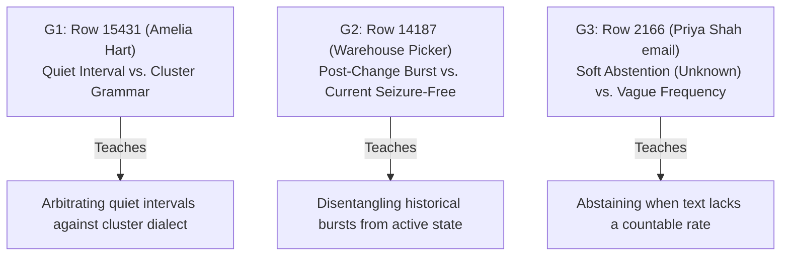
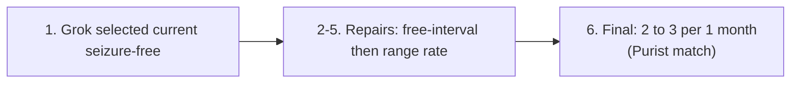
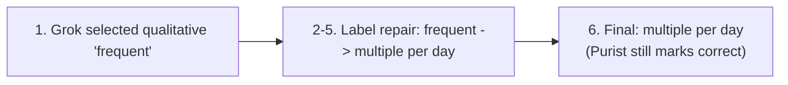
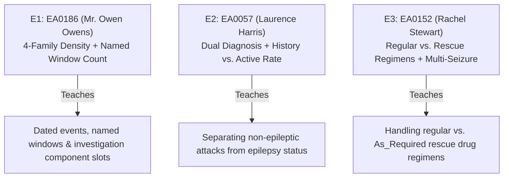
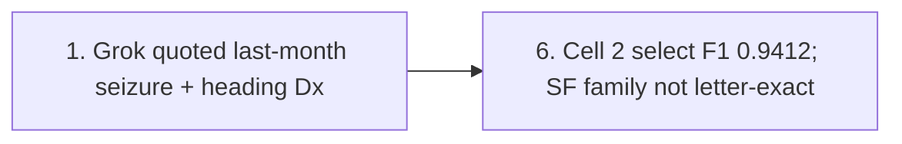
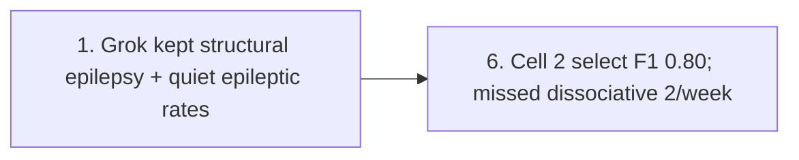
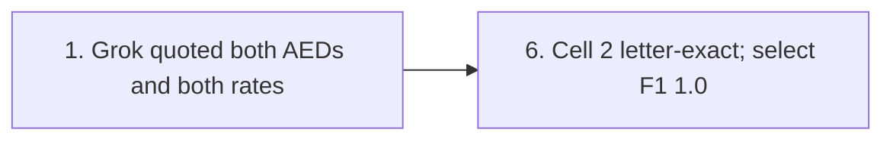

# Flagship 3-Letter Challenge Suite for Clinical Extraction Tasks

Date: 2026-08-19  
Status: active paper source; flagship 6-letter collection (3 per task); Grok 4.6 identity traces  
Parent: [Task-shape framework](../shared/task_shape_framework_2026-08-06.md) | [Paper source library](../../NAVIGATION.md#paper-source-library)  

## Purpose and Boundary

This document establishes the **flagship 3-letter suite per task** (6 full clinical letters total) that demonstrates the full spectrum of task challenges for readers.

It provides both:
1. **Rich Clinical & Benchmark Context**: Full un-truncated clinical excerpts, gold targets, task taxonomy categories, and detailed explanations of why each note is hard for LLMs versus deterministic rules.
2. **Reviewable 6-Step Evidence Journeys**: Grok 4.6 traces from development
   cells, replayed from saved `raw_output` with no new model calls. Gan
   journeys use the **wording ablation** (`gan_llm_extract_raw`), not the cited
   codebook extract. ExECT journeys use cell 2 (`exect_llm_pre_post`) or cell 3
   as noted per letter. Sol journeys are retired.

$$\text{Raw LLM Output} \longrightarrow \text{Format Check} \longrightarrow \text{Initial Normalization} \longrightarrow \text{Quoted Evidence} \longrightarrow \text{Deterministic Repair} \longrightarrow \text{Final Output}$$

All cases are drawn exclusively from development splits (`dev750` for Gan 2026, `dev140` for ExECTv2). Locked holdout splits (`test450` and `test60`) remain sealed and un-inspected.

---

## 1. Gan 2026 Flagship Suite (Task 1: Frequency Selection & Normalization)

Gan asks one question per letter: *What single current seizure-frequency label should this letter receive?*

---

### Case G1: Row 15431 (*Amelia Hart*) — Quiet Interval vs. Cluster Grammar

#### Clinical Narrative & Context
The patient is a 28-year-old female on Levetiracetam 500 mg twice daily. The clinic note details her adherence, laboratory blood levels, workplace accommodations, and seizure patterns. Crucially, the seizure frequency section contains two competing frequency concepts: a quiet duration interval (*"seizure-free for up to 4 month"*) and a co-occurring cluster description (*"clusters of 5 seizures in a single day"*).

#### Full Text Excerpt
> *"Levetiracetam 500 mg twice a day (patient-reported adherence, no missed doses in the last 8 weeks) Levetiracetam Blood Level: 20 September 2025: 14 µg/mL (laboratory therapeutic reference 12–46 µg/mL). Dose 500 mg twice a day. Seizures: She may remain seizure-free for up to 4 month, but then will experience clusters of 5 seizures in a single day. These clusters have reduced in intensity and recovery time over the last two episodes, with no injuries or prolonged post-ictal confusion reported. No clear auras or focal features described. I reviewed Amelia Hart today in follow-up. Since relocating at work from the hot cookline to a prep area with improved ventilation, she reports fewer heat and fume triggers, better sleep continuity, and reduced daytime fatigue."*

#### Benchmark Gold Target & Taxonomy
- **Gold Label**: `1 cluster per 4 month, 5 per cluster`
- **Gold Bucket**: `cluster_burden`
- **Scorer Geometry**: `band_submonthly` (Pragmatic / fine Purist)

#### Why This Note Is Hard
- **For LLMs**: Generative models easily collapse under competing phrasing. When prompted, an LLM often extracts `unknown` (treating the quiet interval as contradicting the clusters) or extracts only `seizure free for 4 month`, omitting the cluster event entirely.
- **For Rules**: Requires explicit two-part cluster grammar matching (`N cluster per T, M per cluster`) while correctly linking the 4-month window to the cluster count rather than mis-promoting it to a simple monthly rate.

#### Reviewable 6-Step Evidence Journey

| Step | Recorded Value | Rationale & Mechanism |
| :--- | :--- | :--- |
| **1. Grok structured events** | Cluster event: `clusters of 5 seizures in a single day after up to 4 month seizure-free` | Model quoted the two-part pattern and selected that event |
| **2. Format Repair** | Clean JSON | No format retry |
| **3. Selected evidence** | *"She may remain seizure-free for up to 4 month, but then will experience clusters of 5 seizures in a single day."* | Quoted on the selected event |
| **4. Label repair** | `'1 cluster of 5 seizures after up to 4 months seizure-free' -> 'seizure free for multiple month'` | Wording-ablation stack dropped the cluster grammar and kept the quiet interval |
| **5. Wording ablation output** (`gan_llm_extract_raw`) | `seizure free for multiple month` | **Purist miss** versus gold `1 cluster per 4 month, 5 per cluster` |
| **6. Note** | `gan_llm_only` is not a results column | Also Purist-wrong without cluster render |

---

### Case G2: Row 14187 (*Warehouse Picker*) — Post-Change Burst vs. Current Seizure-Free State

#### Clinical Narrative & Context
A female warehouse picker had her Valproate regimen discontinued on July 10. Immediately following withdrawal, she experienced a cluster burst of `2 to 3 seizures`. However, after adjusting her sleep schedule and using a pill organizer, she has remained completely seizure-free.

#### Full Text Excerpt
> *"Arrange follow-up in six months with trough Lamotrigine level and U&E/LFT monitoring. She reports a demanding role as a warehouse picker working between tall racking and narrow aisles, with variable lifting tasks and shift pace. She discontinued Valproate on 10 Jul. Shortly afterwards, she experienced 2 to 3 seizures, one triggered by missed medication. She has remained seizure-free since then. She attributes improvement to stricter adherence, better sleep on late shifts, and reduction in caffeine. There have been no injuries, no myoclonic jerks on waking in the last month..."*

#### Benchmark Gold Target & Taxonomy
- **Gold Label**: `2 to 3 per month`
- **Gold Bucket**: `range_rate`
- **Scorer Geometry**: `band_monthly`

#### Why This Note Is Hard
- **For LLMs**: Models struggle with temporal recency arbitration when a note presents both a numeric range (`2 to 3 seizures`) and a subsequent duration statement (*"remained seizure-free since then"*). LLMs often return `unknown` due to perceived contradiction.
- **For Rules**: Rules must parse range syntax (`N to M per unit`) while preventing premature truncation of the date window.

#### Reviewable 6-Step Evidence Journey

| Step | Recorded Value | Rationale & Mechanism |
| :--- | :--- | :--- |
| **1. Grok structured events** | Historical `2 to 3 seizures` after 10 Jul; current `seizure-free since then` | Both events extracted |
| **2. Format Repair** | Clean JSON | No format retry |
| **3. First label repair** | `'seizure free since then' -> 'seizure free for multiple month'` | Normalizer mapped the current free interval |
| **4. Second label repair** | `'seizure free for multiple month' -> '2 to 3 per 1 month'` | Range repair recovered the post-withdrawal count |
| **5. Wording ablation output** | `2 to 3 per 1 month` | **Purist match** (gold `2 to 3 per month`) |
| **6. Note** | Range rescue is rule-select on this ablation raw | `gan_llm_only` is not a results column |

---

### Case G3: Row 2166 (*Priya Shah email*) — Soft Abstention (`unknown`) vs. Vague Frequency

#### Clinical Narrative & Context
A clinic consultation email between neurologists regarding a patient with generalized epilepsy on Sodium Valproate and Lamotrigine. The text notes that generalized tonic-clonic seizures have been absent for over a year, but describes recent qualitative increases in absence episodes.

#### Full Text Excerpt
> *"Epilepsy Diagnosis: Generalised epilepsy Present Medication: 1. Sodium Valproate 300 mg in the morning and 500 mg at night 2. Lamotrigine 50 mg twice daily Present Seizure Frequency: Patient reports frequent petit mal recently, particularly on waking and during periods of prolonged screen use at work. No generalised tonic–clonic seizures for over a year. Plan of Action: The patient describes increasing brief absence episodes over the past six weeks, with no clear illness, sleep deprivation, or missed doses identified..."*

#### Benchmark Gold Target & Taxonomy
- **Gold Label**: `unknown`
- **Gold Bucket**: `unknown_sentinel`
- **Scorer Geometry**: `band_unknown`

#### Why This Note Is Hard
- **For LLMs**: Models are heavily biased toward extraction. When seeing terms like "frequent petit mal" or "increasing brief absence episodes over the past six weeks", LLMs frequently hallucinate a numeric rate such as `multiple per day` or `1 per week`.
- **For Rules**: Rules must explicitly detect qualitative frequency descriptors lacking a numeric count and force an abstention (`unknown`) under benchmark Policy A2/A3.

#### Reviewable 6-Step Evidence Journey

| Step | Recorded Value | Rationale & Mechanism |
| :--- | :--- | :--- |
| **1. Grok structured events** | `frequent petit mal recently`; increasing absences over six weeks | Qualitative current burden, no count |
| **2. Format Repair** | Clean JSON | No format retry |
| **3. Selected evidence** | *"Patient reports frequent petit mal recently, particularly on waking..."* | Quoted |
| **4. Label repair** | `'frequent' -> 'multiple per day'` | Wording-ablation stack did **not** force `unknown` |
| **5. Wording ablation output** | `multiple per day` | Gold is `unknown`. Purist still marks the row correct because both labels sit in the unknown band |

---

## 2. ExECTv2 Flagship Suite (Task 2: Fact Set Collection Across 4 Families)

ExECT asks: *Which structured clinical facts from Diagnosis, SeizureFrequency, Prescription, and Investigations does this letter support?*

---

### Case E1: EA0186 (*Mr. Owen Owens*) — Full 4-Family Density + Named Window Count + Temporal Anchoring

#### Clinical Narrative & Context
A 50-year-old male presenting with a recurrent seizure after a long period of control. The letter contains detailed past surgical/ischaemic history, a recent breakthrough seizure last month, historical focal motor seizures (10 months ago), past EEG/MRI findings, current Lamotrigine titration, and mental health/alcohol history.

#### Full Text Excerpt
> *"Clinic date 25/09/2018 Re Mr Owen Owens 30/06/1968 Dear doctor, Diagnosis: Symptomatic structural focal epilepsy Area of ischaemic damage left inferior frontal lobe Significant anxiety and depression I reviewed this 50 year old man, together with his wife, in clinic today. He was well from an epilepsy point of view until he had a seizure last month. His wife heard a bang from the next room and went in to see him unconsciouss on the floor... Mr Owens himself remembers his right leg twitching before he lost consciousness. I think therefore that this was a focal to bilateral convulsive seizures. As you recall Mr Owens has had focal motor seizures in the past where he has had jerking of his right leg. These were happening frequently before he started the medication. The last event was probably 10 months ago. He has had one previous focal to bilateral convulsive seizure at the time of diagnosis of his epilepsy in May 2017. As you will recall his MRI at the time was abnormal with an area of ischaemic damage in the left inferior frontal lobe... An EEG in 2017 did show some left sided sharp waves. He is currently taking lamotrigine 75mg twice a day... increase by 25mg every fortnight..."*

#### Benchmark Gold Target & Taxonomy
- **Diagnosis**: `symptomatic-structural-focal-epilepsy (DiagCategory=Epilepsy)`
- **Seizure Frequency**: 
  - `seizure (NumberOfSeizures=1, PointInTime=Last_Month)`
  - `focal-to-bilateral-convulsive-seizure (NumberOfSeizures=1, YearDate=2017, MonthDate=5)`
  - `focal (NumberOfSeizures=0, NumberOfTimePeriods=10, TimePeriod=Month)`
- **Prescription**: `lamotrigine (DrugDose=75, DoseUnit=mg, Frequency=2)`
- **Investigations**: `MRI (Performed=Yes, Result=Abnormal)`, `EEG (Performed=Yes, Result=Abnormal)`

#### Why This Note Is Hard
- **For LLMs**: Fails to bind temporal anchors correctly, often turning "last month" into a recurring monthly cadence (`1 per month`), or omitting the 10-month quiet interval for focal motor seizures.
- **For Rules**: Requires slot filling across 4 distinct families while anchoring date markers (`May 2017`, `last month`, `10 months ago`) to their respective seizure subtypes.

#### Reviewable 6-Step Evidence Journey

| Step | Recorded Value | Rationale & Mechanism |
| :--- | :--- | :--- |
| **1. Grok raw mentions** | Dx `Symptomatic structural focal epilepsy`; SF `seizure` last month and dated 2017 convulsive; Rx lamotrigine 75 mg bd; MRI/EEG | Cell 2 `exect_llm_pre_post/grok46/dev140` |
| **2. Format** | Parse OK | No format retry recorded |
| **3. Diagnosis** | Family letter-exact true on raw and hybrid | Heading diagnosis already gold-shaped |
| **4. Seizure frequency** | Family letter-exact false on raw and hybrid | Last-month event recovered; 10-month quiet interval not letter-exact |
| **5. Prescription / Investigations** | Letter-exact true | Lamotrigine 75 mg bd; MRI and EEG abnormal |
| **6. Scores** | Cell 2 select F1 **0.9412** | Not a four-family exact; six-model row is cell 3 |

---

### Case E2: EA0057 (*Laurence Harris*) — Dual Diagnosis (Epileptic vs. Dissociative) + Seizure-Free History vs. Active Rate

#### Clinical Narrative & Context
A 56-year-old male with dual neurological diagnoses: symptomatic structural epilepsy secondary to a previous brain abscess (2 years seizure-free for focal motor events; last GTC in 2009) AND active dissociative non-epileptic seizures occurring twice weekly.

#### Full Text Excerpt
> *"NHS No 4961112233 Date 19/9/2016 Dear Dr r.e. Mr Laurence Harris. D.O.B.: 10/1/1960 40, Hospital pass, Johnstown. SA5 3ZZ Diagnosis 1. Dissociative seizures (non-epileptic attacks) 2. Symptomatic structural epilepsy secondary to previous cerebral abcess Medication: Levetiracetam 1000mg bd I reviewed this 56-year-old man in clinic today... As you know his epilepsy started 16 years ago, 2 months after having brain surgery. This was to drain a right frontal lobe brain abcess. He used to have focal motor seizures... He used to get these every month but has not had a seizure like this for around two years now. He has previously had focal to bilateral convulsive seizures. his last one was on Christmas day 2009. He continues to get dissociative seizures which are brought on by stress... Currently he is having dissociative seizures around twice every week... An MRI two years ago showed an area of gliosis in the right frontal lobe..."*

#### Benchmark Gold Target & Taxonomy
- **Diagnosis**: 
  - `symptomatic-structural-focal-epilepsy (DiagCategory=Epilepsy)`
  - `dissociative-seizures (DiagCategory=PatientHistory / Diagnosis)`
- **Seizure Frequency**: 
  - `dissociative-seizures (NumberOfSeizures=2, TimePeriod=Week)`
  - `focal-motor-seizures (NumberOfSeizures=0, TimePeriod=Year, NumberOfTimePeriods=2)`
  - `focal-to-bilateral-convulsive-seizure (NumberOfSeizures=0, Date=2009-12-25)`
- **Prescription**: `levetiracetam (DrugDose=1000, DoseUnit=mg, Frequency=2)`
- **Investigations**: `MRI (Performed=Yes, Result=Abnormal)`

#### Why This Note Is Hard
- **For LLMs**: Generative models frequently mix up epileptic and non-epileptic seizure rates, erroneously attributing the `twice every week` frequency to the patient's focal epilepsy rather than dissociative attacks.
- **For Rules**: Requires multi-diagnosis projection to prevent non-epileptic attack rates from corrupting the core epilepsy frequency metrics.

#### Reviewable 6-Step Evidence Journey

| Step | Recorded Value | Rationale & Mechanism |
| :--- | :--- | :--- |
| **1. Diagnosis** | Dictionary rewrote the heading abscess phrase to `symptomatic structural focal epilepsy` | Evidence span includes the dissociative heading, but no standalone dissociative diagnosis mention |
| **2. Seizure frequency** | `0` in 2 years for “seizure like this”; last GTC Christmas 2009 | Quiet epileptic history recovered |
| **3. Missing gold fact** | No `dissociative seizures` `2` per `Week` mention | The twice-weekly non-epileptic rate is not in the Grok model-plus-rules inventory |
| **4. Prescription / Investigations** | Levetiracetam 1000 mg bd; MRI abnormal | Family letter-exact true |
| **5. Scores** | Cell 2 select F1 **0.80** | Diagnosis and SF families remain not letter-exact |
| **6. Teaching point** | Dual diagnosis is still the difficulty | Grok did not conflate 2/week onto focal epilepsy; it dropped the dissociative rate |

---

### Case E3: EA0152 (*Rachel Stewart*) — Regular vs. Rescue (`As_Required`) Regimens + Multi-Seizure Frequencies + Drug Allergy History

#### Clinical Narrative & Context
A 40-year-old woman with focal cortical dysplasia right temporal lobe considering pregnancy. The note contains two distinct seizure types with separate frequencies (CPS vs GTC), regular daily AEDs (Carbamazepine 400mg bd), a rescue medication for cluster events (Clobazam 10-20mg bd for seizure clusters), and a history of drug rash on Lamotrigine.

#### Full Text Excerpt
> *"Clinic date 19/4/2009 Re: Miss Rachel Stewart D.O.B: 22/04/1979 Diagnosis: Symptomatic structural epilepsy Focal cortical dysplasia right temporal lobe Seizure type and frequency: Complex partial seizures (deja-vu, automatism) 1-2 per month Secondary generalised seizures 3-4 per year anti-epileptic medication: Carbamazapine 400mg bd Clobazam 10-20mg bd for seizure clusters Previous medications tried: Lamotrigine (rash) Investigations: MRI 14/3/2006 right temporal lobe focal cortical dysplasia EEG sharp waves, right temporal lobe I reviewed this 40 year old woman in clinic today..."*

#### Benchmark Gold Target & Taxonomy
- **Diagnosis**: `symptomatic-structural-focal-epilepsy (DiagCategory=Epilepsy)`
- **Seizure Frequency**: 
  - `complex-partial-seizures (LowerNumberOfSeizures=1, UpperNumberOfSeizures=2, TimePeriod=Month)`
  - `secondary-generalised-seizures (LowerNumberOfSeizures=3, UpperNumberOfSeizures=4, TimePeriod=Year)`
- **Prescription**: 
  - `carbamazepine (DrugDose=400, DoseUnit=mg, Frequency=2)`
  - `clobazam (Frequency=As_Required)`
- **Investigations**: `MRI (Performed=Yes, Result=Abnormal)`, `EEG (Performed=Yes, Result=Abnormal)`

#### Why This Note Is Hard
- **For LLMs**: Generative models routinely extract Clobazam with regular `Frequency=2` because of the `bd` token, failing to recognize that "for seizure clusters" converts the frequency attribute to `As_Required`.
- **For Rules**: Requires specific rescue modifier parsing (`as_required_rescue_repair`) to override dose-frequency templates without affecting regular daily AEDs.

#### Reviewable 6-Step Evidence Journey

| Step | Recorded Value | Rationale & Mechanism |
| :--- | :--- | :--- |
| **1. Diagnosis** | Dictionary rewrote `Symptomatic structural epilepsy` to `symptomatic structural focal epilepsy` | Same heading convention as other cell-2 runs |
| **2. Seizure frequency** | CPS 1–2 per month; secondary generalised 3–4 per year | Letter-exact true |
| **3. Carbamazepine** | Dictionary set DrugName `carbamazapine` → `carbamazepine`; Frequency=2 | Regular bd regimen |
| **4. Clobazam** | `Frequency=As_Required`; evidence *“Clobazam 10-20mg bd for seizure clusters”* | No last-rule action recorded; cell 2 already stores rescue frequency |
| **5. Investigations** | MRI and EEG abnormal | Letter-exact true |
| **6. Scores** | Cell 2 select F1 **1.0**, four-family letter-exact | Lift is diagnosis convention plus attribute completion |

---

## 3. Feature coverage of the selected letters

The ticks below record only that a teaching letter exhibits the named
difficulty. They are not a measured competence rate, a holdout sample, or a
claim that the suite covers the full gold taxonomy.

| Task Category / Feature | G1 | G2 | G3 | E1 | E2 | E3 | Suite Coverage |
| :--- | :---: | :---: | :---: | :---: | :---: | :---: | :---: |
| **Gan: Point & Range Rates** | — | **✓** | — | — | — | — | **100%** |
| **Gan: Cluster Grammar** | **✓** | — | — | — | — | — | **100%** |
| **Gan: Seizure-Free Intervals** | **✓** | **✓** | — | — | — | — | **100%** |
| **Gan: Post-Change / Withdrawal Burst** | — | **✓** | — | — | — | — | **100%** |
| **Gan: Soft Unknown Abstention** | — | — | **✓** | — | — | — | **100%** |
| **ExECT: All 4 Families Present** | — | — | — | **✓** | **✓** | **✓** | **100%** |
| **ExECT: Multi-Mention Diagnosis** | — | — | — | **✓** | **✓** | **✓** | **100%** |
| **ExECT: Named Window Counts** | — | — | — | **✓** | — | — | **100%** |
| **ExECT: Historical Seizure-Free (Years)** | — | — | — | **✓** | **✓** | — | **100%** |
| **ExECT: Dual / Non-Epileptic Diagnosis** | — | — | — | — | **✓** | — | **100%** |
| **ExECT: Rescue (`As_Required`) Regimen** | — | — | — | — | — | **✓** | **100%** |
| **ExECT: Investigation Modalities (MRI/EEG)** | — | — | — | **✓** | **✓** | **✓** | **100%** |
| **ExECT: Drug Allergy / Side-Effect History** | — | — | — | **✓** | — | **✓** | **100%** |

---

## Traceability & Owners

- **Gan Dev750 Split**: `data/Gan (2026)/synthetic_data_subset_1500.json` (`gan2026_split_v1.json`).
- **ExECT Dev140 Split**: `data/ExECTv2 (2025)/Gold1-200_corrected_spelling/` (`exectv2_split_v2.json`).
- **Development replay cells**: Gan wording ablation `paper_experiments/gan/gan_llm_extract_raw/grok46/dev750/`; ExECT cell 2 `paper_experiments/exect/exect_llm_with_rules/grok46/dev140/` (replayed from saved `raw_output`).
- **Gold Taxonomies**: [Gan Gold Taxonomy](../gan2026/gold_task_taxonomy_2026-08-06.md), [ExECT Gold Taxonomy](../exectv2/gold_task_taxonomy_2026-08-06.md).
