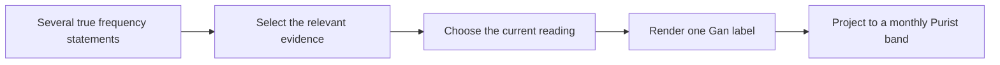

# Gan 2026: choosing one current seizure-frequency state

Date: 2026-08-10
Revised: 2026-08-22 (five-cell headline; cited score is select)

Status: paper source; selected results and development mechanism evidence

## The result

Gan asks for one current seizure-frequency label per letter. On the locked
`test450` split, the headline table is five role rows. Each of recognise,
encode, and select is rules, LLM, or both. The cited score is the select
stop. Named Gemini 3.7 Flash `test450` select stops:

| Recognise | Encode | Select | Purist |
| --- | --- | --- | ---: |
| rules | rules | rules | 0.73 |
| both | rules | rules | 0.82 |
| LLM | rules | rules | 0.83 |
| LLM | LLM | rules | 0.82 |
| LLM | LLM | LLM | 0.79 |

The headline row is **LLM / rules / rules** (codebook recognise, rule encode,
rule select) at 0.83. That is also the **six-model comparison row** on
both tasks. Holdout is aggregate-only. Do not inspect `test450` rows.

The source-near wording ablation (`gan_llm_extract_raw`) reaches 0.79 at
select on the same ablation stack. The paper may say wording can be kept
and later mapped into the gold form. It may not say the softer recognise
preserves clinical reasoning. `gan_llm_only` is a third prompt and is not
a results column.

The rules-only row is a standalone deterministic-pipeline holdout figure,
zero model calls. It is **not** ruleset-matched to the model-led rows:
those rows carry repair stages operating on model-produced structured
events, which the rules-only lane never had. The gap from rules to the
headline row is a method comparison, not a measurement of those repair
stages in isolation — see
[the rules-only test450 aggregate](../gan2026/rules_only_test450_aggregate_2026-08-10.md)
and its [protocol](../gan2026/rules_only_test450_aggregate_protocol_2026-08-10.md).

## What the task requires

A letter may contain a usual rate, a dated count, a recent cluster, a quiet
interval, and older history. Several statements can be true. Gan requires the
system to select one as the current state and render it in a fixed label form.

This makes Gan mainly a selection problem. On the proposed method the model
collects an event ledger with source text and makes the first pick. Recorded
rules can later change that pick or render the gold dialect. A grounded span
can still support the wrong event, period, or denominator. A gold-correct
label can also drop a bound that the span still holds.

## Where rule encode and select help

Development replay across six models on **cell 3 only** (LLM recognise, rules
encode, rules select) separates three main jobs:

1. **Evidence reconciliation** turns the model's selected span into a valid Gan
   label and clears much malformed or incomplete rate grammar. It is the first
   consequential change on 2,925 of 3,075 changed cells.
2. **Clinical selection rules** choose among competing readings, especially
   diary, dated-count, usual-rate, and breakthrough patterns.
3. **Free-interval handling** resolves a smaller set of seizure-free windows.

For ordinary point rates, pooled development accuracy rises from about 0.37 at
the model/resolve stage to 0.72 after evidence reconciliation, 0.85 after
clinical selection, and 0.88 at the final stage. These are development replay
checkpoints on the six-model cell-3 row, not holdout component estimates.

Those lifts are not one kind of rescue. A 13 Aug development provenance
study classified every first Purist rescue on the same six-model `dev750`
cell-3 replay (1,539 first-rescues):

| Where the rescued answer came from | First-rescues | Share |
| --- | ---: | ---: |
| Render the model's selected quote (`repair.selected_evidence`) | 1,437 | 0.93 |
| Compose a new label from events the model already extracted | 89 | 0.06 |
| Promote another event whose label already matched the rescue | 13 | 0.01 |
| Invent a rate from letter text the model never quoted | 0 | 0.00 |

So the mass first change is label rendering of a span the model already
chose. Clinical families can still switch the reading after that render —
`monthly_diary` has 152 any-rescues in the stage ledger — but those later
hops still operate on model events. On this development replay, Gan never
first-rescues by introducing a frequency the model did not capture as a
selected quote or as an extracted event.

See [rescue source provenance](../shared/hybrid_rescue_source_provenance_2026-08-13.md)
and the [exhibit](../shared/hybrid_rescue_source_provenance_2026-08-13.md).

## Where the difficulty remains

Cell 3 improves every model's overall holdout score, but the gain
is uneven across gold categories.

- **Ordinary rates** form the largest share of the task. Rules clear many
  malformed or over-cautious answers, but wrong rate selection remains.
- **Clusters** are the clearest shared floor. On holdout, cell-3 accuracy ranges
  from 0.41 to 0.68 across the six models.
- **Unknown cases** expose a trade-off. Some clinical rules turn a correct
  unknown into a false active rate or false seizure-free answer.
- **Seizure-free, range, and no-reference cases** gain strongly from explicit
  rendering and selection rules.

The main residual problem is no longer label syntax. It is choosing among
clinically plausible readings under the dataset's definition.

## One reviewable example

In development row `10`, Grok on the wording ablation quoted “≤ four per day.”
Recorded repair rendered `4 per day`, which is the Gan gold form. The span
stays in the object. The bound is not in the submitted label. That mapping
can be replayed on the same model output. Turning selected-evidence repair
off disables the whole renderer, not only bound-flattening. This gold still
scores `4 per day`.

See the [case explorer](reviewable_case_pair_2026-08-09.md)
for the recorded object.

## What this evidence supports

The retained evidence supports this account of the proposed method:

- the model collects an event ledger with source text and makes the first pick;
- recorded rules then shape that ledger into the designed form, and can
  later switch the reading;
- those mappings can be replayed without a new model call;
- the locked headline row (LLM / rules / rules) is 0.83 on Gemini;
- the six-model comparison is that cell-3 row only;
- most first development rescues re-render a span the model already chose;
  later clinical rules add both rescues and harms;
- clusters and current-state choice remain the hard part.

It does not establish state of the art, clinical validity, a universal hybrid
advantage, causal necessity for any rule, or a second use case from one
extraction.

## Evidence owners

- [Paper claim status C16, C18, and C19](../../canon/10_paper_provenance.md)
- [Six-model comparison](../shared/six_model_comparison_report_2026-07-18.md)
- [Gan stage replay](../gan2026/hybrid_stage_ablation_2026-08-06.md)
- [Rescue source provenance](../shared/hybrid_rescue_source_provenance_2026-08-13.md)
- [Gan category error record](../gan2026/category_error_catalog_2026-08-06.md)
- [Aggregate holdout categories](../shared/six_model_holdout_category_aggregates_2026-08-06.md)
