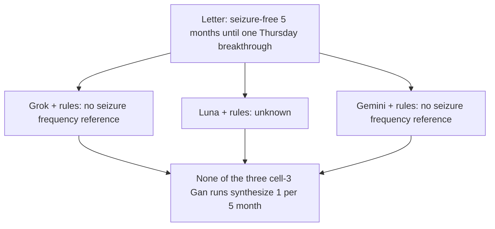

# Six-Model Single-Letter Walkthrough for Clinical Extraction Tasks

Date: 2026-08-19
Revised: 2026-08-22 (six-model row is cell 3 only)
Status: active paper source; illustrative comparative case layer
Parent: [Paper source library](../../NAVIGATION.md#paper-source-library) | [Flagship 3-letter suite](flagship_3_letter_suite_2026-08-11.md) | [Two reviewable evidence-to-output cases](reviewable_case_pair_2026-08-09.md)  

## Purpose and Research Boundary

This document provides an illustrative comparative layer for the manuscript: **a single clinical letter evaluated across all six roster models on cell 3 only** (LLM extract, rules encode, rules select), with one deep-dive case for **Gan 2026** (single-label frequency selection & normalization) and one for **ExECTv2** (multi-entity, multi-family phenotyping).

Rather than showing only aggregate tables, these two letters illustrate why models diverge, how different LLMs collect the same facts through different pathways, where specific failure modes occur (schema corruption, evidence drift, under-extraction, recency confusion), and how recorded rules then shape each model's output into the designed form.

### Safeguards and Provenance
- All cases are drawn exclusively from development splits: **Row 13190** from Gan `dev750` and **Letter EA0133** from ExECT `dev140`.
- Locked holdout splits (`test450` and `test60`) remain sealed and un-inspected.
- Traces are replayed from saved cell-3 runs (`raw_output`, no new
  calls). Gemini 3.7 Flash is the cited model for headline tables.
  - Gan cell 3 `dev750` on disk: Grok, Luna, Gemini.
    DeepSeek, Qwen, and Gemma Gan cell 3 `dev750` are missing; do not invent them.
  - ExECT cell 3 `dev140` on disk: Grok, Luna, Gemini, DeepSeek, Gemma.
    Qwen ExECT cell 3 is missing. Sol Compact dump paths are historical.

---

## 1. Gan 2026 Single-Letter Six-Model Case Study: Row 13190 (*John Doe*)

### Clinical Narrative and Context
A follow-up clinic consultation letter from a neurologist for a 40-year-old male with epilepsy managed on Carbamazepine monotherapy. The clinic note contains a critical temporal collision: the patient maintained a 5-month seizure-free interval until experiencing a single breakthrough focal impaired-awareness seizure "three Thursdays ago" triggered by sleep disruption.

```
+-----------------------------------------------------------------------------+
|                                                                             |
|  [ 5 months seizure-free ]  ------------->  [ Breakthrough seizure ]         |
|  (Historical baseline window)               (3 weeks / "three Thursdays ago")|
|                                                                             |
|  Benchmark Target: 1 event across the 5-month observation frame             |
|  -> Gold Label: "1 per 5 month"                                             |
+-----------------------------------------------------------------------------+
```

### Full Text Excerpt
> *"KINGS NEUROSCIENCES CENTRE*  
> *Clinic Date: 10 June 2023*  
> *Dr Wang, Saffron Park Hospital, London, E14 7JL*  
> *Dear Dr Wang*  
> *John Doe, DOB: 21-11-1982, Hospital No: P546484 NHS No. 5484656746*  
> *Flat 15 Roundwood Road, London, E14 7JL*  
> 
> *I reviewed the above patient in the Neurology Clinic today. Since our last contact, he has adopted a pillbox with phone reminders and reports that this has markedly reduced missed doses and improved his day-to-day stability. He feels more confident managing his medications and describes better energy levels with fewer fluctuations during the week.*  
> 
> *On Carbamazepine monotherapy he was seizure-free for 5 months, until a focal impaired-awareness seizure occurred three Thursdays ago. He recovered without injury and did not require hospital attendance. There were no witnessed convulsions, tongue biting or incontinence, and he reports an aura of brief disorientation followed by several minutes of confusion. He attributes the breakthrough event to a particularly disrupted week of sleep and work stress, though he did not miss any medication doses. He remains otherwise well and continues to use the adherence aids reliably.*  
> 
> *Examination today is unremarkable and there are no new adverse effects reported beyond occasional mild tiredness on late clinic days, which he feels is manageable. He denies rash, pruritus or mood change. We discussed ongoing self-management, the importance of sleep regularity, and continuing the current adherence strategy. Given the overall improvement, the prolonged seizure-free interval, and the isolated breakthrough event, I have not made any changes to his current Carbamazepine regimen today. We agreed to continue observation with the present plan and to review if there are any further events.*  
> 
> *I will follow up in three months, or sooner should he experience additional seizures or any concerns.*  
> *Yours sincerely"*

### Benchmark Gold Target and Taxonomy
- **Gold Label**: `1 per 5 month`
- **Gold Evidence**: *"On Carbamazepine monotherapy he was seizure-free for 5 months, until a focal impaired-awareness seizure occurred three Thursdays ago"*
- **Taxonomy Category**: `rate_denominator` (single event terminating a quiet interval)
- **Scorer Geometry**: `band_submonthly`

### Why This Note Is Hard
1. **Competing Temporal Anchors**: The note mentions both a 5-month duration ("seizure-free for 5 months") and an event recency anchor ("three Thursdays ago" / ~3 weeks).
2. **Rate Synthesis Requirement**: The correct clinical summary requires synthesizing the event count (1 breakthrough event) with the preceding quiet window (5 months) to form `1 per 5 month`, rather than extracting only the quiet state or only the isolated event date.

The shared structured-events prompt on this letter is
`gan2026_hybrid_structured_events_v0.5`: 13 instructions, 5,076
characters. That is the original short contract, not an ExECT-style
annotation manual. Lineage:
[Gan structured-prompt lineage](../gan2026/structured_prompt_lineage_2026-08-15.md).

### Six-Model Comparison Table (Gan Row 13190)

| Model | Cell 3 final label | Purist | What cell 3 did |
| :--- | :--- | :--- | :--- |
| **Grok 4.6** (identity) | `no seizure frequency reference` | **Wrong** | Extracted the 5-month free interval and the Thursday breakthrough; selected the last-event events. Repair: `'last event three Thursdays ago' -> 'no seizure frequency reference'`. LLM-only: `unknown`. Gold `1 per 5 month` was not synthesized. |
| **GPT-5.6 Luna** | `unknown` | **Wrong** | Cell 3 stays `unknown`. No evidence-reconciliation rescue on this letter. |
| **Gemini 3.7 Flash** | `no seizure frequency reference` | **Wrong** | Repair: `'1 seizure three Thursdays ago' -> 'no seizure frequency reference'`. LLM-only: `unknown`. |
| **DeepSeek / Qwen / Gemma** | — | pending | No Gan cell 3 `dev750` run. Do not reuse the old Sol-era walkthrough labels. |



---

## 2. ExECTv2 Single-Letter Six-Model Case Study: Letter EA0133 (*Mr Harry Harris*)

### Clinical Narrative and Context
A detailed, multimodal neurology clinic letter for a 67-year-old man with post-stroke epilepsy following a 2005 right MCA infarct. The letter contains dense clinical phenotyping spanning:
- **Diagnosis**: Post-stroke epilepsy, right MCA infarct, migraine, childhood febrile seizures, severe concussion.
- **Seizure Frequency**: Active focal motor seizures (2–3 per month), historical focal-to-bilateral convulsive seizures (last event 2015), pre-treatment frequency (1 per day).
- **Prescription Regimen**: Dual AED therapy (Carbamazepine 400 mg BD to be increased to 600 mg BD; Sodium Valproate 500 mg BD), secondary stroke prevention (Clopidogrel, Simvastatin, Ramipril), past failed drug (Levetiracetam discontinued due to mood change).
- **Investigations**: CT head showing gliosis in the right MCA territory.

### Full Text Excerpt
> *"Clinic Date 5/11/2017*  
> *Dear Dr,*  
> *Re: Mr Harry Harris. DOB 31/02/1950*  
> 
> *Diagnosis: Symptomatic structural epilepsy*  
> *           Right MCA infarct 2005*  
> 
> *Seizure type and frequency: Focal motor seizures, (left arm jerks) 2-3 per month*  
> *                            Focal to bilateral convulsive seizures, last event 2015*  
> 
> *Investigations: CT Head 1/3/2015 gliosis consistent with previous R MCA terrority infarct*  
> 
> *Medication: Carbamazepine 400mg bd*  
> *            Sodium Valproate 500mg bd*  
> *            Clopidogrel 75mg od*  
> *            Simvastatin 20mg od*  
> *            Ramipiril 5mg od*  
> 
> *I reviewed this 67-year-old man by telephone today. His epilepsy was diagnosed in 2015 after he had a convulsive epileptic seizure for the first time. With hindsight he had been having focal seizures, consisting of left arm jerks, for around 1 year before this. The focal seizures were occurring more frequently, perhaps once per day before the carbamazepine was introduced alongside the sodium valproate. He has previously tried levetiracetam but that caused significant mood change.*  
> 
> *As well as his cerebrovascular disease, he has high blood pressure and also gets ocassional migraine. Interestingly his brother also has had a stroke and has developed post stroked epilepsy, there is no other relevant family history. He was born prematurely at 32 weeks and weighed 2kg but had no developmental problems. He had 2 febrile seizures at the age of 8 months and 18 months. He has not had meningitis or encephalitis but has a significant head injury whilst playing rugby where he was unconscious for 1 hour and was kept in hospital overnight.*  
> 
> *He was working as a surveyor before the stroke but has stopped working since. He needs a stick to walk. He lives with his wife and has stopped smoking, previously having smoked cigars for around 35 years. He drinks 8 pints of dark stout a week.*  
> 
> *Mr Harris would like to get better control of his epilepsy – the focal seizures are troublesome and so in the first instance I would suggest increasing the carbamazepine to 600mg bd. I will review him again in clinic and arrange epilepsy nurse follow up."*

### What the letter contains versus what gold scores

The letter is dense. The four-family gold is not a dump of every clinical noun. The 14 gold mentions on this letter are:

| Family | Gold concept (CUI phrase) | Attributes that matter | How many gold mentions |
| :--- | :--- | :--- | :---: |
| Diagnosis | `symptomatic-structural-focal-epilepsy` | Certainty 5, Affirmed, DiagCategory Epilepsy | 1 |
| Diagnosis | `epilepsy` | Certainty 5, Affirmed, DiagCategory Epilepsy | 2 |
| Diagnosis | `epileptic-seizure` | Certainty 5, Affirmed, DiagCategory SingleSeizure | 1 |
| Diagnosis | `focal-motor-seizures` | Certainty 5, Affirmed, DiagCategory MultipleSeizures | 1 |
| Diagnosis | `focal-to-bilateral-convulsive-seizures` | Certainty 5, Affirmed, DiagCategory MultipleSeizures | 1 |
| Diagnosis | `focal-seizures` | Certainty 5, Affirmed, DiagCategory MultipleSeizures | 3 |
| SeizureFrequency | `focal-motor-seizures` | 2–3 per 1 Month | 1 |
| SeizureFrequency | `focal-to-bilateral-convulsive-seizures` | 0 seizures Since 2015 | 1 |
| Prescription | `carbamazepine` | Dose 400 mg, Frequency 2 | 1 |
| Prescription | `sodium-valproate` | Dose 500 mg, Frequency 2 | 1 |
| Investigations | `ct-abnormal` | CT_Performed Yes, CT_Results Abnormal | 1 |

Present in the letter and **outside** this scored set:

- `Right MCA infarct`, `migraine`, `febrile seizures`, rugby `head injury` (not four-family gold diagnoses)
- `Clopidogrel`, `Simvastatin`, `Ramipiril` (not anti-seizure; the prompt's medication lane rejects non-anti-seizure drugs)
- past `levetiracetam` trial and the planned `600mg bd` carbamazepine increase (historical / future medication)
- brother's `post stroked epilepsy` (family history; `diagnosis_context_only`)
- the narrative `once per day` rate before carbamazepine (not a gold SeizureFrequency mention)

The shared prompt tells models to skip most of that list. See [Appendix A](#appendix-a-exact-shared-prompt-ea0133). Comparing models against a 14-item *clinical* inventory that includes infarct, migraine, febrile seizures, head injury, and the three cardiovascular drugs therefore misstates both completeness and Luna's omission.

---

### Living hybrid scores (letter EA0133)

Promoted `exect_llm_with_rules` `dev140` cells, replayed 2026-08-19. Qwen is missing.

| Model | Cell 3 select F1 | Four-family letter-exact | Diagnosis / SF / Rx / Inv exact | Notes |
| :--- | ---: | :---: | :--- | :--- |
| **Grok 4.6** | 0.90 | no | F / T / T / T | Heading + narrative epilepsy, convulsive seizure, both heading rates, both AEDs, CT. Dictionary rewrote SSE. |
| **GPT-5.6 Luna** | 0.8889 | no | F / T / T / T | Heading types + epilepsy; skipped some narrative seizure mentions Grok kept. |
| **Gemini 3.7 Flash** | 0.8571 | no | F / F / T / T | Convulsive + focal narrative; SF family not letter-exact. |
| **DeepSeek V4 Flash** | 0.8889 | no | F / T / T / T | No separate extract-only cell on disk. |
| **Gemma 4 26B** | 0.7619 | no | F / F / F / T | Extra levetiracetam / 600 mg plan; weakest cell-3 F1 on this letter. |
| **Qwen 3.8 27B** | — | pending | — | No cell 3 run. |

---

### Unique gold-fact checklist

`Y` = the model emitted a mention for that fact. Dictionary/residual additions are marked. Unscored letter facts are separated at the bottom so they are not counted as misses.

| Fact | In gold? | Grok | Luna | Gemini | DeepSeek | Qwen | Gemma raw | Gemma after dictionary |
| :--- | :---: | :---: | :---: | :---: | :---: | :---: | :---: | :---: |
| Heading `Symptomatic structural epilepsy` → gold `symptomatic structural focal epilepsy` | yes | Y (rewritten) | Y (rewritten) | Y (rewritten) | Y (rewritten) | Y (model already remapped) | Y (rewritten) | Y |
| Narrative `epilepsy` | yes | Y | — | Y | Y | — | family-history only | dropped |
| `convulsive epileptic seizure` | yes | — | — | Y | — | — | — | — |
| `Focal motor seizures` as Diagnosis | yes | Y | Y | Y | Y (duplicated) | Y | — | added residual |
| `Focal to bilateral convulsive seizures` as Diagnosis | yes | Y | Y | Y | Y (duplicated) | Y | — | added residual |
| Narrative `focal seizures` as Diagnosis | yes | Y | — | — | — | Y | Y | Y |
| SF `Focal motor` 2–3 / month | yes | Y | Y | Y | Y | Y | — | — |
| SF `FTBCS` last event 2015 | yes | Y | Y | Y | Y | Y | — | — |
| `Carbamazepine 400mg bd` | yes | Y | Y | Y | Y | Y | Y | Y |
| `Sodium Valproate 500mg bd` | yes | Y | Y | Y | Y | Y | Y | Y |
| `CT Head` abnormal | yes | Y | Y | Y | Y | Y | Y | Y |
| Cardio list (Clopidogrel / Simvastatin / Ramipiril) | no | — | — | — | — | — | — | — |
| Migraine / febrile seizures / head injury / MCA infarct as Diagnosis | no | — | — | — | — | — | — | — |
| Historical `once per day` SF | no | Y | — | — | — | as `Infrequent` | Y | Y |
| Past `levetiracetam` | no | — | — | — | — | Y | Y | Y |
| Planned `600mg bd` increase | no | — | — | — | — | — | Y | Y |
| Brother's epilepsy | no | — | — | — | — | — | Y (`Affinted`) | dropped |

---

### Detailed analysis of model divergence

The live call is one JSON object of `clinical_events`. The prompt says each event may render more than one family when the same fact belongs to more than one requested family. Sol dual-renders heading seizure types as Diagnosis + SeizureFrequency inside one event. Luna splits those into two events but still dual-covers the heading. Gemma mostly does not cover the heading rates at all.

```
+---------------------------------------------------------------------------------------------------+
| SAME PROMPT, DIFFERENT KEEP/REJECT DECISIONS ON EA0133                                             |
+---------------------------------------------------------------------------------------------------+
|  Gemma 4 26B        | Follows narrative ledger; misses heading SF; illegal enum; extra meds        |
|  Qwen 3.6:35B       | Concepts mostly right; evidence not an exact substring; remaps SSE text      |
|  GPT-5.6 Luna       | Heading-only current facts; skips the same unscored extras as everyone else  |
|  DeepSeek V4 Flash  | Heading + narrative epilepsy; duplicate Diagnosis renders                     |
|  Gemini 3.7 Flash   | Heading + narrative epilepsy and first convulsive seizure                    |
|  GPT-5.6 Sol        | Heading + narrative epilepsy + historical daily rate; dictionary still fires |
+---------------------------------------------------------------------------------------------------+
```

#### 1. Grok was not already gold-shaped: dictionary rewrite of the heading diagnosis

Sol's raw Diagnosis mention is letter-exact:

```json
{
  "entity": "Diagnosis",
  "text": "Symptomatic structural epilepsy",
  "evidence": "Diagnosis:\tSymptomatic structural epilepsy",
  "attributes": {"Certainty": "5", "DiagCategory": "Epilepsy", "Negation": "Affirmed"}
}
```

Gold wants `symptomatic-structural-focal-epilepsy` (`C0472349`). The letter never contains the word `focal` in that heading. The diagnosis convention regex maps `symptomatic structural (?:frontal lobe |temporal lobe )?epilepsy` onto `symptomatic structural focal epilepsy`. After `standard_dictionary_diagnosis_convention`:

| Surface | `text` | `normalized_concept` | Owner |
| :--- | :--- | :--- | :--- |
| `source_scored` / `evidence_valid` | `Symptomatic structural epilepsy` | `Epilepsy` | `gpt56sol_structured_model_facts` |
| `dictionary_normalized` / final predicted | `symptomatic structural focal epilepsy` | `symptomatic structural focal epilepsy` | `...+standard_dictionary_diagnosis_convention` |

The same rewrite fires for Luna, Gemini, DeepSeek, and Gemma. Qwen already wrote `symptomatic structural focal epilepsy` as mention text — that string is **not** in the letter — and the dictionary still normalized it. Sol's raw answers are source-near, not gold-phrase-perfect.

The relevant prompt rule is the opposite of that rewrite: *“Every rendered mention text must be an exact substring of the letter.”* The model followed the prompt; the later dictionary step is a benchmark-format convention, not a model success.

#### 2. Luna under-extracted, but not on the unscored extras

Luna emitted eight mentions: heading SSE, heading focal-motor and FTBCS as both Diagnosis and SeizureFrequency, both current AEDs, and CT. It did **not** emit Clopidogrel, Simvastatin, Ramipiril, febrile seizures, migraine, or head injury.

Neither did Sol. Neither did any of the six models. Those omissions follow the prompt, not a Luna-only filter:

- Family guidance: medication is *“Anti-seizure medication events.”*
- Event-lane guide: `reject: non-anti-seizure medication or unsupported plan`.
- Clinical rule: *“Do not render childhood febrile seizures, family-history seizures… as current SeizureFrequency unless the sentence explicitly gives the patient's current frequency state.”*
- Clinical rule: *“Do not add generic epilepsy from family history, clinic names, medication labels, or weak context.”*
- Ledger row `K9` (`He had 2 febrile seizures…`) is already tagged `lane_hint: reject`.

Luna's real difference versus Grok is heading-only conservatism. The prompt also says *“Scan the letter globally for the four key families; do not stop at section headers”* and *“When the letter explicitly states both a generic epilepsy diagnosis and a specific syndrome or seizure type, render both.”* Sol kept the narrative `His epilepsy was diagnosed in 2015…` mention and the historical `once per day` focal-seizure event. Luna kept only the header block. The first of those is gold; the second is not a gold SeizureFrequency mention. Calling Luna “8/14 complete” because it skipped cardio drugs is the wrong denominator.

#### 3. Qwen: the three recorded evidence repairs

Qwen's gate list on this letter is exactly three events — not six, and not illegal enums. The letter stores heading lists with tabs. Qwen rebuilt those lists as `Section:\t\titem`, which is not a substring.

**Repair 1 — `repaired_evidence_from_mention_text` (Diagnosis).**  
Qwen evidence: `Seizure type and frequency:\t\tFocal to bilateral convulsive seizures, last event 2015`  
That string is not in the letter. The heading is `Seizure type and frequency:\tFocal motor seizures…` and the FTBCS line is a *following* tab-indented row. Mention text `Focal to bilateral convulsive seizures` **is** a substring, so the Diagnosis mention's evidence is replaced with the mention text.

**Repair 2 — `repaired_evidence_from_mention_text` (Prescription).**  
Qwen evidence: `Medication:\t\tSodium Valproate 500mg bd`  
Not a substring. The source is `Medication:\tCarbamazepine 400mg bd` then a newline and `\t\tSodium Valproate 500mg bd`. Mention text `Sodium Valproate 500mg bd` is a substring, so evidence becomes that item span.

**Repair 3 — `repaired_evidence_exact_copy` (SeizureFrequency).**  
Mention-text fallback applies only to Diagnosis and Prescription. The FTBCS SeizureFrequency mention still had the illegal `Section:\t\titem` evidence. `repair_section_header_list_item_evidence_copy` splits on the colon, finds the header and the list item, and copies the exact source span from the header through that item:

| | Evidence |
| :--- | :--- |
| Qwen raw | `Seizure type and frequency:\t\tFocal to bilateral convulsive seizures, last event 2015` |
| After exact-copy | `Seizure type and frequency:\tFocal motor seizures, (left arm jerks) 2-3 per month\n\t\tFocal to bilateral convulsive seizures, last event 2015` |

The prompt rule these repairs exist for is: *“Both anchor_text and evidence must be exact substrings of the letter”* and *“Before returning JSON, remove … events whose evidence or mention text is not an exact source substring.”* Qwen kept the events; deterministic code made the evidence exact.

Qwen also violated the mention-text rule on SSE (`symptomatic structural focal epilepsy` is not in the letter) and emitted past levetiracetam, against *“previous trials, stopped drugs, future starts, titration targets … are usually rejected.”*

#### 4. Gemma: full error list

Gemma's raw `Affinted` is real, but it is not on the patient's heading diagnosis. It is on the brother's epilepsy. Raw mention:

```json
{
  "entity": "Diagnosis",
  "text": "epilepsy",
  "evidence": "Interestingly his brother also has had a stroke and has developed post stroked epilepsy, there is no other relevant family history.",
  "attributes": {
    "DiagCategory": "Epilepsy",
    "Certainty": "5",
    "Negation": "Affinted"
  }
}
```

Closed vocabulary is `["Affirmed", "Negated"]` (Appendix A, Diagnosis attributes). `repair_attributes` logs `Diagnosis: dropped_illegal_value: 'Negation'='Affinted' not in ['Affirmed', 'Negated']` and **drops the key**. It does not rewrite `Affinted` to `Affirmed`. After the gate the mention remains a patient-level `epilepsy` Diagnosis with no Negation.

The rest of Gemma's raw events on this letter:

1. **Illegal enum** `Negation='Affinted'` on family-history epilepsy (above).
2. **Wrong subject.** Ledger `K8` is tagged `diagnosis_context_only`. Prompt: do not add generic epilepsy from family history. Gemma still rendered a Diagnosis mention.
3. **Missed heading SF `Focal motor seizures, 2-3 per month`.** Prompt SF-recall rule: *“Seizure type and frequency headings are high-value evidence.”*
4. **Missed heading SF `Focal to bilateral convulsive seizures, last event 2015`.** Same rule, plus last-event → `NumberOfSeizures='0'` / `Since` / `YearDate`.
5. **Missed heading Diagnosis** for both named heading types (no dual-render).
6. **Replaced heading rates with a later narrative estimate**: `once per day before the carbamazepine was introduced`. Prompt: *“Do not replace a heading frequency with a later vague narrative estimate unless the later statement is an explicit newer quantified correction.”*
7. **Emitted the planned dose increase** `carbamazepine to 600mg bd` as a Prescription. Prompt: *“requested dose increases … are not current Prescription mentions.”* Ledger `K10` is a current-regimen hint; the written rule still says reject the plan.
8. **Emitted historical introductions** of carbamazepine and sodium valproate as dose-less Prescriptions. Prompt lane: `future_or_historical_medication`. These are the “missing dose attributes” — they were never current-regimen rows.
9. **Emitted past `levetiracetam`.** Same historical-trial reject rule as Qwen.
10. **Did emit** the current `Carbamazepine 400mg bd` and `Sodium Valproate 500mg bd`, heading SSE, narrative `focal seizures` Diagnosis, and CT. Those five are the clean raw hits.
11. **Did not emit** cardio drugs, migraine, febrile seizures, or head injury — same as the other models.

Cell 3 dictionary after that: rewrite SSE → `symptomatic structural focal epilepsy`; drop the family-history `epilepsy` mention as convention noise; add residual heading diagnoses `focal motor seizures` and `focal to bilateral convulsive seizures`. That is why the assembled letter has 12 predicted mentions from 11 raw (11 − 1 + 2). Dictionary does **not** restore the two missing heading SeizureFrequency mentions.

#### 5. Gemini and DeepSeek, briefly

Gemini is the only model that also rendered `convulsive epileptic seizure` (gold `epileptic-seizure`, SingleSeizure) from `His epilepsy was diagnosed in 2015 after he had a convulsive epileptic seizure for the first time.` Prompt: *“When the letter explicitly states both a generic epilepsy diagnosis and a specific syndrome or seizure type, render both.”*

DeepSeek emitted those heading seizure types twice as Diagnosis: once as standalone diagnosis events and again as dual-renders on the SF events. Mention count 11 therefore includes duplicates, not extra families.

---

## 3. Summary of Key Architectural Insights

1. **Deterministic stages change answers that already look clean.** On Gan Row 13190, Grok/Luna/Gemini cell 3 do **not** synthesize `1 per 5 month`. On ExECT EA0133, the diagnosis dictionary still rewrites letter-exact `Symptomatic structural epilepsy` to gold `symptomatic structural focal epilepsy` for Grok and the other present cell-3 runs.
2. **Schema and evidence gates are specific, not a generic “open-weight crash pad”.** Gemma's illegal `Affinted` is dropped, not mapped to `Affirmed`, and it sits on a family-history mention the dictionary later removes. Qwen needed substring repair, not enum repair.
3. **The same prompt produces different keep/reject sets.** Medication guidance (`anti-seizure` only; reject plans and past trials), SF-recall (prefer heading rates), dual-family rendering, and `diagnosis_context_only` are the instructions the six models split on. Luna's smaller inventory is heading-only conservatism, not a failure to extract Clopidogrel. Gemma's larger inventory is narrative-ledger over-read plus missed heading rates.
4. **Gan and ExECT still fail differently.** DeepSeek's recency arithmetic on Gan Row 13190 does not reappear on this ExECT letter; here DeepSeek's cost is duplicate Diagnosis renders. Do not transfer a model's Gan failure mode onto ExECT.

---

## Appendix A. Exact shared prompt (EA0133)

This appendix is a faithful transcript of the live `v0.9.24` payload.
It is not a recommended paper appendix. Provenance and the v10 cut
are in
[Decision 0054](../../decisions/0054-model-request-order-and-metadata-are-explicit.md) / [prompt variant slots](../exectv2/prompt_variant_slots_2026-08-16.md).

Source: `prompt_input_json` on every structured one-call row for this letter. Prompt version **`exectv2_hybrid_key_family_event_ledger_v0.9.24`**. Profile `full`.

The live call also included **49 worked examples** from the same version. They are omitted here (they are not letter-specific). Prompt text below is the shared ExECT pre-post request (cell 2 wording). Do not treat Compact-dump Sol artifacts as the identity trace.

In heading lists, `⇥` marks a tab. Those tabs are part of the exact-substring contract.

### A.1 Task

> Read the clinical letter once. Use the candidate_evidence_ledger as attention scaffolding, then build a compact list of source-near clinical events for medication, diagnosis, seizure frequency, and investigations. Each event may render one or more entity mentions when the same clinical fact validly belongs to more than one requested family.

### A.2 Architecture

- **name:** single hybrid key-family event ledger
- **component_ownership:** The deterministic ledger proposes possible evidence spans only. The model owns keep/reject/split/merge decisions and final rendered mentions. Deterministic code later validates evidence, strips illegal attributes, attaches finite ontology codes, and evaluates outputs.
- **inspiration:** Gan structured-events discipline: source-near candidate evidence, typed state lanes, exact evidence, then final mention renderings.

### A.3 Decision procedure

1. Scan the letter globally for the four key families; do not stop at section headers.
2. Use candidate_evidence_ledger rows as likely evidence anchors, but do not emit a row unless the full sentence supports a requested family.
3. For each candidate, choose a lane, then keep/reject/split/merge. Write the lane decision into event_state when it helps transparency.
4. Render final mentions only after the source-near event state is clear. Counts, dates, result status, dose, and certainty belong in attributes, not in improvised text.
5. Before returning JSON, remove duplicates and remove events whose evidence or mention text is not an exact source substring.

### A.4 Family guidance

- **diagnosis:** Diagnostic concepts such as epilepsy, focal epilepsy, seizure disorder, or named seizure types. Render atomic Diagnosis mentions with DiagCategory, Certainty, and Negation. Preserve uncertainty words and avoid vague symptoms or non-epileptic differentials unless they are explicitly asserted as epileptic diagnoses, even when they appear in a Diagnosis/problem-list section. Mention text should be the clean core concept span; hedging belongs in Certainty.
- **investigation:** EEG, MRI, CT, telemetry, and related investigation statements. Render Investigations with performed/result/type attributes only for completed or resulted tests, not planned repeats or bare modality references.
- **medication:** Anti-seizure medication events. Render Prescription mentions with DrugName, DrugDose, DoseUnit, and Frequency when stated. The rendered text should preserve the medication item's annotation-facing span: full compact regimen when present in a medication list, bare drug name when that is all the note states.
- **seizure_frequency:** How often a seizure type occurs, including seizure-free duration, ranges, interval cadence, cluster counts, dated counts, and frequency change. Preserve the stated seizure anchor and temporal frame instead of converting it into a guessed rate; exclude non-epileptic events and blackouts unless the letter states they are epileptic seizures.

### A.5 Event-lane guide

- **diagnosis:** `diagnosis_assertion` (patient-level epilepsy syndrome or named seizure type); `diagnosis_context_only` (discussion, family history, risk, SUDEP, or education); `symptom_or_nonepileptic`; `reject`.
- **investigation:** `performed_investigation`; `not_performed`; `planned_investigation`; `reject`.
- **medication:** `current_regimen`; `rescue_regimen`; `future_or_historical_medication` (start/introduce/increase/previous/stopped/trial); `reject` (non-anti-seizure medication or unsupported plan).
- **seizure_frequency:** `active_rate`; `seizure_free_anchor`; `qualitative_change`; `reject` (diagnosis-only, family history, unlabelled events, historical best period).

### A.6 Output schema

One object: `clinical_events[]`, each with `family` (`medication | diagnosis | seizure_frequency | investigation`), `anchor_text`, `evidence`, `event_state`, `mentions[]` (`entity`, `text`, `attributes`), `confidence` (`low | medium | high`), `rationale`.

### A.7 Attribute vocabulary (closed values only)

- **Diagnosis.Negation:** `Affirmed`, `Negated`
- **Diagnosis.Certainty:** `1` … `5`
- **Diagnosis.DiagCategory:** `Epilepsy`, `MultipleSeizures`, `SingleSeizure`, `epilepsy`
- **Prescription.DoseUnit:** `g`, `mg`
- **Prescription.Frequency:** `1`, `2`, `3`, `As_Required`
- **Investigations:** `CT/EEG/MRI_Performed` = `Yes`/`No`; `*_Results` = `Abnormal`/`Normal`/`Unknown`; `EEG_Type` = `SleepDeprived`/`Standard`/`VideoTelemetry`
- **SeizureFrequency.FrequencyChange:** `Decreased`, `Frequent`, `Increased`, `Infrequent`, `Same`
- **SeizureFrequency.PointInTime:** `Birthday`, `DrugChange`, `LastClinic`, `Last_Month`, `Last_Week`, `Last_Year`, `Surgery`
- **SeizureFrequency.TimePeriod:** `Day`, `Month`, `Week`, `Year`, `days`
- **SeizureFrequency.TimeSince_or_TimeOfEvent:** `During`, `Since`

CUI / CUIPhrase must be omitted unless explicitly available. Open string fields (DrugName, DrugDose, counts, dates) are copied or normalized from the letter.

### A.8 Clinical rules (complete list from the live prompt)

1. First classify each candidate_evidence_ledger item into an event lane: current_regimen, rescue_regimen, future_or_historical_medication, diagnosis_assertion, diagnosis_context_only, active_rate, seizure_free_anchor, qualitative_change, performed_investigation, planned_investigation, or reject.
2. Candidate ledger rows are not predictions. Keep, reject, split, merge, or add events based only on the full letter and exact evidence.
3. Return only final clinical_events. Do not return candidate IDs unless you copy them into event_state as trace strings.
4. Write each rationale as one short final-justification sentence. Do not show step-by-step reasoning, self-questioning, alternative options, or quoted prompt rules inside rationale.
5. Use one event per medication, diagnostic concept, seizure-rate statement, or test.
6. Both anchor_text and evidence must be exact substrings of the letter.
7. Every rendered mention text must be an exact substring of the letter.
8. Named seizure types can render both Diagnosis and SeizureFrequency when the letter states both the type and a rate or seizure-free state.
9. Do not force a single entity if the same fact belongs to more than one requested family; render each valid entity separately.
10. For diagnosis, split compound seizure clauses into atomic diagnostic concepts when the letter names more than one seizure type.
11. Every Diagnosis mention must include Certainty and Negation. Use Certainty='5' and Negation='Affirmed' for directly stated diagnoses or seizure types unless the letter explicitly says otherwise.
12. For Diagnosis certainty, preserve diagnostic hedging: use Certainty='4' for probable or likely diagnoses, Certainty='3' for possible, suspected, query, or differential diagnoses, and Certainty='5' only for established or unqualified statements.
13. For Diagnosis concepts, prefer the most specific epilepsy syndrome or seizure type stated in the letter, such as focal epilepsy, temporal lobe epilepsy, primary generalised epilepsy, or JME. When the letter explicitly states both a generic epilepsy diagnosis and a specific syndrome or seizure type, render both as separate Diagnosis mentions; do not collapse one into the other.
14. When a Diagnosis heading or impression states an epilepsy subtype using the word epilepsy, such as 'Temporal lobe epilepsy' or 'Symptomatic structural focal epilepsy', render the subtype and also render generic 'epilepsy' only when the source itself explicitly uses the word epilepsy as a diagnosis. Do not add generic epilepsy from family history, clinic names, medication labels, or weak context.
15. Do not add a generic epilepsy companion to a specific epilepsy subtype unless the source separately asserts generic epilepsy as its own diagnosis or context says the patient has/has known epilepsy. For example, 'Diagnosis: symptomatic structural focal epilepsy' renders only 'symptomatic structural focal epilepsy'.
16. When narrative says 'intractable epilepsy', keep the modifier in the Diagnosis text; do not shorten it to generic 'epilepsy'.
17. In phrases like 'general and complex partial seizures', do not emit 'general seizures'; render 'complex partial seizures' unless another explicit named generalised seizure type is present.
18. Onset-history phrases such as 'epilepsy started at age 4' are not a separate Diagnosis mention when the same letter already provides the current diagnosis or named seizure types.
19. For Diagnosis mention text, render only the core clinical concept span. Do not include section labels, dashes, hedging words ('probable', 'possible', 'query'), qualifiers like 'single' or 'alone', or surrounding explanation in the mention text; put uncertainty in Certainty instead.
20. Do not render bare modifiers such as 'focal', 'generalised', 'probable focal', or 'possibly generalised' as Diagnosis mentions. When such wording appears in a Diagnosis heading modifying epilepsy, render the implied concept, for example 'focal epilepsy' or 'generalised epilepsy'.
21. When a Diagnosis heading combines an established epilepsy type with a probable anatomical qualifier, render two concepts with separate certainty: for example 'focal epilepsy-Probable temporal' means text 'focal epilepsy' with Certainty='5' and text 'temporal lobe epilepsy' with Certainty='4'.
22. When a Diagnosis heading states established epilepsy before a dash and an uncertain subtype after the dash, keep the generic epilepsy diagnosis at Certainty='5' and apply the lower certainty only to the subtype; for example 'Epilepsy - unclassified, possibly generalised' renders 'epilepsy' Certainty='5' and 'generalised epilepsy' Certainty='3'.
23. For abbreviated syndromes, use the exact abbreviation as mention text when that is the source span, for example text 'JME' or 'jme' with Certainty from probable/possible context.
24. Do not render vague symptoms, blackout/loss-of-consciousness descriptions, anxiety, or non-epileptic events as Diagnosis unless the same phrase is explicitly asserted as an epileptic seizure, epilepsy diagnosis, or named seizure type.
25. Do not render negated resemblance statements as Diagnosis or SeizureFrequency. Phrases such as 'no events which resemble absences, myoclonus or focal seizures' are explicit absence of those events, not affirmed diagnoses or seizure-frequency states.
26. Do not render isolated symptoms or aura features as Diagnosis, including myoclonic jerks, jerks, flashing lights, odd sensations, altered awareness by itself, or dizziness, unless the phrase is part of a named seizure type such as 'focal seizures with altered awareness'.
27. For tonic-clonic seizure wording, preserve 'tonic clonic' or 'tonic-clonic'. Never write 'tonic chronic'.
28. For Diagnosis headings like 'generalised tonic clonic seizures with myoclonic jerks, possible JME', render the plural tonic-clonic seizure type as Diagnosis and render JME with lower certainty; do not render isolated 'myoclonic jerks' as a Diagnosis mention.
29. For composite Diagnosis headings such as 'complex partial seizures with secondary generalised tonic clonic seizures', split the heading into separate Diagnosis mentions for the named seizure types instead of returning the whole clause as one text span.
30. A problem-list or Diagnosis header is not enough by itself: still exclude anxiety, dissociative/non-epileptic events, blackouts, collapse, and loss of consciousness from the requested Diagnosis family unless the phrase is explicitly asserted as epileptic.
31. For diagnosis, use DiagCategory='Epilepsy' for epilepsy syndromes or diagnoses. Use DiagCategory='SingleSeizure' for one singular named seizure event such as 'focal seizure'. Use DiagCategory='MultipleSeizures' for plural named seizure types such as 'focal seizures' or 'generalised tonic clonic seizures', and for phrases that represent multiple seizure types or recurrent seizures as a category.
32. Keep plural seizure-type wording plural in Diagnosis text. Source phrases such as 'absence like seizures' or 'absence-like seizures' render as plural Diagnosis text with DiagCategory='MultipleSeizures', not singular 'absence like seizure'.
33. For seizure frequency, mention text is only the seizure-type anchor; do not include counts, dates, or the words 'seizure frequency' in text. event_state and attributes carry counts, periods, dates, and changes.
34. Never emit a SeizureFrequency mention with empty attributes, only Negation, or only CUI/CUIPhrase. A valid SeizureFrequency mention must include a frequency-state attribute such as NumberOfSeizures, LowerNumberOfSeizures, FrequencyChange, TimeSince_or_TimeOfEvent, PointInTime, DayDate, MonthDate, YearDate, AgeLower, or AgeUpper.
35. For SeizureFrequency anchors, use the generic seizure phrase when the count refers to seizures generally; use a named seizure type only when the count explicitly belongs to that type.
36. SF recall: Seizure type and frequency headings are high-value evidence. If a heading says 'seizures every 3 to 4 weeks', 'several seizures since last clinic', '2 generalised tonic clonic seizures 2014', or a named seizure type plus a date, render a SeizureFrequency mention for that anchor even when the count is approximate or dated. Do not replace a heading frequency with a later vague narrative estimate unless the later statement is an explicit newer quantified correction.
37. When a seizure-frequency heading names a plural seizure type followed only by a year or date, treat it as one dated occurrence of that named type unless another count is attached to that same type. For example, 'absence like seizures 2014' has NumberOfSeizures='1', YearDate='2014', and TimeSince_or_TimeOfEvent='During'.
38. SF state choice: statements that seizures have returned or have been experienced since a triggering event are active seizure states, not unknown states. Use active-rate attributes when a count, cadence, date, or since-frame is present; use unknown only when the letter names current seizures but gives no count, cadence, change, or seizure-free time frame.
39. For named seizure types, preserve clinically meaningful modifiers that are part of the exact phrase, including 'with altered awareness', 'focal to bilateral', lobe qualifiers, convulsive, tonic clonic, absence-like, and myoclonic.
40. When a named seizure-frequency row says 'focal seizures with altered awareness approximately 1 per fortnight', keep the full named anchor 'focal seizures with altered awareness' rather than shortening it to 'focal seizures'.
41. Do not render SeizureFrequency for generic events, blackouts, collapse, anxiety attacks, or dissociative/non-epileptic events unless the same phrase is explicitly asserted as epileptic seizures.
42. SF precision: reject generic spell anchors such as 'events', 'episodes', 'episodes of loss of consciousness', 'minor seizures', and 'jerks' when the letter describes uncertain attacks, dizziness, loss of consciousness, shaking, or light-triggered jerks without explicitly asserting that the anchor itself is an epileptic seizure type.
43. Do not render childhood febrile seizures, family-history seizures, risk discussion, or old previous-event context as current SeizureFrequency unless the sentence explicitly gives the patient's current frequency state.
44. SF precision: do not render risk or counselling statements such as 'risk of further seizures', 'at risk of further seizures', or 'even though he has only had one seizure' as SeizureFrequency.
45. SF precision: do not render non-epileptic or diagnostically vague episode descriptions as SeizureFrequency, even when they include a cadence, such as 'episodes around twice a week of an unusual thought'.
46. SF precision: do not render old or contextual minor-seizure episode phrases such as 'the episodes occur 4 to 5 times a year' unless the sentence explicitly asserts a current scorable epileptic seizure type.
47. Onset-history statements such as 'seizures since the age of 13' are not SeizureFrequency by themselves. Use them only as a seizure-free since-age anchor when the same sentence says the last seizures were in a past age range such as the teenage years.
48. For seizure-frequency ranges, never write values like '2 to 3', '2-4', or '3 or 4' in NumberOfSeizures. Use LowerNumberOfSeizures and UpperNumberOfSeizures instead.
49. For approximate count words without exact numbers, use conservative integer counts only when the letter clearly describes seizures: 'couple'='2', 'few'='2', and 'several'='3'.
50. For interval rates such as 'one every 3 to 4 weeks', set NumberOfSeizures='1', LowerNumberOfTimePeriods='3', UpperNumberOfTimePeriods='4', and TimePeriod='Week'. Do not convert the interval into 3 to 4 seizures.
51. For cluster statements, keep the cluster as the clinical event when the note counts clusters, for example text 'cluster of seizures' with NumberOfSeizures='1' and the stated date or time frame.
52. For frequency-change statements without an exact count, render a SeizureFrequency mention with FrequencyChange only, such as Frequent, Infrequent, Increased, Decreased, or Same.
53. For dated counts such as '2 to 3 in March', use Lower/Upper count fields plus MonthDate or YearDate and TimeSince_or_TimeOfEvent='During'; do not invent TimePeriod='Month' unless the note says per month.
54. For 'since last clinic', use TimeSince_or_TimeOfEvent='Since' and PointInTime='LastClinic'; do not put 'since last clinic' in TimePeriod.
55. For last-event or seizure-free statements, use NumberOfSeizures='0' with TimeSince_or_TimeOfEvent='Since' and the stated MonthDate, YearDate, or PointInTime. Do not convert last-event dates into an annual recurring rate.
56. Phrases like 'last seizure', 'last event', or 'has had none since' mean seizure-free since that anchor for the named seizure type; do not render them as one seizure during that date or as an active current-rate statement.
57. Do not infer seizure-free from phrases like 'last seizure coincided with missing medication' or 'previous seizure was a year ago' unless the source also gives a clear no-further/since frame for the same seizure type.
58. For seizure-free statements, anchor text to the underlying seizure phrase when it is present in the same sentence, such as 'seizures' or 'focal seizures'; otherwise use the exact seizure-free phrase.
59. SF precision: do not render safety-advice, conditional, or instructional statements as SeizureFrequency. Phrases such as 'if you have a seizure', 'in the event of a seizure', 'advised what to do if seizures occur', or general SUDEP/driving advice describe guidance, not a current rate.
60. SF precision: do not emit a bare seizure-free or 'well controlled' SeizureFrequency mention unless it is tied to a seizure type, a count, or a temporal anchor (since/last/date). A standalone 'seizure free' with no seizure type and no time frame is not a scorable SF state.
61. Phrases such as 'remains seizure free and is now driving' or 'seizures were well controlled on medication' are not enough for a SeizureFrequency mention unless they name the seizure type and give a since/date/drug-change frame.
62. SF precision: do not use an anaphoric anchor such as 'these seizures', 'such episodes', or 'the events' as the SeizureFrequency text. Use the specific named seizure type stated earlier in the same context, or the generic 'seizures' when the count refers to seizures in general.
63. SF precision: when a sentence names two seizure types joined by 'and' with a single shared count, render the count against the seizure type it actually belongs to, not a merged 'X and Y' anchor; only split into two SF mentions if the letter gives each type its own count or state.
64. SF precision: emit at most one SeizureFrequency mention per distinct rate statement. Do not emit both a generic 'seizures' mention and a named-type mention for the same single count in the same clause.
65. For medication, mention text is the medication name where possible; dose and frequency belong in attributes.
66. Medication decision lane: current ordinary regimens and rescue as-required regimens render Prescription mentions; previous trials, stopped drugs, future starts, titration targets, options, and if-further-seizures plans are usually rejected.
67. Medication current-list split dosing: if a current regimen gives unequal time-of-day doses such as 'Epilim 300 mg mane and 600 mg nocte' or 'Lamictal 100 mg in the morning, 175 mg in the afternoon', render separate Prescription mentions with Frequency='1'. Do not mark these current scheduled doses as As_Required.
68. Medication plan boundary: future starts, requested dose increases, taper targets, or if-further-seizures instructions are not current Prescription mentions unless a separate current/taking/on-medication statement supports them.
69. Medication frequency completion: when the selected current regimen says 'twice a day', 'twice daily', or 'bd', include Frequency='2'; when it says once daily, mane, nocte, morning, or evening, include Frequency='1'.
70. For medication list entries that contain a compact regimen, render text as the exact medication item span including dose and frequency when those words are part of the same short line, for example 'Topiramate 100 mg BD'.
71. For investigations, use one event per modality such as EEG, MRI, or CT; put performed, result, and EEG type in attributes.
72. ECG is not an ExECTv2 target investigation. Never map ECG to EEG, MRI, or CT, and do not emit an Investigations mention from ECG-only evidence.
73. Investigation decision lane: completed historical tests and tests with results render Investigations mentions; planned/requested/repeat tests without a completed result are rejected.
74. Do not render future planned, requested, repeat, or follow-up investigations as performed tests. Only render completed tests or tests with a stated result.
75. Investigation pending-test cues are decisive: if the test sentence contains 'will', 'arrange', 'request', 'await'/'awaiting', 'appointment', 'suggest', 'recommend', 'should update', 'chase', 'up to date', 'not yet performed/received', or 'planned', treat it as a pending test and do not emit an Investigations mention for it unless a separate completed result for the same modality is also stated.
76. Never emit an Investigations mention whose only support is a pending cue with Performed='No' or an unknown result; a requested or awaited test is not a completed historical test.
77. Do not render a bare modality-only investigation when the note gives no completion/result statement, and do not add a duplicate modality-only mention when a result-bearing mention for the same modality is already rendered.
78. Phrases such as 'EEG did show temporal slowing', 'EEG has shown spike and wave', or 'MRI does show signal change' are completed abnormal investigation results.
79. For investigation text, use the shortest exact modality phrase: 'MRI scan' if those words occur together, otherwise 'MRI'; likewise 'EEG' or 'CT'. Do not include dates or results in text.
80. Only include EEG_Type when the letter explicitly says sleep-deprived EEG or video telemetry. Do not default a plain EEG to Standard.
81. Every rendered mention object must include both entity and text. Do not emit projection-only companion mentions such as objects with only CUI/CUIPhrase attributes; omit CUI and CUIPhrase unless they are explicitly available in the source.
82. Do not invent CUI values. If a CUI is not explicitly available, omit it.
83. If no requested findings are present, return `{"clinical_events": []}`.
84. Return exactly one JSON object. No markdown code fences.

### A.9 Letter-specific candidate evidence ledger

The ledger is attention scaffolding, not a gold list. Heading SSE, heading seizure rates, the medication list, and CT are **not** in it. Narrative and plan sentences are.

| ID | Family | Lane hint | Anchor | Evidence |
| :--- | :--- | :--- | :--- | :--- |
| K0 | diagnosis | diagnosis_assertion | epilepsy | His epilepsy was diagnosed in 2015 after he had a convulsive epileptic seizure for the first time. |
| K1 | seizure_frequency | active_rate | seizure | (same sentence as K0) |
| K2 | diagnosis | diagnosis_assertion | focal seizures | With hindsight he had been having focal seizures, consisting of left arm jerks, for around 1 year before this. |
| K3 | seizure_frequency | active_rate | focal seizures | (same sentence as K2) |
| K4 | medication | current_regimen | carbamazepine | The focal seizures were occurring more frequently, perhaps once per day before the carbamazepine was introduced alongside the sodium valproate. |
| K5 | diagnosis | diagnosis_assertion | focal seizures | (same sentence as K4) |
| K6 | seizure_frequency | active_rate | focal seizures | (same sentence as K4) |
| K7 | medication | future_or_historical_medication | levetiracetam | He has previously tried levetiracetam but that caused significant mood change. |
| K8 | diagnosis | diagnosis_context_only | epilepsy | Interestingly his brother also has had a stroke and has developed post stroked epilepsy, there is no other relevant family history. |
| K9 | seizure_frequency | reject | seizures | He had 2 febrile seizures at the age of 8 months and 18 months. |
| K10 | medication | current_regimen | carbamazepine | …I would suggest increasing the carbamazepine to 600mg bd. |
| K11 | diagnosis | diagnosis_assertion | epilepsy | (same sentence as K10) |
| K12 | seizure_frequency | reject | focal seizures | (same sentence as K10) |
| K13 | diagnosis | diagnosis_assertion | epilepsy | I will review him again in clinic and arrange epilepsy nurse follow up. |

Gemma kept K4, K6, K7, K8, and K10. Luna kept none of them. Sol kept K0 and K6. That is the same prompt, not a different task.

### A.10 Exact letter text as sent in the prompt

Tabs shown as `⇥`.

```
Clinic Date 5/11/2017

Dear Dr,

Re: ⇥Mr Harry Harris. DOB 31/02/1950

Diagnosis:⇥Symptomatic structural epilepsy
⇥⇥Right MCA infarct 2005

Seizure type and frequency:⇥Focal motor seizures, (left arm jerks) 2-3 per month
⇥⇥Focal to bilateral convulsive seizures, last event 2015

Investigations:⇥CT Head 1/3/2015 gliosis consistent with previous R MCA terrority infarct

Medication:⇥Carbamazepine 400mg bd
⇥⇥Sodium Valproate 500mg bd
⇥⇥Clopidogrel 75mg od
⇥⇥Simvastatin 20mg od
⇥⇥Ramipiril 5mg od

I reviewed this 67-year-old man by telephone today. His epilepsy was diagnosed in 2015 after he had a convulsive epileptic seizure for the first time. With hindsight he had been having focal seizures, consisting of left arm jerks, for around 1 year before this. The focal seizures were occurring more frequently, perhaps once per day before the carbamazepine was introduced alongside the sodium valproate. He has previously tried levetiracetam but that caused significant mood change.

As well as his cerebrovascular disease, he has high blood pressure and also gets ocassional migraine. Interestingly his brother also has had a stroke and has developed post stroked epilepsy, there is no other relevant family history. He was born prematurely at 32 weeks and weighed 2kg but had no developmental problems. He had 2 febrile seizures at the age of 8 months and 18 months. He has not had meningitis or encephalitis but has a significant head injury whilst playing rugby where he was unconscious for 1 hour and was kept in hospital overnight.

He was working as a surveyor before the stroke but has stopped working since. He needs a stick to walk. He lives with his wife and has stopped smoking, previously having smoked cigars for around 35 years. He drinks 8 pints of dark stout a week.

Mr Harris would like to get better control of his epilepsy – the focal seizures are troublesome and so in the first instance I would suggest increasing the carbamazepine to 600mg bd. I will review him again in clinic and arrange epilepsy nurse follow up.
```
