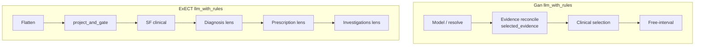

# Cross-task hybrid mechanism synthesis

Date: 2026-08-06  
Status: development mechanism synthesis from retained no-call ladder  
Paper-library role: cross-task technical record; start with the [component deck](../artifacts/paper_source_component_roles_and_limits_2026-08-09.pptx)

Protocol: [cross-task hybrid mechanism synthesis protocol](cross_task_hybrid_mechanism_synthesis_protocol_2026-08-06.md)  
Parents: [task-shape](task_shape_framework_2026-08-06.md), [category-cut](six_model_category_cut_performance_2026-08-06.md), [Gan catalog](../gan2026/category_error_catalog_2026-08-06.md), [Gan stage ablation](../gan2026/hybrid_stage_ablation_2026-08-06.md), [ExECT catalog](../exectv2/family_error_catalog_2026-08-06.md), [ExECT stage ablation](../exectv2/hybrid_stage_ablation_2026-08-06.md)  
Artifact: [`experiments/cross_task_hybrid_mechanism_synthesis_20260806.json`](../../experiments/cross_task_hybrid_mechanism_synthesis_20260806.json)

> **Update 2026-08-10:** The Prescription statements below describe the v09
> development lens and are now historical context. A per-rule decomposition
> removed two harmful rules as v10; aggregate-only `test59` confirmation
> improved Prescription exactness and micro-F1. The Diagnosis, SF, and
> Investigations findings below remain unchanged.

## Plain answer

Across both tracks, `llm_with_rules` is not one polish step.

1. **Gan** — rules **create** easy mass (seizure-free, range, no-reference) and lift ordinary rates out of the llm-only floor. Inside hybrid, **`selected_evidence`** is the mass first-changer; clinical selection adds the next Purist lift and most harm; clusters stay the practical floor; **`unknown_sentinel` is not a clean rescue**.
2. **ExECT** — rules **rescue Diagnosis inventory** and **trim SF precision**;
   the prior v09 Prescription lens contained a harmful sub-rule bundle that was
   removed and confirmed as v10 on `test59`; Investigations lenses are a no-op
   on this roster. Mass first-changers are `lens.diagnosis` (Dx) and
   `project_and_gate` (SF).
3. **Similarity across models** on overall scores is surface-dependent: shared weakness without rules, shared easy mass with rules—not interchangeable competence.
4. **Residuals after the stack** are selection / convention / inventory problems, usually with evidence already in hand—not missing format cleanup.

## What the ladder already established

| Layer | What it answered |
| --- | --- |
| Task shape + gold taxonomies | What each letter asks; gold buckets / families |
| Category-cut x/y/z | Which gold categories are common, discriminating, or shared floors on `llm` vs hybrid |
| Error catalogs | Wrong-answer shapes and llm→hybrid ablation |
| Hybrid stage ablations | Named first-changer stages inside hybrid |

This page is the cross-task packaging. Numbers below are copied from those parents; regenerate the parents first if they change.

## Three-method contrast

The word “rules” has two different roles in this ladder. `rules` is the
independent deterministic method; `llm_with_rules` is the post-LLM hybrid
surface. The independent method already owns much of the ExECT development
competence that the hybrid band can otherwise make look like a rules lift:
rules-only is high on Prescription (0.96), Diagnosis (0.86), and development
SF (0.83 Decision 0046 primary; 0.85 category-cut helper), while Investigations
is a floor (0.53). On Gan, rules-only is high on every
a_priori bucket except `unknown_sentinel` (mid). Therefore “promote” below
means post-LLM movement between the `llm` and hybrid surfaces; it does not mean
the independent rules system first acquired that competence.

## Rules job by track

### Gan (`dev750` Purist)

| Bucket | llm lens | hybrid lens | Rules job |
| --- | --- | --- | --- |
| `ordinary_point_rate` | 0.61–0.71 (**z**) | 0.82–0.89 (**y**) | Lift main mass out of shared floor |
| `cluster_burden` | 0.31–0.59 (**z**) | 0.52–0.77 (**y**) | Help, but remain practical floor |
| `seizure_free` | 0.78–0.95 (**y**) | 0.95–1.00 (**x**) | Create easy / common competence |
| `range_rate` | 0.75–0.85 (**y**) | 0.89–0.96 (**x**) | Create easy / common competence |
| `no_reference_sentinel` | 0.04–1.00 (**y**) | 0.96–1.00 (**x**) | Collapse wild llm variance to ceiling |
| `unresolved_multiple` | 0.93–1.00 (**x**) | 0.93–1.00 (**x**) | Already easy without rules |
| `unknown_sentinel` | 0.81–0.89 (**y**) | 0.77–0.87 (**y**) | Not clean; can hurt |

Strict **x** without rules: `unresolved_multiple`.  
Strict **x** with rules: `no_reference_sentinel`, `range_rate`, `seizure_free`, `unresolved_multiple`.
Independent rules-only is high on all seven buckets except `unknown_sentinel`
(mid).

### ExECT (`dev140` four-family clinical fact F1)

| Family | llm lens | hybrid lens | Rules job |
| --- | --- | --- | --- |
| Prescription | 0.85–0.95 (**y**) | 0.87–0.94 (**x**) | Compress into common competence (**x**) |
| Diagnosis | 0.69–0.77 (**y**) | 0.84–0.89 (**y**) | Large inventory rescue; still **y** |
| Investigations | 0.80–0.95 (**y**) | 0.80–0.95 (**y**) | Little/no band change on this roster |
| SeizureFrequency | 0.59–0.79 (**y**) | 0.62–0.83 (**y**) | Partial precision trim; remains practical floor |

Strict **x** without rules: none.  
Strict **x** with rules: `Prescription`.
Independent rules-only bands: Prescription high (0.96), Diagnosis high
(0.86), SeizureFrequency high (0.83 primary; 0.85 helper), Investigations floor
(0.53).

## Mass first-changers inside hybrid

### Gan

| Band / stage | First-changer rows | Role |
| --- | ---: | --- |
| Evidence reconcile (`selected_evidence`) | 2925 | Mass grammar/evidence rewrite; dominant rescue |
| Clinical selection | 140 | Next Purist lift; diary-led; main harm surface |
| Free-interval | 10 | Smaller, cleaner seizure-free/window commits |

Residual ownership after full stack (pooled row×model): `final_correct_after_repair` 2636, `final_correct_no_repair` 1313, `final_wrong_after_repair` 439, `final_wrong_no_repair` 94.

### ExECT

| Family | Mass first-changer | Rescue / harm (any) | Final exact |
| --- | --- | --- | ---: |
| Diagnosis | `lens.diagnosis` (457 first) | 214 / 49 | 0.58 |
| SeizureFrequency | `project_and_gate` (623 first) | 305 / 0 | 0.57 |
| Prescription | `lens.prescription` (123 first) | 44 / 60 | 0.81 |
| Investigations | near no-op (lens fires 0; gate 14) | thin | 0.87 |

## Residual ownership (the four open slices)

### 1. Gan `unknown_sentinel` — assertion damage after evidence

Evidence reconcile lifts unknown accuracy sharply; clinical selection then adds false_active_rate / false_seizure_free. This is assertion damage on abstention gold, not missing format cleanup.

| Band | Accuracy |
| --- | ---: |
| `model_final` | 0.45 |
| `representation` | 0.47 |
| `evidence_reconcile` | 0.83 |
| `clinical_selection` | 0.80 |
| `free_interval` | 0.80 |

Clinical-selection mode Δ vs evidence reconcile: `false_active_rate` +12, `false_seizure_free` +1.

First-changer homes on unknown gold: `repair.selected_evidence` 315, `repair.breakthrough` 4, `repair.non_epileptic` 1, `repair.elapsed_anchor` 1.

### 2. Gan `cluster_burden` — grammar cleaned; selection residual

Mass lift is evidence reconcile clearing incomplete cluster grammar. Clinical/free-interval add little. Residual is collapse_to_unknown and dropped_to_smooth_rate with quotes usually already selected.

| Band | Accuracy |
| --- | ---: |
| `model_final` | 0.02 |
| `evidence_reconcile` | 0.65 |
| `clinical_selection` | 0.70 |
| `free_interval` | 0.70 |

Final wrong modes: `collapse_to_unknown` 54, `dropped_to_smooth_rate` 29, `wrong_cluster_parameters` 13, `collapse_to_no_reference` 9, `false_seizure_free` 9. Hard-slice exact selected evidence among hybrid wrongs: 140/143 (0.98).

### 3. ExECT SeizureFrequency — gate rescues; inventory remains

Producer gate is the mass first-changer and rescue. Residual imperfect mass is empty_gold_spurious, missed_only, and substituted_or_mixed—inventory/precision, not missing Dx/Rx lenses.

| Band | Exact |
| --- | ---: |
| `post_flatten` | 0.14 |
| `producer_gate` | 0.51 |
| `sf_clinical` | 0.57 |
| `evidence_gate` | 0.57 |

Final imperfect / correct modes: `correct_nonempty` 318, `correct_empty` 153, `missed_only` 100, `substituted_or_mixed` 91, `empty_gold_spurious` 85, `extra_only` 66, `missed_all` 17.

### 4. ExECT Prescription lens — the prior v09 harm surface

The v09 `lens.prescription` was the first-changer and recorded any-harm 60 vs
any-rescue 44 on `dev140`; exactness fell across that band. The subsequent
per-rule study showed that two rules caused the harm. v10 removes them and is
now confirmed on aggregate-only `test59`; this is a named simplification result,
not evidence that the whole Prescription stage should be removed.

| Checkpoint | Exact |
| --- | ---: |
| Before Rx lens | 0.83 |
| After Rx lens | 0.81 |

`lens.prescription`: fires 124, first 123, any-rescue 44, any-harm 60.

### Investigations note

Investigations lens fires 0; only thin project_and_gate movement. Residual wrongs are mostly no_stage_change.

## What this changes about “models perform similarly”

| Surface | Overall similarity means |
| --- | --- |
| Gan `llm` | Shared weakness on ordinary rates + clusters |
| Gan hybrid | Shared strength on free/range/sentinel mass; clusters / unknown still break it |
| ExECT `llm` | No strict **x**; Diagnosis + SF pull everyone down |
| ExECT hybrid | Prescription carries ease; SF still separates |

Compatible with [why the error floor persists](why_the_error_floor_persists_2026-07-31.md): evidence is usually present; forced clinical choice and required label/inventory shape are what remain.

## Paper / claim packaging

Done as a sibling owner:
[claim-boundary packaging vs C16 / Decision 0046](paper_claim_boundary_hybrid_mechanism_c16_0046_2026-08-06.md).
Primary fills stay on C16 / C17; companion claims C18/C19 record stage
attribution and named residual harms.

## Still open

- **holdout_category_cuts** (answered): ExECT family holdout lenses plus Gan
  a_priori / ExECT letter-bucket holdout scores in
  [holdout category aggregates](six_model_holdout_category_aggregates_2026-08-06.md)
  (machine-only sealed scoring; no human row inspection).
- **leave_one_stage_out** (unanswered): First-changer attribution is not factorial necessity.
- **prescription_policy_counterfactual** (superseded by bounded confirmation): The v09 on/off contrast was mixed; the per-rule v10 removal is simpler and confirmed on aggregate-only `test59`. See the 2026-08-10 decomposition and holdout confirmation.
- **unknown_sentinel_repair_design** (localized_not_authorized): Breakthrough dominates unknown any-harm; no repair candidate authorized. See gan2026_unknown_sentinel_clinical_harm_2026-08-06.

## Next executable actions

1. Keep operational primary on the fixed vLLM dev10 endpoint task (unchanged by this synthesis).
2. Done: ExECT Prescription lens decomposition and v10 holdout confirmation — [decomposition](../exectv2/prescription_lens_rule_decomposition_2026-08-10.md) and [confirmation](../exectv2/prescription_lens_v10_holdout_confirmation_2026-08-10.md).
3. Done: Gan `unknown_sentinel` clinical-selection harm catalog — [report](../gan2026/unknown_sentinel_clinical_harm_2026-08-06.md).
4. Done: [sealed holdout category aggregates](six_model_holdout_category_aggregates_2026-08-06.md)
   (family lenses + unlocked bucket arms).
5. Do not authorize repair or lens rewrites from this packaging page alone.

## How to explore further

| Need | Where |
| --- | --- |
| Machine-readable synthesis tables | JSON artifact |
| Gan stage ledger | [Gan hybrid stage ablation](../gan2026/hybrid_stage_ablation_2026-08-06.md) |
| ExECT stage ledger | [ExECT hybrid stage ablation](../exectv2/hybrid_stage_ablation_2026-08-06.md) |
| Full error-mode catalogs | [Gan](../gan2026/category_error_catalog_2026-08-06.md), [ExECT](../exectv2/family_error_catalog_2026-08-06.md) |
| Regenerate this page | `python scripts/build_cross_task_hybrid_mechanism_synthesis.py` |

## Method

- No new model calls.
- Inputs: retained 2026-08-06 category-cut, catalog, stage-ablation, and hard-slice JSON artifacts.
- Attribution language inherits parent first-changer definitions.
- Git at build: `922ff314` (dirty tree).

## Claim boundary

Development mechanism synthesis from retained 2026-08-06 no-call artifacts on Gan dev750 and ExECT dev140. Not holdout competence, not leave-one-stage-out, not a Decision 0046 or C16 rewrite, not clinical validation. Scores are not interchangeable across tasks.
