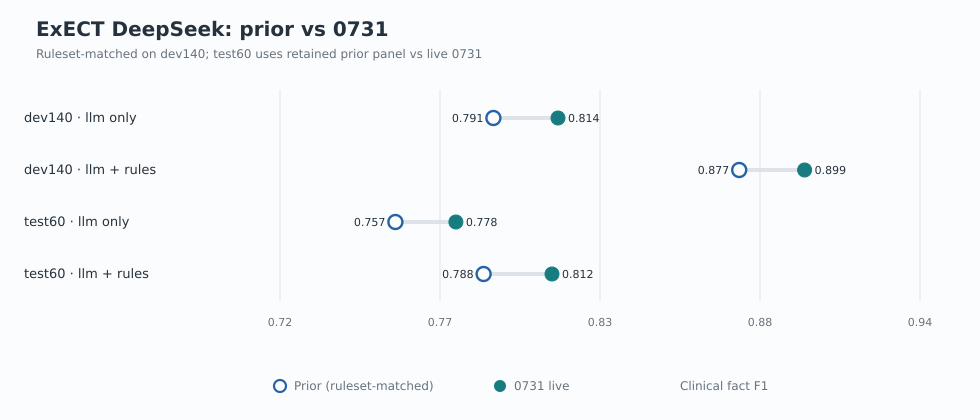
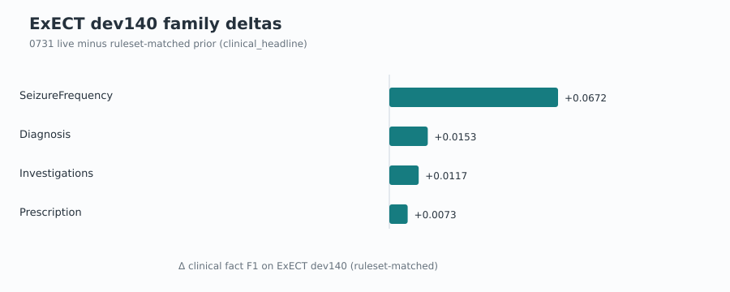
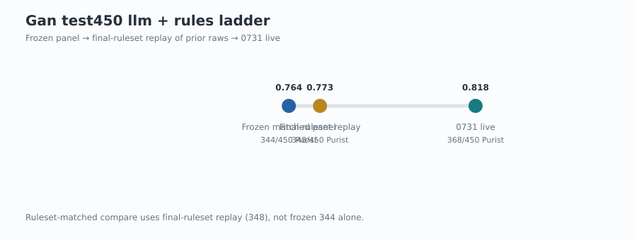

# DeepSeek V4-Flash-0731 matched comparison

Paper-library status: historical route comparison; current selected results remain with
paper provenance and the six-model comparison.

Date: 2026-08-03  
Protocol: [matched comparison protocol](deepseek_v4_flash_0731_matched_comparison_protocol_2026-08-03.md)  
Artifact: [`experiments/deepseek_v4_flash_0731_matched_comparison_20260803.json`](../../experiments/deepseek_v4_flash_0731_matched_comparison_20260803.json)

## Finding

On ruleset-matched comparators, the 2026-07-31 DeepSeek-V4-Flash API revision
improves both ExECT arms by about **+0.02 clinical fact F1** on `dev140` and
`test60`, and improves Gan `test450` llm_with_rules by **+20 Purist**
(348→368) versus final-ruleset replay of the prior raws. Gan llm_only has no
matched pre-0731 prior; the 0731 cell is **332/450** Purist.

This is provider-update evidence. The 0731 holdout figures are folded into
[`experiments/six_model_final_panel_20260803/`](../../experiments/six_model_final_panel_20260803/panel_aggregate.json),
which the [six-model comparison report](six_model_comparison_report_2026-07-18.md)
cites as the final results. Decision 0046 Sol method-row fills remain the paper
ExECT method identity.

## How the comparison was made clean

| Surface | Prior used for delta | Why |
| --- | --- | --- |
| ExECT `dev140` | Current-rules no-call replay of 2026-07-15 structured outputs | Equals retained panel (llm+rules 0.8767; llm-only 0.7915), so ruleset drift is removed |
| ExECT `test60` | Retained stage-panel DeepSeek cell | Aggregate-only; closest ruleset control is the `dev140` invariance above |
| Gan llm_with_rules `test450` | Final-ruleset replay of prior matched raws (**348**/450) | Separates floor changes (+4 from frozen 344) from the model update (+20) |
| Gan llm_only `test450` | None | No pre-0731 matched v0.5 DeepSeek llm_only `test450` exists |

Operational disclosures: ExECT 0731 raised structured `max_tokens` 16k→64k after
thinking-budget truncation; all 0731 cells are no-cache live runs; holdout rows
stay sealed.

## Cross-task delta summary

| Cell | Prior | 0731 | Δ |
| --- | ---: | ---: | ---: |
| ExECT `dev140` llm only | 0.7915 | 0.8139 | **+0.0224** |
| ExECT `dev140` llm + rules | 0.8767 | 0.8994 | **+0.0227** |
| ExECT `test60` llm only | 0.7575 | 0.7785 | **+0.0210** |
| ExECT `test60` llm + rules | 0.7881 | 0.8118 | **+0.0237** |
| Gan `test450` llm + rules (Purist) | 348/450 | 368/450 | **+20** |
| Gan `test450` llm only (Purist) | — | 332/450 | no matched prior |

ExECT and Gan metrics are not interchangeable; the table is side-by-side
provider evidence, not a joint ranking.

## ExECTv2

Both method stages move by a similar amount on development and holdout
aggregates. The llm-only gain shows the model revision helps before fixed
rules; the llm_with_rules gain shows the improvement survives the current
default stack.

### Family driver on `dev140` (llm + rules)

| Family | Prior | 0731 | Δ |
| --- | ---: | ---: | ---: |
| SeizureFrequency | 0.7610 | 0.8282 | **+0.0672** |
| Diagnosis | 0.8764 | 0.8917 | +0.0153 |
| Investigations | 0.9389 | 0.9506 | +0.0117 |
| Prescription | 0.9280 | 0.9353 | +0.0073 |

Letter-level (`dev140`, clinical_headline keys): **59/140** changed;
**38 rescues / 11 regressions / 10 prediction-only**. Seizure Frequency accounts
for most rescues (20 vs 4 regressions). Owner:
[`..._vs_20260715_current_rules.json`](../../experiments/exectv2_deepseek_v4_flash_0731_update_dev140_20260731_vs_20260715_current_rules.json).

`test60` remains aggregate-only; no row mechanism is claimed there.

## Gan 2026 seizure frequency

### LLM + rules (`test450`, v0.5, aggregate-only)

| Layer | Purist | Pragmatic | Role |
| --- | ---: | ---: | --- |
| Frozen matched panel | 344/450 | 366/450 | Historical July repair |
| Final-ruleset replay of those raws | **348**/450 | 370/450 | Ruleset-matched prior |
| 0731 live | **368**/450 | 377/450 | Provider update |

Versus the ruleset-matched prior: **+20 Purist**, **+7 Pragmatic**, 0 call
failures, 0 parse/validation failures. The frozen→replay step alone is only
+4 Purist, so most of the live gain is not explained by floors.

### LLM only (`test450`, v0.8, aggregate-only)

| Layer | Purist | Pragmatic |
| --- | ---: | ---: |
| Matched pre-0731 prior | *none* | *none* |
| 0731 live | **332**/450 (0.7378) | 350/450 (0.7778) |

This cell is also the DeepSeek row in the 2026-08-01 six-model llm_only
`test450` panel. Do not backfill a prior from quarantined v0.7 validation
(559/750) or v0.5 model-boundary (449/750); those are different identities.

## Claim boundary

- **In scope:** named DeepSeek API revision versus ruleset-matched priors on the
  stated splits and methods.
- **Out of scope:** replacing retained six-model paper panels; Decision 0046
  Sol primary fills; clinical validation; DeepSeek unknown-competence prompt U;
  cross-task transfer claims.
- **Promotion:** 0731 ExECT `test60` and Gan llm_with_rules live cells remain
  unpromoted relative to frozen panel owners unless a separate decision adopts
  them.

## Evidence owners

| Piece | Path |
| --- | --- |
| Comparison artifact | `experiments/deepseek_v4_flash_0731_matched_comparison_20260803.json` |
| ExECT `dev140` protocol / report | `docs/experiments/exectv2/reliability/exectv2_deepseek_v4_flash_0731_dev140_protocol_2026-07-31.md` |
| ExECT `dev140` vs-prior diff | `experiments/exectv2_deepseek_v4_flash_0731_update_dev140_20260731_vs_20260715_current_rules.json` |
| Gan final-ruleset replay | `experiments/gan2026_six_model_current_floors_replay_20260731/replay_summary.json` |
| Gan 0731 live roots | `scratch/holdout/gan2026_test450_deepseek_v4_flash_0731_20260731/` |
| ExECT 0731 `test60` root | `scratch/holdout/exectv2_test60_deepseek_v4_flash_0731_20260731/` |
| Charts | `docs/research/assets/deepseek_v4_flash_0731_comparison_2026-08-03/` |
| Chart script | `scripts/render_deepseek_v4_flash_0731_comparison_charts.py` |
| Parent six-model synthesis | [six-model comparison report](six_model_comparison_report_2026-07-18.md) |

## Decision

Answer: the 0731 revision is a clear net positive on every ruleset-matched
DeepSeek cell available for comparison, with ExECT gains ~+0.02 F1 across
method and split and Gan llm_with_rules +20 Purist on locked `test450`. Gan
llm_only is reported as a first matched cell only. Next action, if wanted:
separate promotion decision for whether any 0731 cell replaces a retained
panel DeepSeek row.
