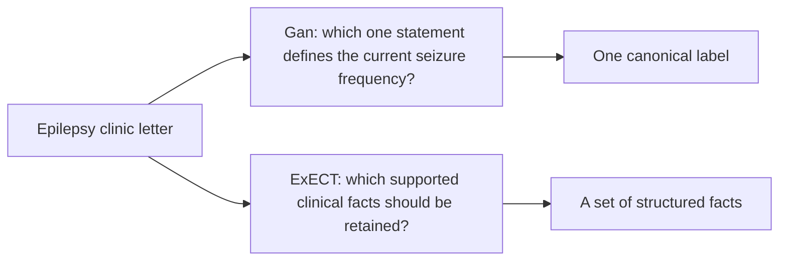

# What the two extraction tasks ask

Date: 2026-08-06

Rewritten: 2026-08-10 for the paper-source library

Status: active task-difficulty source

## The short answer

Gan 2026 and ExECTv2 both begin with an epilepsy clinic letter. They require
different kinds of reasoning.

- **Gan asks the system to choose.** It must return one current
  seizure-frequency label when several statements may be true.
- **ExECT asks the system to collect.** It must recover a complete set of
  diagnoses, seizure-frequency facts, prescriptions, and investigations
  without merging facts or inventing unsupported ones.

The tasks therefore test complementary abilities. Their scores must remain
separate.

## One letter, two questions

| | Gan 2026 | ExECTv2 |
| --- | --- | --- |
| Required output | One seizure-frequency label | A set of facts from four clinical families |
| Main difficulty | Select the current reading | Recover a complete, coherent inventory |
| Common conflict | Usual rate, recent cluster, dated count, or seizure-free interval | Distinct mentions, attributes, regimens, and repeated findings |
| Empty or uncertain output | Explicit `unknown`, `no reference`, or unresolved-multiple labels | An empty family means that no annotated fact should be returned |
| Primary project measure | Purist accuracy | Four-family clinical fact F1 |

## Why Gan is difficult

A letter can contain an older rate, a recent cluster, a diary total, a quiet
interval, and a statement about the usual pattern. The system must decide which
statement answers the dataset's question about the current state. It must also
preserve the count, time period, range, and cluster structure.

Finding a real phrase is not enough. The selected phrase can still describe
the wrong event or time window.

The detailed gold categories are in the
[Gan taxonomy](../gan2026/gold_task_taxonomy_2026-08-06.md). The largest category
is an ordinary point rate. Clusters remain the clearest shared difficulty;
unknown and seizure-free cases show where selection rules can also cause harm.

## Why ExECT is difficult

A short letter can contain several diagnoses, multiple seizure-frequency
states, complete and planned drug regimens, and results from more than one
investigation. The system must keep separate facts separate, preserve their
attributes, and avoid adding information that the letter does not support.

Understanding one sentence is not enough. The output can still be incomplete,
over-combined, or internally inconsistent.

The detailed gold categories are in the
[ExECT taxonomy](../exectv2/gold_task_taxonomy_2026-08-06.md). Diagnosis and
seizure frequency carry the largest model-dependent difficulties.
Investigations show the opposite pattern: the model is important because the
independent rules-only system misses many abnormal findings.

## What this means for the architecture

Both tasks need flexible language interpretation. They also need recorded
rules at the point where a quoted span becomes a designed structured form.

For Gan, those rules mainly render and select one current answer. For
ExECT, they mainly project, check, and assemble a fact inventory. The package
and method names are shared; the task schemas, clinical policies, and measures
are not. The proposed method is the same on both tasks; tables cite Grok.

Read [why the proposed method is a model plus recorded rules](../paper/why_hybrid_architecture_2026-08-09.md)
for the design rationale and the
[architecture view](../artifacts/hybrid_architecture_2026-08-10.html)
for the end-to-end system.

## Evidence and limits

This source describes the tasks from their gold labels and retained project
definitions. It does not show that the hybrid succeeds. Results are owned by
the [six-model comparison](six_model_comparison_report_2026-07-18.md),
[category analysis](six_model_category_cut_performance_2026-08-06.md), and
[paper provenance](../../canon/10_paper_provenance.md).

Gan and ExECT scores are not numerically comparable. The project does not claim
zero-shot transfer, one shared clinical policy, or clinical validation.

## Detailed sources

- [What the two golds already decided](../paper/what_the_two_golds_already_decided_2026-08-17.md)
- [Why the two programmes annotated differently](annotation_approach_comparison_2026-08-16.md)
- [Gan gold-label taxonomy](../gan2026/gold_task_taxonomy_2026-08-06.md)
- [ExECT gold-label taxonomy](../exectv2/gold_task_taxonomy_2026-08-06.md)
- [Category performance](six_model_category_cut_performance_2026-08-06.md)
- [Clinical selection policies](clinical_selection_policy_catalog_2026-07-31.md)
