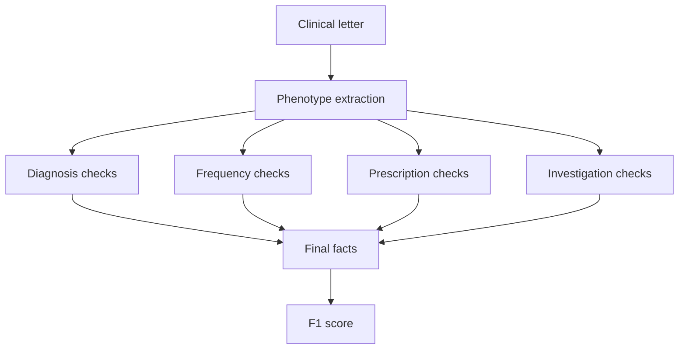
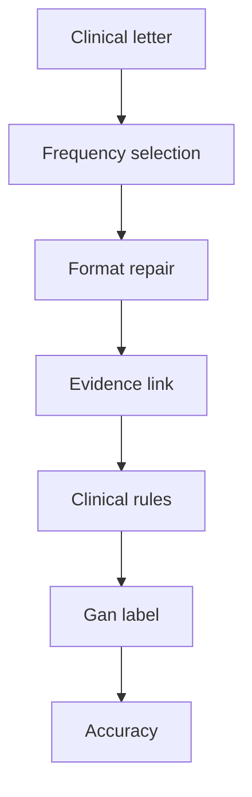

# Six-model comparison across ExECTv2 and Gan 2026

Date: 2026-07-18  
Updated: 2026-08-03  
Status: final six-model results on the selected codebase; primary readout is
aggregate-only locked holdout (`test60` / `test450`); development side-by-side
and row-level error analysis remain on `dev140` / `dev750`

Final results owner:
[`experiments/six_model_final_panel_20260803/`](../../experiments/six_model_final_panel_20260803/panel_aggregate.json)

Language follows [Decision 0048](../decisions/0048-comprehension-and-handoff-refactor.md)
and [CONTEXT.md](../../CONTEXT.md).

## Terms used in this report

Naming follows the [plain-language glossary](../reference/plain_language_glossary.md)
and [CONTEXT.md](../../CONTEXT.md).

- **ExECTv2** extracts facts from four parts of an epilepsy letter: Diagnosis,
  Seizure Frequency, Prescription, and Investigations.
- **Gan 2026** assigns one current seizure-frequency label to each letter.
- **Active methods** are `rules`, `llm`, and `llm_with_rules`. Plain names:
  rules only, LLM only, and LLM with rules.
- **Development split** means data that may be examined one row at a time.
  ExECT `dev140` has 140 letters; Gan `dev750` has 750 letters. Retained Gan
  filenames and API `split` fields may still say `validation750`.
- **Locked holdout** means data whose individual rows may not be examined or
  used to change the system. This report gives only totals for ExECT `test60`
  and Gan `test450`.
- **Aggregate-only** means that only totals and summary scores are available,
  not individual predictions or errors.
- **LLM only** (`llm`) means the saved model output before deterministic code
  changes its clinical content. On ExECT, that scored boundary is
  `raw_lane_score`. **LLM with rules** (`llm_with_rules`) means the final
  output after fixed code checks, standardizes, selects, or repairs that
  output. On ExECT, the scored final view is still stored as
  `clinical_headline` / `headline_target`.
- **Clinical fact F1** is the primary ExECT measure: internal de-duplicated
  clinical fact recovery. It is not the published ExECT benchmark.
- **Purist accuracy** is the primary Gan measure and requires the exact
  reference label. Higher is better.
- **Reporting precision:** primary scores in this report are given to two
  decimal places. Do not mix count numerators with rate scores in the same
  comparison table.
- **Exact evidence** means that a prediction includes text copied exactly from
  its source letter. It shows that a quotation is present, not that the
  quotation clinically supports the prediction.
- **Wrong to correct** and **correct to wrong** count answers changed by the
  deterministic code. The latter are also called regressions.

## Executive conclusion

The same six models were evaluated with the fixed ExECTv2 and Gan pipelines:
GPT-4.1-mini, GPT-5.6 Luna, GPT-5.6 Sol, DeepSeek V4 Flash, Qwen 3.6:35B, and
Gemma 4 26B. Scores below are the final LLM-with-rules results on the selected
codebase
([final panel](../../experiments/six_model_final_panel_20260803/panel_aggregate.json)).

On locked holdout, DeepSeek leads ExECT `test60` at clinical fact F1 `0.81`,
with Sol and Luna next at `0.80`. Sol leads Gan `test450` at Purist `0.85`;
mini and DeepSeek follow at `0.82`. Cross-task rank correlation is `0.54`,
where `1.00` would mean identical rankings. The tasks use different data and
scores, so this does not establish general model superiority. Decision 0046
paper method-row fills remain Sol-matched for ExECT; this six-model panel is
model-comparison evidence.

External Artificial Analysis context aligns with a compressed quality ladder:
Sol leads the Intelligence Index and Healthcare & Medical Index among the six,
but Luna and DeepSeek sit close on Healthcare while list prices differ by more
than an order of magnitude. On these two extraction tasks the absolute gaps are
modest (ExECT `test60` about `0.72`–`0.81`; Gan Purist about `0.79`–`0.85`).
Smaller or cheaper models can therefore look “good enough” on task score even
when general/domain indexes separate them more clearly. Matched run tokens,
latency, and spend were not retained; dollar figures below are clearly labelled
external list-price illustrations.

Development error ownership is partly shared and partly idiosyncratic: every
Gan model is dominated by `rate_denominator` rows, while residual first-failure
owners differ (Qwen heavy on `evidence_selection`; Sol/Luna almost entirely
`llm_clinical_selection`).

On both tasks, LLM with rules beats LLM only on locked holdout for every model
(ExECT about `+0.02`–`+0.06` F1; Gan about `+0.08`–`+0.11` Purist). Do not
combine the historical v0.7 Gan `dev750` panel with these v0.5 `test450`
results. All holdout results are aggregate-only, so they support comparison
under these protocols but not row-level holdout error analysis or tuning.

### Results at a glance

| Question | ExECTv2 | Gan 2026 |
| --- | --- | --- |
| What is extracted? | Facts from four parts of an epilepsy letter | One current seizure-frequency label |
| Primary measure | Clinical fact F1 (2 d.p.) | Purist accuracy (2 d.p.) |
| Best holdout result | DeepSeek: `0.81`; Sol/Luna: `0.80` | GPT-5.6 Sol: `0.85` |
| Locked holdout vs development | Same model order; holdout lower by about `0.06`–`0.09` | Holdout lower by about `0.02`–`0.08` |
| LLM only → LLM with rules (holdout) | Gain about `0.02`–`0.06` | Gain about `0.08`–`0.11` |
| External capability context | Same six models on AA Intelligence + Healthcare indexes (not task scores) | Same |
| Main limitation | Internal metric; 59 loadable holdout letters | Locked holdout; aggregate totals only |

## 1. What the two tasks measure

### ExECTv2: facts from four parts of an epilepsy letter

ExECTv2 uses de-identified clinical letters to recover facts from four fixed
parts of each letter: Diagnosis, Seizure Frequency, Prescription, and
Investigations. `dev140` permits row-level development analysis; `test60` is
locked holdout and reported only through aggregate readouts. The primary score
is clinical fact F1. It is not the published ExECT benchmark. Code and saved
scores still use `clinical_headline` / `headline_target`.

Illustrative synthetic letter, not a retained dataset row:

> Dear colleague, she has had no further seizures since March 2024. She remains
> on levetiracetam 500 mg twice daily. MRI brain was normal; EEG showed left
> temporal epileptiform discharges. The working diagnosis is focal epilepsy.

The expected structured output links each fact to supporting text:

| Part of the letter | Example extracted fact |
| --- | --- |
| Diagnosis | focal epilepsy, affirmed |
| Seizure Frequency | seizure-free since March 2024 |
| Prescription | levetiracetam, 500 mg, twice daily |
| Investigations | MRI normal; EEG with left temporal discharges |

The pipeline produces one prediction as follows:

The model proposes facts and quotes supporting text. Fixed code then checks and
standardizes each part without running a second extractor or adding facts the
model did not propose. The final facts are compared with the reference using
clinical fact F1.

### Gan 2026: current seizure-frequency extraction

Gan uses synthetic clinical letters and asks for one current seizure-frequency
label per letter. The source contains 1,500 records; the fixed comparison uses
`dev750` for development evidence and `test450` as locked aggregate-only
holdout. Retained filenames and machine-readable records may use the legacy
identifier `validation750` for `dev750`. The primary scorer is Purist accuracy;
Pragmatic accuracy is a secondary measure. Both are label-level measures and
are not numerically interchangeable with ExECT F1.

Illustrative synthetic letter, not a retained holdout row:

> Since the last review she reports two focal seizures in the past month. There
> have been no prolonged seizure-free intervals, and the frequency is otherwise
> unchanged. The current answer is an active monthly seizure frequency.

The pipeline produces one prediction as follows:

The model identifies seizure events and selects the current frequency. Fixed
code repairs formatting, keeps the supporting quotation, resolves conflicts
between current and historical statements, and converts the answer to a Gan
label. Each stage is saved so errors can be assigned to model selection,
formatting, clinical rules, or label conversion. The final label is scored with
Purist accuracy; Pragmatic accuracy is reported as a secondary measure.

## 2. Comparison method and results

Each model uses the same data, prompt, processing steps, and score as the other
models within a task. Scores from the two tasks are not combined. Both tasks
use the same two comparisons below, in the same order, with primary scores to
two decimal places. All tables come from the
[final panel](../../experiments/six_model_final_panel_20260803/panel_aggregate.json).

| Field | ExECTv2 | Gan 2026 |
| --- | --- | --- |
| Development split | `dev140`; row review permitted | `dev750` (legacy API/filename id: `validation750`); row review permitted |
| Locked holdout | `test60`; 59 loadable letters; aggregate only | `test450`; 450 rows; aggregate only |
| Model call | One structured call for all four parts of each letter | One structured call for seizure events in each note |
| Selected methods compared | LLM only (`llm`) and LLM with rules (`llm_with_rules`) | LLM only (`llm`) and LLM with rules (`llm_with_rules`) |
| Primary score | Clinical fact F1 | Purist accuracy |

### ExECTv2: locked holdout versus development

Primary ranking uses aggregate-only `test60` under LLM with rules. Matched
`dev140` is the development side-by-side. Every holdout score is lower than its
matched development score.

| Model | test60 | dev140 | Change |
| --- | ---: | ---: | ---: |
| DeepSeek V4 Flash | 0.81 | 0.90 | -0.09 |
| GPT-5.6 Sol | 0.80 | 0.89 | -0.09 |
| GPT-5.6 Luna | 0.80 | 0.88 | -0.09 |
| Qwen 3.6:35B | 0.79 | 0.86 | -0.07 |
| GPT-4.1-mini | 0.76 | 0.82 | -0.06 |
| Gemma 4 26B | 0.72 | 0.80 | -0.08 |

These results use Diagnosis/Prescription **`default` / `default`**, the active
ExECT comparison policy
([decision 0045](../decisions/0045-exect-default-policy-not-joint-combined.md)).
DeepSeek leads `test60`; Sol remains the Decision 0046 ExECT LLM-with-rules
method-row fill. The small locked split and the ban on examining its rows mean
the report cannot explain individual failures or claim broad reliability.

### ExECTv2: LLM only versus LLM with rules

On aggregate-only `test60`, LLM with rules improves clinical fact F1 for every
model.

| Model | LLM only | LLM with rules | Change |
| --- | ---: | ---: | ---: |
| DeepSeek V4 Flash | 0.78 | 0.81 | +0.03 |
| GPT-5.6 Sol | 0.78 | 0.80 | +0.03 |
| GPT-5.6 Luna | 0.76 | 0.80 | +0.03 |
| Qwen 3.6:35B | 0.73 | 0.79 | +0.06 |
| GPT-4.1-mini | 0.73 | 0.76 | +0.02 |
| Gemma 4 26B | 0.69 | 0.72 | +0.03 |

These gains combine several operations: removing facts without valid quoted
evidence; standardizing values; recovering Diagnosis facts; converting or
removing Seizure Frequency facts; repairing Prescription facts; and assembling
the final output. The comparison does not isolate the effect of any one rule.

### ExECTv2: results for each part of the letter

These results are separate from the overall comparison because each part has
different fact counts and extraction behavior. On aggregate-only `test60`,
Seizure Frequency remains the weakest family for every model, while
Investigations or Prescription is usually strongest.

| Model | Diagnosis | Seizure Frequency | Prescription | Investigations |
| --- | ---: | ---: | ---: | ---: |
| GPT-5.6 Sol | 0.84 | 0.61 | 0.86 | 0.90 |
| GPT-5.6 Luna | 0.85 | 0.57 | 0.83 | 0.92 |
| Qwen 3.6:35B | 0.84 | 0.61 | 0.84 | 0.86 |
| DeepSeek V4 Flash | 0.82 | 0.58 | 0.85 | 0.90 |
| GPT-4.1-mini | 0.81 | 0.51 | 0.81 | 0.91 |
| Gemma 4 26B | 0.79 | 0.49 | 0.78 | 0.79 |

### Gan 2026: locked holdout versus development

Primary ranking uses aggregate-only `test450` under LLM with rules. Matched
`dev750` is the development side-by-side. Every holdout score is lower than its
matched development score.

| Model | test450 | dev750 | Change |
| --- | ---: | ---: | ---: |
| GPT-5.6 Sol | 0.85 | 0.88 | -0.03 |
| GPT-4.1-mini | 0.82 | 0.90 | -0.08 |
| DeepSeek V4 Flash | 0.82 | 0.84 | -0.02 |
| GPT-5.6 Luna | 0.81 | 0.88 | -0.07 |
| Qwen 3.6:35B | 0.80 | 0.88 | -0.08 |
| Gemma 4 26B | 0.79 | 0.86 | -0.07 |

Sol leads `test450`. On `dev750`, mini leads and Luna/Sol tie second. Only
totals are available for locked holdout rows. Qwen and Gemma use the same
prompt and method as the hosted models, but run locally; that route difference
is recorded in the saved results.

### Gan 2026: LLM only versus LLM with rules

On aggregate-only `test450`, LLM with rules improves Purist accuracy for every
model.

| Model | LLM only | LLM with rules | Change |
| --- | ---: | ---: | ---: |
| GPT-5.6 Sol | 0.74 | 0.85 | +0.11 |
| GPT-4.1-mini | 0.73 | 0.82 | +0.09 |
| DeepSeek V4 Flash | 0.74 | 0.82 | +0.08 |
| GPT-5.6 Luna | 0.71 | 0.81 | +0.10 |
| Qwen 3.6:35B | 0.70 | 0.80 | +0.10 |
| Gemma 4 26B | 0.68 | 0.79 | +0.11 |

This is the selected active-method comparison for Gan: LLM only versus LLM with
rules on the same locked holdout. It does not isolate the effect of any one
repair rule.

This comparison does not establish a general model ranking.

## 3. Other findings about errors and evidence

This section uses **development** row-level evidence where locked holdout
splits cannot be inspected. Before seeing the results, the study specified a
comparison of the Seizure Frequency states produced by the model with those
left after fixed code converted or removed states. A state records whether the
letter gives a rate, says the patient is seizure-free, or leaves the current
frequency unknown. The fixed code improves F1 for these state sets for every
model on the same 140 development letters:

| Model | Model state F1 | F1 after fixed code | Change | Wrong→correct | Correct→wrong |
| --- | ---: | ---: | ---: | ---: | --- |
| GPT-4.1-mini | 0.73 | 0.78 | +0.05 | 13 | 0 |
| GPT-5.6 Luna | 0.84 | 0.86 | +0.02 | 4 | 0 |
| GPT-5.6 Sol | 0.85 | 0.86 | +0.01 | 3 | 1 |
| DeepSeek V4 Flash | 0.81 | 0.84 | +0.03 | 9 | 0 |
| Qwen 3.6:35B | 0.75 | 0.80 | +0.05 | 13 | 0 |
| Gemma 4 26B | 0.69 | 0.74 | +0.05 | 12 | 0 |

Across the six runs there are 54 wrong-to-correct and one
correct-to-wrong transition. The repeated 140 letters mean these counts are
descriptive, not 840 independent clinical samples. The planned comparison of
unknown frequency with a stated rate cannot be calculated: the reference data
contain no letters labelled only as unknown, and letters with no reference
fact cannot be counted as unknown.

Other limits on the main scores are:

- ExECT records an exact source-text match for `1.00` of final facts for every
  model on the retained development panel. This confirms citation presence, not
  that the cited text clinically supports the fact; independent clinical review
  is still pending.
- The planned ExECT unknown-versus-rate analysis cannot be calculated because
  there are no unknown-only gold cases. Gan findings on this question therefore
  cannot be transferred to ExECT.
- Parsing, output-format, repair, and model-host information is saved for every
  model, but the runs do not provide matched cost or latency measurements.
- Results for each part of the ExECT letter are reported, but neither task
  measures demographic fairness or deployment calibration.

## 4. External capability context (Artificial Analysis)

No independent MedQA board covers all six roster models. This section uses the
Artificial Analysis **Intelligence Index** (general capability) and
**Healthcare & Medical Index** (domain composite: medical knowledge, agentic
knowledge work, non-hallucination, reasoning, customer interaction). Values
were retrieved 2026-07-31 from the public AA pages and are stored in
[`experiments/six_model_external_capability_cost_snapshot_20260731.json`](../../experiments/six_model_external_capability_cost_snapshot_20260731.json).

These scores are **not** ExECT or Gan results. AA “max” / reasoning variants
are not asserted to match the project’s extraction temperature or reasoning
settings. Qwen and Gemma use local Ollama in this project; AA still scores the
same model families independently.

| Roster model | AA variant used | Intelligence Index | Healthcare Index | Healthcare provenance |
| --- | --- | ---: | ---: | --- |
| GPT-5.6 Sol | GPT-5.6 Sol (max) | 58.9 | 45.0 | Matches AA published chart |
| DeepSeek V4 Flash | V4 Flash 0731 (max) | 49.9 | 36.4 | Matches AA published chart |
| GPT-5.6 Luna | GPT-5.6 Luna (max) | 51.2 | 35.6 | Matches AA published chart |
| Qwen 3.6:35B | Qwen3.6 35B A3B (Reasoning) | 31.6 | 22.7 | Recomputed from AA component fields with published weights |
| Gemma 4 26B | Gemma 4 26B A4B (Reasoning) | 25.7 | 15.5 | Recomputed from AA component fields with published weights |
| GPT-4.1-mini | GPT-4.1 mini | 14.8 | 11.7 | Recomputed from AA component fields with published weights |

Sol leads both indexes. Luna and DeepSeek are close on Healthcare despite a
large list-price gap (next section). Mini and the two local open-weight models
trail on both indexes more than they trail on the ExECT/Gan task tables above.
That supports the intended reading: stronger general/domain models tend to do
better here, but the **task** gaps are smaller than the **index** gaps.

## 5. External list-price cost and latency context

**Label:** the following are external list-price and Artificial Analysis
latency estimates, not measured tokens, wall time, or dollars from the ExECT
or Gan comparison runs. The retained efficiency work already closed matched
token/cost/latency reconstruction as unavailable.

Hosted first-party or median hosted prices from AA (USD per 1M tokens):

| Roster model | Input $/M | Output $/M | AA blended $/M (7:2:1 where published) | AA output tok/s | AA TTFT (s) | Project route |
| --- | ---: | ---: | ---: | ---: | ---: | --- |
| GPT-5.6 Sol | 5.00 | 30.00 | 4.35 | 65.5 | 147.3 | Hosted |
| GPT-5.6 Luna | 0.20 | 1.20 | 0.17 | 184.4 | 116.5 | Hosted |
| GPT-4.1-mini | 0.40 | 1.60 | 0.31 | 83.5 | 0.92 | Hosted |
| DeepSeek V4 Flash | 0.14 | 0.28 | 0.06 | — | — | Hosted |
| Qwen 3.6:35B | 0.25 | 1.49 | — | 140.8 | — | Local Ollama (table shows hosted median proxy) |
| Gemma 4 26B | 0.13 | 0.40 | 0.13 | — | — | Local Ollama (table shows hosted median proxy) |

Illustrative only — assume 3,000 input and 1,500 output tokens per note, with
**no** reasoning/thinking surplus:

| Roster model | Illustrative $/1,000 notes | Relative to Sol |
| --- | ---: | ---: |
| GPT-5.6 Sol | 60.00 | 1.00× |
| GPT-4.1-mini | 3.60 | 0.06× |
| Qwen 3.6:35B (hosted proxy) | 2.97 | 0.05× |
| GPT-5.6 Luna | 2.40 | 0.04× |
| Gemma 4 26B (hosted proxy) | 0.99 | 0.017× |
| DeepSeek V4 Flash | 0.84 | 0.014× |

Local Qwen/Gemma project runs do not incur that hosted API bill; their true
marginal cost is hardware, energy, and operator time, which this snapshot does
not measure. Reasoning models can also emit large thinking-token volumes, so
real Sol/Luna/DeepSeek spend may exceed the non-thinking illustration.

Read with the task tables: Luna and DeepSeek approach Sol’s ExECT/Gan scores
and Healthcare Index at a small fraction of Sol’s list price; Gemma trails
more on task score and indexes but is cheap as a hosted proxy and free at the
API layer when run locally.

## 6. Do error patterns track model “level”?

This section uses **development** evidence only (`dev750` Gan attribution;
ExECT `dev140` SF-state transitions above). Locked holdout rows remain
aggregate-only.

### Shared floor (not model-idiosyncratic)

On Gan `dev750`, every model’s clinical-subproblem histogram is dominated by
`rate_denominator`, with large `seizure_free_boundary` and
`cluster_or_diary_aggregation` masses. That matches the residual-floor audit:
the hard core is forced clinical selection under annotation conventions, not a
missing-quote problem that only weak models show.

On ExECT, Seizure Frequency is the weakest family for every model on both
aggregate-only `test60` and development `dev140`. Deterministic rules raise
clinical fact F1 for every model on `test60` by about `0.02`–`0.06`, and by
about `0.08`–`0.11` on matched `dev140`.

### Idiosyncratic residual owners

Gan `dev750` first-failure owners among rows that are not `none`:

| Model | Final Purist | `llm_clinical_selection` | `evidence_selection` | Other owners |
| --- | ---: | ---: | ---: | --- |
| GPT-5.6 Sol | 0.87 | 88 (92.6% of owned failures) | 1 | 6 deterministic |
| GPT-5.6 Luna | 0.86 | 96 (89.7%) | 3 | 8 format/deterministic |
| Gemma 4 26B | 0.86 | 101 (82.8%) | 15 | 6 |
| DeepSeek V4 Flash | 0.83 | 121 (82.3%) | 19 | 7 |
| GPT-4.1-mini | 0.89 | 70 (53.0%) | 57 (43.2%) | 5 |
| Qwen 3.6:35B | 0.88 | 55 (22.8%) | 183 (75.9%) | 3 |

Stronger hosted models fail almost entirely at clinical selection after finding
evidence. Qwen’s residual is mostly evidence-selection / grounding under the
same prompt and method. Mini splits between selection and evidence. Subproblem
mixes also differ at the margin (Luna/DeepSeek higher `uncertainty_boundary`;
Qwen/mini higher `cluster_or_diary_aggregation`).

**Reading:** model “level” predicts aggregate score and shifts the dominant
failure owner somewhat, but the shared clinical-selection floor remains. Error
shape is therefore **partly level-linked and partly idiosyncratic**, not a
clean weak-versus-strong taxonomy.

## 7. What the report does and does not establish

The report supports:

- a fixed six-model comparison on both named task pipelines, with aggregate-only
  locked holdout as the primary ranking;
- final ExECT and Gan results from one panel directory, with the same two
  comparisons on each task: locked holdout versus development, and LLM only
  versus LLM with rules;
- the result, limited to these task-specific procedures, that DeepSeek leads
  current ExECT `test60` while Sol leads current Gan `test450`;
- external AA Intelligence and Healthcare Index context for the same six model
  families, with list-price and AA latency illustrations;
- development evidence that residual Gan failures share a clinical-selection
  floor while first-failure owners differ by model; and
- a negative, data-limited result for transferring Gan's unknown-versus-rate
  measure to ExECT.

It does not support general model superiority, one reliability score combined
across tasks, applying Gan findings to ExECT, the published ExECT benchmark,
matched run token/latency/dollar rankings, treating AA max-effort scores as the
extraction runtime, estimates of confidence after deployment, proof that
quotations clinically support the extracted facts, or clinical validation.
Independent clinical review is required before making stronger clinical-
validity claims. Decision 0046 Sol method-row fills are unchanged by the
six-model ranking.

## Sources and technical detail

- [Final six-model panel](../../experiments/six_model_final_panel_20260803/panel_aggregate.json)
- [Project status](../../PROJECT_STATUS.md)
- [Paper claim status](../canon/10_paper_provenance.md)
- [CONTEXT.md glossary](../../CONTEXT.md)
- [Plain-language glossary](../reference/plain_language_glossary.md)
- [Decision 0048](../decisions/0048-comprehension-and-handoff-refactor.md)
- [Retained evidence index](../experiments/retained_evidence_manifest.md)
- [Shared reliability report](shared_reliability_scorecard_2026-07-18.md)
- [Reliability framework](../design/reliability_evaluation_framework.md)
- [External AA capability/cost snapshot](../../experiments/six_model_external_capability_cost_snapshot_20260731.json)
- [Artificial Analysis Healthcare & Medical Index](https://artificialanalysis.ai/models/capabilities/healthcare-and-medical)
- [Why the error floor persists](why_the_error_floor_persists_2026-07-31.md)
- [DeepSeek V4-Flash-0731 matched comparison](deepseek_v4_flash_0731_matched_comparison_report_2026-08-03.md)
  (provider-update study; values already folded into the final panel)
- [ExECT SF reliability protocol](../experiments/exectv2/reliability/exectv2_six_model_sf_overinference_protocol_2026-07-18.md)
- [ExECT SF reliability result](../experiments/exectv2/reliability/exectv2_six_model_sf_overinference_2026-07-18.md)
