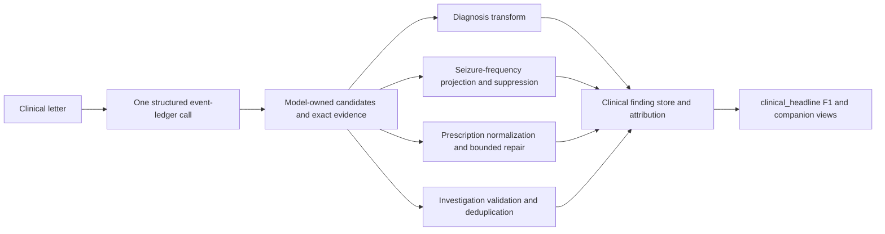
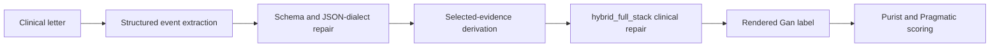

# Six-model comparison across ExECTv2 and Gan 2026

Date: 2026-07-18  
Status: retained-panel report with bounded development and aggregate-only holdout claims

## Executive conclusion

The same six named model conditions were evaluated on the fixed ExECTv2 and
Gan pipelines: GPT-4.1-mini, GPT-5.6 Luna, GPT-5.6 Sol, thinking-enabled
DeepSeek V4 Flash, Qwen 3.6:35B, and Gemma 4 26B.

There is no stable cross-task winner. Sol leads ExECT test60, while Qwen leads
Gan test450. Their aggregate rank correlation is only `0.20`. This supports a
task- and pipeline-specific interpretation; it does not support a general model
superiority claim.

ExECT's final deterministic transforms improve the saved development aggregate
for every model, while final exact source-text evidence is `1.0` for all six.
That evidence rate establishes citation presence, not semantic support. The
ExECT unknown-versus-rate study is not measurable because its predeclared
unknown-only denominator is zero. Gan's six-model panel is aggregate-only on a
previously used locked holdout, so it supports comparison at the named scorer
and protocol scope, not row-level error analysis or tuning.

## 1. Datasets and task profiles

### ExECTv2: broad epilepsy phenotyping

ExECTv2 uses de-identified clinical letters to recover four fixed clinical
families in the final comparison: Diagnosis, Seizure Frequency, Prescription,
and Investigations. `dev140` permits row-level development analysis;
`test60` is locked and reported only through aggregate readouts. The primary
score is internal de-duplicated clinical fact recovery (`clinical_headline`)
F1. It is not the published ExECT benchmark.

Illustrative synthetic letter, not a retained dataset row:

> Dear colleague, she has had no further seizures since March 2024. She remains
> on levetiracetam 500 mg twice daily. MRI brain was normal; EEG showed left
> temporal epileptiform discharges. The working diagnosis is focal epilepsy.

Expected structured content is evidence-linked and family-specific:

| Family | Example extracted fact |
| --- | --- |
| Diagnosis | focal epilepsy, affirmed |
| Seizure Frequency | seizure-free since March 2024 |
| Prescription | levetiracetam, 500 mg, twice daily |
| Investigations | MRI normal; EEG with left temporal discharges |

The named model supplies the candidate facts for all four families. Deterministic
code may normalize, project, suppress, validate, or apply bounded repair, but
an independent rules extractor may not replace or union the model's result.

### Gan 2026: current seizure-frequency extraction

Gan uses synthetic clinical letters and asks for one current seizure-frequency
label per letter. The source contains 1,500 records; the fixed comparison uses
validation750 for development evidence and test450 as a locked aggregate-only
holdout. The primary scorer is Purist accuracy; Pragmatic accuracy is a
secondary side-car. Both are label-level measures and are not numerically
interchangeable with ExECT F1.

Illustrative synthetic letter, not a retained test row:

> Since the last review she reports two focal seizures in the past month. There
> have been no prolonged seizure-free intervals, and the frequency is otherwise
> unchanged. The current answer is an active monthly seizure frequency.

The Gan stack keeps raw model selection, format repair, selected evidence,
clinical repair, rendered label, and scorer output separate. Exact evidence is
reported at the Gan row-level measurement point; it is not directly comparable
with ExECT's post-assembly mention rate.

## 2. Comparison contract and results

The panels are matched within each task, not pooled across tasks.

| Field | ExECTv2 | Gan 2026 |
| --- | --- | --- |
| Development evidence | `dev140`; row review permitted | `validation750`; development/replay evidence |
| Locked evidence | `test60`; 59 loadable letters; aggregate only | `test450`; 450 rows; aggregate only |
| Model call | One structured four-family call per letter | One structured event call per note |
| Prompt | `exectv2_hybrid_key_family_event_ledger_v0.9.24` | `gan2026_hybrid_structured_events_v0.7` |
| Final repair | Attributable family transforms and finding assembly | `hybrid_full_stack` |
| Primary score | `clinical_headline` F1 | Purist accuracy |

### ExECTv2 six-model panel

| Model | dev140 F1 | test60 F1 | Change | Final exact evidence | Schema/parse signal |
| --- | ---: | ---: | ---: | ---: | --- |
| GPT-5.6 Sol | 0.8920 | 0.8047 | -0.0873 | 1.0000 | 0 |
| GPT-5.6 Luna | 0.8832 | 0.7950 | -0.0882 | 1.0000 | 0 |
| DeepSeek V4 Flash (thinking) | 0.8767 | 0.7881 | -0.0886 | 1.0000 | 0 |
| Qwen 3.6:35B | 0.8571 | 0.7872 | -0.0699 | 1.0000 | 0 |
| GPT-4.1-mini | 0.8202 | 0.7572 | -0.0630 | 1.0000 | 0 |
| Gemma 4 26B | 0.8016 | 0.7169 | -0.0847 | 1.0000 | 6 aggregate events |

All six retain the same rank order from dev140 to test60. The mean absolute
F1 change is `0.0803`; this is useful transfer evidence for the internal scorer,
but the small locked split and row-inspection ban prevent a failure-mechanism
or broad robustness claim.

Family-level development comparison:

| Model | Diagnosis | Seizure Frequency | Prescription | Investigations |
| --- | ---: | ---: | ---: | ---: |
| GPT-4.1-mini | 0.8470 | 0.6936 | 0.8672 | 0.8538 |
| GPT-5.6 Luna | 0.8910 | 0.7892 | 0.9250 | 0.9202 |
| GPT-5.6 Sol | 0.8882 | 0.8012 | 0.9432 | 0.9358 |
| DeepSeek V4 Flash | 0.8764 | 0.7610 | 0.9280 | 0.9389 |
| Qwen 3.6:35B | 0.8720 | 0.7062 | 0.9249 | 0.9105 |
| Gemma 4 26B | 0.8378 | 0.6226 | 0.9046 | 0.8047 |

The saved raw-to-final development deltas range from `+0.0773` to `+0.1083`
F1. They combine evidence filtering, normalization, Diagnosis recovery,
Seizure Frequency projection/suppression, Prescription repair, and final
assembly; they are not model-only gains.

### Gan six-model test450 panel

| Model | Purist | Pragmatic | Rank | Exact evidence | Schema/repair trace |
| --- | ---: | ---: | ---: | ---: | --- |
| Qwen 3.6:35B | 367/450 (0.8156) | 380/450 (0.8444) | 1 | 363/450 | 0 final; deterministic repair |
| GPT-5.6 Sol | 358/450 (0.7956) | 376/450 (0.8356) | 2 | 449/450 | 0; 366 repair notes |
| GPT-4.1-mini | 353/450 (0.7844) | 371/450 (0.8244) | 3 | 419/450 | 2; 317 repair notes |
| GPT-5.6 Luna | 352/450 (0.7822) | 365/450 (0.8111) | 4 | 446/450 | 3; 305 repair notes |
| Gemma 4 26B | 343/450 (0.7622) | 367/450 (0.8156) | 5 | 437/450 | 0 final; deterministic repair |
| DeepSeek V4 Flash (thinking) | 342/450 (0.7600) | 362/450 (0.8044) | 6 | 434/450 | 4; 259 repair notes |

Qwen and Gemma use the same named prompt, pipeline, repair policy, and scorer
as the hosted conditions. Local route and retained aggregate-reparse details
remain explicit provenance notes; they do not change the six-row headline
comparison. The panel is aggregate-only, not a pristine one-shot or general
model-capability ranking.

## 3. ExECT component and reliability mechanisms

The predeclared ExECT Seizure Frequency replay compares model-structured state
sets with the final projected/suppressed state sets on the same 140 development
letters. The deterministic stage improves state-profile F1 for every model:

| Model | Structured state F1 | Final state F1 | Delta | Wrong→correct | Correct→wrong |
| --- | ---: | ---: | ---: | ---: | ---: |
| GPT-4.1-mini | 0.7340 | 0.7845 | +0.0505 | 13 | 0 |
| GPT-5.6 Luna | 0.8357 | 0.8551 | +0.0194 | 4 | 0 |
| GPT-5.6 Sol | 0.8509 | 0.8603 | +0.0094 | 3 | 1 |
| DeepSeek V4 Flash | 0.8104 | 0.8429 | +0.0325 | 9 | 0 |
| Qwen 3.6:35B | 0.7517 | 0.7986 | +0.0469 | 13 | 0 |
| Gemma 4 26B | 0.6894 | 0.7386 | +0.0492 | 12 | 0 |

Across the six repeated panels there are 54 wrong-to-correct and one
correct-to-wrong transition. The repeated 140 letters mean these counts are
descriptive, not 840 independent clinical samples. The intended ExECT
unknown-versus-rate measure remains closed: the unknown-only gold denominator
is zero, and empty-gold letters cannot be relabelled as unknown.

## 4. Eight-criterion reliability scorecard

The same eight questions are applied to both tasks, but each task keeps its own
measurement object, denominator, score stage, and evidence state. No composite
reliability score or pooled task ranking is calculated.

### ExECTv2

| Criterion | Evidence and result | Limit / disposition |
| --- | --- | --- |
| Clinical correctness and generalization | Six-model dev140 and test60 F1; all six test ranks retained | Complete for named internal scorer; not published benchmark or clinical validation |
| Clinical selection and unsupported inference | Unknown-only study predeclared | Not measurable: denominator is zero; no transfer claim |
| Evidence support and faithfulness | Exact evidence `1.0` after final assembly | Citation presence only; semantic-support sample awaits independent review |
| Uncertainty and selective action | Internal scoring-rule calibration and historical confidence-routing replay | Partial; no six-model deployment-calibration claim |
| Robustness and stability | Six-model dev-to-test changes and parser/runtime events | Partial; no wording perturbation or self-consistency study |
| Component attribution and correction safety | Score stages, fact origin, and 54/1 SF transitions | Complete for recorded replay; repeated letters limit pooled transition interpretation |
| Coverage and clinical-slice behavior | Diagnosis, SF, Prescription, and Investigations scores for all six | Partial; family variation is not demographic fairness |
| Operational reliability | Six test60 aggregates, failures, schema events, and route metadata | Partial; no matched cross-route cost/latency claim |

### Gan 2026

| Criterion | Evidence and result | Limit / disposition |
| --- | --- | --- |
| Clinical correctness and generalization | Six-model test450 Purist and Pragmatic panel plus retained validation/test subject comparison | Complete for named aggregate scope; no row-level holdout analysis |
| Clinical selection and unsupported inference | Gan unknown-gold active-rate over-read result retained | Partial; compact source lacks selected denominator counts |
| Evidence support and faithfulness | Row-level textual grounding and exact-evidence counts | Partial; exact presence is not independent semantic review |
| Uncertainty and selective action | External calibration, risk-coverage, and failure-prediction results for named subject | Partial; not a six-model routing result |
| Robustness and stability | Prompt-version and repeated-temperature subdimensions | Partial; not broad perturbation robustness |
| Component attribution and correction safety | Shared normalization delta and separate repair stages | Partial; complete stage-transition inventory is unavailable |
| Coverage and clinical-slice behavior | Seizure-band variation and six-model results | Partial; demographic fairness is not measured |
| Operational reliability | Six-model failures, repairs, exact evidence, and bounded historical cost estimate | Partial; matched efficiency telemetry is unavailable |

### Cross-task interpretation

The criteria are comparable as questions about reliability, not as one numeric
scale. Correctness, evidence support, uncertainty, robustness, attribution,
coverage, and operations use different units and scopes. Clinical selection and
unsupported inference is explicitly not comparable because ExECT lacks a valid
unknown-only denominator. Exact evidence must not be called semantic support,
and family variation must not be called demographic fairness.

## 5. Decision and claim boundary

The report supports:

- a fixed six-model comparison on both named task pipelines;
- ExECT development component evidence and aggregate-only test60 transfer
  evidence;
- Gan aggregate-only test450 Purist and Pragmatic evidence;
- a bounded result that model rank is task-specific, with Sol leading ExECT and
  Qwen leading Gan; and
- a negative, data-limited result for transferring Gan's unknown-versus-rate
  measure to ExECT.

It does not support general model superiority, a pooled reliability score,
Gan-to-ExECT reliability transfer, the published ExECT benchmark, deployment
calibration, semantic faithfulness validation, or clinical validation.
Independent clinical review remains the material next requirement for stronger
clinical-validity claims.

## Evidence owners

- [Project status](../../PROJECT_STATUS.md)
- [Paper claim status](../canon/10_paper_provenance.md)
- [Retained evidence index](../experiments/retained_evidence_manifest.md)
- [Shared eight-criterion scorecard](shared_reliability_scorecard_2026-07-18.md)
- [Reliability framework](../design/reliability_evaluation_framework.md)
- [ExECT test60 protocol](../experiments/exectv2/reliability/exectv2_hosted_test60_protocol_2026-07-15.md)
- [Gan v0.7 test450 protocol](../experiments/gan2026/gan2026_matched_v07_test450_protocol_2026-07-15.md)
- [ExECT SF reliability protocol](../experiments/exectv2/reliability/exectv2_six_model_sf_overinference_protocol_2026-07-18.md)
- [ExECT SF reliability result](../experiments/exectv2/reliability/exectv2_six_model_sf_overinference_2026-07-18.md)
