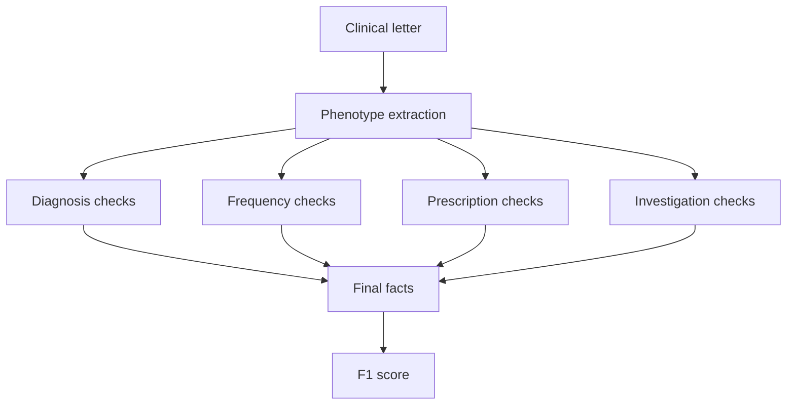
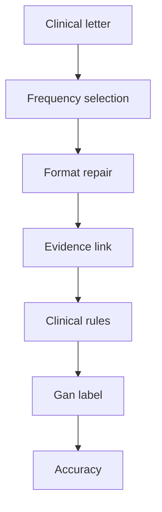
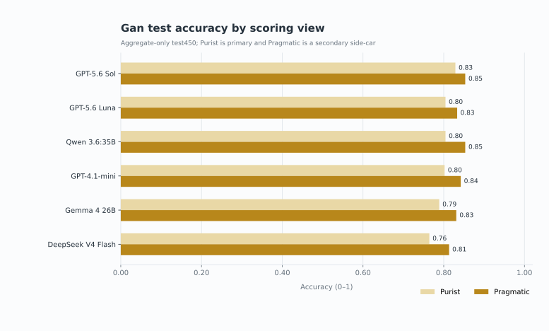

# Six-model comparison across ExECTv2 and Gan 2026

Date: 2026-07-18  
Updated: 2026-07-31  
Status: primary test comparison complete; Gan v0.5 six-model `dev750` coverage
complete; Gan LLM-with-rules ruleset finalized 2026-07-31; ExECT active
assembly policy is `default` / `default` (decision 0045; joint/combined
archived); test results remain aggregate-only; external Artificial Analysis
capability/cost context and development error-pattern synthesis added
2026-07-31

## Terms used in this report

- **ExECTv2** extracts facts from four parts of an epilepsy letter: Diagnosis,
  Seizure Frequency, Prescription, and Investigations.
- **Gan 2026** assigns one current seizure-frequency label to each letter.
- **Development split** means data that may be examined one row at a time.
  `dev140` contains 140 ExECTv2 letters; `dev750` contains 750 Gan letters.
- **Locked test split** means data whose individual rows may not be examined or
  used to change the system. This report gives only totals for ExECTv2 `test60`
  and Gan `test450`.
- **Aggregate-only** means that only totals and summary scores are available,
  not individual predictions or errors.
- **LLM only** means the saved model output before deterministic code changes
  its clinical content. **LLM with rules** means the final output after fixed,
  non-model code checks, standardizes, selects, or repairs that output.
- **F1** combines precision, the share of extracted facts that are correct, and
  recall, the share of reference facts that were extracted. Higher is better.
- **Purist accuracy** requires the exact Gan reference label. **Pragmatic
  accuracy** also accepts specified clinically equivalent labels. Higher is
  better for both measures.
- **Exact evidence** means that a prediction includes text copied exactly from
  its source letter. It shows that a quotation is present, not that the
  quotation clinically supports the prediction.
- **Wrong to correct** and **correct to wrong** count answers changed by the
  deterministic code. The latter are also called regressions.

## Executive conclusion

The same six models were evaluated with the fixed ExECTv2 and Gan pipelines:
GPT-4.1-mini, GPT-5.6 Luna, GPT-5.6 Sol,
DeepSeek V4 Flash, Qwen 3.6:35B, and Gemma 4 26B.

GPT-5.6 Sol leads both selected test panels: ExECT test60 with an F1 of `0.80`
and the Gan v0.5 test450 panel with a Purist accuracy of `0.83`. The rank
correlation is `0.61`, where `1.00` would mean the two rankings were identical.
The tasks use different data and scores, so this does not establish general
model superiority.

External Artificial Analysis context aligns with a compressed quality ladder:
Sol leads the Intelligence Index and Healthcare & Medical Index among the six,
but Luna and DeepSeek sit close on Healthcare while list prices differ by more
than an order of magnitude. On these two extraction tasks the absolute gaps are
modest (ExECT test60 about `0.72`–`0.80`; Gan frozen Purist about `0.76`–
`0.83`). Smaller or cheaper models can therefore look “good enough” on task
score even when general/domain indexes separate them more clearly. Matched
run tokens, latency, and spend were not retained; dollar figures below are
clearly labelled external list-price illustrations.

Development error ownership is partly shared and partly idiosyncratic: every
Gan model is dominated by `rate_denominator` rows, while residual first-failure
owners differ (Qwen heavy on `evidence_selection`; Sol/Luna almost entirely
`llm_clinical_selection`).

Adding deterministic checks improves the ExECT development score for every
model. The matched Gan v0.5 six-model `dev750` panel is complete; do not combine
the historical v0.7 `dev750` panel with the selected v0.5 `test450` results.
All test results are aggregate-only, so they support comparison under these
protocols but not row-level test error analysis or tuning.

As of 2026-07-31, the Gan **LLM with rules** ruleset is finalized as working-
tree `hybrid_full_stack` with the projection/anti-regression, dated-count,
competing-rate, and narrow cross-model guards described below. Frozen July
panel artifacts remain the historical matched-panel record under the prior
repair; current LLM-with-rules readouts use no-call replay of the same saved
raw outputs through the final ruleset.

### Results at a glance

| Question | ExECTv2 | Gan 2026 |
| --- | --- | --- |
| What is extracted? | Facts from four parts of an epilepsy letter | One current seizure-frequency label |
| Primary measure | Internal clinical-fact F1 | Purist accuracy |
| Best test result | GPT-5.6 Sol: `0.80` | GPT-5.6 Sol: `0.83` frozen panel; `0.85` final-ruleset no-call replay |
| Effect of deterministic checks | F1 gain of `0.08` to `0.11` on dev140 | Matched v0.5 `dev750` complete; final ruleset lifts most models on no-call replay |
| External capability context | Same six models on AA Intelligence + Healthcare indexes (not task scores) | Same |
| External cost context | List prices / AA latency; not matched run telemetry | Same |
| Main limitation | Internal metric; 59 loadable test letters | Locked test split; final-ruleset scores are no-call replays of saved raws |

## 1. What the two tasks measure

### ExECTv2: facts from four parts of an epilepsy letter

ExECTv2 uses de-identified clinical letters to recover facts from four fixed
parts of each letter: Diagnosis, Seizure Frequency, Prescription,
and Investigations. `dev140` permits row-level development analysis;
`test60` is locked and reported only through aggregate readouts. The primary
score is internal de-duplicated clinical fact recovery (`clinical_headline`)
F1. It is not the published ExECT benchmark.

Illustrative synthetic letter, not a retained dataset row:

> Dear colleague, she has had no further seizures since March 2024. She remains
> on levetiracetam 500 mg twice daily. MRI brain was normal; EEG showed left
> temporal epileptiform discharges. The working diagnosis is focal epilepsy.

The expected structured output links each fact to supporting text:

| Part of the letter | Example extracted fact |
| --- | --- |
| Diagnosis | focal epilepsy, affirmed |
| Seizure Frequency | seizure-free since March 2024 |
| Prescription | levetiracetam, 500 mg, twice daily |
| Investigations | MRI normal; EEG with left temporal discharges |

The pipeline produces one prediction as follows:

The model proposes facts and quotes supporting text. Fixed code then checks and
standardizes each part without running a second extractor or adding
facts the model did not propose. The final facts are compared with the reference
using the internal `clinical_headline` F1 measure.

### Gan 2026: current seizure-frequency extraction

Gan uses synthetic clinical letters and asks for one current seizure-frequency
label per letter. The source contains 1,500 records; the fixed comparison uses
`dev750` for development evidence and `test450` as a locked aggregate-only
test split. Retained filenames and machine-readable records use the legacy
identifier `validation750` for `dev750`. The primary scorer is Purist accuracy;
Pragmatic accuracy is a secondary measure. Both are label-level measures and
are not numerically interchangeable with ExECT F1.

Illustrative synthetic letter, not a retained test row:

> Since the last review she reports two focal seizures in the past month. There
> have been no prolonged seizure-free intervals, and the frequency is otherwise
> unchanged. The current answer is an active monthly seizure frequency.

The pipeline produces one prediction as follows:

The model identifies seizure events and selects the current frequency. Fixed
code repairs formatting, keeps the supporting quotation, resolves conflicts
between current and historical statements, and converts the answer to a Gan
label. Each stage is saved so errors can be assigned to model selection,
formatting, clinical rules, or label conversion. The final label is scored with
Purist accuracy; Pragmatic accuracy is reported as a secondary measure.

## 2. Comparison method and results

Each model uses the same data, prompt, processing steps, and score as the other
models within a task. Scores from the two tasks are not combined.

| Field | ExECTv2 | Gan 2026 |
| --- | --- | --- |
| Development split | `dev140`; row review permitted | `dev750` (legacy ID: `validation750`); row review permitted |
| Test split | `test60`; 59 loadable letters; aggregate only | `test450`; 450 rows; aggregate only |
| Model call | One structured call for all four parts of each letter | One structured call for seizure events in each note |
| Prompt | `exectv2_hybrid_key_family_event_ledger_v0.9.24` | `gan2026_hybrid_structured_events_v0.5` |
| Fixed code after the model | Checks and standardizes each part, then assembles the facts | Final Gan LLM-with-rules ruleset: `hybrid_full_stack` (see below) |
| Primary score | `clinical_headline` F1 | Purist accuracy |

### ExECTv2: development and test F1

The final ExECT pipeline retains the same model order from dev140 to test60.
Every test60 score is lower than its corresponding development score, with a
mean absolute F1 change of `0.08`.

| Model | dev140 F1 | test60 F1 | Change | Final exact evidence | Schema/parse signal |
| --- | ---: | ---: | ---: | ---: | --- |
| GPT-5.6 Sol | 0.89 | 0.80 | -0.09 | 1.00 | 0 |
| GPT-5.6 Luna | 0.88 | 0.80 | -0.09 | 1.00 | 0 |
| DeepSeek V4 Flash | 0.88 | 0.79 | -0.09 | 1.00 | 0 |
| Qwen 3.6:35B | 0.86 | 0.79 | -0.07 | 1.00 | 0 |
| GPT-4.1-mini | 0.82 | 0.76 | -0.06 | 1.00 | 0 |
| Gemma 4 26B | 0.80 | 0.72 | -0.08 | 1.00 | 6 aggregate events |

These retained panel aggregates use Diagnosis/Prescription **`default` /
`default`**, which is the active ExECT comparison policy
([decision 0045](../decisions/0045-exect-default-policy-not-joint-combined.md)).
An earlier joint (`combined`/`combined`) candidate and a matched six-model
no-call reassembly remain archived development evidence only; they are not the
live comparison stack. See the
[joint-policy archive index](../experiments/exectv2/reliability/archive/exectv2_joint_policy_archive_README.md).

The unchanged model order shows that the development ordering also held on
this test split. The small locked split and the ban on examining its rows mean
the report cannot explain individual failures or claim broad reliability.

### ExECTv2: model output before and after fixed code

The development comparison uses the saved model output for LLM only and the
output after the fixed code for LLM with rules. The fixed code improves
clinical-headline F1 for every model; gains range from `0.08`
to `0.11`.

| Model | LLM only | LLM with rules | Change |
| --- | ---: | ---: | ---: |
| GPT-5.6 Sol | 0.81 | 0.89 | +0.08 |
| GPT-5.6 Luna | 0.81 | 0.88 | +0.08 |
| DeepSeek V4 Flash | 0.79 | 0.88 | +0.09 |
| Qwen 3.6:35B | 0.75 | 0.86 | +0.11 |
| GPT-4.1-mini | 0.71 | 0.82 | +0.11 |
| Gemma 4 26B | 0.70 | 0.80 | +0.10 |

These gains combine several operations: removing facts without valid quoted
evidence; standardizing values; recovering Diagnosis facts; converting or
removing Seizure Frequency facts; repairing Prescription facts; and assembling
the final output. The comparison does not isolate the effect of any one rule.

### ExECTv2: results for each part of the letter

These results are separate from the overall comparison because each part has
different fact counts and extraction behavior. Seizure Frequency is
the weakest family for every model, while Prescription or Investigations is
usually strongest.

Development results by part:

| Model | Diagnosis | Seizure Frequency | Prescription | Investigations |
| --- | ---: | ---: | ---: | ---: |
| GPT-4.1-mini | 0.85 | 0.69 | 0.87 | 0.85 |
| GPT-5.6 Luna | 0.89 | 0.79 | 0.93 | 0.92 |
| GPT-5.6 Sol | 0.89 | 0.80 | 0.94 | 0.94 |
| DeepSeek V4 Flash | 0.88 | 0.76 | 0.93 | 0.94 |
| Qwen 3.6:35B | 0.87 | 0.71 | 0.92 | 0.91 |
| Gemma 4 26B | 0.84 | 0.62 | 0.90 | 0.80 |

### Gan 2026: final LLM-with-rules ruleset (2026-07-31)

The Gan **LLM with rules** implementation is finalized as working-tree
`hybrid_full_stack` under prompt `gan2026_hybrid_structured_events_v0.5`.
Further rule tuning for this comparison is closed unless a new predeclared
study reopens it.

The final ruleset includes the matched-panel repair stack plus:

1. projection / anti-regression floors (range/cluster projection; diary
   anti-overwrite of sustained seizure-free and explicit fortnight/week rates);
2. dated-count and competing-rate floors (`N in/within M months` projection;
   note-mined dated sequences with two distinct months; typical rate over
   explicit year-to-date selection);
3. narrow cross-model guards (bare singleton `1 cluster per …` → `unknown`;
   typical-over-YTD requires YTD selection language; diary may overwrite only
   explicit current-month seizure-free).

Owners:
[dated-count / guard report](gan2026_luna_dated_count_competing_rate_report_2026-07-31.md),
[six-model final-ruleset replay](../../experiments/gan2026_six_model_current_floors_replay_20260731/replay_summary.json).

### Gan 2026: development coverage

The selected v0.5 prompt has complete six-model `test450` and `dev750`
coverage. The July 2026 matched `dev750` panel artifacts remain the row-trace
and attribution owners under the prior repair. Current LLM-with-rules
development scores use no-call replay of those saved raw outputs through the
final ruleset.

The earlier complete v0.7 development panel is excluded from primary results
because combining v0.7 development scores with v0.5 test scores would create a
false development-to-test comparison. It remains a quarantined prompt-
interaction diagnostic under [decision 0043](../decisions/0043-gan-hosted-comparison-uses-v05-prompt.md).

### Gan 2026: Purist and Pragmatic accuracy

Purist accuracy remains the primary result. Pragmatic accuracy is shown as a
separate score rather than combined with the Purist ranking.

#### Frozen matched panel (prior `hybrid_full_stack`; historical record)

| Model | Purist | Pragmatic | Rank | Answers with exact evidence | Format or repair record |
| --- | ---: | ---: | ---: | ---: | --- |
| GPT-5.6 Sol | 373/450 (0.83) | 384/450 (0.85) | 1 | 450/450 | 0 parse/validation failures; 338 repair-note rows |
| GPT-5.6 Luna | 362/450 (0.80) | 375/450 (0.83) | 2= | 444/450 | 3 parse/validation failures; 273 repair-note rows |
| Qwen 3.6:35B | 362/450 (0.80) | 384/450 (0.85) | 2= | 347/450 | 2 parse/validation failures; 308 repair-note rows |
| GPT-4.1-mini | 361/450 (0.80) | 379/450 (0.84) | 4 | 419/450 | 4 parse/validation failures; 310 repair-note rows |
| Gemma 4 26B | 355/450 (0.79) | 374/450 (0.83) | 5 | 436/450 | 2 parse/validation failures; 295 repair-note rows |
| DeepSeek V4 Flash | 344/450 (0.76) | 366/450 (0.81) | 6 | 433/450 | 3 parse/validation failures; 250 repair-note rows |

#### Final ruleset no-call replay (same saved raw outputs)

All six `dev750` and `test450` conditions are covered. Local Qwen/Gemma
`test450` artifacts are under `scratch/holdout/gan2026_matched_v05_local/`.

| Model | `dev750` Purist (final) | Δ vs frozen panel | `test450` Purist (final) | Δ vs frozen aggregate |
| --- | ---: | ---: | ---: | ---: |
| GPT-4.1-mini | 677/750 | +9 | 369/450 | +8 |
| GPT-5.6 Luna | 660/750 | +14 | 364/450 | +2 |
| GPT-5.6 Sol | 660/750 | +4 | 381/450 | +8 |
| DeepSeek V4 Flash | 627/750 | +8 | 348/450 | +4 |
| Qwen 3.6:35B | 657/750 | −3 | 360/450 | −2 |
| Gemma 4 26B | 647/750 | +4 | 356/450 | +1 |

Under the final ruleset on `dev750`, mini leads Purist; Luna and Sol tie second;
Qwen is slightly below its frozen-panel score. On `test450` replay, Sol still
leads; Qwen dips by 2 rows and Gemma gains 1. Only totals are available for
locked test rows. Qwen and Gemma use the same prompt and final ruleset as the
hosted models, but run locally; that route difference is recorded in the saved
results.

This comparison does not establish a general model ranking.

## 3. Other findings about errors and evidence

Before seeing the results, the study specified a comparison of the Seizure
Frequency states produced by the model with those left after fixed code
converted or removed states. A state records whether the letter gives a rate,
says the patient is seizure-free, or leaves the current frequency unknown. The
fixed code improves F1 for these state sets for every model on the same 140
development letters:

| Model | Model state F1 | F1 after fixed code | Change | Wrong→correct | Correct→wrong |
| --- | ---: | ---: | ---: | ---: | ---: |
| GPT-4.1-mini | 0.73 | 0.78 | +0.05 | 13 | 0 |
| GPT-5.6 Luna | 0.84 | 0.86 | +0.02 | 4 | 0 |
| GPT-5.6 Sol | 0.85 | 0.86 | +0.01 | 3 | 1 |
| DeepSeek V4 Flash | 0.81 | 0.84 | +0.03 | 9 | 0 |
| Qwen 3.6:35B | 0.75 | 0.80 | +0.05 | 13 | 0 |
| Gemma 4 26B | 0.69 | 0.74 | +0.05 | 12 | 0 |

Across the six runs there are 54 wrong-to-correct and one
correct-to-wrong transition. The repeated 140 letters mean these counts are
descriptive, not 840 independent clinical samples. The planned comparison of
unknown frequency with a stated rate cannot be calculated: the reference data
contain no letters labelled only as unknown, and letters with no reference
fact cannot be counted as unknown.

Other limits on the main scores are:

- ExECT records an exact source-text match for `1.00` of final facts for every
  model. This confirms citation presence, not that the cited text clinically
  supports the fact; independent clinical review is still pending.
- The planned ExECT unknown-versus-rate analysis cannot be calculated because
  there are no unknown-only gold cases. Gan findings on this question therefore
  cannot be transferred to ExECT.
- Parsing, output-format, repair, and model-host information is saved for every model,
  but the runs do not provide matched cost or latency measurements.
- Results for each part of the ExECT letter are reported, but neither task measures
  demographic fairness or deployment calibration.

## 4. External capability context (Artificial Analysis)

No independent MedQA board covers all six roster models. This section uses the
Artificial Analysis **Intelligence Index** (general capability) and
**Healthcare & Medical Index** (domain composite: medical knowledge, agentic
knowledge work, non-hallucination, reasoning, customer interaction). Values
were retrieved 2026-07-31 from the public AA pages and are stored in
[`experiments/six_model_external_capability_cost_snapshot_20260731.json`](../../experiments/six_model_external_capability_cost_snapshot_20260731.json).

These scores are **not** ExECT or Gan results. AA “max” / reasoning variants
are not asserted to match the project’s extraction temperature or reasoning
settings. Qwen and Gemma use local Ollama in this project; AA still scores the
same model families independently.

| Roster model | AA variant used | Intelligence Index | Healthcare Index | Healthcare provenance |
| --- | --- | ---: | ---: | --- |
| GPT-5.6 Sol | GPT-5.6 Sol (max) | 58.9 | 45.0 | Matches AA published chart |
| DeepSeek V4 Flash | V4 Flash 0731 (max) | 49.9 | 36.4 | Matches AA published chart |
| GPT-5.6 Luna | GPT-5.6 Luna (max) | 51.2 | 35.6 | Matches AA published chart |
| Qwen 3.6:35B | Qwen3.6 35B A3B (Reasoning) | 31.6 | 22.7 | Recomputed from AA component fields with published weights |
| Gemma 4 26B | Gemma 4 26B A4B (Reasoning) | 25.7 | 15.5 | Recomputed from AA component fields with published weights |
| GPT-4.1-mini | GPT-4.1 mini | 14.8 | 11.7 | Recomputed from AA component fields with published weights |

Sol leads both indexes. Luna and DeepSeek are close on Healthcare despite a
large list-price gap (next section). Mini and the two local open-weight models
trail on both indexes more than they trail on the ExECT/Gan task tables above.
That supports the intended reading: stronger general/domain models tend to do
better here, but the **task** gaps are smaller than the **index** gaps.

## 5. External list-price cost and latency context

**Label:** the following are external list-price and Artificial Analysis
latency estimates, not measured tokens, wall time, or dollars from the ExECT
or Gan comparison runs. The retained efficiency work already closed matched
token/cost/latency reconstruction as unavailable.

Hosted first-party or median hosted prices from AA (USD per 1M tokens):

| Roster model | Input $/M | Output $/M | AA blended $/M (7:2:1 where published) | AA output tok/s | AA TTFT (s) | Project route |
| --- | ---: | ---: | ---: | ---: | ---: | --- |
| GPT-5.6 Sol | 5.00 | 30.00 | 4.35 | 65.5 | 147.3 | Hosted |
| GPT-5.6 Luna | 0.20 | 1.20 | 0.17 | 184.4 | 116.5 | Hosted |
| GPT-4.1-mini | 0.40 | 1.60 | 0.31 | 83.5 | 0.92 | Hosted |
| DeepSeek V4 Flash | 0.14 | 0.28 | 0.06 | — | — | Hosted |
| Qwen 3.6:35B | 0.25 | 1.49 | — | 140.8 | — | Local Ollama (table shows hosted median proxy) |
| Gemma 4 26B | 0.13 | 0.40 | 0.13 | — | — | Local Ollama (table shows hosted median proxy) |

Illustrative only — assume 3,000 input and 1,500 output tokens per note, with
**no** reasoning/thinking surplus:

| Roster model | Illustrative $/1,000 notes | Relative to Sol |
| --- | ---: | ---: |
| GPT-5.6 Sol | 60.00 | 1.00× |
| GPT-4.1-mini | 3.60 | 0.06× |
| Qwen 3.6:35B (hosted proxy) | 2.97 | 0.05× |
| GPT-5.6 Luna | 2.40 | 0.04× |
| Gemma 4 26B (hosted proxy) | 0.99 | 0.017× |
| DeepSeek V4 Flash | 0.84 | 0.014× |

Local Qwen/Gemma project runs do not incur that hosted API bill; their true
marginal cost is hardware, energy, and operator time, which this snapshot does
not measure. Reasoning models can also emit large thinking-token volumes, so
real Sol/Luna/DeepSeek spend may exceed the non-thinking illustration.

Read with the task tables: Luna and DeepSeek approach Sol’s ExECT/Gan scores
and Healthcare Index at a small fraction of Sol’s list price; Gemma trails
more on task score and indexes but is cheap as a hosted proxy and free at the
API layer when run locally.

## 6. Do error patterns track model “level”?

This section uses **development** evidence only (`dev750` Gan attribution;
ExECT `dev140` family and SF-state tables above). Locked test rows remain
aggregate-only.

### Shared floor (not model-idiosyncratic)

On Gan `dev750`, every model’s clinical-subproblem histogram is dominated by
`rate_denominator`, with large `seizure_free_boundary` and
`cluster_or_diary_aggregation` masses. That matches the residual-floor audit:
the hard core is forced clinical selection under annotation conventions, not a
missing-quote problem that only weak models show.

On ExECT `dev140`, Seizure Frequency is the weakest family for every model;
Prescription or Investigations is usually strongest. Deterministic rules raise
clinical-headline F1 for every model by about `0.08`–`0.11`.

### Idiosyncratic residual owners

Gan `dev750` first-failure owners among rows that are not `none`:

| Model | Final Purist | `llm_clinical_selection` | `evidence_selection` | Other owners |
| --- | ---: | ---: | ---: | --- |
| GPT-5.6 Sol | 656/750 | 88 (92.6% of owned failures) | 1 | 6 deterministic |
| GPT-5.6 Luna | 646/750 | 96 (89.7%) | 3 | 8 format/deterministic |
| Gemma 4 26B | 643/750 | 101 (82.8%) | 15 | 6 |
| DeepSeek V4 Flash | 619/750 | 121 (82.3%) | 19 | 7 |
| GPT-4.1-mini | 668/750 | 70 (53.0%) | 57 (43.2%) | 5 |
| Qwen 3.6:35B | 660/750 | 55 (22.8%) | 183 (75.9%) | 3 |

Stronger hosted models fail almost entirely at clinical selection after finding
evidence. Qwen’s residual is mostly evidence-selection / grounding under the
same prompt and repair stack. Mini splits between selection and evidence.
Subproblem mixes also differ at the margin (Luna/DeepSeek higher
`uncertainty_boundary`; Qwen/mini higher `cluster_or_diary_aggregation`).

**Reading:** model “level” predicts aggregate score and shifts the dominant
failure owner somewhat, but the shared clinical-selection floor remains. Error
shape is therefore **partly level-linked and partly idiosyncratic**, not a
clean weak-versus-strong taxonomy.

## 7. What the report does and does not establish

The report supports:

- a fixed six-model comparison on both named task pipelines;
- the change made by fixed code on ExECT development data, and ExECT test60
  totals produced without changing the development procedure;
- Gan v0.5 aggregate-only test450 Purist and Pragmatic evidence under the
  frozen matched panel, plus no-call final-ruleset replay of the same saved
  outputs for all six conditions;
- the finalized Gan LLM-with-rules ruleset identity (`hybrid_full_stack` with
  the 2026-07-31 floors and narrow guards);
- the result, limited to these task-specific procedures, that Sol leads both
  selected frozen test panels and the final-ruleset `test450` no-call replay;
- external AA Intelligence and Healthcare Index context for the same six model
  families, with list-price and AA latency illustrations; 
- development evidence that residual Gan failures share a clinical-selection
  floor while first-failure owners differ by model; and
- a negative, data-limited result for transferring Gan's unknown-versus-rate
  measure to ExECT.

It does not support general model superiority, one reliability score combined
across tasks, applying Gan findings to ExECT, the published ExECT benchmark,
matched run token/latency/dollar rankings, treating AA max-effort scores as the
extraction runtime, estimates of confidence after deployment, proof that
quotations clinically support the extracted facts, or clinical validation.
Independent clinical review is required before making stronger clinical-
validity claims.

## Sources and technical detail

- [Project status](../../PROJECT_STATUS.md)
- [Paper claim status](../canon/10_paper_provenance.md)
- [Retained evidence index](../experiments/retained_evidence_manifest.md)
- [Shared eight-criterion scorecard](shared_reliability_scorecard_2026-07-18.md)
- [Reliability framework](../design/reliability_evaluation_framework.md)
- [External AA capability/cost snapshot](../../experiments/six_model_external_capability_cost_snapshot_20260731.json)
- [Artificial Analysis Healthcare & Medical Index](https://artificialanalysis.ai/models/capabilities/healthcare-and-medical)
- [Why the error floor persists](why_the_error_floor_persists_2026-07-31.md)
- [ExECT test60 protocol](../experiments/exectv2/reliability/exectv2_hosted_test60_protocol_2026-07-15.md)
- [Gan v0.5 hosted test450 protocol](../experiments/gan2026/gan2026_matched_v05_test450_protocol_2026-07-16.md)
- [Gan v0.5 local and replay protocol](../experiments/gan2026/gan2026_matched_v05_local_test450_and_qwen_val750_protocol_2026-07-18.md)
- [Gan v0.5 six-model dev750 panel](../experiments/gan2026/gan2026_matched_v05_dev750_panel_2026-07-27.md)
- [Gan final LLM-with-rules floors and guards](gan2026_luna_dated_count_competing_rate_report_2026-07-31.md)
- [Six-model final-ruleset no-call replay](../../experiments/gan2026_six_model_current_floors_replay_20260731/replay_summary.json)
- [ExECT SF reliability protocol](../experiments/exectv2/reliability/exectv2_six_model_sf_overinference_protocol_2026-07-18.md)
- [ExECT SF reliability result](../experiments/exectv2/reliability/exectv2_six_model_sf_overinference_2026-07-18.md)
