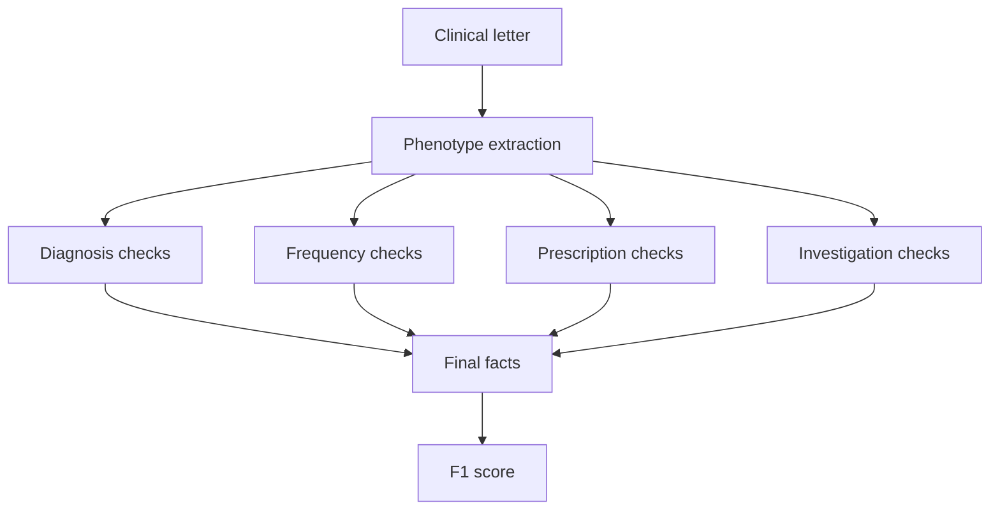
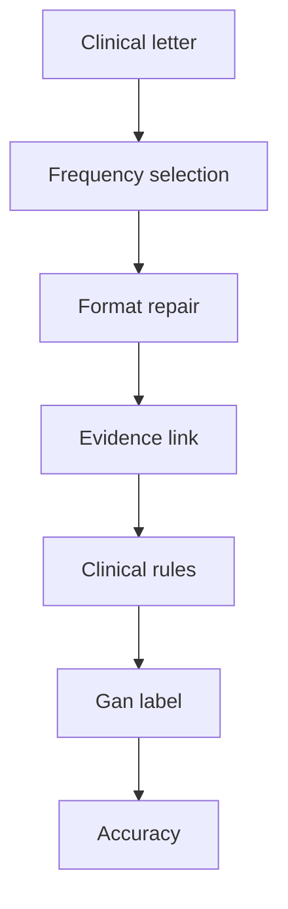

# Six-model comparison across ExECTv2 and Gan 2026

Date: 2026-07-18
Updated: 2026-07-20
Status: final comparison report; test results are aggregate-only

## Terms used in this report

- **ExECTv2** extracts facts from four parts of an epilepsy letter: Diagnosis,
  Seizure Frequency, Prescription, and Investigations.
- **Gan 2026** assigns one current seizure-frequency label to each letter.
- **Development split** means data that may be examined one row at a time.
  `dev140` contains 140 ExECTv2 letters; `dev750` contains 750 Gan letters.
- **Locked test split** means data whose individual rows may not be examined or
  used to change the system. This report gives only totals for ExECTv2 `test60`
  and Gan `test450`.
- **Aggregate-only** means that only totals and summary scores are available,
  not individual predictions or errors.
- **LLM only** means the saved model output before deterministic code changes
  its clinical content. **LLM with rules** means the final output after fixed,
  non-model code checks, standardizes, selects, or repairs that output.
- **F1** combines precision, the share of extracted facts that are correct, and
  recall, the share of reference facts that were extracted. Higher is better.
- **Purist accuracy** requires the exact Gan reference label. **Pragmatic
  accuracy** also accepts specified clinically equivalent labels. Higher is
  better for both measures.
- **Exact evidence** means that a prediction includes text copied exactly from
  its source letter. It shows that a quotation is present, not that the
  quotation clinically supports the prediction.
- **Wrong to correct** and **correct to wrong** count answers changed by the
  deterministic code. The latter are also called regressions.

## Executive conclusion

The same six models were evaluated with the fixed ExECTv2 and Gan pipelines:
GPT-4.1-mini, GPT-5.6 Luna, GPT-5.6 Sol,
DeepSeek V4 Flash, Qwen 3.6:35B, and Gemma 4 26B.

There is no stable winner across the two tasks. GPT-5.6 Sol leads ExECT test60
with an F1 of `0.80`, while Qwen 3.6:35B leads Gan test450 with a Purist
accuracy of `0.82`. The rank correlation is `0.20`, where `1.00` would mean the
two rankings were identical. Choose a model for the task and pipeline being
used. These results do not show that one model is generally superior.

Adding deterministic checks improves the development score for every model on
both tasks. The checks are not uniformly safe: on Gan they also change 23 to 34
previously correct answers to incorrect answers per model. All test results are
aggregate-only, so they support comparison under these protocols but not
row-level test error analysis, tuning, or a general claim about model quality.

### Results at a glance

| Question | ExECTv2 | Gan 2026 |
| --- | --- | --- |
| What is extracted? | Facts from four parts of an epilepsy letter | One current seizure-frequency label |
| Primary measure | Internal clinical-fact F1 | Purist accuracy |
| Best test result | GPT-5.6 Sol: `0.80` | Qwen 3.6:35B: `0.82` |
| Effect of deterministic checks | F1 gain of `0.08` to `0.11` on dev140 | 65 to 134 additional correct rows on dev750 |
| Main limitation | Internal metric; 59 loadable test letters | Previously used locked test split |

## 1. What the two tasks measure

### ExECTv2: facts from four parts of an epilepsy letter

ExECTv2 uses de-identified clinical letters to recover facts from four fixed
parts of each letter: Diagnosis, Seizure Frequency, Prescription,
and Investigations. `dev140` permits row-level development analysis;
`test60` is locked and reported only through aggregate readouts. The primary
score is internal de-duplicated clinical fact recovery (`clinical_headline`)
F1. It is not the published ExECT benchmark.

Illustrative synthetic letter, not a retained dataset row:

> Dear colleague, she has had no further seizures since March 2024. She remains
> on levetiracetam 500 mg twice daily. MRI brain was normal; EEG showed left
> temporal epileptiform discharges. The working diagnosis is focal epilepsy.

The expected structured output links each fact to supporting text:

| Part of the letter | Example extracted fact |
| --- | --- |
| Diagnosis | focal epilepsy, affirmed |
| Seizure Frequency | seizure-free since March 2024 |
| Prescription | levetiracetam, 500 mg, twice daily |
| Investigations | MRI normal; EEG with left temporal discharges |

The pipeline produces one prediction as follows:

The model proposes facts and quotes supporting text. Fixed code then checks and
standardizes each part without running a second extractor or adding
facts the model did not propose. The final facts are compared with the reference
using the internal `clinical_headline` F1 measure.

### Gan 2026: current seizure-frequency extraction

Gan uses synthetic clinical letters and asks for one current seizure-frequency
label per letter. The source contains 1,500 records; the fixed comparison uses
`dev750` for development evidence and `test450` as a locked aggregate-only
test split. Retained filenames and machine-readable records use the legacy
identifier `validation750` for `dev750`. The primary scorer is Purist accuracy;
Pragmatic accuracy is a secondary measure. Both are label-level measures and
are not numerically interchangeable with ExECT F1.

Illustrative synthetic letter, not a retained test row:

> Since the last review she reports two focal seizures in the past month. There
> have been no prolonged seizure-free intervals, and the frequency is otherwise
> unchanged. The current answer is an active monthly seizure frequency.

The pipeline produces one prediction as follows:

The model identifies seizure events and selects the current frequency. Fixed
code repairs formatting, keeps the supporting quotation, resolves conflicts
between current and historical statements, and converts the answer to a Gan
label. Each stage is saved so errors can be assigned to model selection,
formatting, clinical rules, or label conversion. The final label is scored with
Purist accuracy; Pragmatic accuracy is reported as a secondary measure.

## 2. Comparison method and results

Each model uses the same data, prompt, processing steps, and score as the other
models within a task. Scores from the two tasks are not combined.

| Field | ExECTv2 | Gan 2026 |
| --- | --- | --- |
| Development split | `dev140`; row review permitted | `dev750` (legacy ID: `validation750`); row review permitted |
| Test split | `test60`; 59 loadable letters; aggregate only | `test450`; 450 rows; aggregate only |
| Model call | One structured call for all four parts of each letter | One structured call for seizure events in each note |
| Prompt | `exectv2_hybrid_key_family_event_ledger_v0.9.24` | `gan2026_hybrid_structured_events_v0.7` |
| Fixed code after the model | Checks and standardizes each part, then assembles the facts | Repairs format, links evidence, applies clinical rules, and converts the label (`hybrid_full_stack`) |
| Primary score | `clinical_headline` F1 | Purist accuracy |

### ExECTv2: development and test F1

The final ExECT pipeline retains the same model order from dev140 to test60.
Every test60 score is lower than its corresponding development score, with a
mean absolute F1 change of `0.08`.

| Model | dev140 F1 | test60 F1 | Change | Final exact evidence | Schema/parse signal |
| --- | ---: | ---: | ---: | ---: | --- |
| GPT-5.6 Sol | 0.89 | 0.80 | -0.09 | 1.00 | 0 |
| GPT-5.6 Luna | 0.88 | 0.80 | -0.09 | 1.00 | 0 |
| DeepSeek V4 Flash | 0.88 | 0.79 | -0.09 | 1.00 | 0 |
| Qwen 3.6:35B | 0.86 | 0.79 | -0.07 | 1.00 | 0 |
| GPT-4.1-mini | 0.82 | 0.76 | -0.06 | 1.00 | 0 |
| Gemma 4 26B | 0.80 | 0.72 | -0.08 | 1.00 | 6 aggregate events |

The unchanged model order shows that the development ordering also held on
this test split. The small locked split and the ban on examining its rows mean
the report cannot explain individual failures or claim broad reliability.

### ExECTv2: model output before and after fixed code

The development comparison uses the saved model output for LLM only and the
output after the fixed code for LLM with rules. The fixed code improves
clinical-headline F1 for every model; gains range from `0.08`
to `0.11`.

| Model | LLM only | LLM with rules | Change |
| --- | ---: | ---: | ---: |
| GPT-5.6 Sol | 0.81 | 0.89 | +0.08 |
| GPT-5.6 Luna | 0.81 | 0.88 | +0.08 |
| DeepSeek V4 Flash | 0.79 | 0.88 | +0.09 |
| Qwen 3.6:35B | 0.75 | 0.86 | +0.11 |
| GPT-4.1-mini | 0.71 | 0.82 | +0.11 |
| Gemma 4 26B | 0.70 | 0.80 | +0.10 |

These gains combine several operations: removing facts without valid quoted
evidence; standardizing values; recovering Diagnosis facts; converting or
removing Seizure Frequency facts; repairing Prescription facts; and assembling
the final output. The comparison does not isolate the effect of any one rule.

### ExECTv2: results for each part of the letter

These results are separate from the overall comparison because each part has
different fact counts and extraction behavior. Seizure Frequency is
the weakest family for every model, while Prescription or Investigations is
usually strongest.

Development results by part:

| Model | Diagnosis | Seizure Frequency | Prescription | Investigations |
| --- | ---: | ---: | ---: | ---: |
| GPT-4.1-mini | 0.85 | 0.69 | 0.87 | 0.85 |
| GPT-5.6 Luna | 0.89 | 0.79 | 0.93 | 0.92 |
| GPT-5.6 Sol | 0.89 | 0.80 | 0.94 | 0.94 |
| DeepSeek V4 Flash | 0.88 | 0.76 | 0.93 | 0.94 |
| Qwen 3.6:35B | 0.87 | 0.71 | 0.92 | 0.91 |
| Gemma 4 26B | 0.84 | 0.62 | 0.90 | 0.80 |

### Gan 2026: development and test Purist accuracy

The final `llm_with_rules` pipeline is compared on Purist accuracy across
dev750 and aggregate-only test450. Qwen ranks first on both splits; the rest of
the ordering changes, so development rank is not treated as a fixed test rank.

| Model | dev750 Purist | test450 Purist | Change |
| --- | ---: | ---: | ---: |
| Qwen 3.6:35B | 667/750 (0.89) | 367/450 (0.82) | -0.07 |
| GPT-5.6 Sol | 655/750 (0.87) | 358/450 (0.80) | -0.08 |
| GPT-4.1-mini | 653/750 (0.87) | 353/450 (0.78) | -0.09 |
| GPT-5.6 Luna | 646/750 (0.86) | 352/450 (0.78) | -0.08 |
| Gemma 4 26B | 646/750 (0.86) | 343/450 (0.76) | -0.10 |
| DeepSeek V4 Flash | 643/750 (0.86) | 342/450 (0.76) | -0.10 |

Only totals are available for the test results, and this locked split had been
used before this comparison. The results support comparison with the stated
score and procedure. They do not support analysis of individual test errors or
an estimate from a test split used only once.

### Gan 2026: model output before and after fixed code

The development comparison evaluates LLM with rules and LLM only on the same
750 rows for each model:

| Model | LLM with rules | LLM only | Net gain | Wrong→correct | Correct→wrong |
| --- | ---: | ---: | ---: | ---: | ---: |
| GPT-4.1-mini | 653/750 | 577/750 | +76 | 110 | 34 |
| GPT-5.6 Luna | 646/750 | 558/750 | +88 | 120 | 32 |
| GPT-5.6 Sol | 655/750 | 590/750 | +65 | 96 | 31 |
| DeepSeek V4 Flash | 643/750 | 559/750 | +84 | 115 | 31 |
| Qwen 3.6:35B | 667/750 | 565/750 | +102 | 125 | 23 |
| Gemma 4 26B | 646/750 | 512/750 | +134 | 168 | 34 |

The fixed code improves the final Purist result for every model, but it also
changes some correct answers to wrong answers. A
later replay repaired 11 invalid records but changed none of the answers that
had already been selected. These are development results for the tested model
models and the way each model was run. They do not show that the method is ready
for wider use. Rules without a model also remain more accurate on many rows.

### Gan 2026: Purist and Pragmatic accuracy

Purist accuracy remains the primary result. Pragmatic accuracy is shown as a
separate score rather than combined with the Purist ranking; it is
higher for every model but does not change the first-place model.

| Model | Purist | Pragmatic | Rank | Answers with exact evidence | Format or repair record |
| --- | ---: | ---: | ---: | ---: | --- |
| Qwen 3.6:35B | 367/450 (0.82) | 380/450 (0.84) | 1 | 363/450 | 0 final; deterministic repair |
| GPT-5.6 Sol | 358/450 (0.80) | 376/450 (0.84) | 2 | 449/450 | 0; 366 repair notes |
| GPT-4.1-mini | 353/450 (0.78) | 371/450 (0.82) | 3 | 419/450 | 2; 317 repair notes |
| GPT-5.6 Luna | 352/450 (0.78) | 365/450 (0.81) | 4 | 446/450 | 3; 305 repair notes |
| Gemma 4 26B | 343/450 (0.76) | 367/450 (0.82) | 5 | 437/450 | 0 final; deterministic repair |
| DeepSeek V4 Flash | 342/450 (0.76) | 362/450 (0.80) | 6 | 434/450 | 4; 259 repair notes |

Qwen and Gemma use the same prompt, pipeline, repair policy, and scorer as the
hosted models, but run locally. This difference is recorded in the saved
results. Only totals are available, so this comparison does not establish a general model
ranking.

## 3. Other findings about errors and evidence

Before seeing the results, the study specified a comparison of the Seizure
Frequency states produced by the model with those left after fixed code
converted or removed states. A state records whether the letter gives a rate,
says the patient is seizure-free, or leaves the current frequency unknown. The
fixed code improves F1 for these state sets for every model on the same 140
development letters:

| Model | Model state F1 | F1 after fixed code | Change | Wrong→correct | Correct→wrong |
| --- | ---: | ---: | ---: | ---: | ---: |
| GPT-4.1-mini | 0.73 | 0.78 | +0.05 | 13 | 0 |
| GPT-5.6 Luna | 0.84 | 0.86 | +0.02 | 4 | 0 |
| GPT-5.6 Sol | 0.85 | 0.86 | +0.01 | 3 | 1 |
| DeepSeek V4 Flash | 0.81 | 0.84 | +0.03 | 9 | 0 |
| Qwen 3.6:35B | 0.75 | 0.80 | +0.05 | 13 | 0 |
| Gemma 4 26B | 0.69 | 0.74 | +0.05 | 12 | 0 |

Across the six runs there are 54 wrong-to-correct and one
correct-to-wrong transition. The repeated 140 letters mean these counts are
descriptive, not 840 independent clinical samples. The planned comparison of
unknown frequency with a stated rate cannot be calculated: the reference data
contain no letters labelled only as unknown, and letters with no reference
fact cannot be counted as unknown.

Other limits on the main scores are:

- ExECT records an exact source-text match for `1.00` of final facts for every
  model. This confirms citation presence, not that the cited text clinically
  supports the fact; independent clinical review is still pending.
- The planned ExECT unknown-versus-rate analysis cannot be calculated because
  there are no unknown-only gold cases. Gan findings on this question therefore
  cannot be transferred to ExECT.
- Parsing, output-format, repair, and model-host information is saved for every model,
  but the runs do not provide matched cost or latency measurements.
- Results for each part of the ExECT letter are reported, but neither task measures
  demographic fairness or deployment calibration.

## 4. What the report does and does not establish

The report supports:

- a fixed six-model comparison on both named task pipelines;
- the change made by fixed code on ExECT development data, and ExECT test60
  totals produced without changing the development procedure;
- the change made by fixed code on the same 750 Gan development rows,
  including answers changed from correct to wrong and the processing step
  responsible for the first error;
- Gan aggregate-only test450 Purist and Pragmatic evidence;
- the result, limited to these tasks and procedures, that model rank is
  task-specific, with Sol leading ExECT and Qwen leading Gan; and
- a negative, data-limited result for transferring Gan's unknown-versus-rate
  measure to ExECT.

It does not support general model superiority, one reliability score combined
across tasks, applying Gan findings to ExECT, the published ExECT benchmark,
estimates of confidence after deployment, proof that quotations clinically
support the extracted facts, or clinical validation. Independent clinical
review is required before making stronger clinical-validity claims.

## Sources and technical detail

- [Project status](../../PROJECT_STATUS.md)
- [Paper claim status](../canon/10_paper_provenance.md)
- [Retained evidence index](../experiments/retained_evidence_manifest.md)
- [Shared eight-criterion scorecard](shared_reliability_scorecard_2026-07-18.md)
- [Reliability framework](../design/reliability_evaluation_framework.md)
- [ExECT test60 protocol](../experiments/exectv2/reliability/exectv2_hosted_test60_protocol_2026-07-15.md)
- [Gan v0.7 test450 protocol](../experiments/gan2026/gan2026_matched_v07_test450_protocol_2026-07-15.md)
- [ExECT SF reliability protocol](../experiments/exectv2/reliability/exectv2_six_model_sf_overinference_protocol_2026-07-18.md)
- [ExECT SF reliability result](../experiments/exectv2/reliability/exectv2_six_model_sf_overinference_2026-07-18.md)
- [Gan dev750 comparison](../experiments/gan2026/gan2026_six_model_validation_comparison_2026-07-18.md)
- [Gan post-panel component audit](../experiments/gan2026/gan2026_six_model_post_panel_attribution_2026-07-20.md)
