# Six-model comparison across ExECTv2 and Gan 2026

Date: 2026-07-18  
Updated: 2026-08-03  
Status: final six-model results on the selected codebase; primary readout is
aggregate-only locked holdout (`test60` / `test450`); development side-by-side
and row-level error analysis remain on `dev140` / `dev750`

Final results owner:
[`experiments/six_model_final_panel_20260803/`](../../experiments/six_model_final_panel_20260803/panel_aggregate.json)

Language follows [Decision 0048](../decisions/0048-comprehension-and-handoff-refactor.md)
and [CONTEXT.md](../../CONTEXT.md).

## Terms used in this report

Naming follows the [plain-language glossary](../reference/plain_language_glossary.md)
and [CONTEXT.md](../../CONTEXT.md).

- **ExECTv2** extracts facts from four parts of an epilepsy letter: Diagnosis,
  Seizure Frequency, Prescription, and Investigations.
- **Gan 2026** assigns one current seizure-frequency label to each letter.
- **Active methods** are `rules`, `llm`, and `llm_with_rules`. Plain names:
  rules only, LLM only, and LLM with rules.
- **Development split** means data that may be examined one row at a time.
  ExECT `dev140` has 140 letters; Gan `dev750` has 750 letters. Retained Gan
  filenames and API `split` fields may still say `validation750`.
- **Locked holdout** means data whose individual rows may not be examined or
  used to change the system. This report gives only totals for ExECT `test60`
  and Gan `test450`.
- **Aggregate-only** means that only totals and summary scores are available,
  not individual predictions or errors.
- **LLM only** (`llm`) means the saved model output before deterministic code
  changes its clinical content. On ExECT, that scored boundary is
  `raw_lane_score`. **LLM with rules** (`llm_with_rules`) means the final
  output after fixed code checks, standardizes, selects, or repairs that
  output. On ExECT, the scored final view is still stored as
  `clinical_headline` / `headline_target`.
- **Clinical fact F1** is the primary ExECT measure: internal de-duplicated
  clinical fact recovery. It is not the published ExECT benchmark.
- **Purist accuracy** is the primary Gan measure and requires the exact
  reference label. Higher is better.
- **Generalization gap** means holdout score minus matched development score
  under the same method. Negative values mean holdout is lower.
- **Reporting precision:** primary scores in this report are given to two
  decimal places. Do not mix count numerators with rate scores in the same
  comparison table.
- **Exact evidence** means that a prediction includes text copied exactly from
  its source letter. It shows that a quotation is present, not that the
  quotation clinically supports the prediction.
- **Pre-gate exact evidence** (ExECT) is the exact-substring rate on producer
  mentions **before** evidence repair/drop. **Post-rules exact evidence** is
  the rate on final predicted mentions after that gate (typically ~`1.00` for
  every model and does not separate models).

## Executive conclusion

Stronger general/domain models tend to do better on both fixed extraction
pipelines, but absolute task gaps are modest and mid-ranks are not stable
across tasks. Sol and DeepSeek form the top cluster; DeepSeek’s 0731 provider
update is the cleanest within-family demonstration that a better model lifts
scores. Deterministic rules raise every holdout score, compress ExECT ranks
(Qwen gains more than Sol), and explain most of the large ExECT
development-to-holdout drop. On Gan, the “better models generalize better”
pattern is clear mainly under LLM with rules, not under matched LLM only.
Cost is a judgment call: DeepSeek approaches Sol’s scores at a small fraction
of Sol’s list price.

Decision 0046 paper method-row fills remain Sol-matched for ExECT; this panel
is model-comparison evidence, not a rewrite of the paper method identity.

### Findings at a glance

| Finding | What the panel shows |
| --- | --- |
| Capability ladder | Stronger AA Healthcare models tend to score higher; task gaps are smaller than index gaps |
| DeepSeek 0731 | Matched provider update lifts ExECT and Gan; ranking changes follow |
| Top cluster | Sol and DeepSeek lead; mid-ranks diverge (cross-task ρ `0.54`) |
| Rules on ExECT | Weaker models gain more; ranks compress |
| Generalization gaps | ExECT large drops are mostly rules non-transfer; Gan “smaller gap” is rules-primary |
| Failure shape | Pre-gate ExECT quote rates diverge; post-rules exact-evidence is a filter. Gan: stronger models fail less on evidence selection |
| Cost–quality | DeepSeek is the practical balance; Sol when max score matters |

## 1. Stronger models tend to do better; Healthcare Index is a soft predictor

The same six models were evaluated with the fixed ExECTv2 and Gan pipelines:
GPT-4.1-mini, GPT-5.6 Luna, GPT-5.6 Sol, DeepSeek V4 Flash, Qwen 3.6:35B, and
Gemma 4 26B. Primary ranking uses final LLM-with-rules results on locked
holdout
([final panel](../../experiments/six_model_final_panel_20260803/panel_aggregate.json)).

| Model | ExECT test60 | Gan test450 |
| --- | ---: | ---: |
| DeepSeek V4 Flash | 0.81 | 0.82 |
| GPT-5.6 Sol | 0.80 | 0.85 |
| GPT-5.6 Luna | 0.80 | 0.81 |
| Qwen 3.6:35B | 0.79 | 0.80 |
| GPT-4.1-mini | 0.76 | 0.82 |
| Gemma 4 26B | 0.72 | 0.79 |

Absolute gaps are modest (ExECT about `0.72`–`0.81`; Gan Purist about
`0.79`–`0.85`). External Artificial Analysis context aligns with a compressed
ladder: Sol leads both the Intelligence Index and Healthcare & Medical Index
among the six; Luna and DeepSeek sit close on Healthcare.

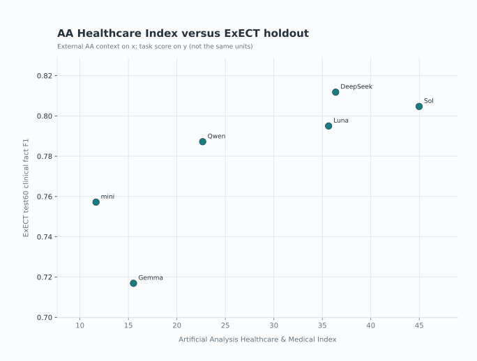

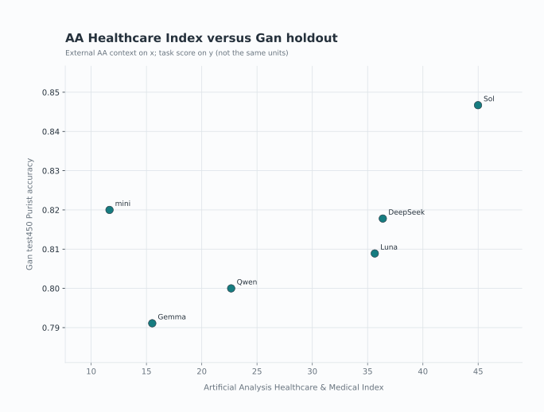

| Roster model | AA variant used | Intelligence Index | Healthcare Index |
| --- | --- | ---: | ---: |
| GPT-5.6 Sol | GPT-5.6 Sol (max) | 58.9 | 45.0 |
| DeepSeek V4 Flash | V4 Flash 0731 (max) | 49.9 | 36.4 |
| GPT-5.6 Luna | GPT-5.6 Luna (max) | 51.2 | 35.6 |
| Qwen 3.6:35B | Qwen3.6 35B A3B (Reasoning) | 31.6 | 22.7 |
| Gemma 4 26B | Gemma 4 26B A4B (Reasoning) | 25.7 | 15.5 |
| GPT-4.1-mini | GPT-4.1 mini | 14.8 | 11.7 |

These AA scores are not ExECT or Gan results. AA “max” / reasoning variants are
not asserted to match the project’s extraction settings. Source:
[`experiments/six_model_external_capability_cost_snapshot_20260731.json`](../../experiments/six_model_external_capability_cost_snapshot_20260731.json).

## 2. DeepSeek 0731: a better model lifts both tasks

The simplest within-family demonstration is the 2026-07-31 DeepSeek-V4-Flash
API revision. On ruleset-matched comparators it improves ExECT by about
**+0.02 clinical fact F1** on `dev140` and `test60`, and improves Gan
`test450` LLM with rules by **+20 Purist** (348→368) versus final-ruleset
replay of the prior raws.

Evidence owner (charts and deltas):
[DeepSeek V4-Flash-0731 matched comparison](deepseek_v4_flash_0731_matched_comparison_report_2026-08-03.md).
The 0731 holdout figures are already folded into the final six-model panel.

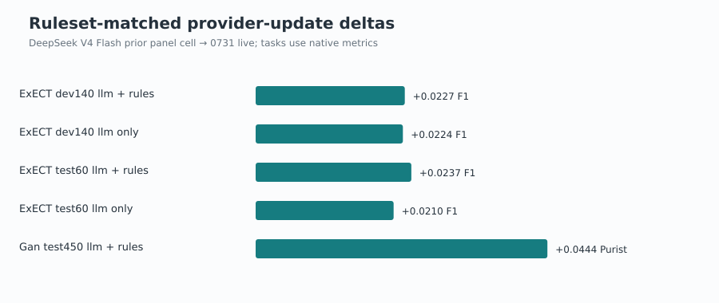

## 3. Top cluster is stable; mid-ranks are not

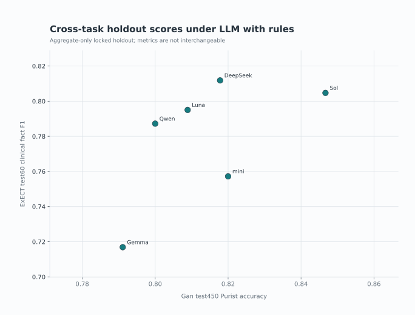

Cross-task rank correlation under LLM with rules is `0.54` (where `1.00` would
mean identical rankings). Sol and DeepSeek are in the top cluster on both
tasks. Mid-ranks are not interchangeable: mini is second on Gan `test450` and
fifth on ExECT `test60`. The tasks use different data and scores, so this does
not establish general model superiority.

## 4. Rules compress ExECT ranks

On aggregate-only `test60`, LLM with rules improves clinical fact F1 for every
model. Weaker models gain more.

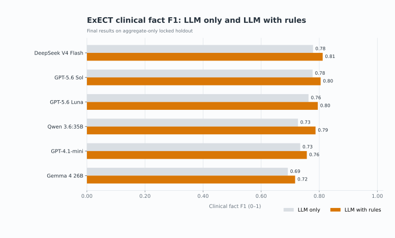

| Model | LLM only | LLM with rules | Change |
| --- | ---: | ---: | ---: |
| DeepSeek V4 Flash | 0.78 | 0.81 | +0.03 |
| GPT-5.6 Sol | 0.78 | 0.80 | +0.03 |
| GPT-5.6 Luna | 0.76 | 0.80 | +0.03 |
| Qwen 3.6:35B | 0.73 | 0.79 | +0.06 |
| GPT-4.1-mini | 0.73 | 0.76 | +0.02 |
| Gemma 4 26B | 0.69 | 0.72 | +0.03 |

Qwen’s larger ExECT lift brings it close to Sol/Luna on the final ranking.
These gains combine several operations (evidence checks, standardization,
family-specific repair) and do not isolate any one rule.

On Gan `test450`, rules lift every model by about `+0.08`–`+0.11` Purist, so
the compression story is weaker there:

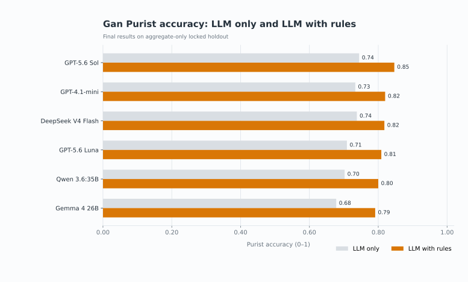

| Model | LLM only | LLM with rules | Change |
| --- | ---: | ---: | ---: |
| GPT-5.6 Sol | 0.74 | 0.85 | +0.11 |
| GPT-4.1-mini | 0.73 | 0.82 | +0.09 |
| DeepSeek V4 Flash | 0.74 | 0.82 | +0.08 |
| GPT-5.6 Luna | 0.71 | 0.81 | +0.10 |
| Qwen 3.6:35B | 0.70 | 0.80 | +0.10 |
| Gemma 4 26B | 0.68 | 0.79 | +0.11 |

## 5. Generalization gaps: strip rules before interpreting ExECT

Primary LLM-with-rules holdout-versus-development barbells:

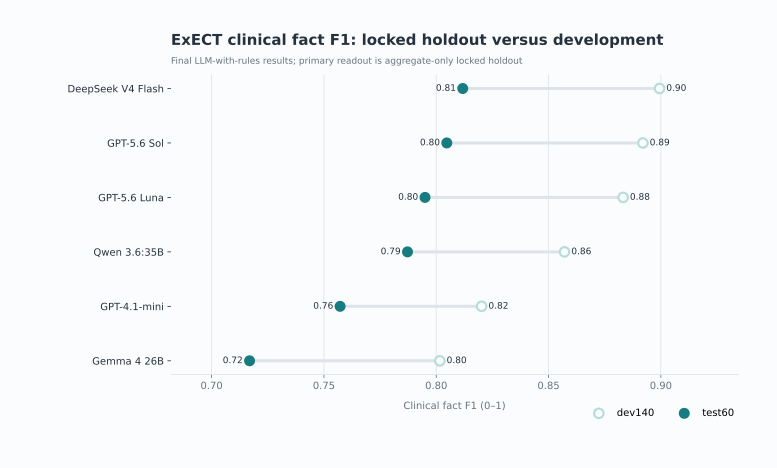

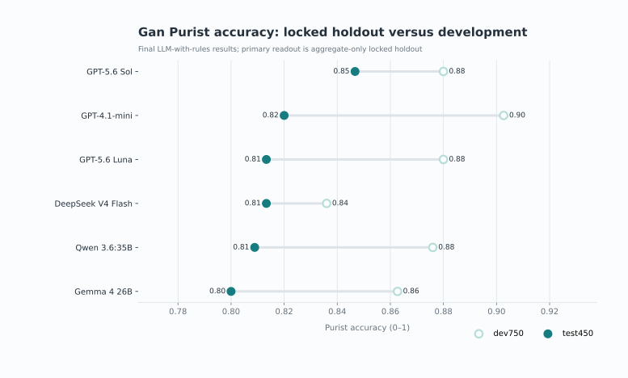

Under LLM with rules alone, ExECT gaps look large for strong models (about
`−0.09`), while Gan gaps are smaller for Sol/DeepSeek than for mini. That
reading changes once LLM-only gaps are included.

### ExECT: large drops are mostly rules that do not transfer

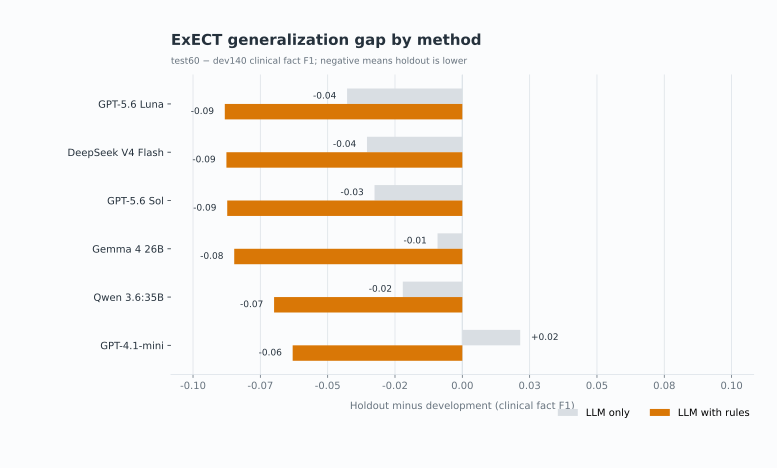

| Model | LLM only gap | LLM + rules gap |
| --- | ---: | ---: |
| GPT-4.1-mini | +0.02 | −0.06 |
| Gemma 4 26B | −0.01 | −0.08 |
| Qwen 3.6:35B | −0.02 | −0.07 |
| GPT-5.6 Sol | −0.03 | −0.09 |
| DeepSeek V4 Flash | −0.04 | −0.09 |
| GPT-5.6 Luna | −0.04 | −0.09 |

LLM-only ExECT gaps are small and similar. LLM-with-rules gaps are large for
every model. The mechanism is rules lift that appears on development but not
holdout:

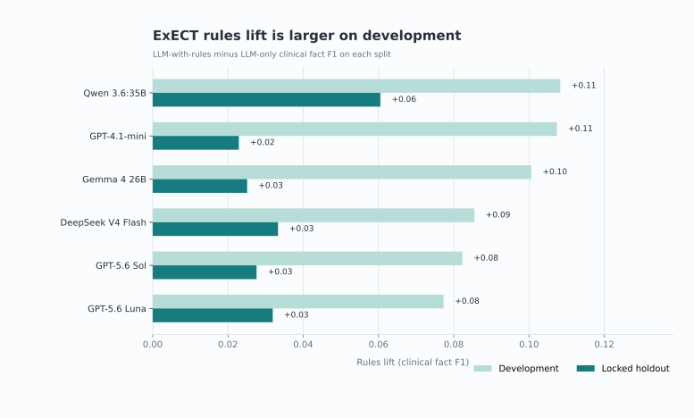

| Model | Rules lift on dev140 | Rules lift on test60 |
| --- | ---: | ---: |
| Qwen 3.6:35B | +0.11 | +0.06 |
| GPT-4.1-mini | +0.11 | +0.02 |
| Gemma 4 26B | +0.10 | +0.03 |
| DeepSeek V4 Flash | +0.09 | +0.03 |
| GPT-5.6 Sol | +0.08 | +0.03 |
| GPT-5.6 Luna | +0.08 | +0.03 |

So the “large ExECT generalization gap,” especially for strong models that
score high with rules on development, is mostly **rules help that does not
transfer**, not a pure model-capability cliff.

### Gan: “better models, smaller gap” is mainly LLM with rules

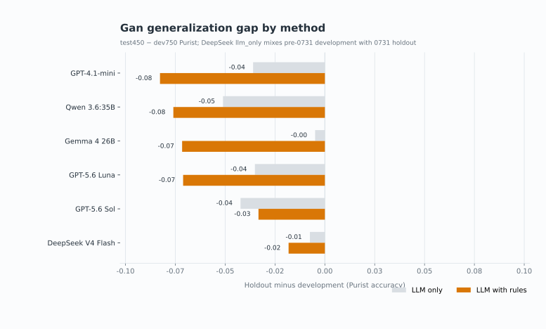

| Model | LLM only gap | LLM + rules gap |
| --- | ---: | ---: |
| Gemma 4 26B | −0.00 | −0.07 |
| DeepSeek V4 Flash | −0.01 | −0.02 |
| GPT-5.6 Luna | −0.04 | −0.07 |
| GPT-4.1-mini | −0.04 | −0.08 |
| GPT-5.6 Sol | −0.04 | −0.03 |
| Qwen 3.6:35B | −0.05 | −0.08 |

Under matched Gan LLM only (v0.8 prompt on both splits), gaps are about
`0.00`–`0.05` and do **not** cleanly show “better models generalize better.”
Under current-floors LLM with rules, Sol and DeepSeek have the smallest drops
(Sol `−0.03`; DeepSeek `−0.02`), while mini/Qwen/Gemma are about `−0.07`–
`−0.08`.

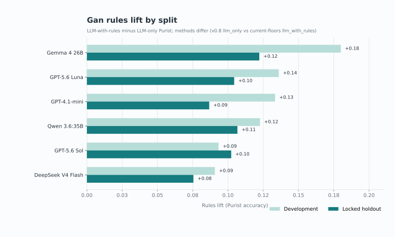

Caveats: do not mix historical Gan `llm_with_rules` v0.7 validation with
current-floors v0.5 `test450`. DeepSeek Gan `llm_only` `dev750` is still
pre-0731 while `test450` is 0731; that LLM-only gap is provisional until the
matched 0731 validation750 run completes.

## 6. Evidence quality diverges before rules; failure owners differ after

This section uses **development** row-level evidence. Locked holdout rows
remain aggregate-only.

### ExECT: final exact-evidence `1.00` is a filter, not a model finding

Under LLM with rules, mentions without valid quoted evidence are repaired
(Dx/Rx text→evidence) or hard-dropped. Counting exact substrings on the
**final** predicted mentions therefore yields ~`1.00` for every model — the
gate outcome, not producer quote quality.

The useful metric is **pre-gate** exact-evidence on producer
`structured_events` mentions versus `letter_text`, before
`repaired_evidence_*` / `dropped_evidence_*`:

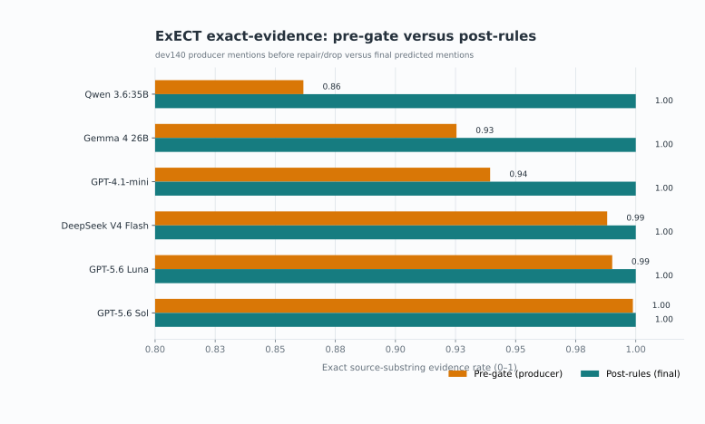

| Model | Pre-gate exact rate | Mentions | Repaired | Hard-dropped | Post-rules exact rate |
| --- | ---: | ---: | ---: | ---: | ---: |
| GPT-5.6 Sol | 1.00 | 842 | 1 | 0 | 1.00 |
| GPT-5.6 Luna | 0.99 | 813 | 8 | 0 | 1.00 |
| DeepSeek V4 Flash | 0.99 | 843 | 10 | 0 | 1.00 |
| GPT-4.1-mini | 0.94 | 973 | 58 | 1 | 1.00 |
| Gemma 4 26B | 0.93 | 978 | 56 | 17 | 1.00 |
| Qwen 3.6:35B | 0.86 | 875 | 120 | 1 | 1.00 |

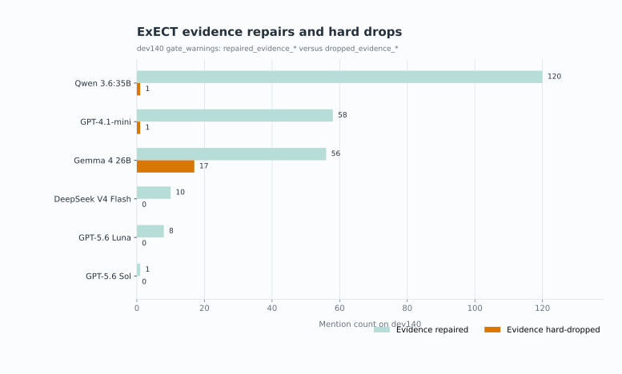

Qwen’s quote quality is weakest pre-gate but is mostly **repaired** rather
than hard-dropped — directly relevant to open question C below (where Qwen
gains from rules). Gemma has the most hard drops. Independent clinical review
of whether cited text supports the fact remains pending (semantic support ≠
substring presence).

### Gan: stronger models fail less on evidence selection

On Gan `dev750`, first-failure owners among rows that are not `none`:

| Model | Final Purist | `llm_clinical_selection` | `evidence_selection` | Other owners |
| --- | ---: | ---: | ---: | --- |
| GPT-5.6 Sol | 0.87 | 88 (92.6% of owned failures) | 1 | 6 deterministic |
| GPT-5.6 Luna | 0.86 | 96 (89.7%) | 3 | 8 format/deterministic |
| Gemma 4 26B | 0.86 | 101 (82.8%) | 15 | 6 |
| DeepSeek V4 Flash | 0.83 | 121 (82.3%) | 19 | 7 |
| GPT-4.1-mini | 0.89 | 70 (53.0%) | 57 (43.2%) | 5 |
| Qwen 3.6:35B | 0.88 | 55 (22.8%) | 183 (75.9%) | 3 |

Stronger hosted models fail almost entirely at clinical selection after finding
evidence. Qwen’s residual is mostly evidence-selection / grounding under the
same prompt and method. Mini splits between selection and evidence.

On aggregate-only Gan `test450` LLM only, parse/validation failures are rare
for hosted models (Sol/DeepSeek/mini `0`; Luna `2`) and higher for local
Gemma (`19`) and Qwen (`4`). That is a format/schema signal, not clinical
error ownership.

Shared floor: every Gan model’s clinical-subproblem histogram is dominated by
`rate_denominator`. On ExECT, Seizure Frequency remains the weakest family for
every model on `test60`:

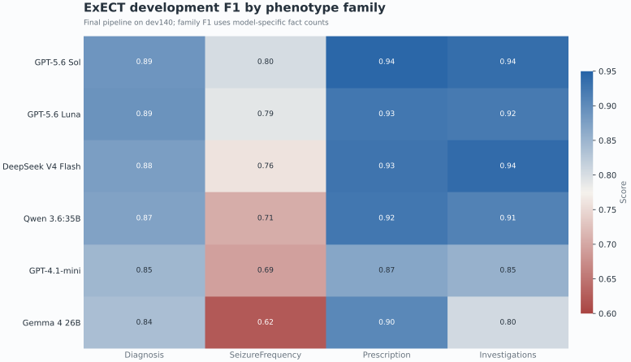

ExECT Seizure Frequency state repair on `dev140` (model state → after fixed
code):

| Model | Model state F1 | F1 after fixed code | Change | Wrong→correct | Correct→wrong |
| --- | ---: | ---: | ---: | ---: | --- |
| GPT-4.1-mini | 0.73 | 0.78 | +0.05 | 13 | 0 |
| GPT-5.6 Luna | 0.84 | 0.86 | +0.02 | 4 | 0 |
| GPT-5.6 Sol | 0.85 | 0.86 | +0.01 | 3 | 1 |
| DeepSeek V4 Flash | 0.81 | 0.84 | +0.03 | 9 | 0 |
| Qwen 3.6:35B | 0.75 | 0.80 | +0.05 | 13 | 0 |
| Gemma 4 26B | 0.69 | 0.74 | +0.05 | 12 | 0 |

## 7. Cost–quality is a judgment call; DeepSeek balances best here

Matched run tokens, latency, and spend were not retained. The figures below are
external Artificial Analysis list-price illustrations only.

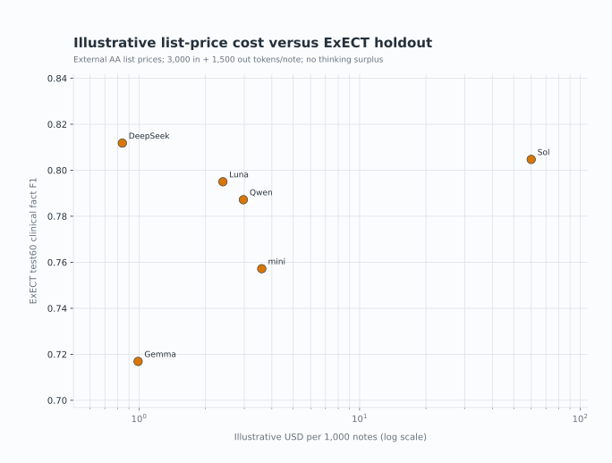

Illustrative only — 3,000 input and 1,500 output tokens per note, **no**
reasoning/thinking surplus:

| Roster model | Illustrative $/1,000 notes | Relative to Sol | ExECT test60 | Gan test450 |
| --- | ---: | ---: | ---: | ---: |
| GPT-5.6 Sol | 60.00 | 1.00× | 0.80 | 0.85 |
| GPT-4.1-mini | 3.60 | 0.06× | 0.76 | 0.82 |
| Qwen 3.6:35B (hosted proxy) | 2.97 | 0.05× | 0.79 | 0.80 |
| GPT-5.6 Luna | 2.40 | 0.04× | 0.80 | 0.81 |
| Gemma 4 26B (hosted proxy) | 0.99 | 0.017× | 0.72 | 0.79 |
| DeepSeek V4 Flash | 0.84 | 0.014× | 0.81 | 0.82 |

DeepSeek leads ExECT holdout and sits with mini just behind Sol on Gan, at
about `0.014×` Sol’s illustrative list price. Sol remains the max-score choice
on Gan and the Decision 0046 ExECT paper method-row fill. Local Qwen/Gemma do
not incur that hosted API bill; their true marginal cost is hardware and
operations. Reasoning models can emit large thinking-token volumes, so real
Sol/Luna/DeepSeek spend may exceed the non-thinking illustration.

## What the two tasks measure

### ExECTv2

ExECTv2 recovers facts from Diagnosis, Seizure Frequency, Prescription, and
Investigations. `dev140` permits row-level development analysis; `test60` is
locked holdout (59 loadable letters) and reported only through aggregates. The
primary score is clinical fact F1, not the published ExECT benchmark.

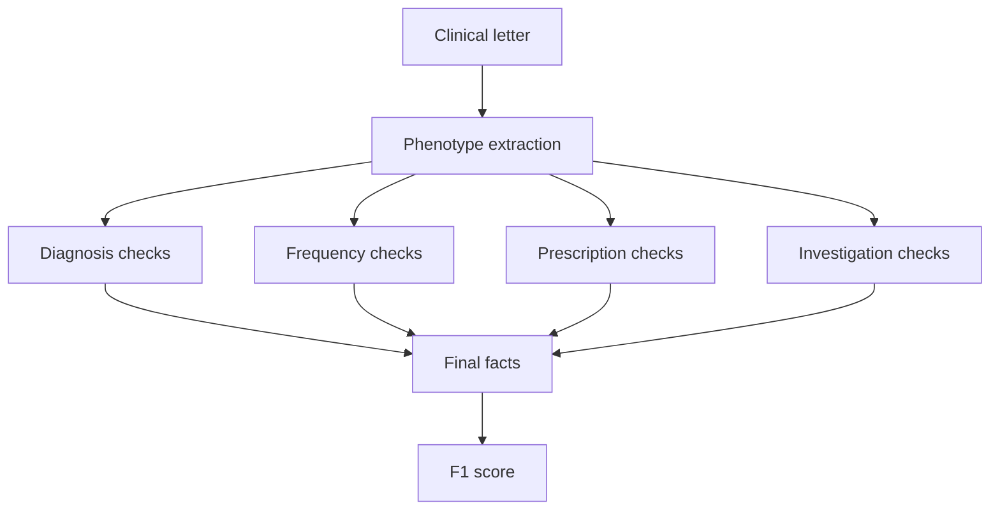

The model proposes facts and quotes supporting text. Fixed code then checks and
standardizes each part without running a second extractor or adding facts the
model did not propose.

### Gan 2026

Gan asks for one current seizure-frequency label per letter. `dev750` is
development evidence; `test450` is locked aggregate-only holdout. Primary
scorer: Purist accuracy. Pragmatic accuracy is secondary. These label-level
measures are not numerically interchangeable with ExECT F1.

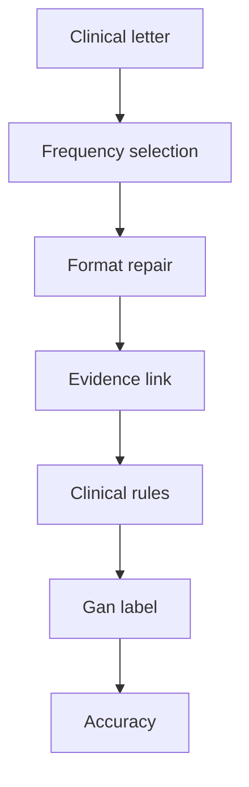

### Comparison method

| Field | ExECTv2 | Gan 2026 |
| --- | --- | --- |
| Development split | `dev140`; row review permitted | `dev750` (legacy id: `validation750`); row review permitted |
| Locked holdout | `test60`; 59 loadable letters; aggregate only | `test450`; 450 rows; aggregate only |
| Model call | One structured call for all four parts | One structured call for seizure events |
| Methods compared | LLM only and LLM with rules | LLM only and LLM with rules |
| Primary score | Clinical fact F1 | Purist accuracy |

Each model uses the same data, prompt, processing steps, and score as the other
models within a task. Scores from the two tasks are not combined. Diagnosis /
Prescription policy is **`default` / `default`**
([decision 0045](../decisions/0045-exect-default-policy-not-joint-combined.md)).
Qwen and Gemma use the same prompt and method as the hosted models, but run
locally.

## Open mechanism questions

The findings above show *what* happened. The natural *why* questions below are
the shared follow-up set; they are not answered by this panel alone.

### Background answers (owned elsewhere)

- **Why an error floor remains** after better models and rules: models usually
  find text; residual failures are forced clinical choices under gold
  conventions (`rate_denominator`, SF state sets, diagnosis granularity).
  Owner: [why the error floor persists](why_the_error_floor_persists_2026-07-31.md).
- **Where DeepSeek 0731 helped on ExECT development:** Seizure Frequency drove
  most of the `dev140` lift (+0.067), with letter-level rescue/regression
  counts. Holdout stays aggregate-only. Owner:
  [0731 matched comparison](deepseek_v4_flash_0731_matched_comparison_report_2026-08-03.md).

### Open

| ID | Question | Why it matters |
| --- | --- | --- |
| A | Why does ExECT rules lift fail to transfer from `dev140` to `test60`? | Finding 5 shows the large ExECT gap is mostly rules non-transfer; which rule classes / families overfit development is unknown |
| B | Why does mini suit Gan better than ExECT? | Explains mid-rank divergence (mini 2nd on Gan, 5th on ExECT); tests task-shaped fit vs one capability ladder |
| C | Which ExECT rules make Qwen competitive? | Qwen’s holdout rules gain is larger (`+0.06` vs Sol `+0.03`); pre-gate evidence shows Qwen needs far more quote repair |

These need predeclared development-only attribution studies (retained
`dev140` / `dev750` artifacts first). No holdout row inspection. Pre-gate
evidence above instruments C; it does not answer A–C by itself.

## What the report does and does not establish

The report supports:

- a fixed six-model comparison on both named task pipelines, with aggregate-only
  locked holdout as the primary ranking;
- final ExECT and Gan results from one panel directory, including LLM-only and
  LLM-with-rules cells on development and holdout for generalization-gap
  analysis;
- ExECT producer-stage pre-gate exact-evidence rates and repair/hard-drop
  counts on `dev140`, showing model quote divergence that post-rules
  exact-evidence (~`1.00`) hides;
- the result, limited to these task-specific procedures, that DeepSeek leads
  current ExECT `test60` while Sol leads current Gan `test450`;
- the mechanism reading that ExECT’s large development-to-holdout drop under
  LLM with rules is mostly rules lift that does not transfer;
- the reading that Gan’s “better models, smaller gap” pattern is mainly an
  LLM-with-rules finding;
- external AA Intelligence and Healthcare Index context, with list-price
  illustrations;
- development evidence that residual Gan failures share a clinical-selection
  floor while first-failure owners differ by model; and
- a short DeepSeek 0731 finding with the matched-comparison report as evidence
  owner.

It does not support general model superiority, one reliability score combined
across tasks, applying Gan findings to ExECT, the published ExECT benchmark,
matched run token/latency/dollar rankings, treating AA max-effort scores as the
extraction runtime, estimates of confidence after deployment, proof that
quotations clinically support the extracted facts, treating final ExECT
exact-evidence as a model-quality ranking, or clinical validation.
Independent clinical review is required before making stronger clinical-
validity claims. Decision 0046 Sol method-row fills are unchanged by the
six-model ranking. DeepSeek Gan `llm_only` generalization gap remains
provisional until matched 0731 `dev750` completes. Open questions A–C are
not answered here.

## Sources and technical detail

- [Final six-model panel](../../experiments/six_model_final_panel_20260803/panel_aggregate.json)
- [Project status](../../PROJECT_STATUS.md)
- [Paper claim status](../canon/10_paper_provenance.md)
- [CONTEXT.md glossary](../../CONTEXT.md)
- [Plain-language glossary](../reference/plain_language_glossary.md)
- [Decision 0048](../decisions/0048-comprehension-and-handoff-refactor.md)
- [Retained evidence index](../experiments/retained_evidence_manifest.md)
- [Shared reliability report](shared_reliability_scorecard_2026-07-18.md)
- [Reliability framework](../design/reliability_evaluation_framework.md)
- [External AA capability/cost snapshot](../../experiments/six_model_external_capability_cost_snapshot_20260731.json)
- [Artificial Analysis Healthcare & Medical Index](https://artificialanalysis.ai/models/capabilities/healthcare-and-medical)
- [Why the error floor persists](why_the_error_floor_persists_2026-07-31.md)
- [DeepSeek V4-Flash-0731 matched comparison](deepseek_v4_flash_0731_matched_comparison_report_2026-08-03.md)
  (provider-update study; values already folded into the final panel)
- [ExECT SF reliability protocol](../experiments/exectv2/reliability/exectv2_six_model_sf_overinference_protocol_2026-07-18.md)
- [ExECT SF reliability result](../experiments/exectv2/reliability/exectv2_six_model_sf_overinference_2026-07-18.md)
- Chart rebuild: `python scripts/render_six_model_comparison_charts.py`
- Panel rebuild: `python scripts/build_six_model_final_panel.py`
