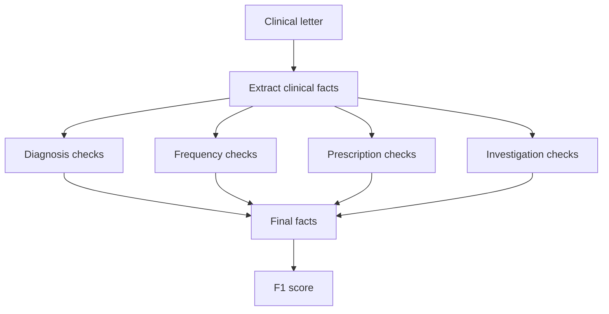
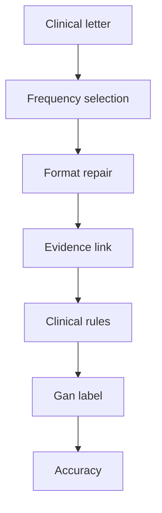

# Six-model comparison across ExECTv2 and Gan 2026

Date: 2026-07-18
Updated: 2026-07-20
Status: final comparison report; test results are aggregate-only

## Executive conclusion

The same six models were evaluated with fixed ExECTv2 and Gan 2026 pipelines:
GPT-4.1-mini, GPT-5.6 Luna, GPT-5.6 Sol, DeepSeek V4 Flash,
Qwen 3.6:35B, and Gemma 4 26B.

The main result is that clinical extraction performance belongs to the model,
task, and deterministic pipeline together. Model rankings do not transfer
cleanly between the two tasks. GPT-5.6 Sol leads ExECT test60 with an internal
clinical-fact F1 of `0.80`, while Qwen 3.6:35B leads Gan test450 with a Purist
accuracy of `0.82`. The cross-task rank correlation is `0.20`, where `1.00`
would mean identical rankings. These results support choosing a model for a
named task and pipeline; they do not establish general model superiority.

The most consistent result across models is the contribution of fixed code.
Deterministic processing improves the development score for every model on
both tasks: by `0.08` to `0.11` F1 on ExECT dev140 and by 65 to 134 net correct
rows on Gan dev750. This processing is not harmless cleanup. On Gan it also
changes 23 to 34 previously correct answers to incorrect answers per model.
The final scores therefore describe complete model-pipeline systems, and the
deterministic contribution must be assessed through both rescues and
regressions.

The remaining difficulty is mainly clinical selection rather than output
format. Seizure Frequency is the weakest ExECT family for every model. In the
Gan development audit, clinical selection and evidence selection account for
far more first failures than format or schema handling. Exact quotations make
predictions traceable, but they do not prove that the quoted text supports the
clinical interpretation. Independent clinical review is still pending.

The two tasks also show why apparently similar clinical targets cannot be
assumed to measure the same failure. A predeclared attempt to test whether
Gan's unknown-versus-rate behavior transfers to ExECT could not calculate its
primary measure because ExECT dev140 contains no unknown-only reference
letters. Cross-task transfer remains unsupported.

### Core findings at a glance

| Finding | ExECTv2 | Gan 2026 | Interpretation |
| --- | --- | --- | --- |
| Test leader | GPT-5.6 Sol: `0.80` F1 | Qwen 3.6:35B: `0.82` Purist | No task-independent winner |
| Fixed-code contribution | `+0.08` to `+0.11` dev140 F1 | `+65` to `+134` net correct dev750 rows | Consistent benefit across all six models |
| Regression evidence | SF state processing: 54 rescues and 1 regression across repeated runs | 23 to 34 regressions per model | Net gain does not establish uniform safety |
| Main clinical weakness | Seizure Frequency is weakest for every model | Clinical and evidence selection dominate recorded first failures | Structured output does not solve clinical selection |
| Transfer result | Unknown-only denominator is zero | Gan measure exists | Gan-to-ExECT transfer is not measurable from current ExECT gold |

## 1. What was compared

ExECTv2 recovers facts from Diagnosis, Seizure Frequency, Prescription, and
Investigations. Gan assigns one current seizure-frequency label to each
letter. The tasks use different output structures and different primary
scores, so their numerical scores are never combined.

| Field | ExECTv2 | Gan 2026 |
| --- | --- | --- |
| Output | Clinical facts from four parts of an epilepsy letter | One current seizure-frequency label |
| Development split | `dev140`; row review permitted | `dev750` (legacy ID: `validation750`); row review permitted |
| Test split | `test60`; 59 loadable letters; aggregate only | `test450`; 450 rows; aggregate only |
| Model call | One structured call for all four parts | One structured call for seizure events |
| Prompt | `exectv2_hybrid_key_family_event_ledger_v0.9.24` | `gan2026_hybrid_structured_events_v0.7` |
| Fixed code after the model | Checks and standardizes each part, then assembles the facts | Repairs format, links evidence, applies clinical rules, and converts the label (`hybrid_full_stack`) |
| Primary score | Internal `clinical_headline` F1 | Purist accuracy |

Each model uses the same data, prompt, processing steps, and scorer as the
other models within a task. Qwen and Gemma run locally; the other four models
use hosted routes. Provider transport and temperature differ where required,
and the local Gan results use aggregate-only reparse of sealed outputs. These
differences are recorded in the retained results.

## 2. Model rankings are task-specific

The test results do not identify one model that is best across both tasks.
Sol ranks first on ExECT, while Qwen ranks first on Gan. Several lower-ranked
models also change position: DeepSeek ranks third on ExECT and sixth on Gan,
while GPT-4.1-mini ranks fifth on ExECT and third on Gan.

| Model | ExECT test60 F1 | ExECT rank | Gan test450 Purist | Gan rank |
| --- | ---: | ---: | ---: | ---: |
| GPT-5.6 Sol | 0.8047 | 1 | 358/450 (0.7956) | 2 |
| GPT-5.6 Luna | 0.7950 | 2 | 352/450 (0.7822) | 4 |
| DeepSeek V4 Flash | 0.7881 | 3 | 342/450 (0.7600) | 6 |
| Qwen 3.6:35B | 0.7872 | 4 | 367/450 (0.8156) | 1 |
| GPT-4.1-mini | 0.7572 | 5 | 353/450 (0.7844) | 3 |
| Gemma 4 26B | 0.7169 | 6 | 343/450 (0.7622) | 5 |

The cross-task rank correlation is `0.20`. The comparison does not show that
the tasks share one underlying model ranking: ExECT asks for multiple clinical
facts and uses an internal fact-recovery F1, while Gan asks for one exhaustive
label and uses accuracy. The result is limited to the fixed pipelines and
recorded routes rather than model capability in isolation.

## 3. Fixed code provides the most consistent gain

Changing the model produces task-specific rankings. In contrast, applying the
fixed deterministic stage improves the development result for every model on
both tasks.

### ExECTv2: model output before and after fixed code

The ExECT comparison uses saved model output for LLM only and the output after
fixed code for LLM with rules.

| Model | LLM only | LLM with rules | Change |
| --- | ---: | ---: | ---: |
| GPT-5.6 Sol | 0.81 | 0.89 | +0.08 |
| GPT-5.6 Luna | 0.81 | 0.88 | +0.08 |
| DeepSeek V4 Flash | 0.79 | 0.88 | +0.09 |
| Qwen 3.6:35B | 0.75 | 0.86 | +0.11 |
| GPT-4.1-mini | 0.71 | 0.82 | +0.11 |
| Gemma 4 26B | 0.70 | 0.80 | +0.10 |

The gains combine several operations: removing facts without valid quoted
evidence, standardizing values, recovering Diagnosis facts, converting or
removing Seizure Frequency facts, repairing Prescription facts, and assembling
the final output. This aggregate comparison shows a repeated pipeline benefit
but does not isolate the effect of any one rule.

### Gan 2026: benefit and regression cost

The Gan comparison evaluates LLM with rules and LLM only on the same 750 rows
for each model.

| Model | LLM with rules | LLM only | Net gain | Wrong→correct | Correct→wrong |
| --- | ---: | ---: | ---: | ---: | ---: |
| GPT-4.1-mini | 653/750 | 577/750 | +76 | 110 | 34 |
| GPT-5.6 Luna | 646/750 | 558/750 | +88 | 120 | 32 |
| GPT-5.6 Sol | 655/750 | 590/750 | +65 | 96 | 31 |
| DeepSeek V4 Flash | 643/750 | 559/750 | +84 | 115 | 31 |
| Qwen 3.6:35B | 667/750 | 565/750 | +102 | 125 | 23 |
| Gemma 4 26B | 646/750 | 512/750 | +134 | 168 | 34 |

The event-ledger-plus-rules method has a positive net effect relative to the
direct-label method for every model, but this is not a same-raw-output rule
ablation: the two methods use different prompts and prediction structures.
Every condition also contains correct-to-wrong changes. A later rerun repaired
11 invalid records without changing any answer that had already been selected.
Those recoveries do not account for the net gains. These are development
results for the named models and routes. Rules without a model also remain
more accurate on many Gan rows, so this result does not promote LLM with rules
over the deterministic comparator. The [Qwen versus GPT-5.6 Sol row audit](../experiments/gan2026/gan2026_qwen_sol_rule_benefit_audit_2026-07-20.md)
separates the prompt/method comparison from the same-saved-output deterministic
effect and comments on every row missed by either scored condition.

## 4. Clinical selection remains the main difficulty

### ExECTv2: Seizure Frequency is weak across models

Seizure Frequency is the weakest ExECT family for every model, while
Prescription or Investigations is usually strongest. This repeated pattern
points to the clinical target rather than one model as the main source of
difficulty.

| Model | Diagnosis | Seizure Frequency | Prescription | Investigations |
| --- | ---: | ---: | ---: | ---: |
| GPT-4.1-mini | 0.85 | 0.69 | 0.87 | 0.85 |
| GPT-5.6 Luna | 0.89 | 0.79 | 0.93 | 0.92 |
| GPT-5.6 Sol | 0.89 | 0.80 | 0.94 | 0.94 |
| DeepSeek V4 Flash | 0.88 | 0.76 | 0.93 | 0.94 |
| Qwen 3.6:35B | 0.87 | 0.71 | 0.92 | 0.91 |
| Gemma 4 26B | 0.84 | 0.62 | 0.90 | 0.80 |

The predeclared Seizure Frequency component study compares the states produced
by the model with those left after fixed code converts or removes states. A
state records whether the letter gives a rate, says the patient is
seizure-free, or leaves the current frequency unknown.

| Model | Model state F1 | F1 after fixed code | Change | Wrong→correct | Correct→wrong |
| --- | ---: | ---: | ---: | ---: | ---: |
| GPT-4.1-mini | 0.73 | 0.78 | +0.05 | 13 | 0 |
| GPT-5.6 Luna | 0.84 | 0.86 | +0.02 | 4 | 0 |
| GPT-5.6 Sol | 0.85 | 0.86 | +0.01 | 3 | 1 |
| DeepSeek V4 Flash | 0.81 | 0.84 | +0.03 | 9 | 0 |
| Qwen 3.6:35B | 0.75 | 0.80 | +0.05 | 13 | 0 |
| Gemma 4 26B | 0.69 | 0.74 | +0.05 | 12 | 0 |

Across the six runs, fixed code produces 54 wrong-to-correct and one
correct-to-wrong transition. Because the same 140 letters are repeated for
each model, these counts are descriptive rather than 840 independent clinical
samples.

### Gan 2026: first failures are rarely format failures

The Gan post-panel audit assigns the first failure in each of 9,000
development model-condition rows to a processing stage:

| First failure owner | Rows |
| --- | ---: |
| LLM clinical selection | 1,449 |
| Evidence selection | 616 |
| Format or schema | 84 |
| Deterministic semantic processing | 40 |
| Model transport | 12 |
| No recorded failure | 6,799 |

Clinical selection and evidence selection account for most recorded first
failures. Format, schema, and transport failures matter operationally, but
they are not the main source of incorrect clinical answers in this audit.

## 5. Exact evidence makes answers traceable, not clinically valid

ExECT records an exact source-text match for all final facts in every model
condition. Despite that saturated result, overall F1 differs across models and
Seizure Frequency remains the weakest family. Exact evidence confirms that a
quotation is present; it does not show that the quotation is decisive or that
the resulting interpretation is clinically correct.

Gan shows a similar separation between evidence and final correctness. Exact
evidence is present for 363 to 449 of 450 test answers across the six models,
while Purist accuracy ranges from 342 to 367 correct answers.

| Model | Purist | Pragmatic | Answers with exact evidence | Format or repair record |
| --- | ---: | ---: | ---: | --- |
| Qwen 3.6:35B | 367/450 (0.82) | 380/450 (0.84) | 363/450 | 0 final; deterministic repair |
| GPT-5.6 Sol | 358/450 (0.80) | 376/450 (0.84) | 449/450 | 0; 366 repair notes |
| GPT-4.1-mini | 353/450 (0.78) | 371/450 (0.82) | 419/450 | 2; 317 repair notes |
| GPT-5.6 Luna | 352/450 (0.78) | 365/450 (0.81) | 446/450 | 3; 305 repair notes |
| Gemma 4 26B | 343/450 (0.76) | 367/450 (0.82) | 437/450 | 0 final; deterministic repair |
| DeepSeek V4 Flash | 342/450 (0.76) | 362/450 (0.80) | 434/450 | 4; 259 repair notes |

Purist accuracy remains the primary Gan result. Pragmatic accuracy accepts
specified clinically equivalent labels and is higher for every model, but it
does not change the first-place model. Neither evidence presence nor Pragmatic
agreement replaces independent clinical review.

## 6. Similar task names do not guarantee comparable measures

The study predeclared a comparison of unknown frequency with an asserted rate
to test whether a Gan failure pattern also appears in ExECT. The primary ExECT
gold denominator contains zero letters labelled only as unknown. Letters with
no reference fact cannot be treated as unknown because ExECT permits multiple
mentions and has documented annotation omissions and conventions.

The intended over-inference rate therefore cannot be calculated. The fixed
ExECT state processing improves state F1 for all six models, but that is an
ExECT development component result, not evidence that the Gan mechanism
transfers. Sharing the name Seizure Frequency does not make the two annotation
schemes or output contracts interchangeable.

## 7. Development-to-test behavior and operational limits

The development-to-test comparisons check whether the main model results
reverse on the aggregate-only test splits. They are supporting evidence rather
than a shared measure of general model quality.

### ExECTv2 development and test F1

The ExECT model order is unchanged from dev140 to test60. Every test score is
lower than its corresponding development score, with a mean absolute F1 change
of `0.08`.

| Model | dev140 F1 | test60 F1 | Change | Final exact evidence | Output-format or parsing errors |
| --- | ---: | ---: | ---: | ---: | --- |
| GPT-5.6 Sol | 0.89 | 0.80 | -0.09 | 1.00 | 0 |
| GPT-5.6 Luna | 0.88 | 0.80 | -0.09 | 1.00 | 0 |
| DeepSeek V4 Flash | 0.88 | 0.79 | -0.09 | 1.00 | 0 |
| Qwen 3.6:35B | 0.86 | 0.79 | -0.07 | 1.00 | 0 |
| GPT-4.1-mini | 0.82 | 0.76 | -0.06 | 1.00 | 0 |
| Gemma 4 26B | 0.80 | 0.72 | -0.08 | 1.00 | 6 aggregate events |

Test60 contains 59 loadable letters, and its rows cannot be inspected. The
results show that the development ordering held on this split but cannot
explain individual test failures or establish broad reliability.

### Gan 2026 development and test Purist accuracy

Qwen ranks first on both Gan splits; the ordering below it changes.

| Model | dev750 Purist | test450 Purist | Change |
| --- | ---: | ---: | ---: |
| Qwen 3.6:35B | 667/750 (0.89) | 367/450 (0.82) | -0.07 |
| GPT-5.6 Sol | 655/750 (0.87) | 358/450 (0.80) | -0.08 |
| GPT-4.1-mini | 653/750 (0.87) | 353/450 (0.78) | -0.09 |
| GPT-5.6 Luna | 646/750 (0.86) | 352/450 (0.78) | -0.08 |
| Gemma 4 26B | 646/750 (0.86) | 343/450 (0.76) | -0.10 |
| DeepSeek V4 Flash | 643/750 (0.86) | 342/450 (0.76) | -0.10 |

Only totals are available, and test450 had been used before this comparison.
The results support comparison under the stated score and procedure. They do
not support row-level test error analysis or an estimate from a test split
used only once.

The runs record parsing, output-format, repair, and model-host information, but
they do not provide matched cost or latency measurements. Neither task
measures demographic fairness or whether predicted confidence matches
observed accuracy after deployment.

## 8. What the report does and does not establish

The report supports:

- a fixed six-model comparison on both named task pipelines;
- the result, limited to these tasks and procedures, that model rank is
  task-specific, with Sol leading ExECT and Qwen leading Gan;
- a repeated development result that fixed code improves every model on both
  tasks;
- the Gan development result that this net improvement includes both rescues
  and deterministic regressions;
- the finding that clinical and evidence selection, rather than basic format
  handling, account for most recorded Gan first failures;
- the ExECT development result that Seizure Frequency remains the weakest
  family across models and that fixed state processing improves all six
  conditions; and
- a negative, data-limited result for transferring Gan's unknown-versus-rate
  measure to ExECT.

It does not support general model superiority, one reliability score combined
across tasks, applying Gan findings to ExECT, the published ExECT benchmark,
estimates of confidence after deployment, proof that quotations clinically
support the extracted facts, or clinical validation. Independent clinical
review is required before making stronger clinical-validity claims.

## Appendix: task and term definitions

- **Development split** means data that may be examined one row at a time.
  `dev140` contains 140 ExECTv2 letters; `dev750` contains 750 Gan letters.
- **Locked test split** means data whose individual rows may not be examined or
  used to change the system. This report gives only totals for ExECTv2 `test60`
  and Gan `test450`.
- **Aggregate-only** means that only totals and summary scores are available,
  not individual predictions or errors.
- **LLM only** means the saved model output before deterministic code changes
  its clinical content. **LLM with rules** means the final output after fixed,
  non-model code checks, standardizes, selects, or repairs that output.
- **F1** combines precision, the share of extracted facts that are correct, and
  recall, the share of reference facts that were extracted. Higher is better.
- **Purist accuracy** requires the exact Gan reference label. **Pragmatic
  accuracy** also accepts specified clinically equivalent labels. Higher is
  better for both measures.
- **Exact evidence** means that a prediction includes text copied exactly from
  its source letter. It shows that a quotation is present, not that the
  quotation clinically supports the prediction.
- **Wrong to correct** and **correct to wrong** count answers changed by the
  deterministic code. The latter are also called regressions.

### ExECTv2 pipeline

The model proposes facts and quotes supporting text. Fixed code then checks and
standardizes Diagnosis, Seizure Frequency, Prescription, and Investigations
without running a second extractor or adding facts the model did not propose.
The final facts are compared with the reference using the internal
`clinical_headline` F1 measure. It is not the published ExECT benchmark.

### Gan 2026 pipeline

The model identifies seizure events and selects the current frequency. Fixed
code repairs formatting, keeps the supporting quotation, resolves conflicts
between current and historical statements, and converts the answer to a Gan
label. Each stage is saved so errors can be assigned to model selection,
formatting, clinical rules, or label conversion. The final label is scored
with Purist accuracy; Pragmatic accuracy is secondary.

## Sources and technical detail

- [Project status](../../PROJECT_STATUS.md)
- [Paper claim status](../canon/10_paper_provenance.md)
- [Retained evidence index](../experiments/retained_evidence_manifest.md)
- [Shared eight-criterion scorecard](shared_reliability_scorecard_2026-07-18.md)
- [Reliability framework](../design/reliability_evaluation_framework.md)
- [ExECT test60 protocol](../experiments/exectv2/reliability/exectv2_hosted_test60_protocol_2026-07-15.md)
- [Gan v0.7 test450 protocol](../experiments/gan2026/gan2026_matched_v07_test450_protocol_2026-07-15.md)
- [ExECT SF reliability protocol](../experiments/exectv2/reliability/exectv2_six_model_sf_overinference_protocol_2026-07-18.md)
- [ExECT SF reliability result](../experiments/exectv2/reliability/exectv2_six_model_sf_overinference_2026-07-18.md)
- [Gan dev750 comparison](../experiments/gan2026/gan2026_six_model_validation_comparison_2026-07-18.md)
- [Gan component audit](../experiments/gan2026/gan2026_six_model_post_panel_attribution_2026-07-20.md)
