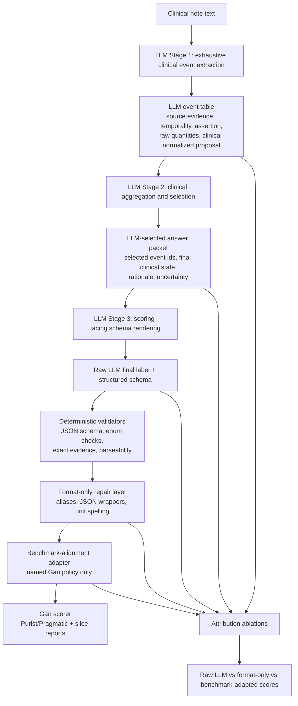

# Gan 2026 LLM-Heavy Clinical Frequency Extraction Protocol

Date: 2026-06-02

This protocol defines a strong alternative to the current state-graph diagnostic
cycle. The state-graph work deliberately exposed failure modes by separating
coverage, projection, boundary-state construction, and scoring. This protocol
uses those lessons but flips the prediction-bearing responsibility: the LLM
must perform extraction, clinical normalization, aggregation/selection, and
schema representation. Deterministic code should only validate, report, and
adapt the selected model answer to a named scoring policy.

This is a research architecture, not a benchmark result.

## Research Motivation

The current `hybrid_clinical_frequency_state_graph` path is mostly
deterministic. That is useful for transparency and failure localization, but it
does not satisfy the project's required strong LLM-driven alternative. A robust
paper should compare at least three families:

- `rules_only`: deterministic interpretation owns the prediction.
- `hybrid_clinical_frequency_state_graph`: deterministic graph/projection owns
  most behavior, with targeted LLM node construction.
- `llm_heavy_clinical_frequency_reasoner`: the LLM owns the clinical
  interpretation and produces a complete structured answer; deterministic code
  validates and scores.

The LLM-heavy family is expected to be more flexible across note styles because
it is not constrained to deterministic candidate recall. The risk is that it can
become opaque or silently rely on post-processing. This protocol makes those
risks measurable.

## Design Principle

The model, not deterministic code, is responsible for these clinical decisions:

1. Which seizure-frequency mentions are clinically relevant.
2. Whether each mention is current, historical, hypothetical, negated, or
   uncertain.
3. How vague terms, intervals, clusters, seizure-free durations, and multiple
   seizure types should be represented clinically.
4. Which extracted events determine the final seizure-frequency answer.
5. The final structured schema, rationale, and source evidence.

Deterministic code may do these things:

1. Validate JSON/schema shape.
2. Check that evidence strings are exact note substrings.
3. Parse the model-selected normalized answer for scoring.
4. Apply named benchmark-alignment adapters that map the model-selected clinical
   answer to Gan-compatible labels.
5. Score, report, cache, and run ablations.

Deterministic code must not introduce a clinical fact, select a different event,
or reinterpret the note while the run is claimed as LLM-heavy.

## Architecture Diagram



## Proposed Pipeline Name

Use this ontology-aligned family name:

```text
llm_heavy_clinical_frequency_reasoner
```

Suggested version names:

- `llm_heavy_clinical_frequency_reasoner_v0`: direct three-stage prompt chain.
- `llm_heavy_clinical_frequency_reasoner_v1`: adds self-check and contradiction
  review.
- `llm_heavy_clinical_frequency_reasoner_gepa_v0`: optimized prompt/program
  variant, if a trainer is later used.

Avoid calling this `llm_only` if benchmark-alignment adapters are enabled. Use
`llm_only` only for raw or format-only conditions where deterministic code does
not change semantic kind, selected event, interval policy, cluster policy, or
benchmark row family.

## Stage 1: LLM Clinical Event Extraction

The LLM receives the note and a task definition, but no deterministic candidate
list. It emits all clinically relevant seizure-frequency facts as structured
events.

Required event fields:

```text
{
  event_id: string,
  kind: "frequency_rate" |
        "cluster_frequency" |
        "seizure_free" |
        "last_event_only" |
        "unknown_frequency" |
        "no_reference",
  applies_to: string | null,
  raw_phrase: string,
  evidence: string,
  assertion_status: "asserted" | "negated" | "hypothetical" | "uncertain",
  temporality: "current" | "recent" | "historical" | "unclear",
  certainty: "high" | "medium" | "low",
  clinical_quantity: {
    occurrences_low: number | null,
    occurrences_high: number | null,
    period_low: number | null,
    period_high: number | null,
    period_unit: "day" | "week" | "month" | "year" | null,
    vague_count: "multiple" | "rare" | "occasional" | "frequent" | null,
    clusters_low: number | null,
    clusters_high: number | null,
    cluster_period_unit: "day" | "week" | "month" | "year" | null,
    events_per_cluster_low: number | null,
    events_per_cluster_high: number | null,
    seizure_free_duration_low: number | null,
    seizure_free_duration_high: number | null,
    seizure_free_duration_unit: "day" | "week" | "month" | "year" | null
  },
  model_normalized_clinical_label: string | null,
  notes: string
}
```

Unlike the deterministic graph, this stage should allow the model to represent
vague clinical meaning directly. For example, it may emit an event whose
`model_normalized_clinical_label` is `unknown` because the note says seizures
continue but the frequency cannot be estimated. It should not be forced to
choose a Gan-compatible label if the clinical fact is underdetermined.

## Stage 2: LLM Aggregation And Selection

The LLM receives the event table and decides which event or combination of
events determines the final seizure-frequency answer.

Required output:

```text
{
  selected_event_ids: [string],
  rejected_event_ids: [string],
  final_clinical_state:
    "frequency" |
    "seizure_free" |
    "unknown_frequency" |
    "no_reference" |
    "unresolved_multiple",
  aggregation_strategy:
    "highest_current_frequency" |
    "recent_window" |
    "seizure_free_over_current_event" |
    "cluster_total_rate" |
    "unknown_boundary" |
    "no_reference_boundary" |
    "other",
  final_clinical_label: string,
  rationale: string,
  uncertainty_flags: [string]
}
```

This is the prediction-bearing selection stage. If a later deterministic module
changes `selected_event_ids`, `final_clinical_state`, or
`aggregation_strategy`, the artifact is no longer LLM-heavy.

## Stage 3: LLM Scoring-Facing Schema Rendering

The LLM renders its own selected answer into the scoring schema. It should know
the allowed Gan label grammar, but it should not be given deterministic
candidates.

Required output:

```text
{
  raw_llm_final_label: string,
  raw_llm_final_kind:
    "frequency" |
    "seizure_free" |
    "unknown" |
    "no_reference" |
    "unresolved_multiple",
  raw_llm_monthly_frequency: number | null,
  selected_evidence: string,
  selected_event_ids: [string],
  final_rationale: string
}
```

The model's own rendered label is the primary LLM-heavy output. Deterministic
format repair and benchmark alignment are side-car score layers.

## Deterministic Layers

### Validator Layer

Allowed behavior:

- JSON parsing and schema validation.
- Enum validation.
- Evidence exact-substring check.
- Selected event id existence check.
- Cross-field consistency checks, such as selected ids existing in the event
  table.

Disallowed behavior:

- Adding missing events.
- Replacing selected events.
- Choosing the highest frequency from the event table.
- Converting `no_reference` to `unknown`, or vice versa.

### Format-Only Repair Layer

Allowed behavior:

- unwrap top-level JSON wrappers;
- repair field aliases;
- normalize unit spelling over the model-selected fact;
- convert parser-compatible syntax without changing clinical meaning.

Examples:

- `3-5 per month` -> `3 to 5 per month`
- `twice per week` -> `2 per week`
- `seizure-free for 6 months` -> `seizure free for 6 month`

### Benchmark-Alignment Adapter

This is the only place where Gan-specific scoring decisions belong. It should
be named, optional, and ablated.

Examples of benchmark-alignment policy:

- Map model-selected vague `multiple per week` to the allowed Gan label.
- Expand model-selected cluster frequency using the Gan evaluation-script
  cluster policy.
- Render model-selected broad seizure-free duration as Gan-style wording.
- Collapse scorer sentinels for `unknown`, `no_reference`, and
  `unresolved_multiple` after preserving semantic kind.

This adapter must not claim to be LLM-only. It is a benchmark-format or
benchmark-policy layer over a model-selected answer.

## Attribution Score Layers

Every run must report at least these score layers over the same raw model
outputs:

| Layer | Meaning |
| --- | --- |
| `raw_llm` | Score the model's exact final label if parseable. |
| `format_only` | Apply JSON/schema/label grammar repair only. |
| `selected_evidence_arithmetic` | Arithmetic over model-selected event quantities only, if needed. |
| `benchmark_aligned` | Apply named Gan-specific adapter. |
| `oracle_format_upper_bound` | Parse/format upper bound without changing selected clinical state. |

Report transitions:

- rows changed by format repair;
- rows changed by arithmetic;
- rows changed by benchmark alignment;
- raw-wrong to adapted-correct;
- raw-correct to adapted-wrong;
- semantic-kind changes;
- selected-event changes, which should be zero for LLM-heavy claims.

## Lessons From State-Graph Work To Carry Forward

1. **Separate representability from projection.** The LLM-heavy pipeline should
   report event coverage separately from final label accuracy.
2. **Boundary states matter.** `unknown`, `no_reference`, and
   `unresolved_multiple` should be first-class outputs, not fallback errors.
3. **Evidence validity is non-negotiable.** Exact evidence should be measured
   for extracted events and selected final evidence.
4. **Duration wording is mostly benchmark-facing.** Seizure-free duration labels
   all score as zero under Gan; exact wording should be reported separately from
   Purist/Pragmatic F1.
5. **Projection rules can look good on target rows and fail elsewhere.** Any
   aggregation or benchmark-alignment policy needs regression panels.
6. **Do not hide repair.** If the metric depends on post-LLM adaptation, report
   the raw and adapted scores side by side.

## Experiment Ladder

Use `gan2026_split_v1` and validation-only development.

### Stage A: Schema Smoke

- Surface: validation25.
- Goal: schema validity, evidence validity, stable selected-event trace.
- Stop rule: do not continue if schema-valid rows < 24/25 or selected evidence
  exactness < 22/25.

### Stage B: Meaningful Signal

- Surface: validation50.
- Goal: compare raw, format-only, and benchmark-aligned layers.
- Required analysis: row-level failure families and evidence validity.
- Stop rule: proceed only if failures are interpretable and raw/format-only
  layers are not dominated by deterministic benchmark repair.

### Stage C: Hard-Slice Stress

- Surface: validation hard-slice union from existing state-graph artifacts plus
  synthetic hard cases as development stress only.
- Goal: check whether the LLM-heavy system handles the known deterministic
  bottlenecks: unknown/no-reference boundaries, unresolved multiple states,
  cluster/diary language, seizure-free duration, temporal conflict, and
  competing semiologies.

### Stage D: Validation250 Decision

- Surface: validation250 only after Stage B/C pass.
- Goal: decide whether to revise, promote to larger validation comparison, or
  reject.
- Required comparators: frozen deterministic V1, state-graph diagnostic
  projection, and prior claim-table/hybrid comparators.

### Stage E: Rare Full Validation

- Surface: validation750 only with a written reason.
- Goal: paper-facing comparison or freeze before holdout.
- Do not use full validation as ordinary prompt iteration.

### Stage F: Locked Test Generalization Audit

- Only after prompt, model, schema, repair layers, benchmark adapters, scorer,
  and inspection policy are frozen.
- Do not tune from locked-test row-level failures.

## Component Ablations

Minimum ablations:

1. `raw_llm_direct`: one prompt emits the final answer directly.
2. `llm_events_then_llm_selection`: Stage 1 + Stage 2, no benchmark adapter.
3. `llm_events_then_llm_selection_format_only`: adds format repair only.
4. `llm_events_then_llm_selection_benchmark_aligned`: adds Gan adapter.
5. `llm_with_self_check`: adds contradiction review before final rendering.
6. `llm_with_state_graph_diagnostic_features`: optional prompt condition that
   includes high-level failure-family hints but no deterministic candidates.
7. `deterministic_v1_comparator`: frozen rules-only comparator.
8. `state_graph_comparator`: existing state-graph diagnostic projection.

Optional model swaps:

- GPT-4.1 mini for rapid iteration.
- Qwen 3.6:35b or another local model after the schema is stable.
- A stronger teacher model only as a documented optimizer condition.

## Expected Outputs

Each run should produce:

- JSONL rows with raw note id, events, selection, final answer, evidence, and
  all score layers.
- Markdown report with schema-validity, evidence-validity, score layers,
  repair transitions, and failure slices.
- Registry entry with model, prompt/program version, cache status, split,
  row count, score layers, evidence validity, and decision.
- Error-analysis table with examples for:
  - missed current evidence;
  - historical/current conflict;
  - seizure-free overreach;
  - unknown vs no-reference boundary;
  - unresolved multiple;
  - cluster aggregation;
  - vague count policy;
  - evidence invalidity;
  - benchmark-alignment dependency.

## Worked Example

Input:

```text
No tonic-clonic seizures since March, but he continues to have focal impaired
awareness seizures about two to three times per month. His family cannot give a
reliable count for brief staring spells.
```

Stage 1 event extraction:

```text
event sf-1:
  kind: seizure_free
  applies_to: tonic-clonic seizures
  evidence: "No tonic-clonic seizures since March"
  temporality: current
  model_normalized_clinical_label: seizure free for multiple month

event sf-2:
  kind: frequency_rate
  applies_to: focal impaired awareness seizures
  evidence: "two to three times per month"
  temporality: current
  model_normalized_clinical_label: 2 to 3 per month

event sf-3:
  kind: unknown_frequency
  applies_to: brief staring spells
  evidence: "cannot give a reliable count"
  temporality: current
  model_normalized_clinical_label: unknown
```

Stage 2 selection:

```text
selected_event_ids: [sf-2]
rejected_event_ids: [sf-1, sf-3]
final_clinical_state: frequency
aggregation_strategy: highest_current_frequency
final_clinical_label: 2 to 3 per month
rationale: current focal impaired-awareness seizures have a quantified recurring rate;
           tonic-clonic seizure freedom applies to a different semiology, and staring
           spells are unquantified.
```

Stage 3 rendering:

```text
raw_llm_final_label: 2 to 3 per month
raw_llm_final_kind: frequency
selected_evidence: two to three times per month
selected_event_ids: [sf-2]
```

Deterministic code then checks that the evidence is an exact substring, parses
`2 to 3 per month`, computes the Gan monthly score, and records score layers.
It does not select `sf-2`; the model did.

## Success Criteria

Promote from diagnostic to candidate only if:

- schema-validity and selected-evidence validity are high on validation50 and
  validation hard slices;
- raw or format-only score is meaningfully competitive, not only the
  benchmark-aligned score;
- selected-event changes from deterministic adapters are zero;
- repair transitions are small and explained;
- hard-slice behavior improves on known state-graph bottlenecks without
  introducing broad regressions;
- the result is compared against frozen deterministic V1 and current
  state-graph diagnostics.

## Claim Language

Use:

```text
LLM-heavy validation development result
```

when the model owns extraction, selection, and final schema, with deterministic
code limited to validation, format repair, arithmetic over selected facts, and
named benchmark alignment.

Use:

```text
benchmark-aligned LLM-heavy hybrid result
```

when a Gan-specific adapter materially changes labels or semantic categories.

Do not use:

```text
LLM-only result
```

unless deterministic code does not change the selected clinical event,
semantic kind, aggregation policy, or benchmark label beyond format-only repair.
